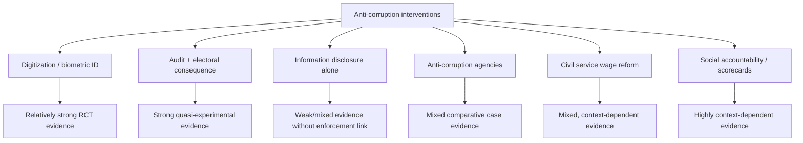

## Anti-Corruption Interventions and Evidence

### Framing: From Diagnosis to Intervention

Anti-corruption interventions map roughly onto the levers implied by the Klitgaard formula ($C = M + D - A$) and the Becker–Stigler-style expected-utility model of corrupt decisions ($E[U_{corrupt}] = B - pF$) introduced in the causes-and-consequences discussion: interventions either reduce the value of extractable rents ($B$), reduce discretion/monopoly power ($M$, $D$), or raise detection probability and penalties ($p$, $F$, captured jointly as accountability $A$). This chapter surveys the major intervention categories and summarizes what the empirical evidence — particularly randomized and quasi-experimental studies — has found about their effectiveness.

A recurring theme in this literature is the gap between intervention design (often well-grounded in theory) and rigorous causal evidence of impact (often thin), because corruption's hidden nature makes credible outcome measurement difficult even for well-designed studies (see corruption measurement methodologies).

### Taxonomy of Intervention Types

| Category | Mechanism | Example Instruments |
| --- | --- | --- |
| Monitoring and audits | Raise detection probability ($p$) | Top-down government audits, PETS, social audits |
| Transparency and disclosure | Reduce information asymmetry enabling monitoring | Asset declarations, freedom-of-information laws, open contracting |
| E-governance and digitization | Reduce discretion ($D$) at point of transaction | E-procurement, biometric ID, digital payments |
| Deregulation / simplification | Reduce monopoly power and discretion ($M$, $D$) | One-stop business registration, reduced permitting steps |
| Legal/institutional reform | Raise penalties and enforcement credibility ($F$) | Anti-corruption courts, specialized prosecution agencies |
| Civil service reform | Alter incentive structure of officials | Meritocratic recruitment, wage reform, performance pay |
| Citizen engagement / social accountability | Bottom-up monitoring pressure | Community scorecards, participatory budgeting, grievance platforms |
| International/financial | Restrict concealment and cross-border enablers | Beneficial ownership registries, anti-money-laundering cooperation |

### Monitoring and Audits

**Top-down government audits.** Ferraz and Finan's widely cited study of Brazil's municipal anti-corruption audit program — where randomly selected municipalities received unannounced federal audits of spending — found that audited municipalities' incumbent mayors experienced significantly reduced re-election prospects when audits revealed high levels of corruption irregularities, and pre-announced audit risk (from a lottery system) was associated with lower measured corruption, providing some of the strongest experimental-style evidence that audit exposure combined with electoral accountability can deter corruption.

**Public Expenditure Tracking Surveys (PETS) as intervention.** Beyond their diagnostic use, publicizing PETS findings has itself been tested as an intervention: Reinikka and Svensson's follow-up work on Uganda found that a newspaper information campaign informing schools of their entitled capitation-grant amounts substantially increased the share of funds actually reaching schools, illustrating an "information as accountability" mechanism operating through local monitoring rather than central enforcement.

**Social audits.** Community-led verification of public works and expenditure records (prominently used in India's National Rural Employment Guarantee Act, MGNREGA) has been studied for its effect on reducing leakage; findings across contexts are mixed and appear to depend on the credibility and follow-through of enforcement after irregularities are identified. [Inference] Social audits without a credible sanctioning mechanism downstream appear to have limited independent effect on corruption levels.

### Transparency and Disclosure Mechanisms

**Asset and income declaration systems.** Mandatory, verified disclosure of officials' wealth is widely adopted, but evidence on effectiveness depends heavily on whether declarations are actually verified and publicly accessible rather than merely filed. [Inference] Cross-country studies generally find that declaration systems with public accessibility and independent verification are associated with better outcomes than declaration-only regimes, though rigorous causal identification specifically isolating verification/publicity as the active ingredient is limited.

**Freedom of information (FOI) laws.** These lower the cost for journalists, civil society, and citizens to obtain government records, theoretically increasing detection probability. [Inference] Evidence on FOI laws' direct causal effect on corruption levels (as opposed to their effect on specific documented disclosure requests) is difficult to establish rigorously given the absence of counterfactual variation in most adopting countries, though case-level evidence of FOI-enabled investigative exposure is well documented.

**Open contracting and procurement transparency.** Publishing procurement data (bidders, contract values, ownership structures) in structured open formats is intended to enable both civil-society and algorithmic monitoring (see machine learning red-flag detection in corruption measurement methodologies). Studies of specific national open-contracting reforms (e.g., Ukraine's ProZorro system) have found associations with increased bidder competition and lower prices, though isolating the transparency mechanism from concurrent broader procurement reforms is methodologically challenging in most such cases. [Inference]

**Beneficial ownership registries.** Requiring disclosure of the real (human) owners behind shell companies and trusts aims to reduce the ability to conceal corrupt proceeds or conflicted interests in public contracting. This is a relatively recent policy area with rapidly evolving international standards (e.g., through the Financial Action Task Force framework); rigorous ex-post impact evaluation is still limited given recency of adoption in most jurisdictions. [Unverified — check current FATF/OECD assessments for the latest cross-country implementation status]

### E-Governance and Digitization

**E-procurement systems.** Digitizing tendering and bid submission is intended to reduce face-to-face official discretion and create auditable digital trails. Empirical evaluations of specific national systems (e.g., South Korea's KONEPS, Ukraine's ProZorro, India's Government e-Marketplace) generally report positive associations with competition and cost savings, though results vary in magnitude and rigor across studies and are sometimes based on before-after comparisons rather than clean identification strategies. [Inference]

**Biometric identification and digital payments.** Linking benefit disbursement to biometric verification (fingerprint/iris) is intended to eliminate "ghost beneficiaries" and reduce diversion. Muralidharan, Niehaus, and Sukhtankar's study of Andhra Pradesh's biometric smartcard system for social security and employment-guarantee payments found meaningful reductions in payment leakage and corruption-related transaction costs for beneficiaries, one of the more robust RCT-based findings in this literature.

**Direct benefit transfer (DBT) / digitized welfare payments.** Moving from cash/in-kind distribution through intermediaries to direct digital transfers has been studied extensively in India's DBT reforms and similar programs elsewhere; evidence generally supports reduced leakage relative to physical distribution chains, though implementation quality (connectivity, exclusion errors for those lacking documentation/banking access) substantially conditions net welfare effects. [Inference]

### Deregulation and Simplification

**Business registration reform.** Reducing the number of procedures, time, and discretionary approval steps required to register a business is directly informed by the "monopoly and discretion" logic; cross-country studies using World Bank Doing Business-style data have found simplified registration associated with reduced informal-sector bribery burden and increased formal firm entry in several studied contexts. [Inference] Effects appear to depend on complementary factors (e.g., whether registration reform is paired with reduced ongoing regulatory discretion, not just entry simplification).

**One-stop shops.** Consolidating multiple permitting/licensing interactions into a single administrative point of contact is intended to reduce the number of discretionary "toll booths" a firm or citizen must pass through, though poorly implemented consolidation can simply relocate rather than eliminate rent-extraction opportunities if underlying discretion is unchanged. [Inference]

### Legal and Institutional Reform

**Specialized anti-corruption agencies (ACAs) and courts.** Many countries have created dedicated investigative/prosecutorial bodies (e.g., Hong Kong's Independent Commission Against Corruption, Indonesia's KPK, various national anti-corruption courts). Hong Kong's ICAC is frequently cited as a comparatively successful case, generally attributed to a combination of strong political backing at founding, independence from the regular police hierarchy, and adequate resourcing — though generalizing this "success case" to other institutional contexts requires caution given the specific political conditions present at Hong Kong's founding. [Inference] Comparative evidence across ACAs globally is decidedly mixed, with many agencies studied in the literature found to be under-resourced, politically captured, or used selectively against political opponents rather than functioning as neutral enforcement bodies.

**Judicial independence reforms.** Strengthening judicial insulation from executive interference is theoretically linked to raising the credible penalty ($F$) for corruption, but rigorous causal evidence isolating judicial reform's direct effect on corruption levels (versus broader governance improvements it may accompany) is limited by the typically slow-moving, endogenous nature of judicial reform processes. [Inference]

### Civil Service and Incentive Reform

**Wage and performance-pay reform.** Evidence on raising public-sector wages as an anti-corruption lever is mixed; some studies find higher relative pay associated with lower petty corruption in specific contexts (e.g., tax administration), while others find limited or no effect, suggesting wage levels alone are insufficient absent complementary monitoring and enforcement. [Inference]

**Meritocratic recruitment reform.** Studies of merit-based hiring reforms in specific civil services (e.g., research on Mexican, Brazilian, and other Latin American civil-service modernization efforts) have found associations between meritocratic entry and both improved competence and, in some cases, reduced susceptibility to political capture, though isolating the meritocracy channel specifically from concurrent broader public-sector reforms is a persistent identification challenge. [Inference]

### Citizen Engagement and Social Accountability

**Community monitoring and scorecards.** Interventions that provide citizens with information and a structured channel to score/monitor local service providers have shown mixed results across RCT evaluations; Björkman and Svensson's Ugandan health-sector community monitoring study found significant improvements in health worker attendance and health outcomes, while other social-accountability interventions in different contexts have found null or modest effects, suggesting effectiveness is highly context-dependent (particularly on whether communities have credible channels to act on the information provided). [Inference]

**Participatory budgeting.** Allowing citizens direct input into allocation of (typically local) public budgets, pioneered in Porto Alegre, Brazil, has been associated in some studies with improved targeting of spending toward citizen priorities and, in certain contexts, reduced diversion, though the causal evidence base linking participatory budgeting specifically to reduced corruption (as opposed to improved spending responsiveness generally) remains limited. [Inference]

### Synthesis: What the Evidence Suggests

- **Information alone is often insufficient without an enforcement or electoral consequence attached.** Interventions that combine transparency/audit information with a credible downstream consequence (re-election risk, prosecution, benefit correction) tend to show stronger effects than information disclosure in isolation.
- **Reducing discretion at the point of transaction (digitization, biometric verification) has some of the more robust experimental evidence**, likely because these interventions directly and mechanically remove opportunities for a specific type of leakage, making effects easier to measure credibly.
- **Institutional and legal reforms (ACAs, judicial independence) are harder to evaluate rigorously** due to their slow-moving, endogenous, and often politically contingent nature, so the evidence base here leans more on comparative case study than clean causal identification.
- **Context and complementary institutions matter substantially.** The same intervention type (e.g., social audits, wage reform) shows heterogeneous effects across studies, generally attributed to differences in baseline institutional strength, political will, and whether complementary accountability mechanisms exist.

### Conceptual Diagram: Intervention Points Along the Corruption Decision Chain (svg_diagram)

<svg xmlns="http://www.w3.org/2000/svg" viewBox="0 0 820 320">
\<style\>
text { font-family: Arial, sans-serif; font-size: 13px; fill: #1a1a1a; }
.title { font-size: 16px; font-weight: bold; }
.box { fill: #eef3f8; stroke: #2c5282; stroke-width: 2; rx: 8; }
.ibox { fill: #fdf2e9; stroke: #b7621b; stroke-width: 2; rx: 6; }
.arrow { stroke: #2c5282; stroke-width: 2; marker-end: url(#ah3); fill: none; }
.darrow { stroke: #b7621b; stroke-width: 1.5; stroke-dasharray: 4,3; marker-end: url(#ah3o); fill: none; }
.label { font-size: 11px; fill: #4a5568; }
\</style\>
<text x="410" y="24" class="title" text-anchor="middle">Intervention Points Along the Corruption Decision Chain (svg_diagram)</text>
<rect x="30" y="140" width="150" height="60" class="box" />
<text x="105" y="165" text-anchor="middle">Bribe value</text>
<text x="105" y="182" text-anchor="middle" class="label">(B)</text>
<rect x="230" y="140" width="150" height="60" class="box" />
<text x="305" y="165" text-anchor="middle">Discretion /</text>
<text x="305" y="182" text-anchor="middle">monopoly (M,D)</text>
<rect x="430" y="140" width="150" height="60" class="box" />
<text x="505" y="165" text-anchor="middle">Detection</text>
<text x="505" y="182" text-anchor="middle" class="label">probability (p)</text>
<rect x="630" y="140" width="150" height="60" class="box" />
<text x="705" y="165" text-anchor="middle">Penalty</text>
<text x="705" y="182" text-anchor="middle" class="label">severity (F)</text>
<path d="M180 170 H230" class="arrow" />
<path d="M380 170 H430" class="arrow" />
<path d="M580 170 H630" class="arrow" />
<rect x="10" y="240" width="190" height="50" class="ibox" />
<text x="105" y="262" text-anchor="middle" class="label">Deregulation, rent removal</text>
<text x="105" y="277" text-anchor="middle" class="label">(reduces B)</text>
<path d="M105 240 V200" class="darrow" />
<rect x="210" y="240" width="190" height="50" class="ibox" />
<text x="305" y="262" text-anchor="middle" class="label">E-governance, one-stop shops</text>
<text x="305" y="277" text-anchor="middle" class="label">(reduces M, D)</text>
<path d="M305 240 V200" class="darrow" />
<rect x="410" y="240" width="190" height="50" class="ibox" />
<text x="505" y="262" text-anchor="middle" class="label">Audits, FOI, social monitoring</text>
<text x="505" y="277" text-anchor="middle" class="label">(raises p)</text>
<path d="M505 240 V200" class="darrow" />
<rect x="610" y="240" width="190" height="50" class="ibox" />
<text x="705" y="262" text-anchor="middle" class="label">ACAs, judicial reform</text>
<text x="705" y="277" text-anchor="middle" class="label">(raises F)</text>
<path d="M705 240 V200" class="darrow" />
</svg>

### Analytical Diagram: Evidence Strength Across Intervention Categories (svg_diagram)

### Evidence Summary Table

| Intervention | Strongest Supporting Study Type | General Evidence Strength |
| --- | --- | --- |
| Randomized government audits + electoral exposure | RCT/quasi-experiment (Brazil) | Comparatively strong |
| Biometric payment verification | RCT (India) | Comparatively strong |
| Information campaigns tied to entitlement monitoring | Natural experiment (Uganda) | Moderate-strong |
| E-procurement digitization | Before-after / case study | Moderate, context-dependent |
| Community social audits | Mixed RCT evidence | Mixed |
| Anti-corruption agencies | Comparative case study | Mixed to weak |
| Wage/pay reform alone | Mixed cross-study evidence | Weak to mixed |
| FOI laws alone | Limited causal identification | Weak (data-limited) |

### Common Pitfalls in Evaluating Anti-Corruption Interventions

- Extrapolating success from a single, well-known case (Hong Kong ICAC, Brazil's audit lottery) as though the mechanism is portable without accounting for the specific political and institutional preconditions present
- Treating transparency/disclosure reforms as sufficient on their own, without checking whether a credible enforcement or electoral consequence is attached to the disclosed information
- Relying on before-after comparisons for digitization reforms without addressing confounding concurrent policy changes
- Assuming null or mixed results in one context (e.g., a specific social-audit RCT) generalize to the intervention type as a whole, when underlying implementation fidelity varies substantially across studies
- Underweighting measurement-error concerns (see corruption measurement methodologies) when interpreting reported effect sizes across this literature

**Related Topics**

- Bureaucratic effectiveness in developing states
- Corruption measurement methodologies
- Causes and consequences of corruption
- Randomized controlled trials in public sector reform evaluation
- E-governance architecture for public service delivery
- Political economy of accountability and electoral sanctioning
- Beneficial ownership transparency and anti-money-laundering frameworks
- Comparative institutional design of anti-corruption agencies