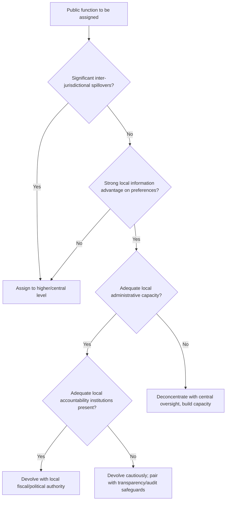

## Decentralization and Local Governance

### Conceptual Definitions

Decentralization refers to the transfer of authority, resources, and/or responsibility from central government to lower levels of government or non-state actors. The literature conventionally distinguishes three (sometimes four) forms, which often occur in combination rather than in isolation:

- **Political decentralization**: transfer of political authority through elected sub-national governments, giving local citizens direct voice in selecting local leaders and policy priorities
- **Administrative decentralization** (sometimes split into deconcentration and devolution): transfer of responsibility for planning, financing, and managing public functions
  - *Deconcentration*: shifting administrative workload to local offices of the central government, which remain accountable upward to the center
  - *Devolution*: transfer of authority to autonomous, legally distinct local government units accountable to local constituents
- **Fiscal decentralization**: transfer of revenue-raising authority and/or expenditure responsibility to sub-national governments, including intergovernmental transfer design
- **Market decentralization** (less central to this chapter): privatization and deregulation transferring functions from public to private actors

[Inference] These forms are analytically distinct but empirically interdependent — political decentralization without accompanying fiscal decentralization often produces local governments with electoral accountability but no resources to act on it, a combination frequently cited in the literature as a source of decentralization's disappointing results in some contexts.

### Theoretical Foundations

**Fiscal federalism (Tiebout, Oates).** The classical economic case for decentralization rests on the idea that local governments possess superior information about local preferences and can tailor public goods provision accordingly (Oates' "decentralization theorem"), while inter-jurisdictional competition (Tiebout sorting) can discipline local governments if citizens can credibly relocate in response to poor governance — an assumption with limited applicability in many developing-country contexts where mobility costs are high.

**Accountability and information theory.** Decentralization is often justified on the grounds that local officials are more directly observable and sanctionable by local citizens than distant central officials, shortening the principal-agent chain discussed in the bureaucratic effectiveness and corruption chapters. This closer proximity is theorized to both improve responsiveness and, under sufficient local accountability institutions, reduce corruption.

**Elite capture theory.** A countervailing theoretical tradition (e.g., Bardhan and Mookherjee's influential work) argues that local elites may face fewer countervailing checks (weaker press, courts, or opposition) than national elites, making local governments more, not less, susceptible to capture by narrow interests — directly challenging the naive assumption that "closer to the people" automatically means "more accountable to the people."

**Yardstick competition.** A related theoretical mechanism suggests that voters use neighboring jurisdictions' performance as a benchmark to evaluate their own local government, creating an indirect accountability pressure even without direct citizen mobility (Besley and Case's yardstick competition framework).

### Rationales for Decentralization

| Rationale | Mechanism |
| --- | --- |
| Allocative efficiency | Local governments better match spending to heterogeneous local preferences |
| Improved accountability | Shorter distance between citizens and decision-makers eases monitoring |
| Political inclusion / conflict management | Devolving authority to regional/ethnic groups can reduce secessionist pressure and accommodate diversity |
| Service delivery responsiveness | Local administrators have better on-the-ground information for targeting |
| Reduced central government overload | Distributing administrative burden across levels |
| Democratic deepening | Local elections create additional venues for citizen political participation |

### Risks and Countervailing Concerns

**Elite capture at the local level.** As noted above, decentralization can concentrate discretionary authority in the hands of local elites who face weaker oversight than national counterparts, particularly where local media, courts, and civil society are underdeveloped.

**Coordination and spillover failures.** Decentralized decision-making can under-provide public goods with cross-jurisdictional spillovers (e.g., disease control, environmental regulation, infrastructure networks) since local governments do not internalize benefits accruing to neighboring jurisdictions.

**Capacity mismatches.** Devolving responsibility without corresponding administrative and technical capacity-building can produce implementation failures — a recurring finding in "unfunded/uncapacitated mandate" critiques of rapid decentralization reforms.

**Fiscal disparities and inequality.** Jurisdictions with weaker local tax bases (poorer regions) may be unable to finance comparable service levels to wealthier jurisdictions absent well-designed equalization transfers, potentially widening regional inequality rather than narrowing it.

**Soft budget constraints.** Sub-national governments that expect central bailouts if they overspend face weakened fiscal discipline incentives — a classic public finance concern (associated with Kornai's soft-budget-constraint concept) documented in numerous decentralized fiscal systems, including well-studied cases in Latin American federalism.

**Multiplication of "toll booths."** As discussed in the corruption chapter, decentralization can, in weak-institution contexts, multiply the number of discretionary points at which bribery can occur rather than reducing them, particularly where deconcentrated administrative offices retain discretion without commensurate local accountability.

### Fiscal Decentralization Design Elements

**Expenditure assignment.** Determining which functions (health, education, local infrastructure, policing) are assigned to which government tier, ideally following the "subsidiarity principle" — assigning functions to the lowest level capable of effective provision, while retaining functions with substantial spillovers or economies of scale at higher levels.

**Revenue assignment.** Determining sub-national taxing authority (property taxes, local business licenses, user fees) versus reliance on transfers from the center. A persistent finding across developing countries is a substantial "vertical fiscal gap" — sub-national expenditure responsibilities exceeding locally raised revenue capacity — necessitating well-designed transfer systems.

**Intergovernmental transfers.** Transfer design typically balances multiple objectives:

- **Equalization transfers**: address fiscal disparities across jurisdictions with different tax bases or needs
- **Conditional/earmarked transfers**: finance specific nationally mandated priorities (e.g., primary education) while constraining local discretion
- **Unconditional/block transfers**: preserve local budgetary autonomy but weaken central steering capacity
- **Formula-based versus discretionary transfers**: formula-based systems (using objective criteria like population, poverty rate, tax effort) are generally associated with greater predictability and reduced scope for political favoritism compared to discretionary, negotiated transfers

**Borrowing authority (sub-national debt rules).** Determines whether local governments can independently access credit markets, with associated moral-hazard/soft-budget-constraint risks if not paired with credible no-bailout commitments and borrowing limits.

### Political Decentralization Design Elements

- **Election timing and alignment**: whether local elections are synchronized with or staggered from national elections affects the degree to which local accountability is distinct from national political dynamics
- **Reserved seats and quotas**: many decentralization reforms (e.g., India's 73rd/74th constitutional amendments establishing Panchayati Raj institutions) include mandated representation quotas for historically marginalized groups (women, scheduled castes/tribes) intended to counter elite capture risk
- **Recall and removal mechanisms**: design of accountability mechanisms between elections
- **Institutional layering**: number of sub-national tiers (state/province, district, municipal, village) and clarity of jurisdictional boundaries between them

### Notable Empirical Findings

**India's Panchayati Raj reforms.** Extensively studied due to randomized/quasi-experimental variation in reserved-seat implementation timing; Chattopadhyay and Duflo's study of randomly assigned women-headed village councils found that reservation shifted the composition of local public goods investment toward priorities more aligned with women's stated preferences (e.g., drinking water infrastructure), providing well-identified evidence that the identity of local decision-makers causally affects policy outcomes.

**Indonesia's decentralization (post-1999).** One of the most rapid and large-scale decentralization reforms studied in the literature, devolving substantial authority to district governments; subsequent research has documented mixed outcomes — some studies find improved responsiveness to local preferences, while others (including some corruption-focused audit studies referenced in the corruption chapter) find persistent or in some cases increased local capture and leakage, illustrating the context-dependence of decentralization's net effects. [Inference]

**Bolivia's Law of Popular Participation (1994).** A frequently studied case of rapid, large-scale devolution to municipal governments; research by Faguet found that decentralization was associated with a documented shift in public investment toward sectors (water, sanitation, education) more closely aligned with local needs relative to the pre-reform centralized pattern, often cited as a relatively favorable case in the empirical literature. [Inference] Generalizing this specific finding to decentralization reforms broadly requires caution given Bolivia's particular institutional and political context at the time.

**China's fiscal decentralization.** Extensively studied for its distinctive combination of substantial fiscal decentralization with limited political decentralization (sub-national officials appointed rather than elected, but evaluated on performance metrics including economic growth) — the resulting "regionally decentralized authoritarianism" model is frequently cited in comparative political economy as an atypical but influential case, associated by many researchers with strong local growth incentives but also documented risks of local government debt accumulation and infrastructure overinvestment. [Inference]

### Decentralization and Corruption: Summary of the Ambiguous Relationship

The relationship between decentralization and corruption does not point in a single direction across the literature:

- **Pro-decentralization channel**: shorter accountability chains, closer citizen monitoring, yardstick competition across jurisdictions
- **Anti-decentralization channel**: weaker local checks on elite capture, multiplication of discretionary points, potential for local monopoly power without competitive alternatives

[Inference] The balance between these channels appears to depend heavily on the strength of complementary local accountability institutions (free local press, competitive local elections, functioning local courts) — decentralization paired with weak local institutions more frequently shows null or negative corruption effects in the empirical literature, while decentralization paired with strong local accountability mechanisms more frequently shows positive effects, though this moderating relationship is inferred across a heterogeneous literature rather than established by a single definitive study.

### Conceptual Diagram: Forms of Decentralization and Their Interdependence (svg_diagram)

<svg xmlns="http://www.w3.org/2000/svg" viewBox="0 0 800 380">
\<style\>
text { font-family: Arial, sans-serif; font-size: 13px; fill: #1a1a1a; }
.title { font-size: 16px; font-weight: bold; }
.box { fill: #eef3f8; stroke: #2c5282; stroke-width: 2; rx: 8; }
.center { fill: #fdf2e9; stroke: #b7621b; stroke-width: 2; rx: 8; }
.arrow { stroke: #4a5568; stroke-width: 1.5; marker-end: url(#ah4); fill: none; }
.label { font-size: 11px; fill: #4a5568; }
\</style\>
<text x="400" y="24" class="title" text-anchor="middle">Forms of Decentralization and Their Interdependence (svg_diagram)</text>
<rect x="300" y="160" width="200" height="70" class="center" />
<text x="400" y="188" text-anchor="middle">Effective Local</text>
<text x="400" y="206" text-anchor="middle">Governance Outcome</text>
<rect x="40" y="40" width="200" height="70" class="box" />
<text x="140" y="68" text-anchor="middle">Political</text>
<text x="140" y="86" text-anchor="middle" class="label">(elected local leaders,</text>
<text x="140" y="100" text-anchor="middle" class="label">local voice)</text>
<path d="M180 110 Q250 140 320 165" class="arrow" />
<rect x="560" y="40" width="200" height="70" class="box" />
<text x="660" y="68" text-anchor="middle">Fiscal</text>
<text x="660" y="86" text-anchor="middle" class="label">(revenue authority,</text>
<text x="660" y="100" text-anchor="middle" class="label">expenditure control)</text>
<path d="M620 110 Q550 140 480 165" class="arrow" />
<rect x="40" y="280" width="200" height="70" class="box" />
<text x="140" y="308" text-anchor="middle">Administrative</text>
<text x="140" y="326" text-anchor="middle" class="label">(implementation</text>
<text x="140" y="340" text-anchor="middle" class="label">capacity, staffing)</text>
<path d="M180 290 Q250 250 320 225" class="arrow" />
<rect x="560" y="280" width="200" height="70" class="box" />
<text x="660" y="308" text-anchor="middle">Local Accountability</text>
<text x="660" y="326" text-anchor="middle" class="label">Institutions</text>
<text x="660" y="340" text-anchor="middle" class="label">(press, courts, elections)</text>
<path d="M620 290 Q550 250 480 225" class="arrow" />
</svg>

### Analytical Diagram: Decision Pathway for Assigning Government Function (svg_diagram)

### Illustrative Transfer Formula

$$T_i = \alpha \cdot P_i + \beta \cdot \max(0, \bar{R} - R_i) + \gamma \cdot N_i$$

where $T_i$ is the transfer to jurisdiction $i$, $P_i$ is population, $R_i$ is jurisdiction $i$'s own-revenue capacity relative to the national average $\bar{R}$ (an equalization component), $N_i$ is a needs-based index (e.g., poverty rate, service backlog), and $\alpha, \beta, \gamma$ are policy-determined weights. [Inference] This is a simplified illustrative structure combining common design elements; actual national formulas vary considerably in specific weighting and additional adjustment factors.

### Common Pitfalls in Analysis

- Treating "decentralization" as a single homogeneous policy rather than distinguishing its political, fiscal, and administrative dimensions, which can move independently and even work at cross-purposes
- Assuming decentralization automatically improves accountability without checking whether complementary local accountability institutions are present
- Overlooking the vertical fiscal gap problem — evaluating devolved service delivery outcomes without accounting for whether revenue authority was devolved commensurately with expenditure responsibility
- Generalizing from single well-studied cases (India's Panchayati Raj reservations, Bolivia's Popular Participation Law) to decentralization reforms in general without accounting for context-specific institutional preconditions
- Ignoring soft-budget-constraint dynamics when evaluating the fiscal sustainability of decentralized systems with weak borrowing rules

**Related Topics**

- Bureaucratic effectiveness in developing states
- Causes and consequences of corruption
- Anti-corruption interventions and evidence
- Fiscal federalism and intergovernmental transfer design
- Local elite capture and clientelism
- Political economy of conflict and secessionist accommodation
- Public goods provision and heterogeneous local preferences
- Comparative case studies: India, Indonesia, Bolivia, China decentralization reforms