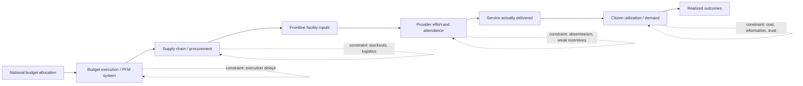

## Public Service Delivery Constraints

### Conceptual Framing

Public service delivery refers to the chain of activities through which public resources are converted into outcomes citizens value — a functioning school, an available medicine, a paved road, a processed permit. Development economics increasingly frames the persistent gap between government spending and realized outcomes not as primarily a resource problem but as an implementation problem, often summarized by the "long route" versus "short route" of accountability framework introduced in the World Bank's 2004 World Development Report: the long route runs from citizens through politicians to policymakers to frontline providers, while the short route runs directly from citizens (as clients) to providers. Delivery constraints are the frictions and failures that occur at each link in this chain.

This chapter treats delivery constraints as distinct from — though closely related to — the causes of bureaucratic ineffectiveness and corruption covered elsewhere in this chapter; the focus here is specifically on the mechanisms by which inputs fail to become outcomes, even absent outright corrupt diversion.

### Taxonomy of Constraint Types

| Constraint Category | Core Mechanism |
| --- | --- |
| Resource/input constraints | Insufficient funding, staff, supplies reaching the frontline |
| Human resource / motivation constraints | Absenteeism, low effort, misallocated skills among providers |
| Information and monitoring constraints | Principals cannot observe provider effort or true need |
| Coordination and last-mile logistics constraints | Breakdown in supply chains and inter-agency handoffs |
| Political economy constraints | Misaligned incentives of politicians and providers relative to citizen welfare |
| Demand-side constraints | Citizens unable or unwilling to access/utilize available services |
| Capacity and design constraints | Poorly designed systems, inadequate technical/managerial skill |

### Resource and Input Constraints

**Underfunding relative to mandate.** Many developing-country service systems face nominal responsibility for universal coverage (e.g., primary healthcare, basic education) without commensurate budget allocation, producing structural understaffing and supply shortages independent of any administrative failure.

**Budget execution gaps.** A well-documented and distinct problem from underfunding: allocated budgets are frequently not fully disbursed or spent by year-end due to procurement delays, cash-management bottlenecks, or overly rigid line-item budgeting rules — meaning the binding constraint is often the public financial management (PFM) system's capacity to execute, not the nominal budget ceiling itself. [Inference] Budget execution rates are a commonly used, if imperfect, proxy for this constraint in PFM diagnostic work.

**Recurrent versus capital expenditure imbalance.** Political incentives (discussed in the corruption chapter) often bias spending toward visible capital projects (new buildings, equipment) at the expense of recurrent costs (maintenance, consumables, staff salaries) needed to keep existing infrastructure functional — a widely observed pattern sometimes termed the "build-neglect-rebuild" cycle in infrastructure economics.

### Human Resource and Motivation Constraints

**Absenteeism.** Nationally representative surveys using unannounced spot-checks (notably the World Bank's cross-country teacher and health-worker absence studies led by Chaudhury, Hammer, Kremer, Muralidharan, and Rogers) have documented substantial unannounced-visit absence rates among frontline health workers and teachers across multiple developing countries, a finding replicated widely enough to be considered one of the more robust stylized facts in the service-delivery literature.

**Weak performance incentives.** Civil-service pay structures in many developing-country systems are seniority-based and largely delinked from measured performance or effort, reducing the marginal incentive for frontline effort — related to, but distinct from, the corruption-focused wage literature discussed in the causes-and-consequences chapter.

**Skill-post mismatch.** Postings and transfers of health workers, teachers, and administrators are frequently governed by seniority, political connections, or negotiated preference for desirable (typically urban) locations rather than matching skills to need, producing systematic understaffing of remote and high-need areas.

**Multitasking and diverted effort.** Frontline workers are frequently assigned numerous non-core administrative tasks (data reporting, election duty, other government campaigns) that crowd out time available for core service delivery — documented in several health-worker time-use studies across South Asian and African contexts. [Inference]

### Information and Monitoring Constraints

**Unobservable effort ("multi-tasking" principal-agent problem).** Many service-delivery tasks (teaching quality, diagnostic accuracy, counseling effort) are difficult for a distant principal (ministry, local government) to observe and verify, limiting the effectiveness of standard input-based monitoring and creating scope for effort-shirking that isn't corruption per se but is functionally similar in its effect on outcomes.

**Weak management information systems (MIS).** Many developing-country service bureaucracies historically lacked real-time, disaggregated data on facility-level inputs, staffing, and outputs, making it difficult for supervisors to identify where breakdowns are occurring — a gap increasingly addressed (with mixed results) by digital MIS and dashboard tools.

**Distorted self-reported data.** Where reporting systems rely on facility self-report without independent verification, data used for both monitoring and resource allocation can be systematically inflated or manipulated, undermining the credibility of the very information meant to identify delivery gaps.

### Coordination and Last-Mile Logistics Constraints

**Supply chain breakdowns.** Documented extensively in the essential-medicines and vaccine-delivery literature: stockouts at the frontline facility can coexist with adequate national-level procurement, reflecting failures in intermediate distribution, storage (e.g., cold-chain requirements for vaccines), and inventory management rather than aggregate resource shortfalls.

**Fragmented inter-agency mandates.** Services requiring coordination across multiple agencies or government tiers (e.g., water and sanitation infrastructure spanning national utilities and local governments) are prone to coordination failure where no single actor has clear accountability for the end-to-end outcome.

**Infrastructure and geographic constraints.** Physical remoteness, poor transport infrastructure, and seasonal accessibility (e.g., monsoon-affected roads) directly constrain both supply delivery to facilities and citizen access to them, independent of administrative performance.

### Political Economy Constraints

**Short political time horizons.** As discussed in the bureaucratic effectiveness chapter, politicians facing short electoral cycles may under-invest in service quality improvements with long payoff horizons in favor of visible, quick-payoff spending.

**Elite and clientelist targeting.** Public services and associated resources may be politically targeted toward core supporter constituencies rather than allocated according to objective need, a pattern extensively documented in the political-economy-of-distribution literature (e.g., work on "pork barrel" and swing-voter targeting models).

**Weak "voice" mechanisms.** Absent credible channels for citizen complaint and feedback (the "short route" of accountability), providers face limited direct pressure to perform beyond whatever weak top-down supervision exists.

**Provider capture of policy.** Organized provider interest groups (teacher unions, medical associations) can, in some documented contexts, resist reforms (performance pay, transfer policies, accountability measures) that would improve delivery but reduce provider rents or autonomy — a dynamic requiring case-specific evidence rather than a universal claim. [Inference]

### Demand-Side Constraints

Even where services are technically available, utilization can be constrained by:

- **Information gaps**: citizens may be unaware of service availability, quality differences across providers, or their own entitlements
- **Direct and indirect costs**: user fees, transport costs, and opportunity cost of time (particularly for women and low-income households) can deter utilization even of nominally free services
- **Social and behavioral barriers**: social norms, distrust of formal institutions, or past negative experiences can reduce demand independent of supply-side quality
- **Quality perception feedback loops**: low perceived quality (sometimes justified, sometimes based on limited information) can drive citizens toward private alternatives or non-use, reducing the political salience of public-system improvement and creating a self-reinforcing dynamic in some documented contexts. [Inference]

### Analytical Framework: The Accountability Triangle

The WDR 2004 framework models effective service delivery as depending on functioning relationships across three actor pairs:

1. **Citizens ↔ Politicians/Policymakers** (the "voice" relationship — elections, political competition, civil society pressure)
2. **Policymakers ↔ Providers** (the "compact" relationship — contracts, budgets, performance management, civil-service rules)
3. **Citizens ↔ Providers** (the "client power" or short-route relationship — direct choice, complaint mechanisms, local monitoring)

[Inference] The framework's core diagnostic claim is that delivery failures typically trace to a weak link in one or more of these three relationships, and effective reform generally requires identifying which link is weakest in a given context rather than applying a generic reform package.

### Conceptual Diagram: The Accountability Triangle (svg_diagram)

<svg xmlns="http://www.w3.org/2000/svg" viewBox="0 0 700 500">
\<style\>
text { font-family: Arial, sans-serif; font-size: 13px; fill: #1a1a1a; }
.title { font-size: 16px; font-weight: bold; }
.box { fill: #eef3f8; stroke: #2c5282; stroke-width: 2; rx: 8; }
.arrow { stroke: #2c5282; stroke-width: 2; marker-end: url(#ah5); fill: none; }
.label { font-size: 12px; fill: #4a5568; }
\</style\>
<text x="350" y="28" class="title" text-anchor="middle">The Accountability Triangle in Service Delivery (svg_diagram)</text>
<rect x="270" y="60" width="160" height="60" class="box" />
<text x="350" y="85" text-anchor="middle">Citizens</text>
<text x="350" y="102" text-anchor="middle" class="label">(clients)</text>
<rect x="60" y="360" width="180" height="60" class="box" />
<text x="150" y="385" text-anchor="middle">Politicians /</text>
<text x="150" y="402" text-anchor="middle">Policymakers</text>
<rect x="460" y="360" width="180" height="60" class="box" />
<text x="550" y="385" text-anchor="middle">Frontline</text>
<text x="550" y="402" text-anchor="middle">Providers</text>
<path d="M300 120 Q200 240 155 360" class="arrow" />
<text x="180" y="240" text-anchor="middle" class="label">Voice</text>
<text x="180" y="255" text-anchor="middle" class="label">(elections, pressure)</text>
<path d="M400 120 Q500 240 545 360" class="arrow" />
<text x="520" y="240" text-anchor="middle" class="label">Client power</text>
<text x="520" y="255" text-anchor="middle" class="label">(short route)</text>
<path d="M240 390 H460" class="arrow" />
<text x="350" y="380" text-anchor="middle" class="label">Compact</text>
<text x="350" y="440" text-anchor="middle" class="label">(budgets, contracts, performance management)</text>
</svg>

### Analytical Diagram: Constraint Points in the Delivery Chain (svg_diagram)

### Evidence-Based Response Approaches

| Constraint | Documented Response Type | Evidence Character |
| --- | --- | --- |
| Absenteeism | Monitoring + attendance-linked pay (e.g., camera-monitored teacher attendance studies in India) | RCT evidence generally supportive, context-dependent |
| Supply chain breakdown | Digitized inventory/logistics management systems | Mixed, implementation-quality dependent |
| Weak local accountability | Community monitoring / scorecards | Highly heterogeneous across RCTs |
| Provider effort/multitasking | Task simplification, dedicated cadres for specific functions | Some supportive evidence, context-specific |
| Demand-side information gaps | Information campaigns on service availability/quality | Generally modest positive effects, varies by design |
| Budget execution failures | PFM reform (simplified procurement, cash management) | Limited rigorous causal evidence; mostly diagnostic/case study |

### Common Pitfalls in Analysis

- Attributing all delivery failures to corruption or resource shortage when absenteeism, coordination failure, and demand-side barriers are frequently the binding constraint
- Treating budget allocation figures as a proxy for realized service delivery without accounting for execution gaps
- Assuming a single accountability-triangle link (e.g., top-down "compact" reform) is sufficient without checking whether "voice" and "client power" links are also functioning
- Generalizing absenteeism findings from specific well-studied contexts (India, sub-Saharan African health systems) to all developing-country service delivery without local verification
- Overlooking that low reported utilization may reflect legitimate demand-side rationality (real cost/quality trade-offs) rather than simple citizen "non-compliance" or ignorance

**Related Topics**

- Bureaucratic effectiveness in developing states
- Causes and consequences of corruption
- Anti-corruption interventions and evidence
- Decentralization and local governance
- Public financial management and budget execution
- Health worker and teacher absenteeism studies
- Community monitoring and social accountability mechanisms
- Public-private partnerships in service delivery