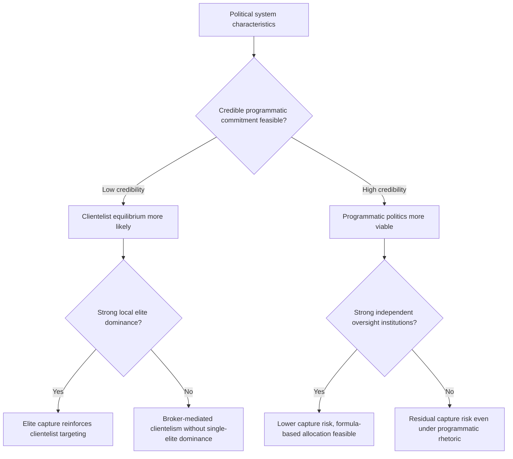

## Elite Capture and Clientelism

### Conceptual Definitions

**Elite capture** refers to the disproportionate control that politically, socially, or economically dominant actors exert over public resources, policy processes, or institutions nominally intended to serve a broader population — diverting benefits toward the elite group at the expense of intended beneficiaries. It is distinguished from ordinary corruption in that capture often operates through legal or quasi-legal channels (agenda-setting, rule design, control of allocation processes) rather than solely through illicit bribery.

**Clientelism** refers to a mode of political exchange in which politicians distribute particularistic benefits (jobs, cash, targeted goods, selective service access) to individuals or groups in exchange for political support (votes, loyalty, mobilization), as opposed to programmatic politics based on broad-based public goods and policy platforms. Clientelism is typically sustained through **patron-client networks** — durable, asymmetric relationships linking a resource-controlling patron to dependent clients, often mediated by local brokers.

[Inference] The two concepts are closely related but analytically distinct: elite capture describes an *outcome* (who benefits from a resource or institution), while clientelism describes a *mechanism* (a particular exchange relationship) that frequently produces or reinforces capture, though capture can also occur through non-clientelist channels (e.g., technocratic policy capture by narrow business interests).

### Theoretical Foundations

**Principal-agent and elite capture in decentralized institutions.** Bardhan and Mookherjee's influential theoretical work models how decentralized public resource allocation can be captured by local elites when (a) political competition at the local level is weak, (b) information about elite diversion is costly for ordinary citizens to obtain, and (c) elites face fewer external checks (national press scrutiny, opposition parties) than they would at higher levels of government — directly informing the decentralization-and-corruption discussion elsewhere in this chapter.

**Clientelism as an equilibrium response to weak institutions.** A substantial political-economy literature (e.g., Kitschelt and Wilkinson's comparative work on clientelist versus programmatic linkages) frames clientelism as an equilibrium strategy politicians adopt when programmatic commitment is not credible — voters, uncertain that politicians will deliver on broad policy promises, prefer the more credible and immediate exchange of a targeted benefit, while politicians prefer the more precisely targetable and easily monitored nature of clientelist exchange (a broker can verify a client's vote or attendance far more easily than a citizen can verify a policy promise).

**Brokerage models.** Stokes and colleagues' work on machine politics emphasizes the role of local brokers (party operatives embedded in communities) who possess granular information about individual voters' likely political behavior and needs, enabling efficient targeting of clientelist benefits — and creating a distinct agency problem between party leaders and brokers, since brokers may divert resources for their own local power-building rather than fully executing the party's electoral strategy. [Inference] This "broker's dilemma" is a recurring theme distinguishing clientelism research from simpler vote-buying models.

**Ethnic favoritism models.** Where political competition is organized along ethnic or communal lines, clientelist distribution frequently follows ethnic-coalition logic — resources flow disproportionately to co-ethnic or co-partisan constituencies of the ruling coalition, documented extensively in African political economy (e.g., Franck and Rainer's cross-country evidence on ethnic favoritism in infrastructure and education spending following leader ethnicity).

### Mechanisms of Elite Capture

| Mechanism | Description |
| --- | --- |
| Agenda and rule-setting control | Elites shape the design of allocation rules (eligibility criteria, project selection processes) to favor themselves ex ante, without needing overt bribery |
| Informational advantage | Elites, often better educated and connected, have superior knowledge of program existence, application procedures, and deadlines |
| Participation cost asymmetries | Formal participatory processes (community meetings, local budgeting forums) may be more accessible to elites with time, literacy, and social standing to participate |
| Control of intermediary/broker positions | Elites often occupy positions (local council seats, cooperative leadership, traditional authority roles) that mediate resource flow to the broader community |
| Coercion and social sanction | In some contexts, elites can use social or economic leverage (landlord-tenant relationships, employer power) to discourage non-compliant behavior among dependents |
| Legal/technical capture | Elites with access to legal or technical expertise can shape formally neutral processes (procurement specifications, zoning rules) to favor their interests |

### Mechanisms of Clientelist Exchange

**Vote buying.** Direct or near-direct exchange of cash or in-kind goods for votes, typically most feasible where ballot secrecy is weak or where turnout/attendance (rather than vote choice itself) can be monitored, since genuine vote-choice monitoring is difficult under secret ballot in most democracies.

**Turnout buying and machine mobilization.** Rather than attempting to buy specific vote choices (difficult to verify), machines often focus resources on mobilizing turnout among likely-supportive voters or discouraging turnout among likely opponents, since turnout is more observable than vote choice.

**Public jobs as patronage.** Public-sector employment, particularly where hiring bypasses meritocratic civil-service rules, functions as a durable clientelist benefit — creating a large, loyal beneficiary class with strong incentive to support the patron party's continuation in power (directly connecting to the bureaucratic effectiveness chapter's discussion of patronage as a driver of weak administrative capacity).

**Targeted program administration.** Even nominally universal or needs-based social programs can be administered with discretionary implementation that channels benefits disproportionately to political supporters — documented in numerous studies of targeted anti-poverty and infrastructure program allocation correlating with political alignment of local officials or beneficiary districts.

**Post-election distribution and core versus swing voter targeting.** A theoretical and empirical literature (following Cox and McCubbins, Dixit and Londregan) debates whether clientelist and pork-barrel resources are more efficiently targeted at "swing" voters (whose support is genuinely contestable) or "core" voters (whose loyalty is being rewarded/maintained), with empirical findings varying by context and specific program studied.

### Empirical Evidence

**Targeted program capture studies.** Research using geo-referenced program and political data (e.g., studies of India's employment guarantee and infrastructure schemes, Indonesia's targeted cash transfer and community development programs) has repeatedly found correlations between local political alignment and disproportionate program benefit receipt, though isolating capture specifically from legitimate differential need or genuinely superior local political mobilization requires careful identification strategies. [Inference]

**Vote-buying field experiments.** Several field experiments (notably in the Philippines and other Southeast Asian and Latin American contexts) using randomized informational or monitoring interventions have found that increased ballot secrecy protection or independent monitoring can reduce the effectiveness of vote-buying attempts, providing some causal evidence on the mechanisms sustaining clientelist exchange. [Inference] Results vary considerably by the specific monitoring technology and local political context studied.

**Ethnic favoritism cross-country evidence.** Using night-light satellite imagery as a proxy for local development and linking it to the ethnicity of national leaders across African countries, Michalopoulos and Papaioannou-adjacent and related literatures (including Franck and Rainer's work) have documented a systematic pattern where regions sharing the ethnicity of a sitting leader show elevated development-proxy measures during that leader's tenure, offering broad cross-national evidence consistent with ethnic favoritism dynamics. [Inference] Night-light-based development proxies are an imperfect measure and this literature's findings should be read as suggestive patterns rather than precise magnitude estimates.

**Elite capture in community-driven development (CDD).** Evaluations of participatory/community-driven development programs (a major aid modality intended to bypass captured central bureaucracies by devolving decisions to community-level committees) have found mixed results: some studies find CDD successfully reduces capture relative to top-down alternatives, while others find local elites simply migrate their capture strategies to the new community-committee structures, echoing the broader decentralization-elite-capture ambiguity discussed in the decentralization chapter. [Inference]

### Consequences

- **Misallocation of public resources**: benefits flow according to political/social connection rather than need or productivity, reducing the efficiency and poverty-reduction impact of public spending
- **Entrenchment of inequality**: capture and clientelism tend to reproduce existing power hierarchies, since elites' privileged access to capture channels is itself often a function of pre-existing wealth, status, or political position
- **Weakened programmatic politics**: where clientelist exchange is an effective electoral strategy, politicians have reduced incentive to invest in broad-based public goods provision or credible policy platforms, potentially trapping political systems in a clientelist equilibrium
- **Undermined institutional reform**: reforms intended to improve targeting or accountability (e.g., participatory budgeting, decentralization) can be subverted by elite capture of the very mechanisms designed to constrain elite power
- **Democratic quality effects**: heavy reliance on clientelist mobilization is associated in the comparative politics literature with weaker programmatic accountability and, in some analyses, reduced incentives for politicians to invest in state capacity broadly, since a well-functioning bureaucracy is less useful for particularistic distribution than a discretionary one

### Policy and Reform Responses

| Response | Mechanism | Evidence Character |
| --- | --- | --- |
| Formula-based, transparent allocation rules | Reduces discretionary space for elite/clientelist targeting | Generally supported where verification of formula adherence exists |
| Independent beneficiary verification/audits | Raises detection probability for capture | Moderate evidence, resource-intensive |
| Ballot secrecy and anti-vote-buying enforcement | Raises cost/reduces credibility of vote-buying exchange | Some experimental support |
| Civil-service meritocratic hiring reform | Reduces patronage-job clientelism | Mixed, politically difficult to sustain |
| Broadened political competition / opposition access to media | Increases external check on elite dominance | Largely theoretical/comparative case support |
| Community-driven development with independent oversight | Attempts to bypass captured bureaucracy while guarding against local elite capture | Highly mixed across evaluated programs |

### Conceptual Diagram: Elite Capture and Clientelist Exchange Structure (svg_diagram)

<svg xmlns="http://www.w3.org/2000/svg" viewBox="0 0 780 420">
\<style\>
text { font-family: Arial, sans-serif; font-size: 13px; fill: #1a1a1a; }
.title { font-size: 16px; font-weight: bold; }
.box { fill: #eef3f8; stroke: #2c5282; stroke-width: 2; rx: 8; }
.ebox { fill: #fdf2e9; stroke: #b7621b; stroke-width: 2; rx: 8; }
.arrow { stroke: #2c5282; stroke-width: 2; marker-end: url(#ah6); fill: none; }
.darrow { stroke: #b7621b; stroke-width: 1.5; stroke-dasharray: 4,3; marker-end: url(#ah6o); fill: none; }
.label { font-size: 11px; fill: #4a5568; }
\</style\>
<text x="390" y="24" class="title" text-anchor="middle">Elite Capture and Clientelist Exchange Structure (svg_diagram)</text>
<rect x="300" y="50" width="180" height="60" class="box" />
<text x="390" y="75" text-anchor="middle">Patron</text>
<text x="390" y="92" text-anchor="middle" class="label">(politician / elite)</text>
<rect x="90" y="180" width="180" height="60" class="ebox" />
<text x="180" y="205" text-anchor="middle">Broker</text>
<text x="180" y="222" text-anchor="middle" class="label">(local intermediary)</text>
<rect x="510" y="180" width="180" height="60" class="box" />
<text x="600" y="205" text-anchor="middle">Public resource /</text>
<text x="600" y="222" text-anchor="middle">program</text>
<path d="M330 110 Q250 145 200 180" class="arrow" />
<text x="230" y="145" text-anchor="middle" class="label">delegate targeting</text>
<path d="M450 110 Q520 145 570 180" class="arrow" />
<text x="540" y="145" text-anchor="middle" class="label">control allocation</text>
<rect x="30" y="320" width="130" height="60" class="box" />
<text x="95" y="345" text-anchor="middle">Client 1</text>
<text x="95" y="362" text-anchor="middle" class="label">(supporter)</text>
<rect x="200" y="320" width="130" height="60" class="box" />
<text x="265" y="345" text-anchor="middle">Client 2</text>
<text x="265" y="362" text-anchor="middle" class="label">(supporter)</text>
<path d="M150 240 Q100 280 95 320" class="arrow" />
<path d="M210 240 Q240 280 265 320" class="arrow" />
<text x="140" y="290" text-anchor="middle" class="label">selective benefit</text>
<path d="M95 320 Q200 280 330 110" class="darrow" />
<text x="180" y="280" text-anchor="middle" class="label" transform="rotate(-40 180 280)">vote / political support</text>
<rect x="510" y="320" width="180" height="60" class="ebox" />
<text x="600" y="345" text-anchor="middle">Non-aligned</text>
<text x="600" y="362" text-anchor="middle">citizens</text>
<path d="M600 240 V320" class="darrow" />
<text x="640" y="285" text-anchor="middle" class="label">excluded /</text>
<text x="640" y="298" text-anchor="middle" class="label">reduced access</text>
</svg>

### Analytical Diagram: Conditions Favoring Capture vs. Programmatic Politics (svg_diagram)

### Common Pitfalls in Analysis

- Conflating elite capture and clientelism as identical phenomena rather than recognizing capture as an outcome that clientelism is one (not the only) mechanism producing
- Assuming all targeted or discretionary program benefits reflect capture, without considering that some differential targeting may reflect genuine need-based variation
- Treating clientelism purely as a moral/institutional failure rather than engaging with its equilibrium logic as a rational response to weak programmatic credibility, which is necessary for understanding why formal anti-clientelist rules alone often fail to dislodge it
- Generalizing ethnic favoritism findings from cross-country night-light studies as precise, universally applicable magnitude estimates rather than suggestive patterns
- Assuming community-driven development or decentralization mechanically bypasses elite capture without independent verification in the specific context studied

**Related Topics**

- Bureaucratic effectiveness in developing states
- Causes and consequences of corruption
- Decentralization and local governance
- Public service delivery constraints
- Political economy of distributive politics (core vs. swing voter targeting)
- Ethnic politics and favoritism in public spending
- Community-driven development program design and evaluation
- Anti-corruption interventions and evidence