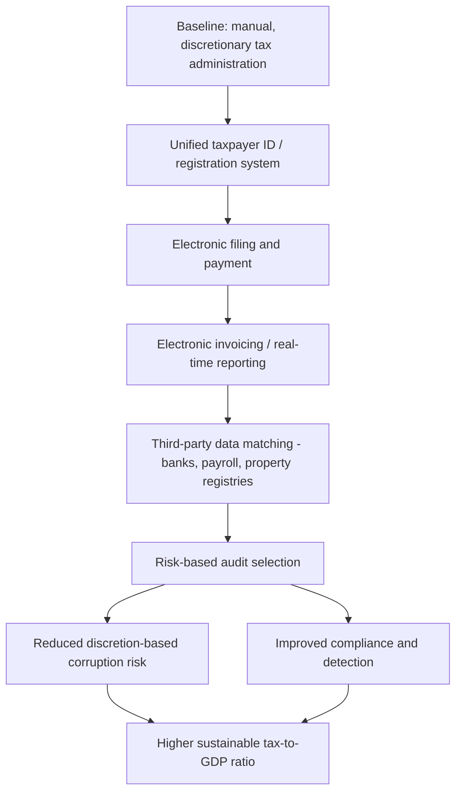

## Tax Capacity and Fiscal State Building

### Conceptual Framing

Tax (or fiscal) capacity refers to a state's ability to raise revenue from its population and economy in a sustained, predictable, and relatively efficient manner. In development economics, fiscal capacity is treated — alongside legal/administrative capacity — as one of the two core dimensions of state capacity in the Besley-Persson framework, and is widely viewed as a prerequisite for, rather than merely a byproduct of, broader state development: a government's ability to finance public goods, enforce contracts, and sustain administrative institutions depends fundamentally on its ability to extract revenue without destroying the tax base or provoking noncompliance and unrest.

This chapter connects directly to bureaucratic effectiveness (tax administration is itself a bureaucratic function subject to the same capacity constraints), corruption (tax collection is a classic site of extraction and bribery), and decentralization (sub-national revenue assignment) discussed elsewhere in this chapter.

### The Historical/Political Economy of Fiscal State Building

**War and state-making.** The classical historical account, associated with Tilly's "war made the state, and the state made war" thesis and subsequently formalized by Besley and Persson, argues that historical fiscal capacity in now-developed states emerged substantially from the revenue-raising imperatives of interstate warfare — rulers who needed to finance armies invested in tax administration, and this investment persisted as durable state capacity even after the immediate military need passed.

**Investment model of state capacity.** Besley and Persson formalize fiscal capacity as the outcome of a forward-looking investment decision by political incumbents: building tax administration is costly today but yields returns in future periods, so incumbents invest more when they expect to remain in power long enough to capture those returns, when political institutions constrain rent extraction (reducing the risk that a successor captures the investment's benefits), and when external threats (war, interstate competition) raise the value of revenue-generating capacity.

**Colonial revenue institutions.** A substantial comparative-historical literature (e.g., work by Frankema, Gardner, and others examining colonial Africa and Asia) documents that colonial fiscal systems were frequently designed around narrow objectives — financing colonial administration cheaply and extracting exportable resources — rather than building broad-based, general-purpose tax systems, and that these institutional legacies are argued by several researchers to have persisted into the post-independence period in ways that shape contemporary tax structures. [Inference] The precise causal weight of colonial-era institutions versus post-independence political choices in explaining current fiscal capacity gaps remains actively debated in this literature.

**The fiscal contract / quasi-voluntary compliance model.** An influential theoretical strand (Levi's "revenue maximization" and "quasi-voluntary compliance" framework) argues that sustainable tax compliance depends on citizens perceiving a credible reciprocal exchange — taxes paid in return for public goods and services delivered — such that low fiscal capacity and low bureaucratic effectiveness/legitimacy can become mutually reinforcing in a low-tax, low-service equilibrium.

### Measuring Tax and Fiscal Capacity

| Measure | What It Captures | Limitation |
| --- | --- | --- |
| Tax-to-GDP ratio | Aggregate revenue mobilization relative to economy size | Doesn't capture composition, administrative efficiency, or informal-sector exclusion |
| Tax effort index | Actual revenue relative to a "predicted" level given structural characteristics (income, trade openness, sector composition) | Depends on the specification of the predictive/benchmark model used |
| VAT/CIT/PIT productivity ratios | Revenue collected per statutory rate point relative to potential base | Sensitive to exemptions, compliance gaps, and base definition |
| Tax gap estimates | Difference between theoretically owed and actually collected tax | Requires detailed micro-data and assumptions; rarely available in many developing contexts |
| Administrative cost ratios | Cost of collection relative to revenue collected | Proxy for collection efficiency, but doesn't capture compliance burden borne by taxpayers |

[Inference] Cross-country tax-to-GDP comparisons are widely used but should be interpreted cautiously since they conflate genuine capacity differences with policy choices (e.g., low statutory rates by design) and informal-sector size, which mechanically constrains the taxable base independent of administrative effort.

### Structural Constraints on Tax Capacity in Developing States

**Large informal sector.** A substantial share of economic activity in many developing economies occurs outside formal, documented channels, making standard income and consumption tax instruments (which typically rely on third-party reporting, payroll withholding, or formal transaction records) difficult to apply — this is frequently cited as the single most binding structural constraint distinguishing developing-country from advanced-economy tax capacity. [Inference]

**Limited third-party information/verification infrastructure.** Modern tax administration in advanced economies relies heavily on third-party reporting (employer withholding, bank interest reporting, VAT invoice-matching) that creates a verifiable paper trail independent of the taxpayer's own self-report; where this infrastructure (formal banking penetration, employer payroll systems, digital transaction records) is thin, self-reported liabilities become far more difficult to verify and enforce.

**Weak cadastral and property registration systems.** Property taxation, often cited as an underexploited revenue source in developing economies given its relatively low administrative and economic distortion costs, is constrained where land titling and valuation systems are incomplete or outdated.

**Administrative capacity constraints in the revenue authority itself.** Tax collection is a bureaucratic function subject to the same absenteeism, weak monitoring, understaffing, and (per the corruption chapter) bribery-vulnerability constraints affecting other parts of public administration — tax officials with discretion over assessment and enforcement decisions represent a well-documented corruption risk point.

**Political economy of taxing elites.** Broadening the tax base to capture high-income individuals, large landholders, or politically connected firms often faces direct political resistance from the groups being taxed, who may have disproportionate influence over tax policy design and enforcement intensity — connecting directly to the elite capture discussion elsewhere in this chapter.

**Trade-tax transition costs.** Many developing economies historically relied heavily on trade taxes (tariffs) because customs collection at a limited number of border points is administratively simpler than broad-based domestic taxation; trade liberalization commitments (WTO accession, regional trade agreements) have required many countries to replace this relatively easy-to-collect revenue source with harder-to-administer domestic taxes (notably VAT), a transition extensively studied in the public finance literature. [Inference]

### Major Tax Instruments and Their Administrative Demands

| Instrument | Administrative Requirements | Common Developing-Country Challenges |
| --- | --- | --- |
| Value-Added Tax (VAT) | Invoice-matching, refund administration, registration threshold management | Refund fraud, compliance burden on small firms, informal-sector exclusion |
| Personal Income Tax (PIT) | Third-party withholding/reporting, filing infrastructure | Narrow formal-sector base, high administrative cost relative to revenue from broad-based low-income filers |
| Corporate Income Tax (CIT) | Auditing capacity, transfer-pricing enforcement | Base erosion via profit shifting, weak audit capacity for complex multinational structures |
| Property tax | Cadastral mapping, periodic valuation | Incomplete land registries, political resistance to reassessment |
| Trade taxes (tariffs) | Border/customs administration | Relatively easier to administer but shrinking base due to trade liberalization and smuggling/misinvoicing |
| Excise taxes | Point-of-production/import monitoring | Illicit trade and smuggling of high-excise goods (tobacco, alcohol, fuel) |

### Digitization and Modern Tax Administration Reform

**Electronic filing and payment systems.** Digitizing tax filing and payment reduces face-to-face interaction between taxpayers and officials (directly addressing the discretion-based corruption channel discussed in the anti-corruption chapter) and lowers compliance costs; several African and Latin American revenue authorities have documented improved filing compliance and reduced processing time following e-filing rollout. [Inference] Magnitude of effects varies by baseline administrative quality and taxpayer digital-access infrastructure.

**Electronic invoicing and real-time transaction reporting.** Systems requiring real-time or near-real-time electronic invoice submission (increasingly adopted across Latin America, notably Brazil, Mexico, and Chile as early adopters) create a continuous third-party verification trail for VAT and income tax purposes, substantially narrowing the space for under-reporting.

**Withholding-based VAT collection.** Several countries have adopted mechanisms requiring large taxpayers, banks, or government agencies to withhold VAT on payments to smaller suppliers, shifting collection responsibility toward more easily monitored large entities.

**Risk-based audit selection.** Using taxpayer data and machine-learning-based risk scoring to target audit resources toward higher-risk cases rather than random or purely discretionary selection, intended to both improve detection efficiency and reduce the discretion-based corruption risk associated with purely official-judgment-based audit targeting.

**Taxpayer registration and unique identifier systems.** Linking tax identification numbers to national ID systems, banking records, and property registries is a foundational infrastructure investment enabling most of the above digitization efforts; studies of countries implementing unified taxpayer ID systems (e.g., various sub-Saharan African revenue authority modernization programs) have found associations with improved registration and compliance, though rigorous causal identification isolating the ID system specifically from concurrent broader reform is limited in much of this literature. [Inference]

### Semi-Autonomous Revenue Authorities (SARAs)

A widely adopted institutional reform across developing economies since the 1990s has been the creation of semi-autonomous revenue authorities — tax administration bodies given greater operational and (in some cases) budgetary autonomy from the core civil service, often with distinct, more competitive pay scales intended to attract and retain qualified staff and reduce susceptibility to the low-wage corruption channel discussed in the causes-of-corruption literature. Evidence on SARA effectiveness is mixed across the extensive comparative literature: some country studies document meaningful revenue-to-GDP gains following SARA establishment, while others find effects fade over time or are difficult to isolate from concurrent broader reforms, and autonomy gains in some documented cases eroded as governments reasserted budgetary or appointment control over the nominally autonomous body. [Inference]

### Consequences of Weak Fiscal Capacity

- **Aid and resource dependence**: countries unable to mobilize substantial domestic revenue may become more reliant on foreign aid or natural resource rents, both of which carry distinct political-economy implications (aid conditionality, or the resource-curse dynamics discussed in the corruption-causes chapter) relative to broad-based domestic taxation
- **Underfunded public services**: directly linked to the public service delivery constraints discussed elsewhere in this chapter — resource constraints at the revenue-raising stage propagate through the entire delivery chain
- **Weakened state-citizen fiscal contract**: where the state relies primarily on non-tax revenue (resource rents, aid) rather than broad-based taxation, some researchers argue citizens have correspondingly weaker leverage to demand accountability, since the classical "no taxation without representation" bargaining dynamic is attenuated when the state's revenue does not depend on extracting it from the taxed population's own economic activity. [Inference] This "rentier state" hypothesis linking revenue source to accountability is influential but contested, with some empirical studies finding the relationship holds more strongly for certain regime types and resource categories than others
- **Persistent informality**: low fiscal capacity and a large informal sector can become mutually reinforcing — a large informal sector constrains the tax base, while weak revenue-funded public goods (business registration efficiency, contract enforcement, infrastructure) reduce the incentive for firms to formalize

### Conceptual Diagram: The Fiscal Capacity Investment Cycle (svg_diagram)

<svg xmlns="http://www.w3.org/2000/svg" viewBox="0 0 780 420">
\<style\>
text { font-family: Arial, sans-serif; font-size: 13px; fill: #1a1a1a; }
.title { font-size: 16px; font-weight: bold; }
.box { fill: #eef3f8; stroke: #2c5282; stroke-width: 2; rx: 8; }
.arrow { stroke: #2c5282; stroke-width: 2; marker-end: url(#ah7); fill: none; }
.label { font-size: 11px; fill: #4a5568; }
\</style\>
<text x="390" y="24" class="title" text-anchor="middle">The Fiscal Capacity Investment Cycle (svg_diagram)</text>
<rect x="300" y="50" width="200" height="60" class="box" />
<text x="400" y="75" text-anchor="middle">Political incentive to</text>
<text x="400" y="92" text-anchor="middle">invest in tax administration</text>
<rect x="560" y="160" width="200" height="60" class="box" />
<text x="660" y="185" text-anchor="middle">Broader, more reliable</text>
<text x="660" y="202" text-anchor="middle">tax base coverage</text>
<rect x="300" y="270" width="200" height="60" class="box" />
<text x="400" y="295" text-anchor="middle">Sustained revenue funds</text>
<text x="400" y="312" text-anchor="middle">public goods provision</text>
<rect x="30" y="160" width="200" height="60" class="box" />
<text x="130" y="185" text-anchor="middle">Citizen compliance /</text>
<text x="130" y="202" text-anchor="middle">fiscal contract legitimacy</text>
<path d="M480 110 Q560 140 620 160" class="arrow" />
<path d="M620 220 Q560 250 480 270" class="arrow" />
<path d="M320 270 Q200 250 130 220" class="arrow" />
<path d="M130 160 Q200 110 320 80" class="arrow" />

<text x="400" y="365" text-anchor="middle" class="label">Reinforcing cycle — breaks down at any weak link</text>

<text x="400" y="382" text-anchor="middle" class="label">(low investment, narrow base, weak delivery, or eroded trust)</text>

</svg>

### Analytical Diagram: Tax Administration Modernization Pathway (svg_diagram)

### Illustrative Tax Effort Model

A simplified representation of the "tax effort" concept used to benchmark actual collection against structural potential:

$$TE_i = \frac{T_i}{\hat{T}_i}, \quad \hat{T}_i = f(Y_i, O_i, S_i)$$

where $T_i$ is country $i$'s actual tax-to-GDP ratio, $\hat{T}_i$ is a predicted "capacity" level estimated as a function of per-capita income $Y_i$, trade openness $O_i$, and sectoral composition (e.g., agricultural share) $S_i$, typically via a cross-country regression. A tax effort ratio above 1 indicates collection exceeding what structural characteristics alone would predict; below 1 indicates under-collection relative to apparent capacity. [Inference] Tax effort estimates are sensitive to model specification and the set of structural covariates included, and should be interpreted as a diagnostic benchmark rather than a precise capacity ceiling.

### Common Pitfalls in Analysis

- Treating tax-to-GDP ratio alone as a sufficient measure of fiscal capacity without accounting for policy choices (statutory rate levels) versus genuine administrative constraints
- Assuming digitization reforms mechanically translate into revenue gains without accounting for complementary factors (digital access, institutional follow-through, political will to enforce)
- Overlooking the political economy of taxing elites when designing base-broadening reforms, since technical design alone rarely overcomes concentrated political resistance
- Generalizing SARA (semi-autonomous revenue authority) success stories without accounting for the specific political conditions (sustained autonomy protection) required to sustain them
- Applying the rentier-state/fiscal-contract hypothesis too generally across all resource-rich or aid-dependent states without accounting for documented heterogeneity by regime type and resource category

**Related Topics**

- Bureaucratic effectiveness in developing states
- Causes and consequences of corruption
- Decentralization and local governance
- Public service delivery constraints
- Elite capture and clientelism
- Resource curse and rentier state theory
- Informality and the informal sector in development economics
- Value-added tax design and administration
- State capacity theory (Besley-Persson framework)