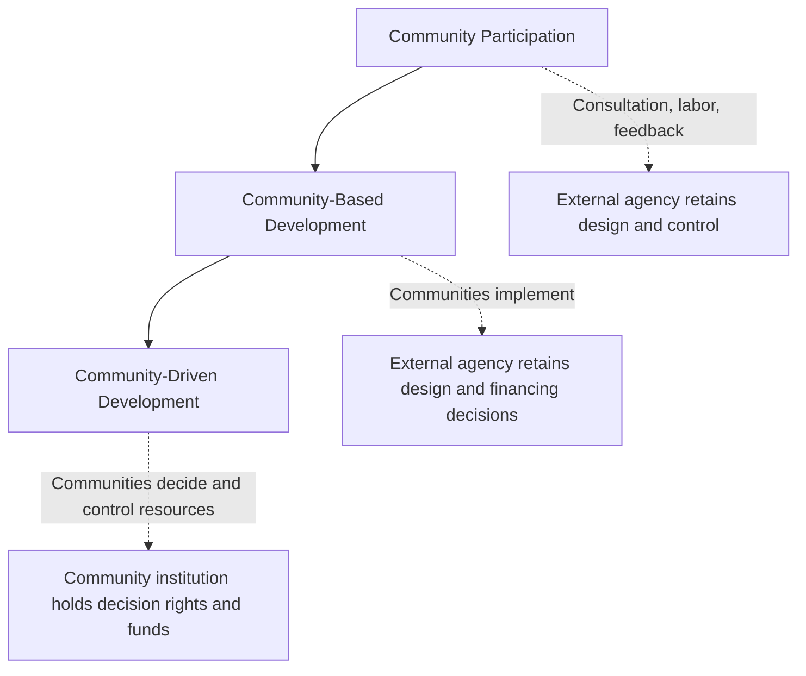

## Community-driven development approaches

### Definition and Core Concept

Community-driven development (CDD) is an approach to development assistance and public service delivery that gives control over planning decisions and investment resources to community groups, often in partnership with demand-responsive support organizations and service providers, including elected local governments, the private sector, NGOs, and central government agencies. CDD treats poor people and their institutions as assets and partners in the development process rather than as beneficiaries of externally designed interventions.

The approach rests on the premise that communities possess local knowledge about their own needs, priorities, and constraints that external planners lack, and that direct control over resources by beneficiaries improves the efficiency, effectiveness, and sustainability of development outcomes relative to centrally planned, top-down delivery mechanisms.

### Distinguishing CDD from Related Concepts

CDD is frequently conflated with two adjacent but distinct concepts:

**Community Participation** refers to any degree of community involvement in a project designed and controlled by an external agency (e.g., consultation, labor contribution, or feedback mechanisms). Participation does not necessarily entail control over resources or decisions.

**Community-Based Development (CBD)** involves communities in project implementation but the design, financing modality, and ultimate decision rights typically remain with an external agency or government body.

**Community-Driven Development (CDD)** is distinguished by the transfer of genuine control — over financial resources, sub-project selection, procurement, and implementation oversight — directly to community-level institutions, usually a democratically elected or broadly representative community organization.

$$\text{CDD} \subset \text{CBD} \subset \text{Community Participation}$$

### Theoretical Rationale

**Information Asymmetry and Local Knowledge**

Central planners face significant information constraints in identifying local needs, monitoring implementation quality, and detecting elite capture or corruption at the micro level. Community members possess tacit, low-cost access to information about relative needs, the reliability of local contractors, and the behavior of local officials. CDD is designed to exploit this local informational advantage.

**Principal-Agent Problems in Service Delivery**

Conventional public service delivery involves long principal-agent chains: citizens (principals) delegate to politicians, who delegate to bureaucrats, who delegate to frontline providers. Each delegation step introduces potential slippage, monitoring costs, and moral hazard. CDD shortens this chain by making the community itself the principal with direct budgetary and oversight authority over the immediate service provider, reducing (though not eliminating) agency losses.

$$L_{total} = \sum_{i=1}^{n} \lambda_i$$

where $L_{total}$ denotes the total expected leakage or agency loss across $n$ delegation links and $\lambda_i$ is the loss associated with link $i$. CDD's design objective is to reduce $n$, thereby reducing $L_{total}$, though this reduction is not automatic and depends on the local institutional environment [Inference].

**Social Capital and Collective Action**

CDD draws on theories of social capital (Putnam, Coleman) positing that dense networks of reciprocity, trust, and local norms lower the transaction costs of collective action. Where social capital is high, CDD can more readily mobilize community labor, monitor local elites, and sustain infrastructure through community maintenance norms. Where social capital is low or communities are highly heterogeneous or fractionalized, CDD's collective-action assumptions are less likely to hold [Inference].

**Empowerment and Voice**

A parallel justification, distinct from the efficiency argument, holds that CDD builds citizen capacity for self-governance, strengthens local accountability institutions, and expands the voice of marginalized groups (including women and lower castes/ethnic minorities) who are typically excluded from centralized planning processes.

### Core Institutional Components

**Key Points**

- A representative or elected community organization (e.g., Village Development Committee, Community Development Council) that holds decision rights
- A block grant or menu-based financing mechanism transferred directly to the community account
- A participatory planning process (often using participatory rural appraisal or similar tools) to identify and prioritize sub-projects
- A facilitation layer (NGOs, government field staff, or project management units) providing technical assistance, training, and fiduciary oversight
- A menu of eligible sub-project categories (e.g., water supply, feeder roads, schools, health posts) from which communities select
- Procurement and financial management rules adapted to low-capacity settings (community procurement committees, simplified bidding, social audits)
- Monitoring and grievance-redress mechanisms, often including community scorecards or public expenditure tracking

### Typical Program Cycle

### Financing Modalities

**Block Grants**: A fixed sum transferred to each community (sometimes scaled by population), with the community given full discretion over allocation within an eligible menu. This is the dominant CDD financing modality (e.g., Indonesia's KDP/PNPM, Afghanistan's National Solidarity Programme).

**Matching Grants**: External funds are conditional on a community co-contribution (cash, labor, or materials), intended to signal genuine demand and increase local ownership, though this can also exclude the poorest communities unable to mobilize matching resources [Inference].

**Competitive/Demand-Driven Grants**: Communities submit proposals that compete for a limited pool of funds, intended to reward stronger institutional capacity and genuine need, at the risk of systematically disadvantaging weaker or less-organized communities.

### Flagship Program Architectures

**Key Points**

- **Indonesia's Kecamatan Development Program (KDP) / PNPM Mandiri**: Sub-district (kecamatan)-level block grants allocated via an inter-village competition judged by community representatives; widely studied in the empirical CDD literature and one of the largest CDD programs globally by disbursement.
- **Afghanistan's National Solidarity Programme (NSP)**: Established elected Community Development Councils (CDCs) as durable local governance institutions receiving block grants; notable for building local governance infrastructure in a fragile-state, low state-capacity setting.
- **India's Rural Livelihoods Missions (e.g., NRLM/self-help group federations)**: Layered federations of women's self-help groups used as the community institutional vehicle for credit access, livelihoods support, and social accountability.
- **Social Funds (e.g., in Latin America and Sub-Saharan Africa)**: Financing intermediary institutions channeling resources to community sub-projects, typically with lighter emphasis on building durable local government institutions compared to CDCs.

### CDD in Fragile and Conflict-Affected States

CDD has been particularly promoted in fragile and post-conflict settings on the premise that it can (a) deliver services where formal state institutions are weak or absent, (b) rebuild social cohesion and trust across conflict-affected groups, and (c) serve as a vehicle for state-building by creating local governance structures aligned with eventual government scale-up.

**[Unverified]** The empirical evidence for CDD's peacebuilding and social cohesion effects in conflict settings is decidedly mixed; several rigorous evaluations (e.g., of the Democratic Republic of Congo's Tuungane program and Liberia's Community Empowerment Program) found limited to no measurable impacts on social cohesion, trust, or collective action beyond project completion, despite finding some infrastructure delivery success. This gap between theory and rigorous evidence is a central point of ongoing debate in the literature and should not be treated as settled.

### Elite Capture: Mechanisms and Evidence

Elite capture refers to the disproportionate influence of locally advantaged individuals (in wealth, education, caste, ethnicity, or political connection) over the selection, siting, and benefit distribution of CDD-funded sub-projects.

**Mechanisms of Capture**

- Control over the facilitation process and information flow to less-connected community members
- Disproportionate representation on community management committees
- Steering of sub-project location or type toward elite-proximate benefits (e.g., roads near elite landholdings)
- Manipulation of participatory meetings through social pressure, exclusion of women or marginalized castes/ethnicities from decision fora

**Key Points**

- Evidence from Indonesia's KDP-related studies suggests capture is more muted where formal accountability structures (village meetings, information disclosure) are actively enforced.
- Studies of Sub-Saharan African CDD programs find more pronounced capture along lines of pre-existing local political and economic hierarchies, particularly where facilitation quality is weak or facilitators are co-opted.
- **[Inference]** Elite capture appears less a binary failure than a matter of degree, with "benevolent capture" (where elites redirect resources but still toward broadly beneficial local infrastructure) documented as distinct from purely extractive capture; the welfare implications of the two differ substantially.

### Elite Capture: Formal Framing

A simplified median-voter departure can illustrate the capture logic. Let $v_i$ denote community member $i$'s valuation of a sub-project, and suppose the selected project reflects a weighted aggregation:

$$P^* = \arg\max_{p} \sum_{i=1}^{n} w_i \cdot v_i(p)$$

where $w_i$ is member $i$'s effective decision-weight. Under an idealized democratic process, $w_i = 1/n$ for all $i$. Elite capture is formally a distortion in which $w_i \gg 1/n$ for a small elite subset, causing $P^*$ to diverge from the allocation that would emerge under equal weighting — even absent any embezzlement of funds.

### Targeting Performance and the Poverty Question

**Key Points**

- CDD's *geographic* targeting (allocating more resources to poorer communities/regions) is generally found to perform reasonably well when a transparent, formula-based allocation rule is used.
- CDD's *within-community* targeting of the poorest households is more inconsistent; participatory processes do not automatically favor the poorest, since the poorest often face the highest opportunity cost of participation (time, social capital) and lowest voice in community fora.
- **[Inference]** This suggests CDD is better understood as a mechanism for improving the efficiency and legitimacy of local public goods provision than as a finely targeted anti-poverty instrument, notwithstanding program rhetoric that sometimes conflates the two.

### Impact Evidence Summary

**Key Points**

- **Infrastructure delivery**: Rigorous evaluations broadly find CDD programs deliver functioning small-scale infrastructure (water points, feeder roads, schools) at costs often comparable to or lower than conventional government contracting, though comparisons are sensitive to how overhead and facilitation costs are accounted for.
- **Household welfare/consumption**: Effects on household consumption, income, or asset accumulation are generally small or statistically insignificant across major randomized evaluations (e.g., studies of Indonesia's PNPM, Sierra Leone's GoBifo program).
- **Social capital and collective action**: A large multi-country meta-analysis (Casey, Glennerster, and Miguel and related literature) found limited to no robust average effects of CDD on measures of social cohesion, trust, or local collective-action capacity, contrary to earlier programmatic claims.
- **Governance/institutional effects**: Evidence on whether CDD durably strengthens local governance institutions beyond the life of donor funding is weak; many community institutions established for CDD purposes show reduced activity or dissolve once external facilitation and funding cease.
- **[Unverified]** These null or modest results generated substantial debate within the development economics profession in the 2010s regarding whether CDD had been oversold relative to the strength of its evidence base at the time of its rapid scale-up by the World Bank and bilateral donors in the 1990s–2000s.

### Design Trade-offs

| Design Choice | Argument For | Argument Against |
| --- | --- | --- |
| Block grant vs. matching grant | Block grants avoid excluding poor communities lacking co-financing capacity | Matching requirements may better screen for genuine local demand and ownership |
| Menu-restricted vs. open sub-project choice | Restriction ensures technical feasibility and safeguards compliance | Open choice better respects genuine local priorities and information advantage |
| NGO facilitation vs. government facilitation | NGOs may be more responsive and less politically captured | Government facilitation better supports institutional sustainability and scale-up into permanent local government |
| Elected vs. self-selected community committees | Elections confer greater legitimacy and reduce capture risk | Elections impose administrative burden and may replicate existing local power structures if turnout/participation is unequal |
| Parallel community institutions vs. integration with local government | Parallel institutions can move faster and bypass weak local government | Parallel institutions risk undermining local government accountability and are less likely to persist after project closure |

### Relationship to Decentralization and Local Government

CDD is sometimes positioned as complementary to, and sometimes as a substitute for, fiscal and political decentralization. Where CDD creates parallel community institutions disconnected from elected local government, it can generate duplication, jurisdictional confusion, or even undermine the accountability of the formal local government by diverting citizen attention and donor resources. A growing strand of program design (e.g., later phases of PNPM, integration with panchayati raj institutions in India) attempts to nest CDD structures within statutory local government to avoid this tension and support institutional durability after donor exit.

### Monitoring, Transparency, and Social Accountability Tools

**Key Points**

- **Social audits**: Public, participatory review of project expenditures and outputs against records, often pioneered in India's employment-guarantee and CDD-adjacent programs
- **Community scorecards**: Structured citizen feedback on service quality compared against provider self-assessment
- **Public expenditure tracking surveys (PETS)**: Used to trace and quantify leakage of funds between disbursement and point of use
- **Information campaigns**: Providing communities with clear, simplified information on entitlements and budgets, shown in some settings (e.g., Indonesian corruption audits under Olken's work) to reduce, though not eliminate, leakage when paired with credible audit threat

### Worked Illustration: Comparing Delivery Mechanism Costs

Consider a stylized comparison of a rural water point delivered via (a) conventional government contracting and (b) a CDD block grant mechanism.

**Example**

| Cost Component | Government Contracting | CDD Block Grant |
| --- | --- | --- |
| Design and engineering overhead | High (centralized technical staff) | Lower (standardized designs, community input) |
| Procurement markup/leakage | Variable, sometimes substantial | Lower where social audit is credible; can still be significant absent oversight |
| Community labor contribution | Typically not mobilized | Often mobilized in-kind, reducing cash cost |
| Facilitation/training cost | Minimal | Substantial (NGO/facilitator salaries, training) |
| Maintenance likelihood | Variable, often weak post-handover | **[Inference]** Somewhat higher where community ownership is genuine, but evidence is mixed and site-specific |

**[Inference]** The net cost-effectiveness comparison depends heavily on how facilitation costs are amortized and whether maintenance externalities are captured in the evaluation window; short-run cost studies favoring CDD may understate its true long-run cost when facilitation overhead is included.

### Gender and Social Inclusion Dimensions

CDD program design frequently incorporates explicit inclusion mechanisms — reserved seats for women on community committees, women-only planning meetings, or targeted self-help group structures — in response to evidence that open community meetings tend to be dominated by socially advantaged male participants. Evidence on the effectiveness of quota-based inclusion mechanisms is mixed: quotas reliably increase women's presence in decision-making bodies but show more limited and context-dependent effects on whether women's stated priorities are actually reflected in final sub-project selection.

### Critiques and Debates

**Key Points**

- **Depoliticization critique**: Some scholars (e.g., drawing on Ferguson's "anti-politics machine" framework) argue CDD reframes inherently political questions of resource distribution as technical, apolitical exercises, potentially obscuring rather than resolving underlying power asymmetries.
- **Sustainability critique**: Community institutions built primarily to administer donor block grants frequently do not persist once funding ends, raising doubts about CDD's claimed institution-building benefits.
- **Evidence-scale mismatch critique**: CDD was scaled to tens of billions of dollars in cumulative World Bank lending well before the rigorous randomized evaluation evidence base matured, prompting retrospective criticism that scale-up outpaced evidence.
- **Elite capture as inherent, not incidental**: Some critics argue capture is not a fixable design flaw but a structural feature of inserting discretionary resources into unequal local power structures.

### Relationship to Broader Governance and Anti-Corruption Literature

CDD sits within the broader development economics literature on state capacity, principal-agent problems in public service delivery, and community monitoring as an anti-corruption tool (paralleling work by Olken and others on top-down audits versus bottom-up/community monitoring of infrastructure projects). A recurring finding across this literature is that community monitoring alone is often insufficient to substantially reduce corruption or leakage unless paired with credible external audit threat, suggesting complementarity rather than substitutability between bottom-up (CDD-style) and top-down (state audit) accountability mechanisms.

### Practical Design Checklist

**Next Steps**

- Assess baseline social capital, heterogeneity, and existing local power structures before selecting CDD as a delivery mechanism over alternatives
- Design a transparent, formula-based inter-community allocation rule to protect geographic targeting performance
- Pair community-level financial control with an external audit or verification layer rather than relying on community monitoring alone
- Build in explicit inclusion mechanisms (reserved seats, women-only fora) if marginalized-group representation is a program objective, and evaluate their actual effect on outcomes, not just presence
- Plan for institutional integration with statutory local government structures from program design onward, rather than as an afterthought at project closure
- Commission or consult rigorous impact evaluations disaggregated by outcome domain (infrastructure delivery vs. household welfare vs. social cohesion vs. governance), since these domains show markedly different effect sizes in the evidence base

### Related Topics

- Decentralization and fiscal federalism
- Elite capture and local political economy
- Social accountability and public expenditure tracking surveys (Olken-style audit studies)
- Self-help group federations and microfinance-linked development
- Fragile states and service delivery in the absence of state capacity
- Participatory budgeting
- Randomized evaluation methods in development economics
- Local public goods provision and the median-voter framework