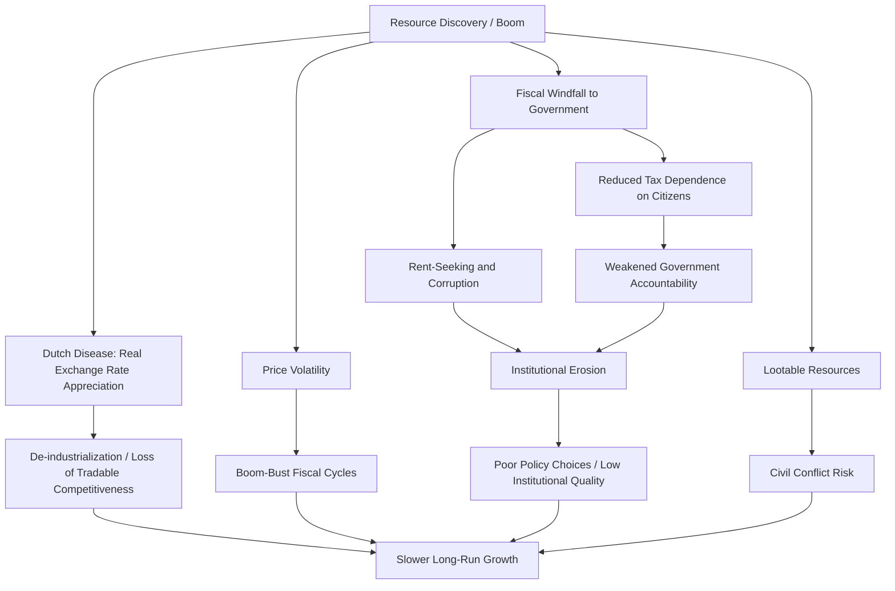

## Natural Resource Curse Theory and Evidence

### Definition and Core Concept

The natural resource curse (also called the "paradox of plenty") refers to the empirical observation that countries with abundant natural resources — particularly point-source resources like oil, gas, and minerals — tend to experience slower economic growth, weaker institutional development, and worse development outcomes than resource-poor countries, despite the theoretical expectation that resource wealth should accelerate development.

**Key Points**

- The term was coined by Richard Auty (1993) in his study of mineral economies
- The curse is a statistical regularity, not a deterministic law — countries like Norway and Botswana are frequently cited counterexamples
- It applies most strongly to point-source resources (oil, minerals, gas extracted from concentrated locations) rather than diffuse resources (agriculture, forestry) that are spread across a population
- The phenomenon spans multiple dimensions: economic (growth), political (governance, conflict), and social (inequality, human development)

### Theoretical Mechanisms

#### Dutch Disease

The most rigorously modeled economic mechanism. Named after the decline of Dutch manufacturing following North Sea gas discoveries in the 1960s.

**Mechanism:**

1. A resource boom generates a surge in foreign currency earnings
2. This causes real exchange rate appreciation through two channels: the "spending effect" (higher domestic demand for non-tradables raises their relative price) and the "resource movement effect" (labor and capital shift toward the booming resource sector)
3. Appreciation makes non-resource tradable sectors (manufacturing, agriculture) less competitive internationally
4. Tradable sectors contract, and de-industrialization occurs
5. When the resource boom ends, the economy lacks a diversified productive base

The core model (Corden and Neary, 1982) divides the economy into three sectors: the booming (resource) sector, the lagging (non-resource tradable) sector, and the non-tradable sector.

$$\frac{P_N}{P_T} = f(W_B, W_L, D)$$

Where $P_N$ is the price of non-tradables, $P_T$ is the price of tradables, $W_B$ is the resource boom windfall, $W_L$ is labor allocated to lagging sectors, and $D$ is aggregate demand. A positive resource shock raises $P_N/P_T$, the real exchange rate.

#### Volatility and Terms-of-Trade Shocks

Commodity prices are highly volatile. Resource-dependent economies face:

- Boom-bust cycles that complicate fiscal planning
- Pro-cyclical government spending (governments spend during booms, then face painful cuts during busts)
- Higher output volatility, which is empirically associated with lower long-run growth (Ramey and Ramey, 1995)

#### Institutional and Political Economy Mechanisms

These are now considered the dominant explanation in the literature (Mehlum, Moene, and Torvik, 2006; Robinson, Torvik, and Verdier, 2006).

- **Rent-seeking**: Resource rents create incentives for individuals and groups to compete for control of the rents rather than engage in productive activity
- **Weak institutional quality amplifies the curse**: countries with "grabber-friendly" institutions (weak property rights, high corruption) experience the curse, while countries with "producer-friendly" institutions (strong rule of law) can convert resources into growth
- **Political resource curse**: resource rents reduce governments' need to tax citizens, weakening the "no taxation without representation" accountability link (Ross, 2001, 2012) — this is the **fiscal/rentier state** channel
- **Conflict channel**: point-source resources (especially "lootable" resources like alluvial diamonds) increase the risk of civil conflict by providing a financeable prize and funding source for rebel groups (Collier and Hoeffler, 2004; Ross, 2004)
- **Patronage and clientelism**: resource rents allow incumbents to buy political support, entrenching authoritarian or weakly accountable regimes
- **Voracity effect**: multiple groups compete for a share of the rents, leading to excessive and inefficient redistribution (Tornell and Lane, 1999)

#### Human Capital Crowding Out

Gylfason (2001) argues resource abundance can reduce incentives to invest in education, since resource sectors typically employ low-skill labor intensively relative to their revenue generation, and government complacency from rent inflows can reduce public investment in schooling.

### Mermaid Overview: Causal Pathways

### Empirical Evidence

#### Foundational Cross-Country Studies

**Sachs and Warner (1995, 1997, 2001)** produced the seminal empirical finding: using a panel of roughly 97 developing countries from 1970–1990, they found a robust negative correlation between the ratio of natural resource exports to GDP and subsequent economic growth, controlling for initial income, trade openness, investment rates, and other growth determinants.

$$g_i = \alpha + \beta_1 (SXP/GDP)_i + \beta_2 X_i + \varepsilon_i$$

Where $g_i$ is per-capita GDP growth, $SXP/GDP$ is resource exports as a share of GDP (the resource-intensity measure), and $X_i$ is a vector of standard growth controls. The estimated $\beta_1$ was consistently negative and statistically significant.

**Key qualifications and critiques that followed:**

- **Endogeneity concerns**: resource export share may be endogenous to growth itself (a country's overall economic structure jointly determines both)
- **Lederman and Maloney (2007)** re-examined the data and found the curse was less robust when using resource *abundance* (stocks, e.g., resources per capita) rather than resource *dependence* (flows, e.g., exports/GDP) — dependence measures may capture failure to diversify rather than a causal resource effect
- **Brunnschweiler and Bulte (2008)** distinguished resource *dependence* from resource *abundance* and argued that using subsoil asset value (a stock measure) rather than export share (a flow measure, contaminated by reverse causality) weakens or reverses the curse finding
- **Alexeev and Conrad (2009)** found that oil and mineral abundance is associated with *higher* per capita income when controlling for the fact that resource-rich countries in the sample were often already wealthy prior to major extraction, challenging the growth-curse interpretation

#### Institutional Quality as a Conditioning Variable

**Mehlum, Moene, and Torvik (2006)**: replicating Sachs-Warner but interacting resource dependence with institutional quality, they found the negative growth effect of resources is concentrated entirely in countries with weak ("grabber-friendly") institutions. In countries with strong institutions, resource abundance has no negative effect or is even positive.

$$g_i = \alpha + \beta_1 R_i + \beta_2 (R_i \times Q_i) + \beta_3 Q_i + \beta_4 X_i + \varepsilon_i$$

Where $R_i$ is resource intensity and $Q_i$ is an institutional quality index. A positive $\beta_2$ indicates institutions moderate the curse.

#### Country Case Comparisons

**Negative examples (commonly cited):**

- **Nigeria**: oil rents since the 1970s coexisted with stagnant non-oil GDP per capita for decades, high corruption (Nigeria consistently ranks poorly on Transparency International's Corruption Perceptions Index), and the Niger Delta conflict tied to oil extraction and revenue distribution disputes
- **Venezuela**: heavy oil dependence (historically often exceeding 90% of export earnings) accompanied economic mismanagement, hyperinflation in the 2010s, and institutional collapse — though this case is also heavily shaped by domestic macroeconomic policy choices, [Inference] making the relative weight of "resource curse" versus policy failure difficult to cleanly separate
- **Angola, DRC, Sierra Leone**: resource-financed civil conflicts (oil in Angola, coltan/diamonds in DRC, "blood diamonds" in Sierra Leone)
- **Equatorial Guinea**: among the highest GDP per capita in Africa due to oil, but with human development indicators (health, poverty, inequality) far below what income levels would predict

**Positive/counterexample cases:**

- **Norway**: established the Government Pension Fund Global (est. 1990) to sterilize oil revenue, insulate the domestic economy from Dutch disease, and save wealth for future generations; combined with pre-existing strong institutions and rule of law prior to oil discovery
- **Botswana**: diamond wealth managed through prudent fiscal policy, a stable multi-party democracy, and strong property rights predating major mineral discoveries; often cited alongside Mehlum-Moene-Torvik's institutional thesis
- **Chile**: copper revenue managed via a structural fiscal rule and a stabilization fund (though copper is state-controlled via Codelco, distinct in political economy from privately-extracted oil)
- **Malaysia, Indonesia**: partial diversification success, though with more mixed institutional records than Norway/Botswana

#### Resources and Conflict — Empirical Findings

- **Collier and Hoeffler (2004)**: primary commodity exports as a share of GDP show a robust, non-linear (inverted-U) relationship with civil war onset risk in cross-country panel regressions
- **Ross (2004, 2006)**: reviews of the literature find that oil is associated with conflict onset and duration, but the mechanism is contested — greed-based (financing rebellion) versus grievance-based (regional inequities in revenue-sharing) explanations both find support
- **Lootability distinction**: alluvial (surface-scattered) diamonds, easily extracted by artisanal or informal labor, show a stronger conflict association than kimberlite (deep-mined, capital-intensive) diamonds (Lujala, Gleditsch, and Gilmore, 2005)

### Policy Responses and Mitigation Strategies

**Sovereign Wealth Funds (SWFs)**

Used to sterilize windfall revenue, smooth spending across price cycles, and save for intergenerational equity.

- Norway's Government Pension Fund Global — full transparency, arm's-length investment management, strict withdrawal rule (historically capped near 3–4% of fund value annually, the "fiscal rule")
- Chile's Economic and Social Stabilization Fund — rule-based, tied to a structural balance fiscal framework
- Botswana's Pula Fund

**Fiscal Rules and Revenue Management**

- Structural balance rules that de-link government spending from current commodity prices, using long-run price estimates instead
- Revenue transparency initiatives, notably the **Extractive Industries Transparency Initiative (EITI)**, which requires disclosure of payments by extractive companies and revenues received by governments

**Direct Distribution Proposals**

- Some economists (e.g., Sala-i-Martin and Subramanian, 2003, on Nigeria) have proposed direct cash transfers of oil revenue to citizens rather than routing funds through government budgets, to bypass weak state institutions and restore an accountability link between citizens and (subsequently taxed) revenue — [Inference] this remains a largely theoretical proposal rather than a widely implemented policy, given implementation and political feasibility challenges

**Local Content and Diversification Policies**

- Requirements for domestic value-addition, technology transfer, and employment quotas in extractive sectors
- Explicit industrial policy to counteract Dutch disease effects on manufacturing competitiveness

**Institutional Strengthening Pre-Extraction**

- The Mehlum-Moene-Torvik and Botswana evidence suggests establishing strong property rights, anti-corruption frameworks, and checks on executive power *before* major resource windfalls arrive is more effective than reforming institutions after rent-seeking patterns are entrenched

### Illustrative Diagram: Dutch Disease Sectoral Reallocation (svg_diagram)

<svg xmlns="http://www.w3.org/2000/svg" viewBox="0 0 700 420">
<text x="350" y="30" text-anchor="middle" font-size="18" font-weight="bold" fill="#1a1a1a">Dutch Disease: Sectoral Reallocation (svg_diagram)</text>

<text x="150" y="65" text-anchor="middle" font-size="14" font-weight="bold" fill="#333">Before Resource Boom</text>

<rect x="50" y="80" width="200" height="60" fill="`#4a90d9`" opacity="0.85" />

<text x="150" y="115" text-anchor="middle" font-size="13" fill="white">Tradable / Manufacturing</text>

<rect x="50" y="145" width="200" height="40" fill="`#7fbf7f`" opacity="0.85" />

<text x="150" y="170" text-anchor="middle" font-size="13" fill="white">Non-Tradable Sector</text>

<rect x="50" y="190" width="200" height="20" fill="`#d9a441`" opacity="0.85" />

<text x="150" y="205" text-anchor="middle" font-size="11" fill="white">Resource Sector</text>

<line x1="290" y1="150" x2="380" y2="150" stroke="#1a1a1a" stroke-width="3" marker-end="url(#arrow)" />
<text x="335" y="140" text-anchor="middle" font-size="12" fill="#1a1a1a">Boom +</text>
<text x="335" y="170" text-anchor="middle" font-size="12" fill="#1a1a1a">Appreciation</text>
<text x="550" y="65" text-anchor="middle" font-size="14" font-weight="bold" fill="#333">After Resource Boom</text>

<rect x="450" y="80" width="200" height="25" fill="`#4a90d9`" opacity="0.85" />

<text x="550" y="97" text-anchor="middle" font-size="11" fill="white">Tradable / Manufacturing (shrunk)</text>

<rect x="450" y="110" width="200" height="70" fill="`#7fbf7f`" opacity="0.85" />

<text x="550" y="150" text-anchor="middle" font-size="13" fill="white">Non-Tradable Sector (expanded)</text>

<rect x="450" y="185" width="200" height="55" fill="`#d9a441`" opacity="0.85" />

<text x="550" y="215" text-anchor="middle" font-size="13" fill="white">Resource Sector (expanded)</text>

<text x="350" y="270" text-anchor="middle" font-size="12" fill="#333">Spending effect: windfall raises demand for non-tradables → relative price ↑</text>

<text x="350" y="290" text-anchor="middle" font-size="12" fill="#333">Resource movement effect: labor/capital shift into the booming sector</text>

<text x="350" y="310" text-anchor="middle" font-size="12" fill="#333">Net effect: manufacturing contracts, real exchange rate appreciates</text>

<rect x="150" y="340" width="400" height="60" fill="none" stroke="#999" stroke-width="1" />
<text x="350" y="360" text-anchor="middle" font-size="12" font-weight="bold" fill="#333">Real Exchange Rate</text>
<text x="350" y="380" text-anchor="middle" font-size="12" fill="#333">$P_N/P_T \uparrow$ as non-tradable prices rise relative to tradables</text>
</svg>

### Critiques and Open Debates

- **Reverse causality and selection**: some scholars argue weak institutions cause both resource dependence (failure to diversify) and poor growth, rather than resources causing weak institutions — making the *direction* of causality contested
- **Measurement issues**: resource "dependence" (export share, a flow) versus "abundance" (endowment per capita, a stock) yield different and sometimes contradictory empirical results
- **Publication and case-selection bias**: [Inference] the prominence of dramatic negative cases (Nigeria, Venezuela, Angola) in public discourse may overstate the curse's average statistical strength relative to the full cross-country distribution, which includes many resource-rich middle-income and high-income countries that do not exhibit clear curse symptoms
- **Van der Ploeg (2011)** surveys the literature and concludes the curse is real on average but highly conditional — institutional quality, quality of economic policy, and the type of resource (point-source vs. diffuse) determine whether it manifests
- The consensus in recent development economics has shifted from "resources cause bad outcomes" toward **"resources amplify pre-existing institutional quality"** — good institutions turn resources into a blessing, weak institutions turn them into a curse

### Related Topics

- Dutch disease and real exchange rate dynamics
- Rentier state theory and the political economy of taxation
- Sovereign wealth fund design and fiscal rules
- Extractive Industries Transparency Initiative (EITI) and revenue transparency
- Civil conflict and natural resource financing (greed vs. grievance models)
- Institutional quality indices (Worldwide Governance Indicators, Polity)
- Economic diversification strategies for resource-dependent economies
- Norway's Government Pension Fund Global as a policy case study
- Commodity price volatility and macroeconomic stabilization policy
- Extractive sector local content and industrial policy