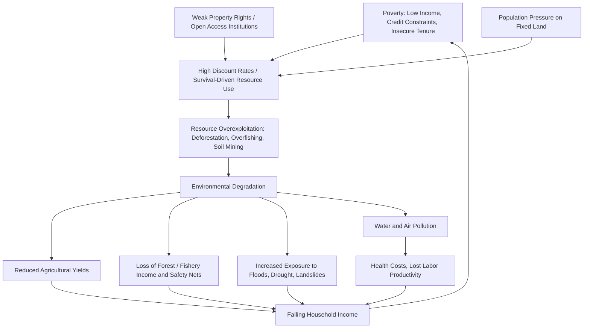

## Environmental Degradation and Poverty Linkages

### Conceptual Framework

The relationship between environmental degradation and poverty is bidirectional and mutually reinforcing, often described as a "vicious circle" or "downward spiral." Poverty can drive environmentally destructive behavior (due to high discount rates, lack of alternatives, and insecure tenure), while environmental degradation deepens poverty (by eroding the natural capital the poor depend on most directly). This is distinct from, though related to, the broader Environmental Kuznets Curve literature on income-pollution relationships.

**Key Points**

- The poor are disproportionately dependent on natural capital (land, forests, water, fisheries) for direct subsistence, income, and insurance against shocks
- Environmental degradation is not simply a byproduct of poverty — the causal arrows run in both directions and are mediated by institutions, markets, and policy
- The linkage is highly context-dependent: it varies by resource type (renewable vs. non-renewable, local vs. global commons), tenure regime, and market access
- Much of the empirical literature cautions against a simplistic "poverty causes degradation" narrative, since evidence is mixed and often locally specific

### Theoretical Mechanisms: Poverty → Degradation

#### High Discount Rates and Survival Constraints

Poor households facing immediate survival needs, credit constraints, and limited access to insurance often apply high implicit discount rates to future resource yields relative to present consumption.

$$\max_{c_t} \sum_{t=0}^{\infty} \beta^t U(c_t) \quad \text{subject to} \quad c_t \leq f(R_t), \ R_{t+1} = g(R_t) - h_t$$

Where $\beta$ is the discount factor (lower $\beta$ implies heavier weighting of present consumption $c_t$), $R_t$ is the resource stock, $h_t$ is harvest, and $g(\cdot)$ is the natural regeneration function. A low $\beta$ — plausible under poverty-induced impatience or survival risk — can produce resource-mining behavior even when the household is aware of long-run depletion consequences.

**Key Points**

- [Inference] This model formalizes a widely cited intuition rather than a single universally estimated empirical parameter; actual discount rates used by poor households vary substantially across studies and contexts
- Credit market failures compound this: without access to savings or credit, natural resource stocks (standing forest, soil fertility, fish stocks) become the *de facto* savings/insurance mechanism, encouraging drawdown during shocks

#### Open Access and Weak Property Rights

Where the poor lack secure tenure over land, forests, or fisheries, resources are effectively open-access, generating the classic "tragedy of the commons" dynamic (Hardin, 1968; formalized by Gordon, 1954, and Clark, 1973 for fisheries).

$$\pi(E) = pqEX(E) - cE$$

Where $\pi$ is rent, $E$ is harvesting effort, $p$ is price, $q$ is catchability, $X(E)$ is the equilibrium stock as a function of effort, and $c$ is the cost per unit effort. Under open access, effort expands until $\pi(E) = 0$, dissipating all resource rent and often pushing the stock below the level that maximizes sustainable yield.

- The poor are frequently both the primary users of open-access resources and the group with the least capacity to organize collective management (Ostrom, 1990, documents when and how communities overcome this)
- Insecure tenure removes incentive for long-horizon investment (e.g., soil conservation, tree planting) since returns cannot be reliably captured by the investor

#### Population Pressure and Land Fragmentation

Higher population density in poor rural areas with fixed or shrinking arable land can drive:

- Cultivation of marginal/erosion-prone land
- Shortened fallow periods in shifting cultivation systems, reducing soil recovery time
- Deforestation frontier expansion as land-constrained households clear new plots

[Inference] This "population-driven degradation" narrative associated with neo-Malthusian frameworks is contested in the literature — Boserupian counter-arguments (Boserup, 1965) suggest population pressure can instead induce agricultural intensification and technological adaptation rather than degradation, with the outcome depending on institutional and market context.

#### Energy Poverty and Biomass Dependence

Households without access to modern energy rely on fuelwood, charcoal, and crop residues for cooking and heating.

- In fuelwood-scarce regions, this contributes to localized deforestation and forest degradation (though large-scale deforestation is more often driven by commercial agriculture and logging than household fuelwood collection — a key empirical correction to earlier "fuelwood crisis" narratives of the 1970s–80s)
- Indoor air pollution from solid biomass fuel use is a major health burden, linking environmental and human capital degradation directly

### Theoretical Mechanisms: Degradation → Poverty

#### Erosion of Natural Capital as an Asset

For rural poor households, natural capital often constitutes the largest share of the asset portfolio. Degradation directly reduces wealth and income-generating capacity:

- Soil erosion and nutrient depletion reduce agricultural yields (studies across Sub-Saharan Africa link land degradation to substantial agricultural productivity losses, though magnitudes are highly context-specific)
- Deforestation reduces access to non-timber forest products (fuel, fodder, medicine, food) that serve as a critical safety net, particularly for women and landless households
- Fisheries collapse removes a primary protein and income source for coastal poor

#### Health Channels

- Water pollution and inadequate sanitation drive diarrheal disease, a leading cause of child mortality and stunting in low-income settings
- Indoor and ambient air pollution contribute to respiratory illness, reducing labor productivity and increasing health expenditure, which pushes households toward poverty (or deeper into it) via medical costs and lost income
- Vector-borne disease exposure (malaria, etc.) can be affected by land-use change (e.g., deforestation altering mosquito habitat)

#### Vulnerability to Environmental Shocks

Degraded ecosystems provide less buffering capacity against natural shocks:

- Deforested watersheds experience more severe flooding and landslides
- Degraded coastal mangroves offer less storm-surge protection
- Soil degradation reduces resilience to drought
- The poor, who typically live in more hazard-exposed locations and have fewer resources to rebuild after shocks, bear a disproportionate share of resulting losses — this is central to the "poverty-environment-vulnerability nexus" literature (e.g., World Bank, *World Development Report 2010*)

#### Intergenerational and Human Capital Effects

- Time spent by children (often girls) collecting fuelwood or water — tasks that lengthen as local resources degrade — reduces school attendance
- Malnutrition linked to degraded agricultural productivity has long-run effects on cognitive development and lifetime earnings

### Diagram: The Poverty-Environment Vicious Circle

### Complicating Factors and Empirical Nuance

**Key Points**

- **The poor are not the primary drivers of most large-scale environmental degradation.** Global deforestation is predominantly driven by commercial agriculture (cattle ranching, soy, palm oil) and industrial logging, not smallholder subsistence activity. Carbon emissions are overwhelmingly concentrated among high-income populations and countries. Attributing degradation primarily to poverty risks obscuring these larger structural drivers.
- **Reverse causality and confounding**: cross-sectional correlations between poverty and local degradation are often confounded by remoteness, weak state presence, and market access — variables that independently affect both poverty and resource management capacity
- **Heterogeneous findings**: Community-based natural resource management (CBNRM) research (building on Ostrom's work on the commons) shows that poor communities frequently *do* develop effective sustainable management institutions absent external disruption — undermining a deterministic "poverty inevitably causes degradation" claim
- **Environmental Kuznets Curve (EKC) critique**: while some pollutants show an inverted-U relationship with income (rising then falling as income grows), this pattern does not hold consistently across all environmental indicators (e.g., $CO_2$ emissions and biodiversity loss often do not decline with rising income), so a simple "growth will fix it" inference from the EKC is not well supported [Unverified/contested across pollutant types]

### Policy Responses

#### Secure Property Rights and Tenure Reform

- Formalizing land and forest tenure (e.g., community forestry programs in Nepal, joint forest management in India) to align incentives with long-term resource stewardship
- Fisheries co-management and Territorial Use Rights for Fishing (TURFs) to replace open access with defined access rights

#### Payments for Ecosystem Services (PES)

- Direct compensation to poor resource users for conservation-compatible behavior (e.g., Costa Rica's PSA program, Mexico's PSAH)
- Design challenges include ensuring participation by poor/landless households (who may lack the land titles required to enroll) and avoiding elite capture

#### Social Safety Nets to Reduce Environmental Drawdown

- Cash transfers, public works programs (e.g., India's MGNREGA, which includes natural resource regeneration works), and insurance mechanisms can reduce reliance on natural capital liquidation as a coping strategy during shocks
- [Inference] The theoretical logic (relaxing survival-driven high discount rates) is well established; the magnitude of environmental impact from specific safety net programs varies by program design and context and is an active area of impact evaluation research

#### Energy Access and Clean Cooking Interventions

- Expanding access to modern cooking fuels (LPG, electricity) or efficient cookstoves to reduce fuelwood pressure and indoor air pollution
- Evidence on cookstove adoption and sustained use has been mixed; behavioral and affordability barriers often limit impact of technology-only interventions [Unverified — adoption outcomes vary widely by program design]

#### Integrated Conservation and Development Projects (ICDPs)

- Combine livelihood support (alternative income sources) with conservation objectives in and around protected areas
- Historically mixed track record; more recent design emphasizes clearer conditionality linking livelihood benefits to conservation outcomes

### Illustrative Diagram: Natural Capital Dependence by Income Level (svg_diagram)

<svg xmlns="http://www.w3.org/2000/svg" viewBox="0 0 700 380">
<text x="350" y="30" text-anchor="middle" font-size="17" font-weight="bold" fill="#1a1a1a">Share of Household Income from Natural Capital (svg_diagram)</text>
<line x1="80" y1="320" x2="620" y2="320" stroke="#333" stroke-width="2" />
<line x1="80" y1="60" x2="80" y2="320" stroke="#333" stroke-width="2" />

<text x="350" y="355" text-anchor="middle" font-size="13" fill="#333">Household Income Level (Low to High)</text>

<text x="30" y="190" text-anchor="middle" font-size="13" fill="#333" transform="rotate(-90 30 190)">Share of Income from Natural Resources</text>

<rect x="120" y="100" width="80" height="220" fill="#c0392b" opacity="0.85" />
<text x="160" y="90" text-anchor="middle" font-size="12" fill="#333">~High</text>
<text x="160" y="340" text-anchor="middle" font-size="11" fill="#333">Poorest Quintile</text>
<rect x="260" y="160" width="80" height="160" fill="#d68910" opacity="0.85" />
<text x="300" y="150" text-anchor="middle" font-size="12" fill="#333">Moderate</text>
<text x="300" y="340" text-anchor="middle" font-size="11" fill="#333">Middle Quintile</text>
<rect x="400" y="220" width="80" height="100" fill="#27ae60" opacity="0.85" />
<text x="440" y="210" text-anchor="middle" font-size="12" fill="#333">Lower</text>
<text x="440" y="340" text-anchor="middle" font-size="11" fill="#333">Upper-Middle Quintile</text>
<rect x="540" y="270" width="60" height="50" fill="#2980b9" opacity="0.85" />
<text x="570" y="260" text-anchor="middle" font-size="12" fill="#333">Low</text>
<text x="570" y="340" text-anchor="middle" font-size="11" fill="#333">Richest Quintile</text>

<text x="350" y="65" text-anchor="middle" font-size="11" fill="#666" font-style="italic">Stylized illustrative pattern — magnitudes vary by country and resource type</text>

</svg>

### Case Illustrations

- **Nepal community forestry**: devolving forest management to user groups has been associated in multiple studies with forest condition improvements, alongside debates over whether benefits are equitably distributed to the poorest households within communities
- **Ethiopian highlands soil conservation**: land degradation from population pressure and fragmented, insecure tenure has been a long-studied case of the poverty-degradation feedback, motivating watershed rehabilitation and tenure security programs
- **Sahel dryland management**: farmer-managed natural regeneration (FMNR) programs demonstrate degradation reversal driven by changed tenure and management incentives among smallholders, cited as a counter to purely poverty-deterministic degradation narratives
- **Bangladesh coastal communities**: illustrate the vulnerability channel — mangrove loss combined with poverty-driven settlement in hazard-exposed floodplains compounds cyclone and flooding risk

### Related Topics

- Environmental Kuznets Curve: theory and empirical critiques
- Common-pool resource management and Ostrom's design principles
- Payments for Ecosystem Services (PES) program design
- Land tenure security and agricultural investment incentives
- Community-based natural resource management (CBNRM)
- Climate change vulnerability and adaptive capacity of the poor
- Deforestation drivers: smallholder vs. commercial agriculture
- Energy poverty and clean cooking transitions
- Social protection as environmental policy (safety nets and resource drawdown)
- Natural resource curse theory and evidence (macro-level resource-development linkage)