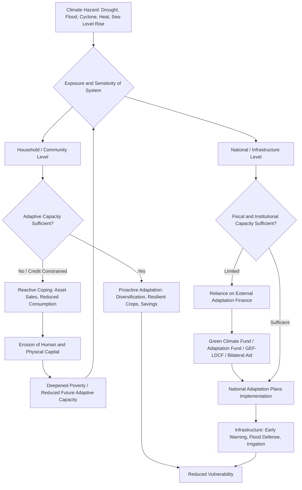

## Climate Change Adaptation in Developing Countries

### Definition and Conceptual Framework

Climate change adaptation refers to the process of adjustment to actual or expected climate and its effects, in order to moderate harm or exploit beneficial opportunities (IPCC definition). In the development economics context, adaptation is distinguished from **mitigation** (reducing greenhouse gas emissions) — adaptation addresses the *consequences* of climate change that are already occurring or locked in, which is of disproportionate importance to developing countries that contribute least to historical emissions but face the greatest exposure and least capacity to cope.

**Key Points**

- Developing countries face a "double inequity": lowest historical responsibility for emissions, highest vulnerability to impacts
- Vulnerability is commonly decomposed (IPCC AR4/AR5 framework) into three components: **exposure** (degree of climate stress experienced), **sensitivity** (degree to which a system is affected by that stress), and **adaptive capacity** (ability to adjust, cope, and moderate harm)
- Adaptation is not a single intervention but a portfolio spanning infrastructure, agriculture, institutions, finance, and social protection
- The literature distinguishes autonomous adaptation (spontaneous adjustment by individuals/markets) from planned adaptation (deliberate policy intervention)

$$V = f(E, S, AC^{-1})$$

Where $V$ is vulnerability, $E$ is exposure, $S$ is sensitivity, and $AC$ is adaptive capacity (inversely related to vulnerability — higher capacity reduces vulnerability for a given exposure and sensitivity level).

### Why Developing Countries Are Disproportionately Vulnerable

#### Structural Economic Exposure

- Higher dependence on climate-sensitive sectors: rain-fed agriculture typically constitutes a much larger share of GDP and employment in low-income countries than in high-income economies
- Geographic exposure: many developing countries are concentrated in tropical and subtropical zones already near biophysical thresholds for crop productivity, where further warming causes larger relative yield losses than in temperate zones
- Coastal and delta populations in South and Southeast Asia face acute exposure to sea-level rise and cyclone intensification

#### Limited Adaptive Capacity

- Lower per-capita income constrains private adaptive investment (irrigation, drought-resistant seeds, home retrofitting)
- Weaker public infrastructure (early warning systems, flood defenses, health systems) reduces institutional buffering capacity
- Limited access to credit and insurance markets restricts households' ability to smooth consumption after climate shocks
- Governance and fiscal constraints limit the scale of public adaptation investment

#### Compounding with Existing Development Deficits

Climate change acts as a **threat multiplier** on pre-existing development challenges (poverty, weak health systems, food insecurity) rather than an independent, isolable shock — this is a central theme distinguishing adaptation economics from climate science proper.

### Theoretical Framework: Adaptation as a Response to Risk

#### Expected Utility and Risk Management

Households and governments choose adaptation investment by weighing costs against expected damage reduction:

$$\max_{a} \ E[U(y - c(a) - D(a, \theta))]$$

Where $y$ is income, $a$ is the level of adaptation investment, $c(a)$ is the cost of adaptation, $D(a, \theta)$ is climate damage as a function of adaptation level and climate shock realization $\theta$, with $\partial D/\partial a < 0$ (adaptation reduces damage) and typically $\partial^2 D/\partial a^2 > 0$ (diminishing returns).

**Key Points**

- Underinvestment in adaptation by poor households is frequently attributed to credit constraints (inability to finance upfront adaptation costs despite positive expected returns), not merely irrationality or lack of awareness
- This motivates the policy emphasis on adaptation finance and de-risking mechanisms discussed below

#### Adaptation vs. Coping: An Important Distinction

- **Adaptation** (proactive, capacity-building, often long-term): e.g., adopting drought-tolerant crop varieties, diversifying livelihoods, building climate-resilient infrastructure
- **Coping** (reactive, post-shock, often depletes assets): e.g., distress sale of livestock, reducing meals, pulling children from school
- A large body of household-level empirical work shows that coping strategies, while rational in the short run, frequently generate long-run poverty traps by eroding productive assets and human capital — linking climate shocks directly to the poverty-environment feedbacks covered in adjacent syllabus material

### Sectoral Adaptation Strategies

#### Agriculture

- **Crop diversification and drought/flood-tolerant varieties**: e.g., submergence-tolerant rice varieties (Sub1 rice) adopted in flood-prone South Asian deltas
- **Climate-smart agriculture (CSA)**: an FAO-promoted framework integrating three objectives — sustainably increasing productivity, building resilience/adaptive capacity, and reducing/removing emissions where possible
- **Irrigation expansion and water-use efficiency** to reduce rainfall dependence
- **Index-based (parametric) weather insurance**: payouts triggered by measured weather indices (e.g., rainfall thresholds) rather than assessed individual losses, designed to reduce moral hazard and adverse selection relative to traditional indemnity insurance; take-up has often been lower than anticipated in pilot programs, attributed to basis risk, liquidity constraints, and trust deficits [Unverified — outcomes vary substantially by program design and country]

#### Water Resources

- Rainwater harvesting and groundwater recharge infrastructure
- Integrated water resource management (IWRM) frameworks for basin-level allocation under increased variability
- Desalination and water reuse in acutely water-stressed contexts (higher capital cost, more relevant to middle-income than low-income settings)

#### Coastal and Disaster Risk Management

- Mangrove and coastal ecosystem restoration as "nature-based" storm-surge and erosion buffers (linking directly to the environment-poverty degradation nexus)
- Early warning systems for cyclones and floods — cited among the most cost-effective adaptation interventions per dollar spent, given very high benefit-cost ratios estimated in disaster risk literature
- Managed retreat and resettlement planning for highly exposed low-lying areas (politically and socially complex, often a last-resort strategy)

#### Urban Adaptation

- Climate-resilient urban planning and drainage infrastructure to manage flood risk in rapidly urbanizing, often informally-settled cities
- Heat action plans addressing urban heat island effects, particularly relevant given rapid urban population growth in developing regions

#### Health Systems

- Strengthening surveillance and response capacity for climate-sensitive disease (malaria range shifts, dengue, heat-related illness)
- Integrating climate risk into health system planning, particularly in regions where disease vectors are expected to expand range with warming temperatures

### Adaptation Finance Architecture

#### Key Multilateral Mechanisms

- **Green Climate Fund (GCF)**: established under the UNFCCC, the largest dedicated multilateral climate fund, mandated to balance mitigation and adaptation finance
- **Adaptation Fund**: established under the Kyoto Protocol, financed partly through a levy on Clean Development Mechanism transactions
- **Global Environment Facility (GEF)**: manages several climate-related trust funds including the Least Developed Countries Fund (LDCF), specifically targeted at LDC adaptation needs
- **World Bank Climate Investment Funds** and bilateral donor adaptation financing channels

#### The Adaptation Finance Gap

A persistent theme in the literature and UNFCCC negotiations is that estimated adaptation finance needs in developing countries substantially exceed current flows, and the gap is projected to widen — though precise quantification varies significantly across studies due to differing methodologies and scenario assumptions [Unverified precise magnitude — figures are estimates subject to considerable modeling uncertainty; directionally, most assessments including UNEP's Adaptation Gap Report series concur the gap is large and growing].

**Key Points**

- Adaptation finance is harder to mobilize via market mechanisms than mitigation finance, since adaptation benefits are often local and non-tradable (unlike carbon credits, which create a fungible global commodity)
- This creates a structural reliance on public/concessional finance for adaptation relative to mitigation, which can draw private capital more readily
- Debates over "new and additional" finance versus reallocated development assistance remain contentious in international negotiations

### Institutional Frameworks

- **National Adaptation Plans (NAPs)** and, for Least Developed Countries, **National Adaptation Programmes of Action (NAPAs)**: UNFCCC-mandated planning instruments identifying urgent and long-term adaptation priorities
- **Loss and Damage mechanism**: formally established as a distinct pillar from adaptation at COP27 (2022) with the Loss and Damage Fund, addressing climate impacts that exceed adaptation limits — [Inference] operational modalities and funding scale were still being defined in the years following establishment, so implementation details should be checked against current UNFCCC decisions for the most current status
- **Nationally Determined Contributions (NDCs)**: while primarily a mitigation instrument under the Paris Agreement, many developing country NDCs also include adaptation components and communications

### Diagram: Adaptation Decision and Finance Pathway

### Empirical Evidence and Program Findings

- **Index insurance take-up studies** (e.g., Kenya, India, Ethiopia pilots) generally find demand is price-sensitive and constrained by liquidity and trust, with take-up rising substantially when premiums are subsidized or bundled with credit — a widely replicated finding across multiple randomized evaluations, though exact take-up elasticities vary by study
- **Early warning system cost-effectiveness**: multiple disaster-risk-reduction assessments (e.g., analyses associated with the Global Facility for Disaster Reduction and Recovery) report high benefit-cost ratios for investment in warning systems relative to post-disaster relief spending, though specific ratio estimates vary by hazard type and country context [Inference — directionally robust finding, precise ratios are context-dependent]
- **Agricultural adaptation adoption studies** show technology adoption (e.g., drought-tolerant maize in Sub-Saharan Africa) is strongly conditioned by extension access, land tenure security, and credit access — reinforcing that adaptation capacity is itself a function of broader development indicators, not a standalone climate variable
- **Migration as adaptation**: a growing literature treats labor migration (seasonal or permanent) as an adaptive response to climate stress in origin areas, remittances serving as an informal risk-sharing mechanism — though migration can also reflect adaptation *failure* when driven by unlivable conditions rather than strategic diversification, and the literature is divided on how to cleanly categorize this distinction

### Policy Design Considerations

**Key Points**

- **Locally-led adaptation**: increasing emphasis in the literature and donor practice on community-driven prioritization, given context-specificity of vulnerability and the risk of top-down maladaptation
- **Maladaptation risk**: interventions that reduce short-term vulnerability but increase long-term or shift vulnerability elsewhere (e.g., hard sea walls that increase erosion at adjacent unprotected coastline; groundwater-based irrigation expansion that depletes aquifers) are a recognized design failure mode requiring explicit assessment
- **Gender dimensions**: women in many developing-country contexts face compounded vulnerability due to unequal access to land, credit, and decision-making power, while often bearing increased labor burdens (water/fuel collection) as environmental stress intensifies
- **Ecosystem-based adaptation (EbA)**: using biodiversity and ecosystem services as part of an adaptation strategy (mangrove restoration, watershed protection) — often lower-cost and co-beneficial for biodiversity relative to hard infrastructure, though with context-dependent protective limits against extreme events

### Related Topics

- Environmental degradation and poverty linkages (natural capital vulnerability nexus)
- Index-based weather insurance design and take-up constraints
- Loss and Damage financing mechanisms post-COP27
- Climate-smart agriculture and technology adoption economics
- Disaster risk reduction and early warning system cost-effectiveness
- Climate-induced migration and remittances as risk-sharing
- National Adaptation Plans (NAPs) and UNFCCC institutional architecture
- Green Climate Fund governance and disbursement mechanisms
- Ecosystem-based adaptation and nature-based infrastructure
- Mitigation vs. adaptation trade-offs in climate finance allocation