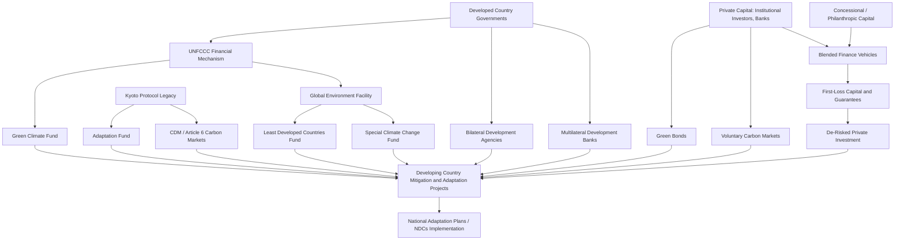

## Climate Finance Mechanisms

### Definition and Scope

Climate finance refers to local, national, or transnational financing — drawn from public, private, and alternative sources — that seeks to support mitigation and adaptation actions addressing climate change. The UNFCCC operationalizes this through a set of formal financial mechanisms, while a much larger ecosystem of market-based, bilateral, and blended instruments has developed alongside the multilateral architecture.

**Key Points**

- Climate finance spans two functionally distinct objectives: **mitigation finance** (reducing or avoiding emissions) and **adaptation finance** (building resilience to climate impacts), which have different market characteristics — mitigation projects often generate tradable, quantifiable outputs (avoided tons of $CO_2$), while adaptation benefits are typically local and non-tradable
- Sources are commonly classified along two axes: **public vs. private** and **domestic vs. international**
- The Paris Agreement (Article 9) reaffirmed developed countries' obligation to provide climate finance to developing countries, building on the earlier UNFCCC principle of common but differentiated responsibilities

### Institutional Architecture Under the UNFCCC

#### The Financial Mechanism

The UNFCCC's Financial Mechanism provides funds to developing countries and is operated by designated entities, principally:

- **Global Environment Facility (GEF)**: established in 1991 (predating the UNFCCC itself), serves as an operating entity of the Financial Mechanism, funding biodiversity, climate, land degradation, and chemicals projects through country-driven programming
- **Green Climate Fund (GCF)**: established at COP16 (2010) in Cancún, became operational around 2014–2015, and is now the largest dedicated multilateral climate fund under the UNFCCC, with a mandate to allocate funding evenly between mitigation and adaptation over time

#### Kyoto Protocol-Era Funds

- **Adaptation Fund**: established under the Kyoto Protocol to finance concrete adaptation projects in developing countries particularly vulnerable to climate change; historically financed in part through a 2% levy on Certified Emission Reduction (CER) credits issued under the Clean Development Mechanism (CDM)
- **Special Climate Change Fund (SCCF)** and **Least Developed Countries Fund (LDCF)**: both managed by the GEF, targeting adaptation with the LDCF specifically serving Least Developed Countries and financing National Adaptation Programmes of Action (NAPAs)

#### Market Mechanisms (Mitigation-Focused)

- **Clean Development Mechanism (CDM)**: established under the Kyoto Protocol, allowed emission-reduction projects in developing countries to earn tradable CER credits, which industrialized countries could use to meet Kyoto targets — largely superseded following the Paris Agreement's shift away from the Kyoto framework
- **Article 6 of the Paris Agreement**: establishes the successor framework for international carbon markets, including Article 6.2 (cooperative approaches / bilateral transfer of mitigation outcomes) and Article 6.4 (a centralized crediting mechanism, sometimes referred to as the Paris Agreement Crediting Mechanism, intended to succeed the CDM) — [Inference] operational rules and modalities have continued to be refined through successive COP decisions, so implementation specifics should be checked against the most current UNFCCC guidance

### Public Bilateral and Multilateral Development Finance

- **Bilateral climate finance**: direct government-to-government flows, often channeled through development agencies (e.g., USAID, GIZ, JICA, DFID/FCDO successor arrangements)
- **Multilateral Development Banks (MDBs)**: the World Bank, regional development banks (Asian Development Bank, African Development Bank, Inter-American Development Bank, European Bank for Reconstruction and Development) have significantly scaled climate-related lending and often co-finance alongside dedicated climate funds
- **Climate Investment Funds (CIF)**: World Bank-administered funds (including the Clean Technology Fund and Strategic Climate Fund) providing concessional finance for large-scale mitigation and resilience investment, particularly in middle-income countries

### Private and Market-Based Instruments

#### Green Bonds and Labeled Debt

- **Green bonds**: fixed-income instruments where proceeds are earmarked for climate/environmental projects, guided by voluntary standards such as the International Capital Market Association's Green Bond Principles
- **Sustainability-linked bonds**: distinct from green bonds in that proceeds are not ring-fenced for specific projects; instead, the bond's financial terms (e.g., coupon rate) are tied to the issuer achieving predefined sustainability performance targets
- Sovereign green bond issuance has grown among developing-country issuers, though market depth and pricing benefits ("greenium") vary by market

#### Carbon Markets (Voluntary and Compliance)

- **Compliance carbon markets**: created by regulation (e.g., EU Emissions Trading System, and various national/subnational cap-and-trade systems), generating demand for offset credits in some jurisdictions
- **Voluntary carbon markets (VCM)**: private actors purchase carbon credits (e.g., REDD+ forest credits, renewable energy credits) to meet voluntary corporate climate commitments; independent crediting standards include Verra's Verified Carbon Standard and the Gold Standard
- **Quality and integrity concerns**: the VCM has faced significant scrutiny over credit quality, additionality (whether the funded activity would have occurred anyway), and permanence (particularly for forestry-based credits), which has affected both pricing and demand in recent years [Unverified precise market impact — subject to ongoing market and regulatory developments]

#### Blended Finance and De-Risking Instruments

- **Blended finance**: strategic use of concessional public or philanthropic capital to mobilize additional private investment, typically by absorbing a disproportionate share of risk in the capital stack
- Common structural mechanisms:
  - **First-loss capital**: concessional investors accept losses before private investors, improving the risk-adjusted return for private capital
  - **Guarantees**: partial risk or credit guarantees (frequently provided by MDBs or agencies like the Multilateral Investment Guarantee Agency) that reduce perceived investment risk in developing-country climate projects
  - **Technical assistance facilities**: grant funding paired with investment to improve project bankability and pipeline development

$$r_{private} = r_{f} + \beta(r_m - r_f) - s$$

Where $r_{private}$ is the required private return, $r_f$ is the risk-free rate, $\beta(r_m - r_f)$ is the standard risk premium, and $s$ is the risk-reduction subsidy effectively provided by concessional blended finance structuring (first-loss tranches, guarantees) — the core theoretical logic of blended finance is to reduce the effective risk premium private investors require, making otherwise unbankable projects viable.

#### Results-Based and Payment-for-Performance Mechanisms

- **REDD+ (Reducing Emissions from Deforestation and Forest Degradation)**: a UNFCCC framework providing results-based payments to developing countries for verified reductions in deforestation-related emissions, often financed through a mix of bilateral, multilateral, and increasingly voluntary carbon market channels
- **Debt-for-climate/nature swaps**: a sovereign's external debt is restructured or partially forgiven in exchange for domestic commitments to climate or conservation spending — a growing instrument for climate-vulnerable, debt-distressed middle-income countries

### Diagram: Climate Finance Flow Architecture

### Measurement, Accountability, and Debates

#### The $100 Billion Goal and Successor Target

Developed countries committed at COP15 (2009) to a collective goal of mobilizing $100 billion per year by 2020 for developing-country climate action, a target that was reportedly reached with some delay and has been the subject of extensive methodological debate over how flows are counted (grants vs. loans, concessional vs. non-concessional, and whether MDB co-financing should be attributed as climate finance). At COP29 (2024), parties agreed a **New Collective Quantified Goal (NCQG)**, setting a new finance mobilization target — [Inference] given the pace of ongoing negotiation and reporting refinement in this area, specific NCQG figures and implementation modalities should be verified against current UNFCCC/OECD reporting for the latest status.

**Key Points**

- **Grant-equivalent vs. face-value accounting**: a persistent methodological critique is that reporting loan principal at face value overstates the real concessional resource transfer relative to grant-equivalent accounting
- **Double counting risk**: overlapping bilateral, multilateral, and blended finance reporting has raised concerns about inflated aggregate figures
- **Debt sustainability concerns**: a significant share of climate finance to developing countries has historically been disbursed as loans rather than grants, raising concerns about compounding debt burdens in already debt-stressed low-income countries — a central critique in South-led climate finance negotiating positions

#### Access Barriers for Developing Countries

- Complex accreditation and application procedures for direct access to funds like the GCF have been widely cited as a barrier, particularly for Least Developed Countries and Small Island Developing States with limited institutional capacity
- **Direct access modalities**: mechanisms allowing national implementing entities (rather than only international intermediaries like UN agencies or MDBs) to access funds directly, intended to build country ownership and reduce intermediation costs

### Related Topics

- Green Climate Fund governance and accreditation processes
- Article 6 Paris Agreement carbon market mechanisms
- Voluntary carbon market integrity and credit quality standards
- Blended finance structuring and de-risking instruments
- Debt-for-climate swaps and sovereign debt sustainability
- REDD+ results-based payment design
- Climate change adaptation in developing countries
- Loss and Damage Fund operationalization
- Sovereign green bond issuance in emerging markets
- New Collective Quantified Goal (NCQG) on climate finance