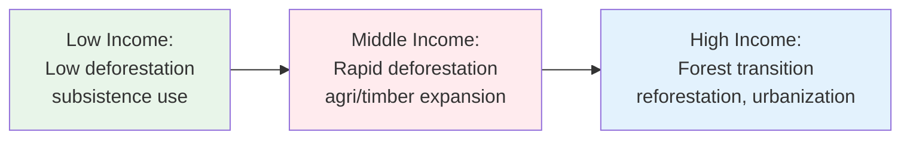
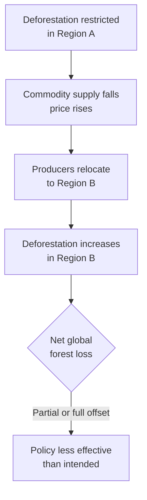

## Deforestation and Land Use Change Economics

### Definition and Scope

Deforestation refers to the conversion of forested land to non-forest uses (agriculture, pasture, infrastructure, settlements), while land use change economics more broadly studies how economic incentives drive transitions between land uses (forest, cropland, pasture, urban) and the welfare, environmental, and distributional consequences of those transitions. This field sits at the intersection of environmental economics, development economics, and agricultural economics, since most deforestation today occurs in developing tropical countries where land-based livelihoods dominate.

### Why Development Economics Cares

Forests provide a dual role in developing economies: they are both a productive asset that can be converted to generate income (timber sales, agricultural land) and a source of non-market ecosystem services (carbon sequestration, watershed protection, biodiversity, local climate regulation). Development economists study deforestation because:

- Land-use decisions by poor rural households are central to poverty dynamics and rural livelihoods
- Deforestation generates negative externalities that cross local, national, and global boundaries
- Policy design must balance growth, poverty reduction, and environmental sustainability under weak institutions and incomplete markets

### The Economic Drivers of Deforestation

#### Direct (Proximate) Drivers

- Agricultural expansion (commercial and subsistence)
- Cattle ranching and pasture conversion
- Logging (legal and illegal)
- Infrastructure development (roads, dams, mining)
- Fuelwood and charcoal extraction

#### Underlying (Root) Economic Drivers

- **Relative factor prices**: When agricultural commodity prices rise relative to timber or standing-forest values, conversion becomes privately profitable
- **Land tenure insecurity**: Weak property rights encourage rapid clearing to establish de facto ownership claims
- **Poverty and credit constraints**: Households without access to credit markets may liquidate forest capital for immediate consumption smoothing
- **Population pressure and land scarcity**: Rising rural population without agricultural intensification pushes the extensive margin into forested land
- **Policy distortions**: Subsidized credit for ranching, road-building subsidies, and insecure but exploitable land claims

### The Land Rent Model of Deforestation

The canonical economic framework treats land use as determined by comparative land rents — the discounted net present value of returns under each possible use. A rational landholder converts forest to agriculture when:

$$PV_{agriculture} > PV_{forest}$$

where the present value of a land use is:

$$PV = \sum_{t=0}^{\infty} \frac{\pi_t}{(1+r)^t}$$

Here $\pi_t$ is the net return (profit) in period $t$ from that land use, and $r$ is the discount rate. This is a direct application of the von Thünen land rent framework, extended by foresters and economists (notably in the tradition of the Faustmann model for optimal forest rotation) to compare standing forest value against converted-use value.

**Key Points**

- Higher agricultural commodity prices (soy, palm oil, beef) raise $\pi_{agriculture}$ and increase deforestation pressure — this is empirically well documented in the Brazilian Amazon and Indonesian palm oil frontiers
- Higher discount rates $r$ (often associated with tenure insecurity, political instability, or poverty-driven impatience) devalue the long-horizon returns from standing forest (carbon storage, sustainable timber yield) relative to the immediate lump-sum gain from conversion
- Road access lowers transport costs, effectively raising $\pi_{agriculture}$ at the farm gate, which is why road-building is one of the most robust empirical predictors of deforestation

### The Faustmann Rotation Model (Optimal Forest Management)

For managed forestry (as opposed to conversion), the Faustmann formula determines the economically optimal harvest age $T$ for a forest stand, maximizing the present value of an infinite series of rotations:

$$V(T) = \frac{P \cdot Q(T) e^{-rT}}{1 - e^{-rT}} - \frac{c}{1-e^{-rT}}$$

where $P$ is timber price, $Q(T)$ is the volume/value of timber at age $T$, $r$ is the discount rate, and $c$ is regeneration cost. Optimizing over $T$ yields the well-known Faustmann condition: harvest when the marginal growth rate of the stand's value equals the discount rate plus the opportunity cost of holding the land in forestry rather than switching to the next-best use. This model explains why higher discount rates lead to shorter rotations and, at the extreme, why sufficiently high discount rates favor permanent conversion over any forestry rotation at all.

### Externalities and Market Failure

Deforestation is a textbook case of environmental market failure because forests generate positive externalities that are not captured by the private landholder's decision:

| Externality Type | Scale | Example |
| --- | --- | --- |
| Carbon sequestration loss | Global | CO2 emissions from biomass burning/decay |
| Biodiversity loss | Global/National | Species habitat destruction |
| Watershed disruption | Regional/Local | Downstream flooding, siltation of dams |
| Local climate regulation loss | Local/Regional | Reduced rainfall recycling (e.g., Amazon "flying rivers") |
| Soil erosion | Local | Reduced agricultural productivity downstream |

Because the landholder does not bear these external costs, private land-use decisions systematically over-convert forest relative to the social optimum. Formally, private marginal benefit exceeds social marginal benefit once external costs are included, so:

$$MB_{private} > MB_{social} = MB_{private} - MEC$$

where $MEC$ is the marginal external cost of conversion. The socially optimal deforestation rate is lower than the privately chosen rate whenever $MEC > 0$.

### The Environmental Kuznets Curve (EKC) for Forests

A hypothesis in development economics posits an inverted-U relationship between per capita income and deforestation rates: forest loss accelerates during early industrialization/agricultural expansion phases, then decelerates and potentially reverses ("forest transition") as economies develop, urbanize, and shift to service/industrial sectors with rising agricultural productivity per hectare.

**Key Points**

- The forest transition has been empirically observed in countries like South Korea, Vietnam (partially), and much of Western Europe historically
- [Inference] The EKC-for-forests hypothesis is contested; unlike pollutants with clear technological abatement options, land itself is finite, so the "decline" phase in some countries reflects the exhaustion of accessible forest frontier as much as policy-driven conservation
- Rural-to-urban migration and off-farm employment growth reduce dependence on forest-clearing for subsistence, contributing to the downturn phase in some transitions

### Property Rights, Tenure, and the Commons

Much of the world's remaining tropical forest is held under insecure, overlapping, or communal tenure systems. This connects directly to the economics of common property resources:

- **Open access forests** (de facto no enforced ownership) predict over-extraction consistent with the tragedy of the commons, since no individual internalizes the cost their extraction imposes on future users
- **Secure private or community titling** has been shown in numerous studies (e.g., in the Brazilian Amazon and Indonesia) to reduce deforestation rates by lengthening the effective planning horizon of landholders and by enabling exclusion of outside encroachers
- **Common Property Regimes (CPR)**, as studied by Elinor Ostrom, can sustain forests when well-defined community institutions exist to monitor and enforce local rules — challenging the simple "privatize or lose it" dichotomy

### Policy Instruments

#### Command-and-Control

- Protected areas and logging bans/moratoria (e.g., Brazil's Amazon Soy Moratorium, various national logging bans)
- Environmental impact assessment requirements for land conversion permits

#### Market-Based Instruments

- **Payments for Ecosystem Services (PES)**: Direct payments to landholders for maintaining forest cover, conditional on verified non-conversion (e.g., Costa Rica's Pago por Servicios Ambientales program)
- **REDD+ (Reducing Emissions from Deforestation and Forest Degradation)**: International mechanism compensating countries/communities for verified emissions reductions from avoided deforestation, financed by carbon markets or results-based aid
- **Forest carbon offset markets**: Allow buyers (firms, governments) to purchase verified emission reductions from forest conservation projects
- **Taxes on land conversion or agricultural commodities linked to deforestation** (supply chain traceability requirements, e.g., EU Deforestation Regulation)

#### Supply Chain and Trade-Based Approaches

- Certification schemes (FSC for timber, RSPO for palm oil) that create price premiums for verified deforestation-free products
- Import restrictions conditioning market access on deforestation-free supply chains

**Example**

Costa Rica's PES program, funded partly by a fuel tax, pays landholders per hectare to conserve forest, contributing to the country's well-documented forest transition from roughly 21% forest cover in the 1980s to over 50% today. [Unverified] — exact cover figures vary by data source and year of measurement, but the directional trend is well documented in the literature.

### The Displacement (Leakage) Problem

A central challenge in deforestation policy is **leakage**: conservation in one location can simply displace the economic activity driving deforestation to another, unprotected location, with no net global reduction in forest loss. This occurs because:

- Restricting supply in a protected region raises commodity prices, incentivizing expansion elsewhere
- Enforcement in one country can shift investment to countries with weaker forest governance

This is analytically similar to carbon leakage in climate policy and implies that jurisdiction-specific policies without complementary demand-side or international coordination may have limited net environmental effect.

### Empirical Methods in Deforestation Economics

Researchers rely on several identification strategies given the endogeneity of land-use decisions:

- **Panel data with fixed effects**: Controlling for time-invariant regional characteristics while exploiting variation in commodity prices, rainfall, or road-building over time
- **Instrumental variables (IV)**: Using instruments such as distance to markets, soil suitability, or exogenous international price shocks to isolate causal effects of economic incentives on deforestation
- **Remote sensing and satellite data**: Landsat and MODIS-derived forest cover datasets (e.g., Global Forest Watch/Hansen et al. data) provide high-frequency, spatially disaggregated deforestation measures used as outcome variables
- **Regression discontinuity**: Exploiting sharp policy boundaries (e.g., protected area borders) to compare deforestation rates just inside versus just outside a jurisdiction
- **Difference-in-differences**: Evaluating the causal impact of policy interventions (e.g., PES program rollout, moratoria) by comparing treated and untreated regions before/after implementation

**Key Points**

- [Inference] Much of the applied literature since the 2000s has shifted toward causal identification using satellite-derived deforestation data because self-reported land-use statistics from developing-country governments are often unreliable or subject to reporting incentives
- Endogeneity is a persistent concern: unobserved factors (e.g., local governance quality) may simultaneously affect both policy adoption and deforestation rates, biasing naive comparisons

### Distributional and Poverty Dimensions

Land use change economics in development contexts must address who bears the costs and benefits:

- Smallholder farmers often face a trade-off between immediate income from clearing and long-run ecosystem service loss, which they may not fully value privately, particularly under poverty-driven high effective discount rates
- Indigenous and forest-dependent communities frequently bear the largest welfare losses from deforestation (loss of subsistence resources, cultural/spiritual value) while capturing little of the commercial conversion value
- Large agribusiness and commercial ranching operations, by contrast, are typically the primary economic beneficiaries of large-scale conversion, raising equity concerns in policy design
- PES and REDD+ programs raise design questions about **additionality** (would conservation have happened anyway?), **leakage**, and **elite capture** (do payments actually reach smallholders and communities, or accrue to large landholders and intermediaries?)

### Illustrative Diagram: Land Rent Frontier

(svg_diagram)

<svg xmlns="http://www.w3.org/2000/svg" viewBox="0 0 700 420">

<text x="350" y="25" font-size="16" font-weight="bold" text-anchor="middle" fill="`#1a1a1a`">Land Rent by Distance from Market (svg_diagram)</text>

<line x1="70" y1="370" x2="650" y2="370" stroke="#333" stroke-width="2" />

<line x1="70" y1="370" x2="70" y2="50" stroke="#333" stroke-width="2" />

<text x="360" y="400" font-size="13" text-anchor="middle" fill="#333">Distance from Market / Infrastructure</text>

<text x="30" y="210" font-size="13" text-anchor="middle" fill="#333" transform="rotate(-90,30,210)">Land Rent (Present Value)</text>

<path d="M 90 100 L 300 250" stroke="#2e7d32" stroke-width="3" fill="none" />
<text x="150" y="150" font-size="12" fill="#2e7d32" font-weight="bold">Agriculture rent</text>
<path d="M 90 300 L 630 330" stroke="#5d4037" stroke-width="3" fill="none" />
<text x="450" y="345" font-size="12" fill="#5d4037" font-weight="bold">Standing forest rent</text>
<line x1="300" y1="50" x2="300" y2="370" stroke="#999" stroke-width="1" stroke-dasharray="4" />
<text x="305" y="65" font-size="11" fill="#666">Conversion margin</text>
<rect x="90" y="215" width="210" height="35" fill="#e8f5e9" opacity="0.6" />
<text x="195" y="237" font-size="11" fill="#1b5e20" text-anchor="middle">Land converted to agriculture</text>
<rect x="300" y="315" width="330" height="15" fill="#efebe9" opacity="0.6" />
<text x="465" y="326" font-size="10" fill="#3e2723" text-anchor="middle">Forest remains standing (rent exceeds agriculture rent)</text>
</svg>

This diagram illustrates the core logic: agricultural rent declines steeply with distance from market (transport cost of outputs), while forest rent (timber, ecosystem services) declines more gradually. The conversion margin occurs where the two rent curves cross — beyond that point, standing forest value exceeds agricultural conversion value and land remains forested, a spatial equilibrium consistent with observed deforestation frontiers concentrated near roads and markets.

### Case Studies

**Example**

- **Brazilian Amazon**: Deforestation has historically tracked soybean and cattle prices closely, road expansion (notably along the BR-163 corridor), and shifts in enforcement intensity (e.g., sharp declines during 2004–2012 command-and-control crackdown, followed by resurgence during periods of weakened enforcement)
- **Indonesia/Malaysia palm oil frontier**: Rising global vegetable oil demand and palm oil price increases since the 1990s drove large-scale peatland and forest conversion; associated with significant carbon emissions due to peat degradation
- **Costa Rica**: Combination of secure property rights, PES payments, and eco-tourism revenue is frequently cited as a successful forest transition case, though the relative contribution of each factor remains debated in the literature [Inference]

### Common Analytical Pitfalls

- Treating deforestation rates as purely a function of poverty (poverty-environment nexus) without accounting for the role of commercial agribusiness, which drives a substantial share of large-scale tropical deforestation
- Ignoring leakage effects when evaluating the effectiveness of localized conservation policy
- Assuming land tenure formalization is always forest-protective; in some contexts, secure titling can accelerate conversion by increasing collateral value of cleared agricultural land, reversing the expected effect [Inference]
- Conflating correlation between income growth and reforestation (forest transition) with a universal causal law, when country-specific institutional and trade factors matter substantially

### Related Topics

- Faustmann rotation model and optimal forest management economics
- Common property resource theory (Ostrom's design principles)
- Carbon markets and REDD+ mechanism design
- Environmental Kuznets Curve — theory and empirical critiques
- Payments for Ecosystem Services (PES) program design and additionality
- Agricultural commodity supply chains and deforestation-linked trade policy (EU Deforestation Regulation)
- Land tenure security and its causal effects on investment and conservation
- Remote sensing methods in environmental and development economics
- The economics of the commons and open-access resource depletion
- Climate change mitigation economics and the social cost of carbon