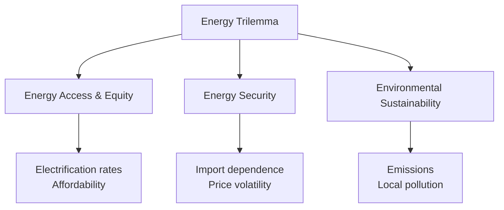

## Renewable Energy Transitions in Developing Economies

### Definition and Scope

Renewable energy transition refers to the structural shift in an economy's energy mix away from fossil fuels (coal, oil, natural gas) toward renewable sources (solar, wind, hydropower, geothermal, biomass). In developing-economy contexts, this transition is distinct from that in industrialized countries because it often occurs alongside — rather than after — the initial build-out of energy access and infrastructure, creating a potential opportunity to "leapfrog" carbon-intensive development pathways.

### Why This Matters for Development Economics

Energy is a fundamental input to nearly all productive activity, and access to reliable, affordable energy is strongly correlated with income growth, industrialization, education outcomes, and health. Developing economies face a distinctive triple challenge:

- **Energy access**: Hundreds of millions of people still lack access to electricity or rely on traditional biomass for cooking
- **Energy security and affordability**: Import dependence on fossil fuels creates balance-of-payments vulnerability and price exposure
- **Climate mitigation**: Global emissions reduction requires developing economies — where energy demand growth is fastest — to avoid locking in high-carbon infrastructure

This is often called the **energy trilemma**: balancing access/equity, security, and sustainability simultaneously.

### The Leapfrogging Hypothesis

A central theoretical proposition is that developing economies can "leapfrog" the fossil-fuel-intensive development stage that industrialized countries historically passed through, moving directly to decentralized renewable generation — analogous to how many developing countries skipped landline telephony and moved directly to mobile networks.

**Key Points**

- Distributed solar photovoltaic (PV) systems and mini-grids can serve rural populations without requiring extension of centralized transmission infrastructure, which is capital-intensive and slow to build
- [Inference] The leapfrogging analogy has limits: unlike telecoms, electricity requires continuous, reliable supply for productive uses (irrigation pumps, manufacturing, cold storage), and intermittent renewable sources without adequate storage or grid balancing may not support the same intensity of industrial use as dispatchable fossil generation
- Falling costs of solar PV and battery storage (driven substantially by manufacturing scale in China) have made distributed renewables cost-competitive with diesel generators and grid extension in many rural contexts, strengthening the empirical case for leapfrogging in access-deficit regions specifically

### Cost Economics: The Levelized Cost of Electricity (LCOE)

Comparisons across energy technologies commonly use the **Levelized Cost of Electricity (LCOE)**, which represents the average total cost of building and operating a generation asset per unit of electricity produced over its lifetime:

$$LCOE = \frac{\sum_{t=0}^{n} \frac{I_t + M_t + F_t}{(1+r)^t}}{\sum_{t=0}^{n} \frac{E_t}{(1+r)^t}}$$

where $I_t$ is capital investment in period $t$, $M_t$ is operations and maintenance cost, $F_t$ is fuel cost, $E_t$ is electricity generated, and $r$ is the discount rate.

**Key Points**

- Renewables (especially solar and wind) have near-zero $F_t$ (fuel cost), since the "fuel" — sunlight, wind — is free; their LCOE is dominated by upfront capital cost $I_t$
- Fossil generation has lower $I_t$ but ongoing, volatile $F_t$, making its LCOE more sensitive to fuel price shocks and exchange rate movements (relevant for fuel-importing developing economies)
- The discount rate $r$ matters disproportionately for capital-intensive renewables: high country risk premiums or weak domestic financial markets in developing economies raise $r$, which can make renewables less cost-competitive there than in high-income countries even when equipment costs are identical — this is often called the **cost-of-capital gap**
- [Unverified] Precise LCOE figures vary substantially by country, resource quality (solar irradiance, wind speed), financing terms, and year; general cost trends (renewables cost declines over the 2010s–2020s) are well documented, but any specific cited LCOE number should be treated as time- and context-specific rather than universal

### The Cost-of-Capital Gap in Developing Economies

A widely documented finding in energy economics is that the same renewable energy project can face a much higher weighted average cost of capital (WACC) in a developing country than in a high-income country, due to:

- Currency risk (most equipment is imported and priced in hard currency, but revenue is often in local currency)
- Political and regulatory risk (expropriation risk, tariff renegotiation, policy reversal)
- Underdeveloped domestic capital markets (limited long-tenor local currency debt, thin institutional investor base)
- Off-taker credit risk (state utilities that are financially distressed and may delay or default on payments under Power Purchase Agreements)

This cost-of-capital gap explains why blended finance and multilateral development bank guarantees (discussed below) are central to unlocking renewable investment at scale in these markets.

### Market and Institutional Barriers

#### Grid Infrastructure Constraints

- Weak or absent transmission and distribution grids limit the ability to absorb variable renewable generation and to transport it from resource-rich areas (e.g., high-irradiance deserts, high-wind coastal zones) to demand centers
- Grid instability (frequent outages, voltage fluctuations) discourages both renewable and industrial investment, creating a chicken-and-egg problem

#### Utility Financial Distress

- Many state-owned utilities in developing economies operate with below-cost-recovery tariffs (often for political/equity reasons), resulting in chronic financial losses
- This undermines the utility's creditworthiness as an off-taker in Power Purchase Agreements (PPAs), raising perceived risk for renewable project developers and lenders

#### Policy and Regulatory Uncertainty

- Inconsistent or retroactively revised feed-in tariffs and subsidy schemes increase investor risk perception
- Weak contract enforcement and currency convertibility restrictions add further risk premia

#### Technical Constraints

- Intermittency of solar and wind requires either storage, dispatchable backup generation, or demand-side flexibility — all of which are costlier to deploy in grids that are already thin and poorly interconnected
- Limited domestic technical capacity for grid balancing, forecasting, and maintenance of renewable assets

### Policy Instruments for Accelerating Transition

#### Price-Based Instruments

- **Feed-in tariffs (FiTs)**: Guaranteed price per unit of renewable electricity fed into the grid, providing revenue certainty to investors
- **Carbon pricing** (carbon tax or emissions trading): Raises the relative cost of fossil generation, though politically and administratively harder to implement in economies with large informal sectors and limited monitoring capacity
- **Fossil fuel subsidy reform**: Removing existing subsidies on diesel, kerosene, or coal indirectly improves renewable competitiveness, though it raises distributional and political-economy concerns (subsidies often benefit poorer households disproportionately in the short run)

#### Quantity-Based Instruments

- **Renewable Portfolio Standards (RPS)**: Mandated minimum share of renewable generation in the energy mix
- **Competitive auctions/tenders**: Reverse auctions where developers bid the lowest tariff to supply a fixed quantity of renewable capacity — now the dominant procurement mechanism globally, credited with much of the observed price decline in utility-scale solar and wind

#### Financial De-Risking Instruments

- **Blended finance**: Combining concessional public/philanthropic capital with commercial capital to lower the effective cost of capital and absorb first-loss risk
- **Partial risk/credit guarantees** (e.g., from the World Bank's Multilateral Investment Guarantee Agency): Insure against specific risks such as utility payment default or currency inconvertibility
- **Green bonds and sovereign green bond issuances**: Raise dedicated capital for renewable and climate-resilient infrastructure

#### Access-Oriented Instruments

- **Mini-grids and off-grid solar (including pay-as-you-go solar home systems)**: Serve dispersed rural populations without waiting for national grid extension, often financed through microfinance-style installment payments enabled by mobile money
- **Results-based financing**: Subsidies disbursed to off-grid energy providers based on verified electricity connections delivered, aligning subsidy payment with actual access outcomes

### Distributed Renewables and the Mobile Money Parallel

A distinctive innovation in developing-economy energy access is the pairing of solar home systems with mobile money payment platforms (pay-as-you-go, or PAYG solar), most notably pioneered in East Africa. Households pay small daily or weekly installments via mobile phone for a solar unit, with the system remotely locked if payments lapse, substituting for formal credit history and collateral in an environment of limited financial inclusion.

**Example**

Off-grid PAYG solar models in Kenya and Tanzania (companies such as M-KOPA) allow households without bank accounts or formal credit histories to acquire solar home systems through mobile-money-enabled microloans, illustrating how energy access innovation and financial inclusion (mobile money) can be mutually reinforcing in a development context. [Unverified] — specific company market shares and current operational scale should be checked against up-to-date sources, as this sector evolves rapidly.

### Employment and Structural Transformation Effects

- Renewable energy sectors (particularly solar installation and maintenance) can generate local employment, though manufacturing of core components (PV cells, wind turbine parts) remains concentrated in a small number of countries with established industrial capacity, limiting the domestic value-added captured by many developing economies
- Transition away from fossil fuel extraction sectors (coal mining, oil production) can create localized structural unemployment in regions economically dependent on those industries, raising **just transition** policy concerns — the need for retraining, social protection, and regional economic diversification for affected workers and communities
- [Inference] The net employment effect of renewable transitions in developing economies is likely to vary substantially by country depending on whether domestic manufacturing capacity is developed alongside deployment, or whether the country remains solely an importer of foreign-manufactured equipment

### Energy Access Metrics and the SDG Framework

Sustainable Development Goal 7 (SDG7) targets universal access to affordable, reliable, sustainable, and modern energy. Common metrics used in the literature include:

- **Electrification rate**: Share of population with access to electricity
- **Clean cooking access**: Share of population using clean fuels/technologies for cooking (as opposed to solid biomass, which causes indoor air pollution and significant health burden, particularly for women and children)
- **Energy intensity**: Energy consumption per unit of GDP, used as a proxy for efficiency of energy use in production

### Case Studies

**Example**

- **India**: Large-scale solar auctions have driven some of the lowest solar tariffs globally, supported by the International Solar Alliance initiative and national programs; India simultaneously maintains substantial coal-based generation for grid stability and industrial demand, illustrating the "transition" as a gradual mix shift rather than abrupt substitution
- **Kenya**: Predominantly renewable grid (geothermal and hydropower forming the bulk of generation) combined with widespread off-grid solar for last-mile rural access, often cited as an example of a resource-endowment-driven renewable-heavy grid in a developing-economy context
- **Bangladesh**: One of the largest off-grid solar home system programs globally, illustrating decentralized deployment models addressing rural access gaps
- [Inference] Country-specific outcomes depend heavily on natural resource endowments (solar irradiance, wind resource, geothermal potential, hydropower sites), making generalized cross-country prescriptions less reliable than context-specific analysis

### Illustrative Diagram: Renewable Transition Pathway

(svg_diagram)

<svg xmlns="http://www.w3.org/2000/svg" viewBox="0 0 700 380">

<text x="350" y="25" font-size="16" font-weight="bold" text-anchor="middle" fill="`#1a1a1a`">Energy Mix Transition Pathway (svg_diagram)</text>

<line x1="70" y1="330" x2="650" y2="330" stroke="#333" stroke-width="2" />

<line x1="70" y1="330" x2="70" y2="50" stroke="#333" stroke-width="2" />

<text x="360" y="360" font-size="13" text-anchor="middle" fill="#333">Time / Development Stage</text>

<text x="30" y="190" font-size="13" text-anchor="middle" fill="#333" transform="rotate(-90,30,190)">Share of Energy Mix</text>

<path d="M 90 300 L 250 250 L 400 180 L 550 110 L 630 80" stroke="#f9a825" stroke-width="3" fill="none" />
<text x="470" y="100" font-size="12" fill="#f9a825" font-weight="bold">Renewables (solar/wind/hydro)</text>
<path d="M 90 100 L 250 130 L 400 170 L 550 220 L 630 250" stroke="#616161" stroke-width="3" fill="none" />
<text x="470" y="255" font-size="12" fill="#616161" font-weight="bold">Fossil fuels</text>
<path d="M 90 320 L 250 300 L 400 260 L 550 200 L 630 160" stroke="#1565c0" stroke-width="3" stroke-dasharray="5,3" fill="none" />
<text x="200" y="315" font-size="12" fill="#1565c0" font-weight="bold">Electrification rate</text>
</svg>

This stylized pathway illustrates a common pattern: as electrification rate rises (dashed line), the composition of new generation capacity shifts increasingly toward renewables, particularly where off-grid and distributed solar close early access gaps before centralized fossil infrastructure would otherwise have been built.

### Common Analytical Pitfalls

- Treating "renewable energy transition" as a homogeneous global process rather than one highly conditioned on each country's resource endowment, grid architecture, and fiscal capacity
- Comparing LCOE figures across countries without adjusting for differing costs of capital, leading to overstated or understated competitiveness claims
- Assuming off-grid solar access is a full substitute for grid connection in supporting industrialization; off-grid systems typically serve household lighting/basic appliance loads and often lack the capacity for productive/industrial uses that require higher and more reliable power
- Overlooking utility financial distress as a root cause of underinvestment, focusing policy discussion solely on generation technology choice rather than the off-taker credit risk that often blocks bankable projects

### Related Topics

- Levelized Cost of Electricity (LCOE) and cost-of-capital risk premia in infrastructure finance
- Just transition policy and structural adjustment for fossil-fuel-dependent regions
- Off-grid and mini-grid electrification models
- Mobile money and financial inclusion as enablers of distributed energy access
- Carbon pricing design in developing-economy contexts (informal sector constraints)
- Blended finance and multilateral development bank risk guarantees
- Energy poverty measurement and SDG7 indicators
- Utility financial sustainability and Power Purchase Agreement (PPA) risk allocation
- Resource curse economics (comparison with fossil fuel export dependence)
- Climate finance architecture (Green Climate Fund, NDC implementation financing)