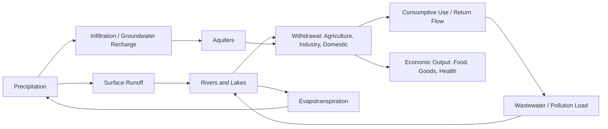
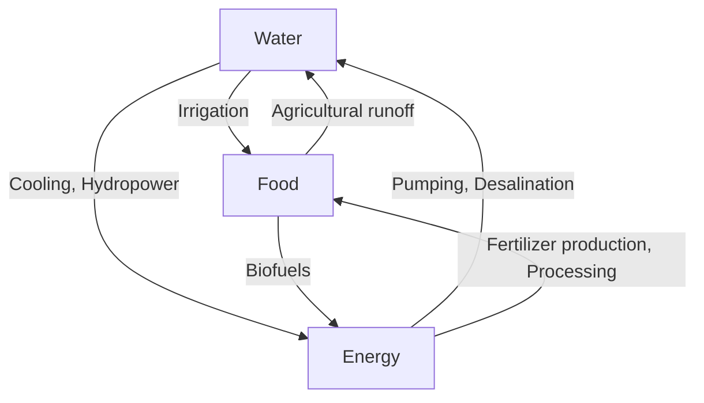

## Water Resource Management

### Definition and Scope

Water resource management (WRM) is the set of institutional, economic, and technical activities involved in planning, developing, distributing, and managing the optimal use of water resources. In development economics, WRM is treated as a problem of allocating a scarce, renewable-but-finite, spatially and temporally variable resource across competing uses (agriculture, industry, domestic consumption, ecosystems, and energy) under conditions of market failure, weak property rights, and climatic uncertainty.

Water differs from most economic goods in ways that shape policy design:

- **Fugitive resource**: water moves (via hydrological cycles), making property rights and metering costly to enforce.
- **Bulky/costly to transport**: high transport costs relative to value create localized, often non-competitive markets.
- **Multiple-use, multiple-scale**: a single river basin serves irrigation, hydropower, drinking water, and ecosystems simultaneously, often across jurisdictions.
- **Merit good and human right**: since 2010, the UN General Assembly has recognized access to safe water and sanitation as a human right, constraining pure market allocation.

### Economic Characteristics of Water as a Resource

**Key Points**

- Water exhibits characteristics of a **common-pool resource** (rivalrous but non-excludable) for surface and groundwater sources, and of a **club/private good** once captured, treated, and piped (excludable via metering).
- **Externalities** are pervasive: upstream withdrawal or pollution imposes costs on downstream users (negative externality); wetland conservation upstream may generate positive externalities (flood control, water purification) downstream.
- **Non-convexities and increasing returns**: water infrastructure (dams, canals, pipe networks) exhibits large fixed costs and economies of scale, tending toward natural monopoly in distribution.
- **Option value and irreversibility**: aquifer depletion and large dam construction can involve irreversible ecological loss, justifying precautionary approaches under uncertainty.

The interaction of common-pool character upstream and natural monopoly character downstream means no single governance instrument (market, state, or community) is sufficient on its own; hybrid institutional arrangements are the empirical norm.

### The Hydrological and Economic Cycle

### Water Scarcity: Physical vs. Economic

Development economists distinguish two forms of scarcity, following the International Water Management Institute (IWMI) framework:

- **Physical water scarcity**: withdrawals exceed 60–75% of renewable supply; more than 75% signals severe scarcity. Common in arid/semi-arid regions (e.g., Middle East, North Africa, parts of South Asia).
- **Economic water scarcity**: physical water is available, but insufficient investment in infrastructure, institutions, or finance prevents access (common in Sub-Saharan Africa).

This distinction matters for policy: physical scarcity calls for demand management (pricing, efficiency, reallocation), while economic scarcity calls for investment-led supply expansion and institutional capacity building.

$$WSI = \frac{\text{Total Freshwater Withdrawal}}{\text{Total Renewable Freshwater Resources}}$$

where $WSI$ is the Water Stress Index; values above 0.4 (40%) are conventionally treated as indicating high water stress (per the Falkenmark and WRI frameworks).

**Falkenmark Water Stress Indicator** (per-capita availability):

| Category | Renewable Water per Capita (m³/year) |
| --- | --- |
| No stress | > 1,700 |
| Stress | 1,000–1,700 |
| Scarcity | 500–1,000 |
| Absolute scarcity | < 500 |

### Water Demand Across Sectors

Global freshwater withdrawal is dominated by agriculture, which is the central fact shaping development-economics treatment of water:

- **Agriculture**: approximately 70% of global freshwater withdrawals, rising to 80–90% in many low- and middle-income agrarian economies.
- **Industry**: approximately 19% globally, concentrated in energy (cooling), manufacturing, and mining.
- **Domestic/municipal**: approximately 11% globally, though this share is disproportionately important for human welfare and health outcomes.

[Inference] Sectoral shares vary substantially by country income level and climate; national statistical agencies or FAO AQUASTAT should be consulted for country-specific figures.

### Market Failures in Water Allocation

**Key Points**

1. **Open-access problem (Tragedy of the Commons)**: groundwater aquifers without well-defined extraction rights lead to a race to pump, driving water tables below socially optimal levels — modeled formally as a common-pool resource game (Gordon-Schaefer type dynamics, analogous to fisheries).
2. **Negative externalities**: agricultural runoff (fertilizer, pesticides) and industrial effluent degrade water quality for downstream users, a classic Pigouvian externality problem.
3. **Public good elements**: watershed protection and flood control from upstream land-use decisions are non-excludable, non-rival benefits to downstream communities, leading to underprovision without coordination.
4. **Natural monopoly in distribution**: piped water networks have high fixed costs and low marginal costs, justifying regulated utility models rather than open competition.
5. **Information asymmetry**: water quality and aquifer depth/recharge rates are often unobserved by users, undermining efficient private decision-making.

**Example**

Consider $n$ farmers extracting groundwater from a shared aquifer. Each farmer's private extraction decision ignores the effect of their pumping on the water table faced by others (a negative externality). The competitive (open-access) equilibrium extraction level $Q_{OA}$ exceeds the socially optimal level $Q^*$ because farmers do not internalize the increased pumping cost (or depletion risk) imposed on others:

$$Q_{OA} > Q^*$$

This is the core justification for regulatory instruments (permits, quotas, extraction taxes) discussed below.

### Governance and Institutional Frameworks

**Integrated Water Resources Management (IWRM)**

IWRM, promoted by the Global Water Partnership since the 1990s and endorsed in Agenda 21 and later the SDGs, is defined as a process that promotes coordinated development and management of water, land, and related resources to maximize economic and social welfare equitably without compromising ecosystem sustainability. Its three pillars are:

- **Enabling environment**: policies, legislation, and financing frameworks.
- **Institutional roles**: clear allocation of responsibilities across national, basin, and local levels (often organized around River Basin Organizations).
- **Management instruments**: assessment tools, allocation instruments, demand management, and conflict resolution mechanisms.

[Inference] IWRM implementation success is contested in the empirical literature; critics (e.g., Biswas, 2004) argue the framework is too broad and difficult to operationalize, particularly in low-capacity states.

**River Basin Organizations (RBOs)**

RBOs coordinate management across a hydrological basin rather than administrative boundaries, addressing the mismatch between political jurisdictions and watersheds. Examples include the Murray-Darling Basin Authority (Australia), the Mekong River Commission, and the Tennessee Valley Authority (historical U.S. model). Basin-level governance is particularly important for transboundary rivers, where 40%+ of the world's population lives in international river basins.

**Water Rights Systems**

| System | Description | Common Context |
| --- | --- | --- |
| Riparian rights | Landowners adjacent to a water body have usage rights | Common law countries (historical) |
| Prior appropriation | "First in time, first in right"; rights are quantified and tradable | Western U.S., parts of Australia |
| Public trust/state allocation | State owns water; allocates via permits/licenses | Most civil law and developing countries |
| Customary/communal rights | Community-based rules, often informal | Traditional irrigation systems, many African and Asian contexts |

### Policy Instruments for Water Management

**Pricing and Tariff Design**

Water pricing serves dual goals of cost recovery and demand management, but must balance efficiency against equity (affordability for low-income users).

- **Increasing Block Tariffs (IBT)**: price rises with consumption tiers; the first block is priced low or free (a "lifeline" tariff) to guarantee basic access, with higher blocks priced to recover costs and discourage waste.
- **Marginal cost pricing**: economically efficient but may fail cost recovery for utilities with high fixed costs, and can be regressive if not paired with lifeline provisions.
- **Two-part tariffs**: a fixed connection fee plus a volumetric charge, separating infrastructure cost recovery from usage-based signals.

$$TR = F + p \cdot Q$$

where $TR$ is total utility revenue, $F$ is the fixed charge, $p$ is the per-unit volumetric price, and $Q$ is quantity consumed.

**Key Points on Tariff Design Trade-offs**

- Full-cost recovery pricing improves utility financial sustainability and reduces waste but risks excluding poor households.
- Subsidized or free provision improves access equity but can worsen fiscal sustainability and encourage overuse; [Inference] evidence on the price elasticity of domestic water demand is mixed and context-dependent, generally found to be inelastic in the short run for basic consumption.

**Tradable Water Rights / Water Markets**

Formal water markets allow reallocation of water rights from lower- to higher-value uses via trading, subject to a cap on total extraction.

- **Cap-and-trade** for water: total allowable extraction is set (the cap), rights are allocated (via grandfathering, auction, or historical use), and trading is permitted.
- The Australian Murray-Darling Basin is the most cited large-scale example, with separated water entitlements (long-term rights) and allocations (seasonal water available under that entitlement) traded on formal exchanges.
- Chile's 1981 Water Code created one of the earliest fully tradable water rights systems; [Unverified/Inference] the equity and environmental outcomes of the Chilean model remain debated in the literature, with critics citing under-regulation of environmental flows in early implementation, partially addressed by 2005 and 2022 reforms.

**Regulatory Instruments**

- **Extraction permits and quotas**: administratively set limits on groundwater or surface withdrawal.
- **Pigouvian taxes**: levies on water pollution or extraction to internalize externalities.
- **Command-and-control standards**: minimum treatment standards for effluent discharge (e.g., under frameworks analogous to the U.S. Clean Water Act).

### Virtual Water and the Water-Food-Energy Nexus

**Virtual water** (or embedded water) refers to the volume of water used in the production of a good or service, a concept developed by Tony Allan in the 1990s. Countries facing physical water scarcity can effectively import water indirectly by importing water-intensive goods (especially food), a strategy sometimes termed "virtual water trade."

$$VW_{import} = \sum_i q_i \cdot w_i$$

where $q_i$ is the quantity of good $i$ imported and $w_i$ is the water footprint (liters or m³ per unit) of producing good $i$.

The **Water-Energy-Food (WEF) Nexus** framework recognizes that water, energy, and food systems are deeply interlinked: irrigation requires energy (pumping), energy production requires water (cooling, hydropower, biofuels), and both require water and energy for food production. Nexus thinking argues that sectoral silos in policy planning lead to suboptimal, sometimes contradictory, outcomes (e.g., biofuel mandates increasing water stress).

### Water, Poverty, and Human Development

**Key Points**

- Lack of access to safe water and sanitation is both a **cause and consequence** of poverty: time spent collecting water (disproportionately borne by women and girls) reduces time available for education and income generation.
- Waterborne disease (diarrheal disease, cholera, typhoid) remains a leading cause of child mortality in low-income countries, linking WRM directly to human capital formation.
- The **WASH framework** (Water, Sanitation, and Hygiene) is the standard multisectoral approach used by WHO/UNICEF and development agencies.
- SDG 6 ("Clean Water and Sanitation for All") sets universal, equitable access to safe drinking water as a 2030 target; [Inference] as of the most recent Joint Monitoring Programme reporting cycles, progress has been assessed as insufficient to meet the 2030 target on current trajectories — recent figures should be verified via the WHO/UNICEF JMP database for current status.

### Irrigation Economics and Agricultural Water Use

Because agriculture dominates water withdrawal, irrigation efficiency is central to WRM in agrarian developing economies.

- **Irrigation efficiency** measures the ratio of water beneficially used by crops to water withdrawn; conventional gravity/flood irrigation often achieves only 30–50% efficiency, while drip irrigation can achieve 80–90%.
- **Return flow economics**: "inefficient" irrigation is not always wasteful in a basin-wide sense, since return flows (runoff, deep percolation) often recharge aquifers or downstream rivers used by others — a key critique of naive efficiency-maximization policy (the "paradox of irrigation efficiency").
- **Water User Associations (WUAs)**: farmer-managed institutions for canal-level water allocation and maintenance, often promoted under irrigation management transfer (IMT) reforms since the 1980s–1990s as a decentralization strategy from state-run irrigation departments.

$$IE = \frac{\text{Water used by crop (evapotranspiration)}}{\text{Water applied at the field}} \times 100\%$$

### Groundwater Management

Groundwater is disproportionately important in South Asia (India is the world's largest groundwater extractor) and parts of the Middle East, often subsidized indirectly through free or underpriced electricity for pumping.

**Key Points**

- **Aquifer depletion** is frequently driven by a policy failure nexus: free/subsidized electricity + open-access extraction rights + absence of metering leads to systematic overdraft, as documented extensively in Indian Punjab and Gujarat.
- **Conjunctive use** (coordinated management of surface and groundwater) can smooth seasonal variability and reduce over-reliance on either source.
- **Managed Aquifer Recharge (MAR)**: deliberate recharge of aquifers via infiltration basins, injection wells, or check dams to restore groundwater levels.

### Climate Change and Water Resource Risk

Climate change alters both the mean and variance of water availability, with significant implications for development planning:

- **Increased variability**: more intense floods and droughts, complicating infrastructure design premised on historical (stationary) hydrological records — the "stationarity is dead" problem identified in the hydrology literature (Milly et al., 2008).
- **Glacial-fed river systems** (e.g., Indus, Ganges-Brahmaputra, Mekong) face medium-term flow increases from accelerated glacial melt followed by longer-term flow declines as glacial mass diminishes.
- **Sea level rise and salinization**: coastal aquifers and deltas (e.g., Bangladesh, Mekong Delta, Nile Delta) face saltwater intrusion, threatening both drinking water and agricultural productivity.
- Adaptation strategies include climate-resilient infrastructure design, diversified water portfolios (desalination, water reuse), and flexible/adaptive water allocation institutions rather than fixed infrastructure-only responses.

### Large Infrastructure: Dams and Their Trade-offs

Large dams remain central and contested instruments of water resource management, generating multiple, often conflicting, benefits and costs:

**Benefits**: hydropower generation, irrigation water supply, flood control, drought buffering, navigation.

**Costs**: population displacement (the World Commission on Dams, 2000, estimated tens of millions displaced globally by large dams historically), downstream ecosystem disruption, sediment trapping (affecting delta stability and downstream agriculture), and altered flow regimes harming fisheries.

[Inference] The cost-benefit balance of large dams is highly context- and project-specific; the World Commission on Dams' 2000 report remains an influential but contested reference point, criticized by some governments and dam-building institutions as insufficiently accounting for energy/development benefits, and cited by others as underestimating displacement and ecological costs.

### Desalination and Non-Conventional Water Sources

- **Desalination** (reverse osmosis being the dominant modern technology) provides a supply-side option independent of rainfall variability, heavily used in the Gulf states, Israel, and increasingly in water-stressed coastal cities.
- Key constraints: high energy intensity (though costs have fallen substantially with reverse osmosis membrane improvements since the 1990s–2000s), brine disposal environmental impacts, and high capital costs limiting feasibility for low-income, non-coastal regions.
- **Wastewater reuse (reclaimed water)**: treating and reusing municipal or industrial wastewater for irrigation, industrial processes, or (with advanced treatment) potable use; Singapore's NEWater program is a widely cited example of large-scale potable reuse integration.
- **Rainwater harvesting**: low-cost, decentralized supplementation strategy particularly relevant in economically water-scarce regions lacking large infrastructure investment capacity.

### Institutional Case Patterns (Illustrative Models)

| Model | Core Mechanism | Illustrative Context |
| --- | --- | --- |
| Centralized state provision | Government owns and operates infrastructure | Historically dominant model, many developing countries |
| Public-Private Partnership (PPP) | Private operation under regulatory oversight, public asset ownership | Manila Water/Maynilad concessions (Philippines), various concessions globally |
| Community-based management | Local user groups manage local resources (often rural) | Traditional subak systems (Bali), many rural water committees |
| Basin-level river authority | Coordinated management across a hydrological basin | Murray-Darling Basin Authority, Mekong River Commission |
| Tradable rights/markets | Cap-and-trade allocation of quantified rights | Murray-Darling water markets, Chile's Water Code |

**Example**

The Manila Water and Maynilad concessions (Philippines, from 1997) split metropolitan water supply into two private concession zones under regulatory oversight by the Metropolitan Waterworks and Sewerage System (MWSS). [Inference] Evaluations of the concession's outcomes are mixed in the literature: proponents cite improved coverage and non-revenue water reduction, while critics point to tariff increases and periodic contract renegotiation disputes; specific performance statistics should be verified against current MWSS regulatory reports.

### Diagram: Institutional Layers of Water Governance (svg_diagram)

<svg xmlns="http://www.w3.org/2000/svg" viewBox="0 0 720 420">
<text x="360" y="30" font-size="18" font-weight="bold" text-anchor="middle" font-family="sans-serif">Institutional Layers of Water Governance (svg_diagram)</text>
<rect x="60" y="60" width="600" height="70" rx="10" fill="#dbeafe" stroke="#1e3a8a" stroke-width="1.5" />
<text x="360" y="90" font-size="14" font-weight="bold" text-anchor="middle" font-family="sans-serif">National Level</text>
<text x="360" y="112" font-size="12" text-anchor="middle" font-family="sans-serif">Water law, national allocation policy, ministries, regulatory bodies</text>
<rect x="60" y="150" width="600" height="70" rx="10" fill="#dcfce7" stroke="#166534" stroke-width="1.5" />
<text x="360" y="180" font-size="14" font-weight="bold" text-anchor="middle" font-family="sans-serif">Basin Level</text>
<text x="360" y="202" font-size="12" text-anchor="middle" font-family="sans-serif">River Basin Organizations, transboundary agreements, basin plans</text>
<rect x="60" y="240" width="600" height="70" rx="10" fill="#fef9c3" stroke="#854d0e" stroke-width="1.5" />
<text x="360" y="270" font-size="14" font-weight="bold" text-anchor="middle" font-family="sans-serif">Local/Utility Level</text>
<text x="360" y="292" font-size="12" text-anchor="middle" font-family="sans-serif">Utilities, irrigation districts, Water User Associations, tariffs</text>
<rect x="60" y="330" width="600" height="70" rx="10" fill="#fee2e2" stroke="#991b1b" stroke-width="1.5" />
<text x="360" y="360" font-size="14" font-weight="bold" text-anchor="middle" font-family="sans-serif">Community/Household Level</text>
<text x="360" y="382" font-size="12" text-anchor="middle" font-family="sans-serif">End-user access, customary rights, household water security</text>
<line x1="360" y1="130" x2="360" y2="150" stroke="#334155" stroke-width="2" marker-end="url(#arrow)" />
<line x1="360" y1="220" x2="360" y2="240" stroke="#334155" stroke-width="2" marker-end="url(#arrow)" />
<line x1="360" y1="310" x2="360" y2="330" stroke="#334155" stroke-width="2" marker-end="url(#arrow)" />
</svg>

### Measuring Water Sustainability: Key Indicators

- **Water Stress Index (WSI)**: withdrawal as a share of renewable supply (defined above).
- **Water Poverty Index (WPI)**: composite index integrating resource availability, access, capacity, use, and environmental components; developed by the Centre for Ecology and Hydrology (UK) in the early 2000s.
- **Non-Revenue Water (NRW)**: share of water produced by a utility that is lost before reaching paying customers (leakage plus theft/unbilled consumption); a key utility performance metric, often exceeding 30–40% in poorly performing developing-country utilities.
- **Water footprint**: total volume of freshwater used to produce goods/services consumed by an entity (individual, firm, or nation), decomposed into blue (surface/groundwater), green (rainwater stored in soil), and grey (water needed to assimilate pollution) components — a framework developed by Arjen Hoekstra.

$$NRW = \frac{\text{Water Produced} - \text{Water Billed}}{\text{Water Produced}} \times 100\%$$

### Gender Dimensions of Water Management

Development economics literature emphasizes that water collection burdens fall disproportionately on women and girls in many low-income rural contexts, with implications for time-use, school attendance, and labor market participation. Consequently, gender-responsive water policy (e.g., ensuring women's participation in Water User Associations, siting infrastructure to minimize collection time) is treated as both an equity objective and an efficiency-enhancing intervention, since reduced collection burden frees time for productive or educational activities. [Inference] The magnitude of labor-supply and schooling effects from improved water access varies across empirical studies and contexts; specific effect sizes should be drawn from primary studies (e.g., randomized evaluations of water infrastructure) rather than generalized.

### Conclusion

Water resource management sits at the intersection of natural resource economics, public finance, and development policy. Its core analytical challenge is reconciling water's physical characteristics — mobility, rivalry, non-excludability, and infrastructural natural monopoly — with the need for efficient, equitable, and sustainable allocation across agriculture, industry, households, and ecosystems. No single instrument (pure market, pure state control, or pure community management) resolves this tension universally; the empirical and policy literature converges on the need for basin-scale, multi-level institutional arrangements combining pricing, regulation, infrastructure investment, and participatory governance, calibrated to a country's hydrological endowment, institutional capacity, and climate risk profile.

**Related Topics**

- Common-pool resource theory and the Tragedy of the Commons (Ostrom's design principles)
- Environmental Kuznets Curve and its application to water pollution
- Cost-benefit analysis and social discount rates for large infrastructure (dams, canals)
- Payments for Ecosystem Services (PES), especially for watershed protection
- Transboundary water conflict and cooperation (hydropolitics)
- Climate change adaptation and resilient infrastructure planning
- Agricultural subsidy reform (energy-water nexus, e.g., electricity subsidies for pumping)
- Sanitation economics and the WASH sector
- Natural resource curse literature (extended to water-abundant vs. water-scarce development paths)
- Public utility regulation theory (rate-of-return vs. price-cap regulation)