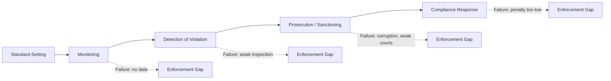

## Environmental Policy and Enforcement Challenges

### Definition and Scope

Environmental policy encompasses the set of legal instruments, economic mechanisms, and institutional arrangements governments use to regulate the interaction between economic activity and the natural environment. In development economics, the central concern is not merely designing theoretically optimal instruments (as in standard environmental economics) but understanding why environmental policy so frequently fails to be implemented or enforced effectively in low- and middle-income country contexts — the gap between policy design ("law on the books") and policy outcomes ("law in practice").

This topic sits at the intersection of environmental economics, public economics, and institutional/development economics, since enforcement capacity is itself a function of state capacity, fiscal resources, judicial independence, and political economy constraints.

### Theoretical Foundations: Why Environmental Policy Is Needed

Environmental problems are fundamentally market failures arising from missing or incomplete markets for environmental goods.

**Key Points**

- **Externalities**: pollution imposes costs on third parties not reflected in market prices (negative externality); conservation can generate uncompensated benefits (positive externality).
- **Public goods**: clean air, biodiversity, and climate stability are non-excludable and non-rival, leading to underprovision without collective action.
- **Common-pool resources**: fisheries, forests, and groundwater are rivalrous but difficult to exclude access to, generating overexploitation absent well-defined rights (the Tragedy of the Commons, Hardin 1968).
- **Information asymmetries**: firms typically know more about their emissions and abatement costs than regulators, creating adverse selection and moral hazard problems in regulatory design.

The standard Pigouvian solution is to set a tax equal to marginal external damage, aligning private and social marginal costs:

$$MPC + t = MSC$$

where $MPC$ is marginal private cost, $t$ is the Pigouvian tax, and $MSC$ is marginal social cost. The Coasean alternative relies on well-defined property rights and low transaction costs to allow bargaining toward the efficient outcome regardless of initial rights allocation — an assumption frequently violated in developing-country contexts with insecure land tenure and high transaction costs.

### Instrument Choice: Design Options

| Instrument Type | Examples | Core Mechanism |
| --- | --- | --- |
| Command-and-control | Emissions standards, technology mandates, zoning | Direct legal limits on behavior |
| Market-based (price) | Pigouvian taxes, effluent charges | Internalizes externality via price |
| Market-based (quantity) | Cap-and-trade, tradable permits | Sets quantity, lets market determine price |
| Information-based | Eco-labeling, mandatory disclosure, public disclosure programs | Corrects information asymmetry |
| Liability rules | Polluter-pays enforcement, strict liability statutes | Ex-post cost internalization via courts |
| Voluntary/hybrid | Negotiated agreements, corporate self-regulation, PES | Non-mandatory or conditional-payment mechanisms |

**Key Points on Instrument Choice in Development Contexts**

- Market-based instruments are theoretically efficient (equalizing marginal abatement costs across firms) but require monitoring capacity, well-functioning courts to enforce trades/penalties, and administrative sophistication frequently absent in low-capacity states.
- Command-and-control instruments are easier to monitor (compliance is binary: met the standard or not) but are cost-inefficient since they do not equalize marginal abatement costs across heterogeneous firms.
- [Inference] The academic consensus favoring market-based instruments (from environmental economics in high-capacity OECD contexts) does not automatically transfer to low-enforcement-capacity settings, where simpler, more easily monitored instruments may outperform theoretically optimal but unenforceable ones — a point emphasized in the development-specific environmental economics literature (e.g., work by Greenstone, Duflo, and co-authors on Indian environmental regulation).

### The Enforcement Gap: Core Analytical Framework

**Key Points**

The enforcement gap arises from a chain of sequential requirements, any one of which can fail:

1. **Standard-setting**: appropriate legal standards must be defined.
2. **Monitoring**: actual emissions/behavior must be observed or measurable.
3. **Detection**: violations must be identified from monitoring data.
4. **Prosecution/Sanctioning**: detected violations must trigger penalties.
5. **Compliance response**: firms must respond to penalties by changing behavior (deterrence must actually bind).

A useful formalization of enforcement is the expected-penalty model (Becker, 1968, applied to environmental crime):

$$E[\text{Cost of Violation}] = p \cdot f$$

where $p$ is the probability of detection and $f$ is the fine imposed if caught. A firm complies (in the simplest deterrence model) only if:

$$p \cdot f > C_{abatement}$$

where $C_{abatement}$ is the cost of compliance. In many developing-country contexts, both $p$ (low monitoring/inspection frequency) and $f$ (low or unenforced fines) are small, so the expected cost of violation falls well below abatement costs, making non-compliance the rational private response even when environmental damage is large.

### Institutional and State Capacity Constraints

**Key Points**

- **Fiscal constraints**: environmental agencies in low-income countries are frequently understaffed and underfunded relative to their regulatory mandate, limiting inspection frequency and monitoring infrastructure (e.g., continuous emissions monitoring systems).
- **Judicial capacity**: weak, backlogged, or under-resourced court systems delay prosecution and reduce the credibility of sanctions; environmental cases often compete with criminal and commercial dockets for scarce judicial attention.
- **Corruption and regulatory capture**: inspectors or officials may be bribed to overlook violations ("bureaucratic capture"), or politically influential firms may successfully lobby to weaken standards or enforcement intensity ("regulatory capture," per Stigler's economic theory of regulation).
- **Fragmented jurisdiction**: environmental mandates are often split across multiple ministries (environment, industry, agriculture, local government) with overlapping or unclear authority, creating coordination failures and accountability gaps.
- **Political economy of enforcement**: incumbent governments may have short time horizons (electoral cycles) that discount long-term environmental costs, or may prioritize employment and output from polluting industries over environmental compliance, particularly during periods of high unemployment.

### Measurement and Data Constraints

A distinctive enforcement challenge in developing countries is the underlying data infrastructure problem: monitoring requires reliable measurement, but measurement itself is costly and politically contestable.

- **Self-reported emissions data**: subject to strategic misreporting when firms know reports determine their own regulatory burden (a classic principal-agent problem).
- **Third-party auditing**: introduces its own incentive problems if auditors are paid by the firms they audit (documented empirically in Indian industrial pollution audits — audit firms have been shown in field experiments to systematically underreport violations when compensated by regulated firms rather than by the regulator).
- **Remote sensing and satellite monitoring**: increasingly used to overcome ground-level data gaps (e.g., satellite-based deforestation monitoring in Brazil's Amazon via INPE's DETER/PRODES systems, or satellite-based air quality proxies where ground monitoring networks are sparse).
- [Inference] The shift toward remote sensing and third-party independent audit reforms (rather than self-reporting or firm-paid audits) has shown promising results in randomized field experiments, but scaling and institutionalizing such reforms across weak-capacity bureaucracies remains an open implementation challenge.

### Case Illustration: Air Pollution Regulation in Industrializing Economies

**Example**

A stylized but empirically grounded pattern observed across rapidly industrializing economies (e.g., India, China during their high-growth industrialization phases):

1. Ambitious air quality standards are legislated, often modeled on OECD frameworks.
2. Monitoring networks are sparse relative to the geographic spread of pollution sources, especially outside major cities.
3. Inspection agencies lack sufficient staff to visit more than a small fraction of regulated facilities annually.
4. Penalties, when imposed, are often set too low relative to abatement costs, or are contested and delayed through prolonged litigation.
5. Result: de facto pollution levels substantially exceed de jure legal standards, despite a nominally strong regulatory framework.

This pattern illustrates why cross-country comparisons of "environmental stringency" based solely on statutory law can be misleading; effective stringency (accounting for enforcement) is often the more policy-relevant — though harder to measure — construct. [Inference] Specific country-level compliance rates and enforcement statistics change over time and should be verified against current national regulatory agency reports or peer-reviewed studies for up-to-date figures.

### Political Economy of Environmental Policy

**Key Points**

- **Environmental Kuznets Curve (EKC) debate**: the hypothesis that pollution first rises then falls with income per capita (an inverted-U relationship) has been used to argue developing countries should prioritize growth first, environment later. The empirical evidence is mixed and pollutant-specific — the relationship holds more consistently for local pollutants with visible, immediate health effects (e.g., sulfur dioxide) than for pollutants with diffuse, global, or delayed effects (e.g., $CO_2$, biodiversity loss, plastic waste).
- **Race-to-the-bottom vs. Pollution Haven Hypothesis**: concern that competition for investment leads countries to weaken environmental standards, or that footloose polluting industries relocate to jurisdictions with laxer enforcement. [Inference] Empirical support for strong pollution-haven effects is more limited and contested than the theoretical concern is often portrayed, with effects appearing more clearly for specific highly-mobile, pollution-intensive industries than as a general phenomenon.
- **Interest group capture**: concentrated industry interests (with strong incentives to lobby against costly regulation) often outweigh diffuse public interest in clean environment (with weak individual incentives to organize), consistent with Olson's logic of collective action.
- **North-South equity tensions in global environmental policy**: developing countries often argue for "common but differentiated responsibilities" (a principle enshrined in the UNFCCC) given historical emissions responsibility differentials, while facing pressure from developed countries and international institutions to adopt stringent standards despite lower current fiscal and institutional capacity.

### Enforcement Innovations and Reform Approaches

**Key Points**

- **Risk-based inspection targeting**: using data analytics to prioritize inspections toward facilities most likely to violate, improving detection rates without proportionally increasing inspector headcount (piloted in various state pollution control boards in India with documented improvements in inspection efficiency in specific studies).
- **Public disclosure programs**: publishing firm-level environmental performance rankings to leverage reputational incentives and community/consumer pressure as a complement to formal sanctions (e.g., Indonesia's PROPER program, which rates industrial facilities on a color-coded compliance scale).
- **Community-based monitoring and grievance mechanisms**: empowering local communities to report violations, reducing reliance on centralized inspectorates alone.
- **Performance-based regulation and results-based financing**: tying disbursements or permits to verified environmental outcomes rather than input compliance alone.
- **Judicial reforms and specialized environmental courts**: dedicated environmental tribunals (e.g., India's National Green Tribunal, established 2010) aim to reduce case backlogs and build specialized judicial expertise in environmental law.
- **Decentralization vs. centralization trade-offs**: decentralizing enforcement to local governments can improve information and accountability (closer to affected communities) but may also increase vulnerability to local elite capture, depending on local governance quality.

### Diagram: The Policy-Implementation-Enforcement Chain (svg_diagram)

<svg xmlns="http://www.w3.org/2000/svg" viewBox="0 0 740 320">
<text x="370" y="28" font-size="17" font-weight="bold" text-anchor="middle" font-family="sans-serif">Policy-Implementation-Enforcement Chain (svg_diagram)</text>
<rect x="20" y="70" width="150" height="80" rx="10" fill="#dbeafe" stroke="#1e3a8a" stroke-width="1.5" />
<text x="95" y="105" font-size="13" font-weight="bold" text-anchor="middle" font-family="sans-serif">Law on the</text>
<text x="95" y="122" font-size="13" font-weight="bold" text-anchor="middle" font-family="sans-serif">Books</text>
<rect x="200" y="70" width="150" height="80" rx="10" fill="#dcfce7" stroke="#166534" stroke-width="1.5" />
<text x="275" y="105" font-size="13" font-weight="bold" text-anchor="middle" font-family="sans-serif">Monitoring</text>
<text x="275" y="122" font-size="13" font-weight="bold" text-anchor="middle" font-family="sans-serif">Capacity</text>
<rect x="380" y="70" width="150" height="80" rx="10" fill="#fef9c3" stroke="#854d0e" stroke-width="1.5" />
<text x="455" y="105" font-size="13" font-weight="bold" text-anchor="middle" font-family="sans-serif">Detection &amp;</text>
<text x="455" y="122" font-size="13" font-weight="bold" text-anchor="middle" font-family="sans-serif">Prosecution</text>
<rect x="560" y="70" width="150" height="80" rx="10" fill="#fee2e2" stroke="#991b1b" stroke-width="1.5" />
<text x="635" y="105" font-size="13" font-weight="bold" text-anchor="middle" font-family="sans-serif">Actual</text>
<text x="635" y="122" font-size="13" font-weight="bold" text-anchor="middle" font-family="sans-serif">Compliance</text>
<line x1="170" y1="110" x2="200" y2="110" stroke="#334155" stroke-width="2" marker-end="url(#arrow2)" />
<line x1="350" y1="110" x2="380" y2="110" stroke="#334155" stroke-width="2" marker-end="url(#arrow2)" />
<line x1="530" y1="110" x2="560" y2="110" stroke="#334155" stroke-width="2" marker-end="url(#arrow2)" />

<text x="370" y="200" font-size="13" text-anchor="middle" font-family="sans-serif" fill="`#991b1b`">Gap widens at each stage due to: fiscal constraints, corruption,</text>

<text x="370" y="220" font-size="13" text-anchor="middle" font-family="sans-serif" fill="`#991b1b`">judicial backlog, regulatory capture, weak data infrastructure</text>

</svg>

### International Dimensions and Multilevel Governance

**Key Points**

- **Multilateral Environmental Agreements (MEAs)**: instruments such as the Paris Agreement (climate), Convention on Biological Diversity, and Montreal Protocol (ozone) create international commitments that must be transposed into domestic enforcement systems — a process subject to the same capacity constraints as purely domestic policy.
- **Conditionality and aid-linked environmental governance**: development finance institutions (World Bank, regional development banks) sometimes attach environmental safeguards to lending, creating an external enforcement channel that can substitute for weak domestic institutions, though this raises sovereignty and effectiveness debates.
- **Carbon markets and international offset mechanisms**: mechanisms such as the (historical) Clean Development Mechanism under the Kyoto Protocol, and newer Article 6 mechanisms under the Paris Agreement, attempt to link developing-country mitigation projects to international carbon finance, but face their own additionality and monitoring-verification challenges analogous to domestic enforcement problems.
- **Transboundary pollution and free-rider problems**: pollution crossing national borders (e.g., transboundary haze from land-clearing fires in Southeast Asia) creates enforcement challenges beyond any single national jurisdiction's authority, requiring regional cooperation mechanisms that are often weakly enforced (e.g., the ASEAN Agreement on Transboundary Haze Pollution).

### Cost-Benefit and Distributional Considerations

**Key Points**

- Environmental policy design in development contexts must weigh abatement costs against not only environmental benefits but also distributional effects on employment, informal-sector livelihoods, and poverty, since environmental regulation can impose disproportionate short-run costs on low-income workers in regulated industries (e.g., artisanal mining, small-scale manufacturing, informal brick kilns).
- **Informality** poses a distinct enforcement challenge: a large share of economic activity in developing countries occurs in the informal sector, which is largely outside the reach of conventional regulatory instruments designed for formal, registered firms.
- Just-transition and compensation mechanisms (retraining, transitional subsidies) are increasingly discussed as complements to environmental regulation to manage distributional and political-economy resistance to enforcement.

### Conclusion

Environmental policy in development economics cannot be evaluated on instrument design alone; the decisive determinant of real-world environmental outcomes is the capacity and political will to monitor, detect, and sanction non-compliance. The enforcement gap — arising from fiscal, judicial, informational, and political-economy constraints — means that formally strong environmental laws frequently coexist with weak actual environmental protection in developing-country contexts. Effective reform therefore requires attention not only to optimal instrument choice (taxes, permits, standards) but to the underlying institutional architecture: monitoring technology, judicial capacity, anti-corruption safeguards, and political economy incentives that determine whether policy on paper translates into policy in practice.

**Related Topics**

- Pigouvian taxation and the economics of externalities
- Cap-and-trade systems and tradable permit market design
- State capacity and institutional quality in development economics
- Regulatory capture and the economic theory of regulation (Stigler, Peltzman)
- Environmental Kuznets Curve: theory and empirical evidence
- Pollution Haven Hypothesis and trade-environment linkages
- Corruption and bureaucratic incentive design
- Informal sector economics and regulatory reach
- Climate finance, carbon markets, and Paris Agreement Article 6 mechanisms
- Judicial reform and specialized environmental courts
- Randomized evaluations of environmental regulation (empirical development economics methodology)