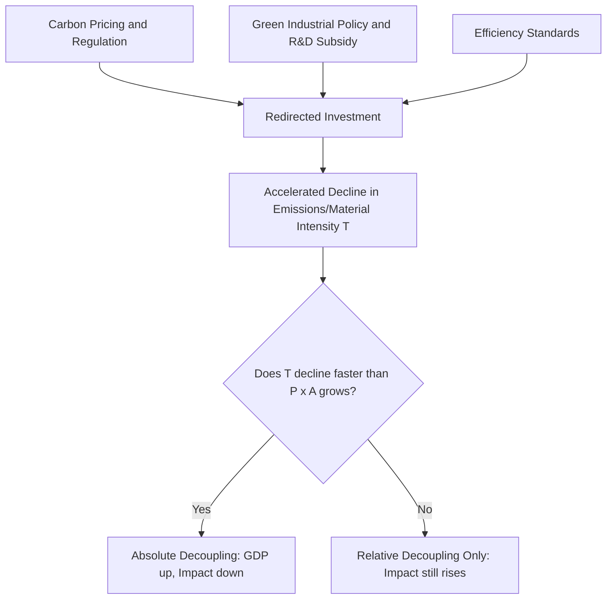
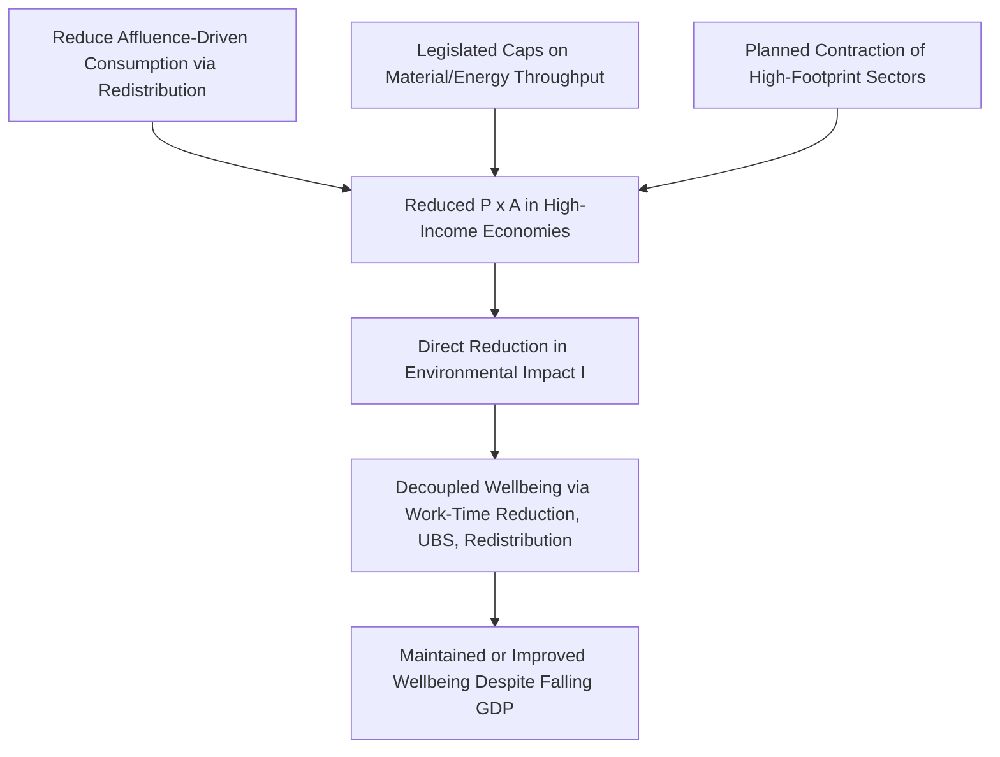

## Green growth versus degrowth debates

### Framing the Debate

Green growth and degrowth represent two competing paradigms for reconciling continued human material welfare improvement with planetary environmental limits. Both accept that current production and consumption patterns in high-income economies exceed sustainable ecological boundaries, but they diverge fundamentally on whether continued aggregate economic growth (as conventionally measured by GDP) is compatible with — or an obstacle to — the environmental transition required to remain within those boundaries.

**Green Growth** holds that GDP growth can continue indefinitely, or at least for the foreseeable policy horizon, provided it is sufficiently "decoupled" from resource use and emissions through technological innovation, efficiency gains, and structural shifts toward less resource-intensive sectors (particularly services and digital activity).

**Degrowth** holds that continued aggregate GDP growth in already-affluent economies is structurally incompatible with staying within planetary boundaries, given the historical failure of decoupling to occur at sufficient scale and speed, and instead advocates a planned, equitable reduction in material and energy throughput in high-income countries alongside a shift away from GDP as the central policy objective.

### The Decoupling Concept

The central empirical and theoretical fault line between the two camps is the concept of decoupling — the extent to which economic output (GDP) can be separated from environmental pressure (resource extraction, material throughput, greenhouse gas emissions).

**Relative decoupling** occurs when resource use or emissions grow more slowly than GDP, so environmental intensity per unit of output falls, but absolute environmental pressure still rises.

**Absolute decoupling** occurs when GDP continues to grow while the absolute level of resource use or emissions declines.

Formally, let $Y_t$ denote real GDP and $E_t$ denote a resource or emissions aggregate at time $t$. Environmental intensity is:

$$I_t = \frac{E_t}{Y_t}$$

Relative decoupling requires:

$$\frac{d \ln I_t}{dt} < 0 \quad \text{while} \quad \frac{d \ln Y_t}{dt} > 0$$

Absolute decoupling requires the stronger condition:

$$\frac{d E_t}{dt} < 0 \quad \text{while} \quad \frac{d Y_t}{dt} > 0$$

Green growth's policy viability rests on the empirical claim that sustained absolute decoupling of GDP from emissions and material footprint is achievable at the pace required to meet climate targets (e.g., a 1.5°C or well-below-2°C carbon budget); degrowth's central empirical claim is that historical and projected absolute decoupling rates are, and will remain, far too slow relative to the required pace, particularly for material footprint (as distinct from territorial carbon emissions alone).

### The IPAT Identity as an Analytical Backbone

Much of the decoupling debate is organized around variants of the IPAT identity, which decomposes environmental impact into multiplicative drivers:

$$I = P \times A \times T$$

where $I$ is environmental impact, $P$ is population, $A$ is affluence (GDP per capita), and $T$ is technology (environmental impact per unit of GDP, i.e., intensity).

**Key Points**

- Green growth proponents emphasize that $T$ can fall fast enough, through renewable energy deployment, efficiency, and material substitution, to offset growth in $P \times A$, driving $I$ down even as $A$ rises.
- Degrowth proponents argue that historically, reductions in $T$ have been outpaced by growth in $P \times A$ (a pattern sometimes called the Jevons paradox or the rebound effect at the macro scale), and that betting climate stabilization on an unprecedented acceleration in the rate of decline of $T$ is a high-risk strategy given the narrowing remaining carbon budget.
- **[Inference]** The disagreement is therefore less about the algebra of the identity itself, which both camps accept, and more about empirically contested projections of feasible future rates of change in $T$, and about risk tolerance for betting climate outcomes on those projections.

### Empirical Evidence on Decoupling

**Key Points**

- **Territorial carbon emissions**: A number of high-income countries (e.g., several EU member states, the UK) have achieved absolute decoupling of territorial (production-based) CO2 emissions from GDP over multi-decade periods, driven substantially by deindustrialization, fuel switching from coal to gas, and renewable energy deployment.
- **Consumption-based emissions**: When emissions are instead measured on a consumption basis (accounting for emissions embedded in imported goods), the extent of absolute decoupling in several of these same economies is smaller or in some cases reverses, since production of emissions-intensive goods has partly relocated abroad rather than been eliminated.
- **Material footprint**: Evidence for absolute decoupling of GDP from total material footprint (raw material extraction attributable to final consumption) is considerably weaker and more contested than for carbon; several empirical reviews find little robust evidence of sustained, economy-wide absolute decoupling from material use at a global level.
- **[Unverified]** Whether currently observed national-level carbon decoupling episodes can be extrapolated to the sustained, accelerating, *global* rate required to meet a well-below-2°C carbon budget is a projection, not an observed fact, and is treated with substantial skepticism in parts of the empirical literature (e.g., work associated with Hickel, Kallis, and coauthors), while green growth-aligned analyses (e.g., OECD, some IEA scenario work) treat accelerated decoupling as achievable under sufficiently ambitious policy.

### Green Growth: Policy Architecture

**Key Points**

- **Carbon pricing** (carbon taxes or cap-and-trade systems) to internalize the externality and redirect investment toward low-carbon technology
- **Green industrial policy**: subsidies, mission-oriented R&D funding, and public investment (e.g., renewable energy deployment, grid modernization, green hydrogen)
- **Regulatory standards**: fuel economy standards, building codes, appliance efficiency standards
- **Innovation policy**: patent incentives, public-private R&D partnerships intended to accelerate the rate of decline in $T$
- **Structural transformation**: policy support for shifting economic composition toward less material-intensive service and digital sectors
- **International coordination mechanisms**: carbon border adjustment mechanisms to prevent carbon leakage that would otherwise undermine unilateral decoupling gains

### Degrowth: Policy Architecture

**Key Points**

- **Work-time reduction**: shorter working weeks to redistribute available employment as material throughput and associated labor demand falls, while maintaining employment levels
- **Universal basic services or a job/income guarantee**: decoupling welfare and security from continued GDP growth and formal employment growth
- **Wealth and income redistribution**: progressive taxation, wealth taxes, and maximum income ratios to reduce the affluence-driven component of the IPAT identity, particularly consumption by the highest-income/highest-footprint households
- **Caps on resource extraction and material throughput**: legislated ceilings on aggregate energy or material use, sometimes proposed as "cap and share" mechanisms analogous to cap-and-trade but applied upstream to extraction
- **Deliberate contraction of ecologically damaging sectors**: planned downscaling of specific high-footprint industries (e.g., aviation, fast fashion, certain extractive industries), paired with active labor-market transition support (a "just transition")
- **Alternative welfare metrics**: replacing GDP as the primary policy target with composite wellbeing, sufficiency, or biophysical indicators (e.g., "Doughnut Economics" boundaries, Genuine Progress Indicator)

### Core Theoretical Disagreements

| Dimension | Green Growth Position | Degrowth Position |
| --- | --- | --- |
| Feasibility of sufficient absolute decoupling | Achievable with adequate policy ambition and technology deployment speed | Empirically unproven at required scale/speed; historically insufficient |
| Role of GDP as policy target | Retained as central metric; growth is compatible with sustainability if properly directed | Rejected or subordinated to biophysical and wellbeing indicators |
| Primary lever | Price and innovation incentives operating within existing growth-oriented institutions | Direct caps on throughput plus redistribution and institutional restructuring |
| Risk under uncertainty | Betting on continued growth with accelerated decoupling carries acceptable risk given growth's poverty-reduction and innovation benefits | Betting on unproven decoupling rates given a rapidly narrowing carbon budget is an unacceptable risk |
| Treatment of global South growth | Growth is generally still needed and desirable in low-income economies; degrowth focus is implicitly or explicitly a high-income country agenda | Most degrowth scholarship explicitly restricts degrowth prescriptions to already-affluent economies, while affirming continued growth in basic-needs provision in low-income economies |
| Political feasibility | Compatible with existing growth-dependent fiscal, pension, and debt structures | Requires substantial restructuring of growth-dependent institutions (public finance, pension systems, debt servicing, employment structures) |

### The Growth-Dependency Critique

A recurring degrowth argument is that many core economic and social institutions in contemporary capitalist economies are structurally growth-dependent, such that a sustained no-growth or negative-growth period would trigger severe social costs (unemployment, debt crises, pension shortfalls, fiscal instability) independent of any deliberate degrowth policy design. This is sometimes termed the "growth imperative" thesis. Degrowth scholars argue this dependency is itself a policy-designed feature of current institutions (e.g., debt-based money creation, pay-as-you-go pension systems tied to labor force and wage growth, employment-linked social insurance) rather than an immutable economic law, and propose institutional redesign (e.g., alternative monetary and pension architectures) as a precondition for a stable no-growth economy. Green growth proponents generally treat this institutional redesign burden as a strong argument against degrowth's near-term political feasibility relative to continuing within a growth-compatible policy framework.

### Distributional and Global Equity Dimensions

**Key Points**

- Both camps generally agree that historical and current per-capita emissions and material footprints are highly unequal across and within countries, with high-income countries and high-income individuals within all countries responsible for a disproportionate share of cumulative emissions and resource extraction.
- Degrowth scholarship frequently frames this inequality as central to its policy design, proposing that high-income countries and high-income individuals bear the primary burden of throughput reduction (an "ecological debt" framing), while low- and middle-income countries retain policy space for continued growth in material living standards.
- Green growth scholarship also generally accepts differentiated responsibility (reflected in the UNFCCC's "common but differentiated responsibilities" principle) but frames the appropriate response as accelerated low-carbon investment and technology transfer to developing economies rather than aggregate throughput reduction in high-income economies.
- **[Inference]** A practical convergence point between the two camps, found in some recent literature, is the idea that a degrowth trajectory in the highest-consuming economies and a green-growth (or simply growth) trajectory in lower-income economies are not mutually exclusive prescriptions but apply to different starting points on the affluence axis; this convergence remains a minority synthesis rather than a settled consensus.

### Wellbeing Beyond GDP: Analytical Foundations

Both camps draw, to differing degrees, on the broader "beyond GDP" literature (Stiglitz-Sen-Fitoussi Commission, Human Development Index, Genuine Progress Indicator, Doughnut Economics framework) documenting that GDP growth and measures of subjective wellbeing or human development decouple at higher income levels — consistent with a broadly diminishing-marginal-utility-of-income relationship (an Easterlin paradox-adjacent finding). Degrowth treats this decoupling as evidence that further GDP growth in affluent economies delivers limited wellbeing returns relative to its environmental cost, and therefore that trading GDP growth for reduced throughput carries a low wellbeing opportunity cost. Green growth scholarship does not typically dispute the diminishing-returns finding directly but argues it does not establish that GDP growth is *net harmful* once environmental externalities are properly priced and internalized, only that its marginal wellbeing benefit is smaller at high income levels.

### Illustrative Numerical Example: Required Decoupling Rate

**Example**

Suppose a hypothetical high-income economy has current GDP growth of 2% per year and needs to cut absolute emissions by 7% per year to remain consistent with its share of a global carbon budget (a rate in the broad range cited in some 1.5°C-consistent scenario literature for rapid near-term mitigation). The required rate of decline in emissions intensity $T$ (emissions per unit of GDP) to achieve this while still growing GDP at 2% is approximately:

$$\frac{d \ln T}{dt} \approx \frac{d \ln E}{dt} - \frac{d \ln Y}{dt} = -7\% - 2\% = -9\% \text{ per year}$$

**[Inference]** A sustained 9% per year decline in economy-wide emissions intensity, maintained over multiple decades, would be historically unprecedented for an economy of significant size; observed sustained decarbonization rates in most economies to date have generally been in the low single digits per year, even during periods of aggressive policy effort. This kind of gap is precisely the empirical terrain over which green growth optimism and degrowth skepticism divide — whether such an acceleration is plausible under sufficiently ambitious policy, or whether it represents a level of required decoupling that has no historical precedent and should not be relied upon.

### Related and Adjacent Frameworks

**Key Points**

- **A-growth (agnostic growth)**: A position distinct from both camps, arguing policy should target environmental and wellbeing outcomes directly and remain indifferent to whether GDP happens to rise, fall, or stagnate as a byproduct, rather than treating GDP change (in either direction) as a policy objective.
- **Doughnut Economics (Raworth)**: A framework combining an environmental "ecological ceiling" (planetary boundaries) with a social "foundation" (minimum wellbeing standards), used by both camps though more frequently invoked in degrowth-adjacent and post-growth policy circles.
- **Circular economy**: A resource-efficiency framework (reduce, reuse, recycle, redesign for longevity) generally compatible with, and frequently incorporated into, green growth policy architecture, though degrowth scholars argue circularity alone is insufficient without an absolute cap on total throughput.
- **Steady-state economics (Daly)**: An earlier precursor literature explicitly proposing a economy of stable population and stable capital stock operating within biophysical throughput limits, foundational to much subsequent degrowth thought.

### Critiques of Each Position

**Key Points**

- **Critiques of green growth**: reliance on unproven future decoupling rates; risk of technological optimism substituting for policy action; carbon border adjustment and offset mechanisms may not fully close leakage channels; continued emphasis on GDP may crowd out attention to distributional and non-market wellbeing outcomes.
- **Critiques of degrowth**: political feasibility challenges given growth-dependent institutions; risk that throughput caps without adequate technological substitution could constrain living-standard improvements, particularly in energy access; underdeveloped macroeconomic modeling of transition dynamics (unemployment, debt, and fiscal paths) relative to the more established modeling infrastructure behind green growth scenario work; ambiguity in precisely which sectors and how much throughput reduction is required, and over what timeframe, in operational (as opposed to conceptual) policy proposals.

### Empirical and Modeling Toolkit for Evaluating the Debate

**Key Points**

- **Integrated assessment models (IAMs)**: Used predominantly within the green-growth-compatible policy and IPCC scenario literature to project decoupling pathways under various carbon prices and technology assumptions; criticized by some degrowth-aligned researchers for embedding growth-continuation assumptions and potentially overestimating feasible negative-emissions technology deployment.
- **Material flow accounting (MFA)**: The standard empirical toolkit for measuring economy-wide material footprint, central to the degrowth camp's empirical claims about the weakness of material decoupling.
- **Multi-regional input-output (MRIO) models**: Used to compute consumption-based (as opposed to territorial) emissions and trace embedded material and carbon flows through international trade, central to evaluating whether observed high-income country decoupling reflects genuine efficiency gains or offshoring of environmental burden.
- **Post-growth macroeconomic models (e.g., stock-flow consistent models)**: An emerging modeling literature attempting to formally simulate degrowth or post-growth transition paths for employment, debt sustainability, and financial stability, still considerably less mature than mainstream growth-oriented macro-climate modeling.

### Practical Implications for Policy Design

**Next Steps**

- Distinguish, in any specific policy proposal, whether it targets territorial or consumption-based environmental accounting, since conclusions about decoupling success depend heavily on this choice
- Separate the empirical question (what decoupling rate is historically/currently achievable) from the normative question (should GDP remain the central policy target) when evaluating arguments from either camp
- Examine sector-specific and income-group-specific throughput data rather than aggregate national figures, since both camps' strongest evidence is often sector- or income-group-specific rather than economy-wide
- Assess growth-dependency of specific domestic institutions (pension systems, public debt structures, employment insurance) before evaluating the political feasibility of either a sustained low-growth or planned-degrowth policy path
- Track emerging post-growth stock-flow consistent macro-modeling literature as a developing evidence base for evaluating degrowth's macroeconomic transition claims, given its current relative immaturity versus green growth scenario modeling

### Related Topics

- Planetary boundaries framework
- Carbon pricing mechanisms (carbon taxes vs. cap-and-trade)
- Environmental Kuznets curve
- Circular economy and resource efficiency
- Just transition and labor market adjustment policy
- Beyond-GDP welfare measurement (Genuine Progress Indicator, Human Development Index)
- Integrated assessment models and climate-economy scenario analysis
- Ecological economics and steady-state economy theory