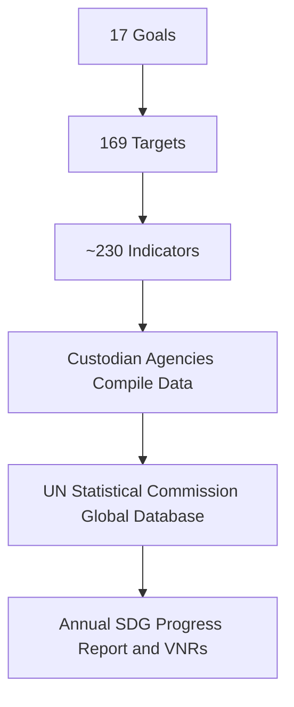
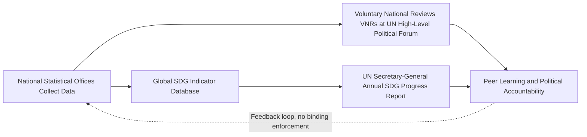

## Sustainable Development Goals and environmental targets

### Overview and Institutional Origin

The Sustainable Development Goals (SDGs) are a set of 17 global goals, comprising 169 targets and a broader indicator framework, adopted by United Nations member states in September 2015 as part of the 2030 Agenda for Sustainable Development. They succeeded the Millennium Development Goals (MDGs, 2000–2015) and are distinguished from their predecessor by universality (applying to all countries rather than only low- and middle-income countries), explicit integration of environmental sustainability alongside social and economic development objectives, and a more elaborate monitoring architecture built around a global indicator framework maintained by the UN Statistical Commission.

### Structural Architecture

**Key Points**

- **Goals (17)**: High-level aspirational statements (e.g., Goal 13, Climate Action)
- **Targets (169)**: Specific, more measurable sub-commitments nested under each goal, denoted numerically (e.g., Target 13.2) and alphabetically for means-of-implementation targets (e.g., Target 13.a)
- **Indicators (~230 unique indicators across the full framework)**: Statistical metrics tracking progress on each target, classified into Tiers I–III based on data availability and methodological maturity
- **Custodian agencies**: Each indicator is assigned to one or more UN or international agencies (e.g., FAO, UNEP, WHO) responsible for methodology and data compilation

### The Environmentally Focused Goals

While environmental sustainability threads through nearly all 17 goals, a core cluster is most directly environmental in focus:

**Key Points**

- **Goal 6 — Clean Water and Sanitation**: universal access to safe drinking water and sanitation, water quality, water-use efficiency, integrated water resources management, and protection of water-related ecosystems
- **Goal 7 — Affordable and Clean Energy**: universal access to modern energy services, substantially increased renewable energy share, and improved energy efficiency
- **Goal 11 — Sustainable Cities and Communities**: includes targets on air quality, municipal waste management, and disaster risk reduction
- **Goal 12 — Responsible Consumption and Production**: sustainable management of natural resources, substantial reduction in waste generation, and rationalization of inefficient fossil-fuel subsidies
- **Goal 13 — Climate Action**: strengthening resilience and adaptive capacity, integrating climate measures into national policy, and improving climate education and early-warning capacity (explicitly framed as complementary to, not a substitute for, the UNFCCC negotiation process)
- **Goal 14 — Life Below Water**: marine pollution reduction, sustainable fisheries management, protection of coastal and marine ecosystems, and addressing ocean acidification
- **Goal 15 — Life on Land**: halting deforestation, combating desertification and land degradation, halting biodiversity loss, and combating illegal wildlife trafficking

### Target Granularity: Illustrative Example

**Example**

Goal 13 (Climate Action) target structure:

| Target | Description |
| --- | --- |
| 13.1 | Strengthen resilience and adaptive capacity to climate-related hazards and natural disasters |
| 13.2 | Integrate climate change measures into national policies, strategies, and planning |
| 13.3 | Improve education, awareness-raising, and institutional capacity on climate mitigation, adaptation, and early warning |
| 13.a | Implement the developed-country commitment to jointly mobilize $100 billion annually by 2020 from all sources for developing-country needs (a financing commitment carried over from UNFCCC negotiations rather than newly created by the SDGs) |
| 13.b | Promote mechanisms for raising capacity for effective climate-related planning and management in least-developed countries and small island developing states |

### The Indicator Tier System

**Key Points**

- **Tier I**: Indicator is conceptually clear, has an internationally established methodology and standards, and data are regularly produced by countries
- **Tier II**: Indicator is conceptually clear and has an internationally established methodology, but data are not regularly produced by countries
- **Tier III**: No internationally established methodology or standards yet exist for the indicator (methodology under development or testing)
- **[Unverified]** The precise count of indicators in each tier changes over time as methodological work progresses (indicators are periodically reclassified upward as methodologies mature), so any specific tier count should be checked against the current UN Statistical Commission classification rather than treated as fixed.

Tier classification matters substantively for the environmental goals in particular: several environmental indicators (e.g., ecosystem extent accounting under Goal 15, certain marine health indicators under Goal 14) have historically been classified in Tier II or III due to underdeveloped national statistical capacity for environmental-economic accounting, in contrast to more established socioeconomic indicators (e.g., poverty headcount ratios) that are more often Tier I.

### Monitoring and Reporting Architecture

**Key Points**

- **Voluntary National Reviews (VNRs)**: Country-led, self-selected annual presentations of SDG progress at the UN High-Level Political Forum on Sustainable Development; participation and reporting depth vary substantially and reviews are not independently audited
- **Global Sustainable Development Report**: A periodic, independently authored scientific assessment (distinct from the Secretary-General's annual progress report) intended to strengthen the science-policy interface
- **No binding enforcement mechanism**: There is no compliance or sanction mechanism for missed SDG targets; the framework relies on political accountability, peer pressure, and voluntary national commitment

### Interlinkages and Trade-offs Among Environmental Targets

A substantial body of SDG-interactions literature analyzes how progress on one goal or target can reinforce or undermine progress on others, often formalized using an interaction typology (e.g., Nilsson et al.'s seven-point scale from "indivisible" to "cancelling").

**Key Points**

- **Synergies**: Renewable energy expansion (Goal 7) can simultaneously reduce air pollution health burdens (Goal 3) and greenhouse gas emissions (Goal 13); improved water resource management (Goal 6) can support agricultural productivity relevant to food security (Goal 2)
- **Trade-offs**: Poverty reduction and industrialization targets (Goals 1, 8, 9) have historically correlated with increased resource extraction and emissions, creating tension with Goals 12, 13, 14, and 15 absent decoupling; bioenergy expansion under Goal 7 can compete with land needed for food production (Goal 2) or biodiversity conservation (Goal 15)
- **[Inference]** The SDG framework itself does not resolve these trade-offs analytically or prioritize among conflicting targets; it is a political consensus document listing co-equal goals, and formal prioritization requires additional modeling or national policy judgment applied on top of the framework rather than derived from it.

### Formal Representation of an Interaction Score

Interaction between a pair of targets $i$ and $j$ can be represented on an ordinal interaction scale $s_{ij} \in \{-3, -2, -1, 0, +1, +2, +3\}$, where positive values denote synergy (progress on $i$ aids progress on $j$) and negative values denote trade-off (progress on $i$ hinders $j$), following the Nilsson et al. typology (+3 indivisible, +2 reinforcing, +1 enabling, 0 consistent, −1 constraining, −2 counteracting, −3 cancelling). A full SDG interaction matrix is:

$$S = [s_{ij}], \quad i,j \in \{1, 2, \dots, 17\}$$

**[Inference]** Because $S$ is context-dependent (interaction signs and magnitudes vary by country, sector, and implementation pathway), any single global interaction matrix is best treated as an illustrative synthesis rather than a universally valid empirical estimate.

### Financing the Environmental SDGs

**Key Points**

- **Estimated financing gap**: Multiple UN and multilateral development bank estimates place the aggregate annual SDG financing gap for developing countries in the low trillions of US dollars, with a substantial share attributable to climate and environmental infrastructure (clean energy, water/sanitation, resilient infrastructure); precise figures vary considerably by methodology and source and should be treated as order-of-magnitude estimates [Unverified]
- **Blended finance mechanisms**: Combining concessional public/philanthropic capital with private investment to de-risk environmental infrastructure projects in lower-income settings
- **Debt-for-nature and debt-for-climate swaps**: Restructuring sovereign debt in exchange for committed conservation or climate financing, used in a growing number of country cases
- **Domestic resource mobilization**: Fossil-fuel subsidy reform (directly referenced in Target 12.c) and environmental taxation as complementary domestic financing levers alongside international flows

### Relationship to the Paris Agreement and Other Environmental Treaties

The SDGs and the Paris Agreement (also adopted in 2015) are mutually reinforcing but institutionally and legally distinct instruments. The Paris Agreement operates under the UNFCCC with its own reporting architecture (Nationally Determined Contributions, the Enhanced Transparency Framework, and periodic Global Stocktakes), while Goal 13 explicitly defers primary responsibility for international climate policy coordination to the UNFCCC process rather than duplicating it. Similarly, Goal 15's biodiversity targets are complemented by the Kunming-Montreal Global Biodiversity Framework under the Convention on Biological Diversity, and Goal 14's ocean targets intersect with instruments such as the UN Convention on the Law of the Sea and the more recent High Seas (BBNJ) Treaty.

| Framework | Primary Legal Instrument | Relationship to SDGs |
| --- | --- | --- |
| Climate | UNFCCC / Paris Agreement | Goal 13 defers substantive climate policy coordination to this process |
| Biodiversity | Convention on Biological Diversity / Kunming-Montreal Framework | Complements and provides more detailed targets underlying Goal 15's biodiversity components |
| Oceans | UN Convention on the Law of the Sea / BBNJ Treaty | Complements Goal 14's marine governance targets |
| Desertification | UN Convention to Combat Desertification | Provides more detailed technical targets underlying Goal 15's land degradation neutrality target |

### Progress Assessment at the Midpoint and Beyond

**Key Points**

- **[Unverified]** UN Secretary-General progress reports issued around and after the 2023 SDG midpoint characterized progress on the environmental goals (particularly Goals 13, 14, and 15) as substantially off-track relative to 2030 targets, though the precise proportion of indicators assessed as off-track varies by report vintage and should be checked against the most current Global Sustainable Development Report or Secretary-General progress report rather than treated as a fixed figure.
- Compounding factors frequently cited in these assessments include the COVID-19 pandemic's fiscal and statistical-capacity disruption, rising sovereign debt burdens constraining fiscal space for environmental investment in lower-income countries, and geopolitical conflict diverting both financial resources and diplomatic attention.
- **[Inference]** The gap between target ambition and observed trajectory has generated debate over whether the SDG framework's non-binding, target-based design is adequate to drive the required pace of change, paralleling similar design debates in the climate policy literature over voluntary versus binding international commitments.

### Critiques of the SDG Framework

**Key Points**

- **Goal proliferation and internal inconsistency critique**: Critics argue 17 goals and 169 targets are too numerous and insufficiently prioritized to provide clear policy guidance, in contrast to the more limited eight-goal MDG framework.
- **Measurement and data-capacity critique**: Persistent Tier II/III classification of many environmental indicators reflects genuine national statistical capacity gaps, particularly in lower-income countries, limiting the framework's ability to track its own most consequential environmental targets.
- **Growth-compatibility critique**: Degrowth-aligned scholars argue the SDG framework's simultaneous pursuit of continued economic growth (Goal 8) and absolute environmental limits (Goals 12–15) embeds an unresolved tension analogous to the broader green growth versus degrowth debate, since the framework does not specify how growth and absolute decoupling are to be reconciled in practice.
- **Accountability and enforcement critique**: The absence of binding compliance mechanisms and reliance on self-selected Voluntary National Reviews is argued to weaken the framework's capacity to compel action where political will is lacking.

### Country-Level Implementation Tools

**Key Points**

- **National SDG indicator frameworks**: Many countries adapt the global indicator set to national statistical capacity and priorities, sometimes adding nationally relevant indicators
- **SDG budget tagging**: Public financial management reform tagging government budget lines to specific SDGs/targets to track fiscal alignment with SDG commitments
- **Integrated national financing frameworks (INFFs)**: A UN-promoted planning tool linking public and private financing strategy explicitly to SDG achievement, including environmental targets
- **Localization initiatives**: Efforts to translate global targets into subnational and municipal-level indicators and plans, particularly relevant to Goal 11's urban targets

### Practical Application: Evaluating a National Environmental Policy Against the SDG Framework

**Next Steps**

- Map the policy's stated objectives against the specific target numbers (not just goal-level headings) it is intended to advance, since target-level specificity is where the framework's analytical content resides
- Check the tier classification and data source of any indicator being used to claim progress, since Tier II/III indicators may reflect modeled estimates rather than direct measurement
- Identify plausible interaction effects (synergies or trade-offs) with adjacent targets, particularly across the growth-oriented (Goals 8–9) and environmental (Goals 12–15) target clusters
- Distinguish means-of-implementation targets (denoted with letters, e.g., 13.a) from substantive outcome targets, since financing and capacity-building commitments are frequently the least fulfilled component of the framework
- Cross-reference climate-related claims against the country's Nationally Determined Contribution under the Paris Agreement, since Goal 13 is explicitly designed to defer substantive climate commitments to that separate instrument rather than duplicate them

### Related Topics

- Millennium Development Goals and lessons for successor frameworks
- Paris Agreement architecture and Nationally Determined Contributions
- Green growth versus degrowth debates
- Environmental-economic accounting (System of Environmental-Economic Accounting, SEEA)
- Planetary boundaries framework
- SDG financing gap and blended finance mechanisms
- Kunming-Montreal Global Biodiversity Framework
- Voluntary National Reviews and SDG accountability design