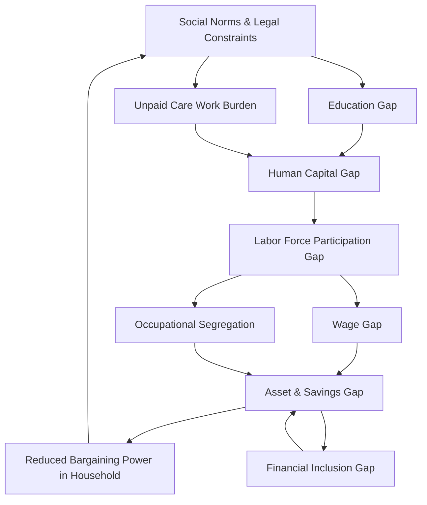

## Gender Gaps Across Economic Domains

### Overview

Gender gaps refer to systematic, measurable differences in economic outcomes, opportunities, and agency between men and women (and, in some frameworks, other gender identities) that are not explained by differences in productive capacity alone. In development economics, gender gaps are studied both as a manifestation of market failures and discrimination and as a constraint on aggregate growth, productivity, and poverty reduction. The World Bank, IMF, and UNDP frameworks typically decompose gender gaps into distinct but interlocking domains: labor markets, education, health, assets/finance, time use, and voice/agency.

### Conceptual Framework

**Key Points**

- Gender gaps are not a single metric but a multidimensional bundle of disparities that reinforce each other across the life cycle.
- Three broad theoretical lenses explain persistence: (1) **statistical discrimination** (employers use gender as a proxy for unobserved productivity), (2) **taste-based discrimination** (Becker, 1957 — direct preference against interacting with or hiring women), and (3) **structural/bargaining models** (intra-household resource allocation is not unitary; Sen's cooperative-conflict model and collective household models formalize this).
- The unitary household model (treating households as single utility-maximizing agents) is now widely rejected in the literature in favor of **collective models** (Chiappori, 1988) and **bargaining models** (McElroy and Horney, 1981), which allow gendered outcomes within households to depend on relative bargaining power (income, assets, outside options).
- Gaps compound intertemporally: an education gap in childhood becomes a human capital gap, which becomes a labor market gap, which becomes an asset and pension gap in old age.

### Domain 1: Labor Market Gaps

#### Labor Force Participation Rate (LFPR) Gap

The most cited aggregate indicator. Defined as:

$$LFPR_{gap} = LFPR_{male} - LFPR_{female}$$

[Unverified — figures shift with each ILO release cycle] As of recent ILO estimates, global female LFPR sits roughly 25 percentage points below male LFPR, with wide regional variance — the gap is narrow in parts of East Asia and Sub-Saharan Africa (where subsistence agriculture requires female labor) and very wide in South Asia and the Middle East and North Africa (MENA).

**Key Points**

- LFPR gaps often follow a **U-shaped curve** with respect to GDP per capita (Goldin, 1995): female LFPR is high in poor agrarian economies (subsistence necessity), falls during early industrialization (income effect, social stigma against factory/manual work, withdrawal into home production as household income rises), then rises again in high-income service economies (education gains, service-sector jobs, fertility decline).
- The **added worker effect** vs. **discouraged worker effect** explains cyclicality: women may enter the labor force during household income shocks (added worker) or exit during broader downturns if job search costs are gendered (discouraged worker).

#### Gender Wage Gap

Decomposed using the **Oaxaca-Blinder decomposition** (Oaxaca, 1973; Blinder, 1973), which splits the raw wage gap into an "explained" component (differences in observable characteristics like education, experience, sector) and an "unexplained" component (often interpreted as a proxy for discrimination, though it also absorbs unobserved productivity differences and selection):

$$\ln(W_m) - \ln(W_f) = \underbrace{(\bar{X}_m - \bar{X}_f)\hat{\beta}_m}_{\text{explained}} + \underbrace{\bar{X}_f(\hat{\beta}_m - \hat{\beta}_f)}_{\text{unexplained}}$$

Where $W_m$ and $W_f$ are male and female wages, $\bar{X}$ are mean characteristics, and $\hat{\beta}$ are estimated returns to those characteristics.

**Example**

A country-level study might find a raw wage gap of 20%, decomposing to 8 percentage points explained by education/experience differences and 12 percentage points unexplained. The unexplained residual is commonly (though imperfectly) interpreted as an upper-bound estimate of labor market discrimination.

- The **Heckman correction** (Heckman, 1979) is standard practice here: because only working women are observed earning wages, and labor force participation is itself non-random (selection on unobserved traits like motivation or family support), naive OLS wage comparisons suffer from **sample selection bias**. A two-step Heckman procedure or Mills ratio correction is used to address this in applied labor economics papers.

#### Occupational and Sectoral Segregation

Measured via the **Duncan Dissimilarity Index**:

$$D = \frac{1}{2}\sum_{i=1}^{n} \left| \frac{M_i}{M} - \frac{F_i}{F} \right|$$

Where $M_i$ and $F_i$ are the number of men and women in occupation $i$, and $M$, $F$ are total male and female employment. $D$ ranges from 0 (no segregation) to 1 (complete segregation) and is interpreted as the share of either sex that would need to change occupations to achieve an even distribution.

- **Horizontal segregation**: concentration of women in specific sectors (care work, education, textiles, informal retail).
- **Vertical segregation**: the "glass ceiling" — under-representation of women in management and leadership even within female-dominated sectors, often measured via the **glass ceiling index** or share of women in top income quintile relative to overall female employment share.

#### Informality Gap

Women are disproportionately represented in informal employment in many developing economies, particularly in South Asia and Sub-Saharan Africa, which correlates with lower social protection coverage, no minimum wage enforcement, and greater income volatility. This is closely tied to **home-based work** and **own-account work** in household enterprises, which blurs the line between labor supply and unpaid family labor.

### Domain 2: Education Gaps

**Key Points**

- The **Gender Parity Index (GPI)** in education is defined as the ratio of female to male enrollment/completion rates: $GPI = \frac{Enrollment_f}{Enrollment_m}$. A GPI of 1 indicates parity; values below 1 favor males, above 1 favor females.
- Primary education gender gaps have narrowed substantially worldwide (many countries now show GPI near or above 1 at primary level), but gaps re-emerge or widen at secondary and tertiary levels in many low-income contexts, often driven by early marriage, safety concerns (distance to school), menstrual hygiene management barriers, and opportunity cost of girls' time in household labor.
- **Reverse gender gaps** exist in tertiary education in a growing number of middle- and high-income countries, where female enrollment now exceeds male enrollment — this does not eliminate the labor market gap, illustrating that education gains do not mechanically translate into economic parity ("the leaky pipeline").
- Field-of-study segregation persists even where enrollment parity is achieved: women remain under-represented in STEM fields in most countries, a gap often attributed to a mix of stereotype threat, teacher bias, and self-selection under social norms.

### Domain 3: Health Gaps

- **Missing women phenomenon** (Sen, 1990): using sex ratios at birth and excess female mortality, Sen estimated over 100 million "missing women" globally due to sex-selective abortion, female infanticide, and neglect in resource allocation (food, healthcare) within households — concentrated historically in South and East Asia.
- Natural sex ratio at birth is approximately 105 male births per 100 female births; ratios significantly above this (e.g., 110–120 in some regions) are used as a proxy for sex selection.
- Maternal mortality ratio (MMR) gaps reflect underinvestment in reproductive health infrastructure and are among the starkest health-domain gender gaps in low-income countries.
- Nutritional gaps: in some contexts, girls receive less food and later/less healthcare access than boys within the same household (intra-household allocation bias), detectable via anthropometric data (stunting, wasting differentials by sex).

### Domain 4: Asset, Land, and Financial Inclusion Gaps

**Key Points**

- **Land tenure gap**: women own or control a small share of agricultural land titles in most developing countries, despite being a substantial share of the agricultural labor force — a gap driven by inheritance law, customary tenure systems, and registration practices that default to male household heads.
- **Financial inclusion gap**: measured via account ownership at a formal financial institution (Global Findex data, World Bank). [Unverified — exact percentage-point gap varies by survey wave] Women in developing economies remain less likely than men to hold a formal bank account, with the gap widest in MENA and South Asia.
- **Credit access gap**: even where women have accounts, access to credit is constrained by lack of collateral (linked back to the land gap), thinner credit histories, and lender bias — a self-reinforcing cycle sometimes called the "collateral trap."
- **Mobile money** has been documented in specific randomized studies (e.g., Suri and Jack, 2016, on M-Pesa in Kenya) as a channel that can narrow financial inclusion gaps by lowering transaction costs and increasing women's control over savings, though effects are context-dependent and should not be generalized as universal.

### Domain 5: Time Use and Unpaid Care Work Gap

This is frequently cited as the most under-measured and foundational gap, because it constrains capacity to participate in every other domain.

- Measured via **time-use surveys**, decomposing daily hours into paid work, unpaid care/domestic work, and leisure.
- [Unverified — varies significantly by country and survey] Women globally perform several times more unpaid care and domestic work than men on average, a gap that is largest in South Asia and MENA and smallest in Nordic countries.
- The **"triple burden"** or **"double shift"** concept describes women in paid employment who return home to a full second shift of unpaid domestic labor, resulting in longer total working days than men.
- The **5 R's framework** (UN Women / ILO) for addressing unpaid care work: **Recognize, Reduce, Redistribute, Reward, Represent** — used as a policy design checklist in national gender strategies.

### Domain 6: Voice, Agency, and Political Representation

- Measured via share of parliamentary seats held by women, share of women in ministerial positions, and female representation in local governance bodies.
- **Quota policies** (reserved seats, candidate quotas) are a widely studied policy intervention; Chattopadhyay and Duflo (2004) is a canonical study using randomized reservation of Indian village council (panchayat) leadership positions to show causal effects of female leadership on public goods provision priorities.
- Agency also encompasses intra-household decision-making power over large purchases, healthcare, children's schooling, and mobility (freedom to travel independently) — commonly captured in Demographic and Health Survey (DHS) modules.

### Composite Indices Used in Practice

| Index | Publisher | Domains Covered |
| --- | --- | --- |
| Gender Development Index (GDI) | UNDP | Life expectancy, education, income (compares HDI by sex) |
| Gender Inequality Index (GII) | UNDP | Reproductive health, empowerment, labor market |
| Global Gender Gap Index | World Economic Forum | Economic participation, education, health, political empowerment |
| Women, Business and the Law Index | World Bank | Legal gender gaps across 8 indicators (mobility, workplace, pay, marriage, parenthood, entrepreneurship, assets, pension) |

**Key Points**

- These indices differ in whether they measure **outcomes** (GDI, GII) versus **opportunities/legal frameworks** (Women, Business and the Law) — a country can score well on legal equality while outcome gaps persist due to enforcement gaps or social norms, so the two types of indices should be read together, not interchangeably.

### Causal Mechanisms Diagram

The diagram above illustrates the **reinforcing feedback loop** structure that development economists emphasize: gender gaps are rarely addressed by intervening in a single domain, because the domains causally feed back into one another (this is why "one-off" interventions like a single cash transfer often show limited persistence without complementary interventions in norms, childcare, or legal reform).

### Policy Interventions and Evidence Base

**Key Points**

- **Conditional Cash Transfers (CCTs)** tied to girls' school enrollment (e.g., Bangladesh's Female Secondary School Stipend Program) — documented to raise female secondary enrollment, though effects on downstream labor market outcomes are more mixed and context-dependent.
- **Childcare provision** interventions reduce the time-use constraint directly and have been studied via RCTs showing increases in maternal labor supply in specific contexts.
- **Legal reform** (removing restrictions on women's ability to open bank accounts, sign contracts, or work in certain sectors without spousal permission) is tracked systematically by the World Bank's Women, Business and the Law project.
- **Information and norm-shifting interventions** (edutainment, role model exposure) — e.g., studies using television soap operas or exposure to female leaders (building on the Chattopadhyay and Duflo panchayat design) to shift aspirations and norms.
- [Speculation] Interventions that simultaneously target multiple domains (a "cash plus" or multi-component design bundling asset transfer, skills training, and mentorship) are increasingly favored in the literature as more likely to produce durable gap closure than single-domain interventions, though the evidence base on optimal bundling is still developing.

### Measurement Challenges

- **Household survey bias**: many surveys interview only a "household head" (disproportionately male), undercounting women's economic contributions, particularly unpaid and informal work.
- **Recall bias** in time-use data collected via interview rather than diary methods.
- **Definitional inconsistency** in "labor force participation" across countries regarding subsistence agriculture and unpaid family work, which can mechanically inflate or deflate measured LFPR gaps depending on classification choices.
- Sex-disaggregated data remains unavailable or low-quality in many national statistical systems, a constraint the UN Statistics Division's Minimum Set of Gender Indicators was designed to address.

**Related Topics**

- Intra-household bargaining models (collective vs. unitary household models)
- Missing women and sex ratio economics
- Conditional cash transfer program design and evaluation
- Time-use survey methodology
- Care economy and childcare policy
- Legal gender gap reform (Women, Business and the Law)
- Randomized controlled trials in gender and development (Duflo, Banerjee methodology)
- Female labor force participation and the U-shaped hypothesis
- Land tenure reform and women's property rights
- Financial inclusion and mobile money