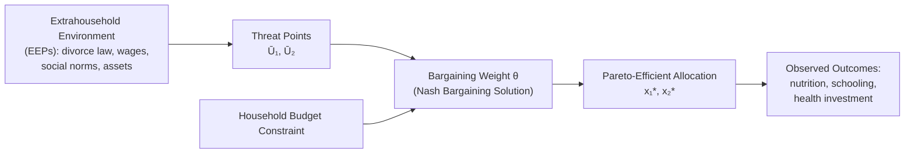

## Intrahousehold Bargaining Models

### Overview

Intrahousehold bargaining models are a class of economic frameworks that replace the "unitary household" assumption with a representation of the household as a collection of individuals — typically spouses — who have distinct preferences and bargain over the allocation of resources, consumption, labor supply, and time. These models emerged in development economics and household economics to explain empirical patterns that unitary models cannot: namely, that *who* controls income within a household affects *how* it is spent, a violation of the income-pooling hypothesis implied by unitary utility maximization.

In development economics specifically, intrahousehold bargaining models are central to understanding gender gaps in nutrition, education, health investment, and labor supply, and they underpin the design of many targeted transfer programs (e.g., conditional cash transfers paid to mothers).

### The Unitary Model and Its Failure

#### The Unitary Household Assumption

The classical (Samuelson-Becker) unitary model treats the household as if it maximizes a single utility function subject to a pooled budget constraint:

$$\max_{x_1, x_2} U(x_1, x_2) \quad \text{s.t.} \quad p_1 x_1 + p_2 x_2 = y_1 + y_2$$

where $y_1$ and $y_2$ are the incomes of household members 1 and 2. A key testable implication is the **income-pooling hypothesis**: only *total* household income $y_1 + y_2$ matters for allocation outcomes — the *distribution* of income between members should have no independent effect.

#### Empirical Rejection of Income Pooling

A large empirical literature — much of it grounded in developing-country data — rejects income pooling:

- **Thomas (1990)**, using Brazilian data, found that unearned income in the mother's hands had a substantially larger positive effect on child survival probability and anthropometric outcomes than the same income in the father's hands. [Inference: exact magnitude comparisons vary by study and specification, but the qualitative directional finding is a canonical, frequently replicated result]
- **Duflo (2003)**, studying South Africa's Old Age Pension program, found that pensions received by grandmothers improved granddaughters' anthropometric status, with no comparable effect from pensions received by grandfathers.
- **Lundberg, Pollak, and Wales (1997)** exploited a UK policy change that shifted a child benefit payment from fathers to mothers ("wallet to purse"), finding a subsequent shift in expenditure toward women's and children's clothing.

These findings motivated the shift toward bargaining-based models, in which control over resources — not just their sum — determines outcomes.

### Cooperative Bargaining Models

Cooperative models assume the household reaches a **Pareto-efficient** allocation, but the *specific* point on the Pareto frontier is determined by a bargaining process shaped by each member's relative power.

#### The Nash Bargaining Model (Manser-Brown, McElroy-Horney)

The most widely used cooperative framework applies the **Nash bargaining solution** to household allocation. Each spouse $i$ has a utility function $U_i(x_1, x_2, \ldots)$ and a **threat point** or **reservation utility** $\bar{U}_i$ — the utility they would obtain if the bargain failed (e.g., through divorce, separation, or non-cooperation).

The household chooses the allocation that solves:

$$\max_{x} \left[ U_1(x) - \bar{U}_1 \right]^{\theta} \left[ U_2(x) - \bar{U}_2 \right]^{1-\theta}$$

subject to the joint budget constraint, where $\theta \in [0,1]$ is a bargaining-power weight.

**Key structural features:**

- **Efficiency**: The solution lies on the Pareto frontier of the two utility functions.
- **Threat points determine leverage**: Anything that raises a spouse's utility in the *no-agreement* state — a higher outside wage, stronger legal divorce rights, more secure property rights, natal family support — raises that spouse's bargaining power and shifts the allocation in their favor, even holding total household resources fixed.
- **Distribution factors**: Variables that affect bargaining power without directly entering either utility function or the budget constraint (e.g., the sex ratio in the local marriage market, divorce law regime, relative wealth brought into marriage) are called **distribution factors**. Their presence and independent effect on allocation outcomes is itself a testable prediction that separates bargaining models from the unitary model.

#### Two Variants of the Threat Point

**1. Divorce-Threat Bargaining (McElroy and Horney, 1981)**

The threat point is each spouse's utility in the event of divorce — determined by external factors such as remarriage prospects, alimony law, child custody rules, and division of marital assets. This variant links intrahousehold allocation directly to the "extrahousehold environment," denoted EEPs (extrahousehold environmental parameters).

**2. Separate-Spheres / Non-Cooperative Threat Point (Lundberg and Pollak, 1993)**

Rather than divorce, the threat point is a *non-cooperative equilibrium within an ongoing marriage* — a "separate spheres" allocation in which each spouse independently provides certain public goods (e.g., the husband customarily pays for housing, the wife for food) without formal cooperation. This variant does not require the marriage to dissolve to generate a meaningful threat point, and it implies that gender norms about who is "expected" to provide which goods matter for outcomes — an insight of particular relevance for developing-country contexts where formal divorce is often difficult, costly, or socially unavailable, and where norm-based separate spheres are common.

#### Formal Comparative Statics

Consider a simple two-good, one-private-good-per-spouse model. If $\bar{U}_1$ increases (spouse 1's bargaining power rises), then under the Nash solution:

$$\frac{\partial x_1}{\partial \bar{U}_1} > 0 \quad \text{(spouse 1's consumption share rises)}$$

$$\frac{\partial U_2}{\partial \bar{U}_1} < 0 \quad \text{(spouse 2 is worse off, though still no worse than their own threat point)}$$

This yields the central empirically testable prediction: **shifting non-labor income, assets, or legal entitlements toward one spouse should shift consumption patterns toward goods that spouse values**, even with total household income held constant.

### Collective Household Models (Chiappori)

**Chiappori (1988, 1992)** generalized bargaining models into the **collective model**, which requires only Pareto efficiency — not a specific bargaining protocol like Nash bargaining — making it more general and more directly testable with standard household survey data.

#### Structure

The collective model represents household behavior as if generated by a two-stage process:

**Stage 1 — Sharing Rule:** Household income $y$ is (implicitly) divided between spouses according to a **sharing rule** $\phi(y, p, z)$, where $z$ is a vector of distribution factors. Spouse 1 receives $\phi$ and spouse 2 receives $y - \phi$.

**Stage 2 — Individual Optimization:** Each spouse then behaves as an individual utility maximizer subject to their own share of resources:

$$\max_{x_i} U_i(x_i) \quad \text{s.t.} \quad p \cdot x_i = \phi_i$$

#### Testable Restrictions

The collective model generates a set of restrictions on demand functions analogous to (but generalizing) the **Slutsky symmetry** conditions from single-agent consumer theory. Specifically, it implies that the effects of distribution factors on demand must satisfy a **proportionality/rank condition**: the matrix of cross-derivatives of demand with respect to different distribution factors must have rank 1 (in the two-person case), because all distribution factors operate *only* through their effect on the single scalar sharing rule $\phi$.

This is a much sharper and more falsifiable prediction than the qualitative "distribution factors matter" prediction of the general Nash bargaining framework, and it has been tested in numerous datasets (e.g., Thomas, Contreras, and Frankenberg's work on Indonesian household data; Rangel's work using Brazilian inheritance-law variation).

#### Identifying the Sharing Rule

Because $\phi$ is not directly observed, identification relies on:

- Goods that are **exclusively or predominantly consumed by one spouse** (e.g., women's or men's clothing) — used as "assignable goods" to back out relative shares.
- **Labor supply functions**, where each spouse's leisure/labor choice reveals information about their effective share of resources.

### Non-Cooperative (Nash Equilibrium) Models

An alternative to cooperative models drops the Pareto-efficiency assumption altogether. Motivated by empirical findings that many real households appear **not** to reach efficient allocations, non-cooperative models (e.g., **Woolley, 1988**; **Konrad and Lommerud, 1995**; **Lundberg and Pollak, 1994** in some specifications) model spouses as independently choosing contributions to household public goods (e.g., child welfare, food) in a static or dynamic Nash equilibrium, with no binding agreement or transferable side-payments.

**Key features:**

- **Inefficiency is possible.** Because contributions to public goods create free-riding incentives (each spouse discounts the benefit accruing to the other), the equilibrium level of public-good provision can be **Pareto-suboptimal** — a private information or coordination failure the cooperative model rules out by assumption.
- **Voluntary contribution game**: A canonical setup has both spouses simultaneously choosing contributions $g_1, g_2$ to a household public good $G = g_1 + g_2$, each maximizing:

$$U_i(x_i, G) \quad \text{s.t.} \quad p x_i + g_i = y_i$$

The **income pooling failure** re-emerges naturally here: since each spouse's contribution depends on their *own* income $y_i$ (not the pooled total), a redistribution of income between spouses that leaves the sum unchanged generically changes the equilibrium value of $G$ — again contradicting the unitary model.

- **Empirical relevance to developing countries**: Non-cooperative models have been argued to be particularly applicable in settings with limited contract enforceability, weak legal systems, high costs of divorce/separation, or where social norms prevent open bargaining — conditions common across many developing-country contexts, though the degree of applicability is context-specific. [Inference: the relative empirical support for cooperative vs. non-cooperative models is mixed and setting-dependent, not settled in favor of either].

### Applications in Development Economics

#### Conditional Cash Transfers (CCTs) and "Mother-Targeting"

A major applied consequence of bargaining models is program design: many CCT programs (e.g., **Progresa/Oportunidades** in Mexico, **Bolsa Família** in Brazil) deliberately disburse payments to mothers rather than fathers, based on the empirical prior — grounded in bargaining theory and the Thomas/Duflo-type findings — that resources controlled by women are more likely to be spent on child health, nutrition, and education.

#### Land and Asset Ownership

Bargaining models explain why titling land or other productive assets in women's names (rather than only men's) can shift household investment and consumption patterns — because asset ownership raises a wife's threat-point utility (higher separation payoff) and/or her bargaining weight $\theta$, independent of total household wealth. This has motivated joint-titling reforms and women's land rights programs in numerous countries.

#### Labor Market Participation and Bargaining Power

Access to independent wage employment is frequently modeled as raising $\bar{U}_2$ (a wife's threat point) by improving her outside option, which the model predicts should shift household allocations toward her preferences. Studies of export-manufacturing job growth (e.g., garment-sector employment for women in Bangladesh) are often interpreted through this lens, showing shifts in women's say over spending, timing of marriage, and fertility decisions. [Inference: causal identification in this literature is often contested due to selection into employment, though several studies use plausibly exogenous factory-siting or trade-shock variation]

#### Sex Ratios and Marriage Markets

Regional or cohort variation in sex ratios has been used as an exogenous **distribution factor**: a relative scarcity of women in a marriage market is predicted to raise women's bargaining power upon marriage (better outside options in the marriage market), a channel studied using China's skewed sex ratios and historical sex-ratio variation elsewhere.

### Empirical Testing Strategies

| Strategy | Logic | Example Data/Setting |
| --- | --- | --- |
| Income-source decomposition | Test whether unearned income by *recipient* (not just total) predicts outcomes | Thomas (1990), Brazil |
| Policy-induced payment shifts | Exploit exogenous shift of a transfer from one spouse to another | Lundberg-Pollak-Wales (1997), UK child benefit |
| Distribution-factor proportionality (rank tests) | Test the collective model's rank-1 restriction on distribution-factor effects | Rangel (2006), Brazilian inheritance law |
| Assignable-goods method | Use spouse-specific goods to back out the sharing rule | Bourguignon, Browning, Chiappori, Lechene (1993) |
| Natural experiments in asset transfer | Exploit exogenous asset/pension receipt by one spouse | Duflo (2003), South African pensions |

### Diagram: Nash Bargaining Frontier and Threat Point

### Visualizing the Bargaining Frontier (svg_diagram)

<svg xmlns="http://www.w3.org/2000/svg" viewBox="0 0 520 420">
<text x="260" y="25" text-anchor="middle" font-size="16" font-weight="bold" fill="#1a1a1a">Nash Bargaining Solution (svg_diagram)</text>
<line x1="60" y1="360" x2="60" y2="50" stroke="#333" stroke-width="2" />
<line x1="60" y1="360" x2="480" y2="360" stroke="#333" stroke-width="2" />
<text x="30" y="60" font-size="13" fill="#333">U₂</text>
<text x="470" y="380" font-size="13" fill="#333">U₁</text>
<path d="M 90 340 Q 150 120 400 90" fill="none" stroke="#2563eb" stroke-width="3" />
<text x="330" y="80" font-size="12" fill="#2563eb">Pareto Frontier</text>
<circle cx="180" cy="290" r="5" fill="#dc2626" />
<text x="188" y="295" font-size="12" fill="#dc2626">Threat Point (Ū₁, Ū₂)</text>
<line x1="180" y1="290" x2="180" y2="360" stroke="#dc2626" stroke-width="1" stroke-dasharray="4" />
<line x1="180" y1="290" x2="60" y2="290" stroke="#dc2626" stroke-width="1" stroke-dasharray="4" />
<circle cx="280" cy="170" r="6" fill="#16a34a" />
<text x="290" y="165" font-size="12" fill="#16a34a">Nash Bargaining Solution (θ high)</text>
<line x1="180" y1="290" x2="280" y2="170" stroke="#16a34a" stroke-width="2" stroke-dasharray="2" />
<circle cx="230" cy="240" r="4" fill="#9333ea" opacity="0.6" />
<text x="200" y="255" font-size="11" fill="#9333ea">Alternative solution (θ low)</text>

<text x="60" y="400" font-size="11" fill="#555">Higher θ (bargaining weight for spouse 1) moves the solution along the frontier toward spouse 1's preferred point.</text>

</svg>

### Key Points

- The unitary model's income-pooling hypothesis is robustly rejected in empirical development economics data; *who* controls income affects household allocation.
- Cooperative bargaining models (Nash bargaining, collective model) assume Pareto efficiency but allow the *distribution* of welfare to depend on bargaining power, driven by threat points and distribution factors.
- The collective model (Chiappori) generates sharper, falsifiable restrictions (the rank-1 proportionality condition on distribution factors) than a generic bargaining framework.
- Non-cooperative models drop efficiency and can generate genuine welfare losses from within-household free-riding, which may better fit settings with weak contract enforcement or divorce constraints.
- Applied development policy (CCT payment targeting, land titling, sex-ratio and labor-market research) draws directly on these models' comparative statics.

### Related Topics

- Collective household models and the sharing rule (formal identification techniques)
- Assignable goods and Engel-curve methods for estimating intrahousehold resource shares
- Conditional cash transfers and gender-targeted program design
- Land rights, joint titling, and women's asset ownership
- Non-cooperative household models and public goods under-provision
- Marriage markets, sex ratios, and search-theoretic models of marriage formation
- Divorce law reform and its effects on household bargaining power
- Missing women, sex-selective outcomes, and the "Sen bargaining power" hypothesis
- Fertility decisions as a bargained outcome
- Time-use surveys as empirical tools for intrahousehold analysis