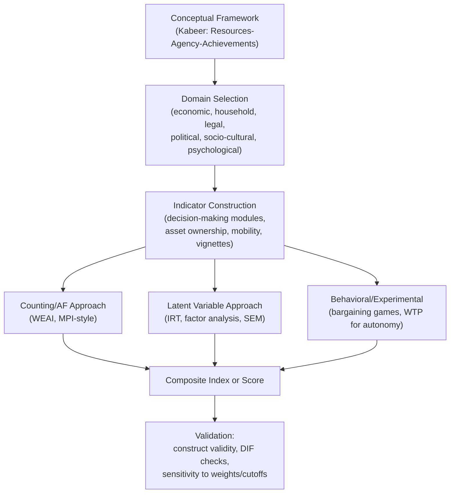

## Women's Empowerment Measurement

### Overview

Women's empowerment measurement is the methodological subfield concerned with operationalizing, quantifying, and validating "empowerment" as an economic and social construct — a process by which women gain the ability to make strategic life choices in contexts where that ability was previously denied them. The measurement challenge is central to development economics because empowerment is inherently **multidimensional**, **context-dependent**, and **not directly observable**, requiring proxy indicators, composite indices, or survey-elicited constructs whose validity must be established rather than assumed.

The literature draws heavily on **Kabeer's (1999)** foundational framework, which decomposes empowerment into three interrelated components: **resources** (access/future claims to material, human, and social resources), **agency** (the process of decision-making, negotiation, and meaning-making), and **achievements** (outcomes). Measurement approaches generally target one or more of these components, and a persistent methodological concern is that many indicators capture *resources* or *achievements* far more easily than they capture *agency* itself.

### Conceptual Foundations

#### Kabeer's Resources-Agency-Achievements Framework

$$\text{Empowerment} = f(\text{Resources}, \text{Agency}, \text{Achievements})$$

- **Resources**: Pre-conditions for empowerment — assets, education, income, social capital, human capital.
- **Agency**: The *process* dimension — the ability to define goals and act on them; includes decision-making power, negotiation, resistance, and voice. This is the component most measurement instruments struggle to capture directly, since it is a latent process rather than an observable stock or flow.
- **Achievements**: Realized outcomes — e.g., improved welfare of self or children, completed schooling, political participation.

A key methodological point: an outcome (e.g., a woman working outside the home) is not itself proof of empowerment unless it reflects the exercise of agency (choice) rather than compulsion or lack of alternatives — the "achievement" must be traced back to an agency process to be interpreted as empowerment rather than mere circumstance.

#### Domains of Empowerment

Standard taxonomies (following **Malhotra, Schuler, and Boender, 2002**, among others) decompose empowerment into domains, each requiring separate indicators:

| Domain | Example Indicators |
| --- | --- |
| Economic | Control over income, asset ownership, access to credit, labor force participation |
| Household/domestic | Decision-making over household purchases, health care, children's schooling |
| Legal | Knowledge of legal rights, inheritance rights, ability to seek legal redress |
| Political | Voting, participation in local governance, political knowledge |
| Socio-cultural | Mobility (freedom of movement), freedom from violence, social network breadth |
| Psychological | Self-efficacy, self-esteem, aspirations |

[Inference: Different studies use different domain taxonomies; there is no single canonical list, and the choice of domains materially affects composite index results]

### Measurement Approaches

#### 1. Decision-Making Indices

The most widely used survey-based proxy for agency asks respondents (typically ever-married women) who makes decisions across a set of household domains — e.g., large household purchases, daily purchases, healthcare, visits to family, children's education. Responses are usually coded as:

- Respondent alone
- Respondent jointly with spouse
- Spouse alone
- Other household member

A common summary index constructs the **share of decisions in which the respondent has sole or joint say**:

$$\text{DM Index}_i = \frac{1}{K} \sum_{k=1}^{K} \mathbb{1}[\text{respondent } i \text{ has sole or joint decision power over domain } k]$$

**Critiques**:

- Sole vs. joint decision-making are often collapsed into one category, obscuring meaningful differences in bargaining power.
- Responses are subject to **social desirability bias** and can vary depending on who else is present during the interview.
- Cross-country and cross-cultural comparability is weak — "joint decision-making" may signal empowerment in one context and *lack* of autonomy (norm-driven consultation obligations) in another. [Inference: the direction and magnitude of this bias is context-specific and not resolvable by survey design alone]

#### 2. Asset-Based and Resource Indicators

Includes:

- Land, housing, and livestock ownership (individual vs. joint vs. spousal titling)
- Access to and control over credit/savings accounts
- Educational attainment relative to spouse

These are more objectively measurable than agency but are **resources**, not empowerment itself, in Kabeer's terms — they proxy the *precondition* rather than the *process*.

#### 3. Composite/Multidimensional Indices

**Women's Empowerment in Agriculture Index (WEAI)** — developed by IFPRI, USAID, and OPHI (2012), is the most widely adopted composite index in agricultural development contexts. It measures empowerment across **five domains** (the "5DE"):

1. Decisions about agricultural production
2. Access to and decision-making power over productive resources
3. Control over use of income
4. Leadership in the community
5. Time allocation (including workload)

Plus a sixth **Gender Parity Index (GPI)** comparing the empowerment score of the primary female decision-maker to the primary male decision-maker in the same household.

**Aggregation formula (Alkire-Foster method):**

The WEAI uses the **Alkire-Foster (AF) counting methodology** — the same underlying methodology as the Multidimensional Poverty Index (MPI). A respondent is defined as "empowered" if she is **adequate** (not deprived) in at least $k$ out of the weighted indicators. The censored deprivation score for individual $i$ is:

$$c_i(k) = \begin{cases} c_i & \text{if } c_i \geq k \\ 0 & \text{if } c_i < k \end{cases}$$

where $c_i = \sum_{j} w_j \cdot \mathbb{1}[\text{deprived in indicator } j]$, and $w_j$ are indicator weights summing to 1 within each domain (domains are typically equally weighted at 20% each for the five domains).

The overall **5DE score** for the population is:

$$\text{5DE} = 1 - \left( \frac{1}{n} \sum_{i} c_i(k) \right)$$

The **abbreviated WEAI (A-WEAI)** is a shorter, lower-respondent-burden version used for rapid or programmatic monitoring, dropping some sub-indicators while preserving the five-domain structure. The **pro-WEAI** (project-level WEAI) extends this for evaluating specific development interventions.

#### 4. Latent Variable / Psychometric Approaches

Because agency is a **latent construct**, some measurement strategies apply psychometric and latent-variable techniques directly:

- **Item Response Theory (IRT)** models empowerment as a latent trait $\theta_i$ underlying observed binary/ordinal survey responses, allowing for item difficulty and discrimination parameters rather than simple additive scoring.
- **Factor analysis / principal components analysis (PCA)** is used to construct empowerment indices from correlated indicator sets (e.g., reducing dozens of decision-making and mobility items into a smaller number of latent factors), often as an alternative or complement to the Alkire-Foster counting approach.
- **Structural equation modeling (SEM)** is used to test whether hypothesized domains (economic, social, psychological) load onto a single higher-order empowerment factor or represent genuinely distinct constructs — evidence in the literature is mixed, supporting the view that empowerment is not unidimensional. [Inference: this remains a live methodological debate rather than a settled result]

#### 5. Vignette and Anchoring Vignette Methods

To address cross-cultural incomparability of self-reported agency (e.g., two women with identical objective circumstances rating their own decision-making power differently due to differing reference norms), **anchoring vignettes** present respondents with hypothetical scenarios describing a third party's situation and ask them to rate that third party's empowerment level. This provides a common reference point to rescale self-reports, correcting for **differential item functioning (DIF)** across cultural or social groups.

#### 6. Experimental and Behavioral Measures

To avoid the self-report and social-desirability biases inherent in survey-based agency measures, some studies use **incentivized behavioral games**:

- **Dictator games / bargaining games** played between spouses to reveal control over resource allocation.
- **Willingness-to-pay for autonomy** experiments, in which women's revealed preference to keep a decision private from their spouse is used as a behavioral empowerment proxy (e.g., studies eliciting how much women will pay to receive information privately rather than jointly with their husband).
- **Lab-in-the-field experiments** measuring risk and time preferences separately for spouses, then examining how elicited household decisions map onto individual preferences versus a bargained compromise.

### Common Measurement Challenges

#### Endogeneity and Reverse Causality

Empowerment indicators (e.g., asset ownership, decision-making) are frequently *both* determinants and consequences of the outcomes they are used to explain (e.g., child health), creating simultaneity bias in regressions of the form:

$$Y_i = \beta \cdot \text{Empowerment}_i + X_i' \gamma + \varepsilon_i$$

where $\text{Empowerment}_i$ is plausibly correlated with $\varepsilon_i$ through unobserved household characteristics (ability, preferences for children's welfare) — a standard identification problem addressed via instrumental variables, panel fixed effects, or experimental variation (e.g., randomized asset transfers).

#### Respondent Selection and Intrahousehold Reporting Discrepancies

Studies that interview both spouses separately consistently find **discordant reports** — husbands and wives frequently disagree about who makes which decisions, and the discrepancy itself is informative but complicates the construction of a single "true" measure. Some studies use both reports and treat the gap as a measurement-error-corrected estimate via measurement models; others treat the female respondent's report as the primary construct of interest on the grounds that self-assessed agency is the object being measured.

#### Aggregation and Weighting Choices

Composite indices require domain and indicator weights, cutoffs $k$ for the counting approach, and functional forms for combining domains — all of which are analyst choices that can materially shift rankings across countries, regions, or time. Sensitivity analysis (varying $k$ and weights) is a standard robustness check in the applied literature.

#### Context (Cultural) Non-Invariance

An indicator that captures empowerment in one setting (e.g., paid employment outside the home in a context where this is unusual and socially costly for women to pursue) may not capture the same underlying construct in another setting (e.g., where female employment is the norm), undermining direct cross-country comparability of raw indicator values without careful contextualization.

### Diagram: Measurement Pipeline

### Illustrating the WEAI Domain Structure (svg_diagram)

<svg xmlns="http://www.w3.org/2000/svg" viewBox="0 0 560 340">
<text x="280" y="25" text-anchor="middle" font-size="16" font-weight="bold" fill="#1a1a1a">WEAI Five Domains of Empowerment (svg_diagram)</text>
<circle cx="280" cy="180" r="60" fill="#eff6ff" stroke="#2563eb" stroke-width="2" />
<text x="280" y="176" text-anchor="middle" font-size="12" font-weight="bold" fill="#1e3a8a">5DE Score</text>
<text x="280" y="192" text-anchor="middle" font-size="10" fill="#1e3a8a">(Alkire-Foster</text>
<text x="280" y="204" text-anchor="middle" font-size="10" fill="#1e3a8a">counting method)</text>
<rect x="30" y="60" width="150" height="45" rx="6" fill="#fef3c7" stroke="#d97706" />
<text x="105" y="87" text-anchor="middle" font-size="11">1. Production Decisions</text>
<line x1="180" y1="82" x2="225" y2="150" stroke="#999" />
<rect x="30" y="240" width="150" height="45" rx="6" fill="#dcfce7" stroke="#16a34a" />
<text x="105" y="267" text-anchor="middle" font-size="11">2. Resource Access/Control</text>
<line x1="180" y1="262" x2="225" y2="205" stroke="#999" />
<rect x="380" y="60" width="150" height="45" rx="6" fill="#fce7f3" stroke="#db2777" />
<text x="455" y="87" text-anchor="middle" font-size="11">3. Control Over Income</text>
<line x1="380" y1="82" x2="335" y2="150" stroke="#999" />
<rect x="380" y="240" width="150" height="45" rx="6" fill="#ede9fe" stroke="#7c3aed" />
<text x="455" y="267" text-anchor="middle" font-size="11">4. Community Leadership</text>
<line x1="380" y1="262" x2="335" y2="205" stroke="#999" />
<rect x="200" y="10" width="160" height="35" rx="6" fill="#fee2e2" stroke="#dc2626" />
<text x="280" y="32" text-anchor="middle" font-size="11">5. Time Allocation / Workload</text>
<line x1="280" y1="45" x2="280" y2="120" stroke="#999" />
</svg>

### Key Points

- Empowerment measurement operationalizes Kabeer's Resources-Agency-Achievements framework, but *agency* — the core process dimension — is the hardest component to capture directly.
- The dominant applied index in agricultural development contexts is the WEAI, built on the Alkire-Foster counting methodology across five domains plus a Gender Parity Index.
- Alternative measurement strategies — latent variable models (IRT, SEM), anchoring vignettes, and incentivized behavioral experiments — address specific validity threats (unidimensionality assumptions, cross-cultural incomparability, social desirability bias) that plague simple decision-making indices.
- Persistent methodological challenges include endogeneity of empowerment measures, spousal reporting discordance, sensitivity of composite indices to weighting/cutoff choices, and the cultural non-invariance of specific indicators.

### Related Topics

- Kabeer's resources-agency-achievements framework (deeper theoretical treatment)
- Women's Empowerment in Agriculture Index (WEAI) construction and country applications
- Alkire-Foster multidimensional counting methodology (shared with the Multidimensional Poverty Index)
- Anchoring vignettes and differential item functioning in survey design
- Intrahousehold bargaining models (theoretical link between measured empowerment and allocation outcomes)
- Randomized evaluations of women's asset transfers and empowerment impacts
- Gender Parity Index and intra-household comparison methods
- Time-use surveys as empowerment and workload indicators
- Survey design for sensitive gender-based questions (interviewer effects, privacy protocols)
- Cross-country comparability of gender indices (e.g., Gender Inequality Index, GGGI)