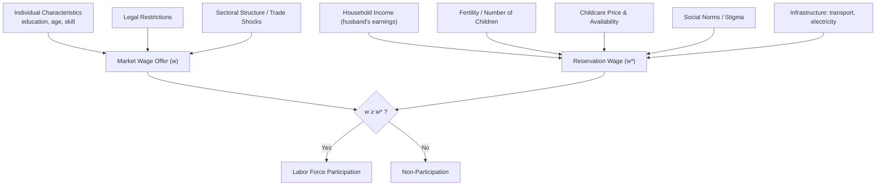

## Female Labor Force Participation Determinants

### Overview

Female labor force participation (FLFP) — the share of working-age women who are employed or actively seeking employment — is one of the most extensively studied outcomes in development economics, both because of its intrinsic welfare implications and because it interacts causally, in both directions, with fertility, education, household bargaining power, and aggregate growth. Cross-country FLFP rates vary enormously (from below 20% in parts of the Middle East and North Africa to over 60% in parts of East Asia and Sub-Saharan Africa), and the relationship between FLFP and GDP per capita is famously **non-monotonic** — the so-called **U-shaped feminization hypothesis** — rather than the simple upward-sloping relationship a naive modernization narrative would predict.

### The U-Shaped Feminization Hypothesis

#### Empirical Pattern

**Goldin (1994)** documented that FLFP tends to *decline* as economies move from low-income agrarian structures into middle-income industrializing structures, before *rising* again at higher income levels as economies shift toward services and educational attainment rises. Plotted against GDP per capita, this traces a **U-shape**:

$$\text{FLFP} = f(\text{GDP per capita}), \quad f'(\cdot) < 0 \text{ at low-to-middle income}, \quad f'(\cdot) > 0 \text{ at higher income}$$

#### Mechanisms Behind the Downward-Sloping Segment

- **Structural transformation away from agriculture**: In agrarian economies, women participate heavily in family farm labor (often unpaid or informally counted). As economies industrialize, employment shifts to manufacturing, where social norms, physical demands, and factory-based work structures (fixed hours, absence of childcare provision, spatial separation from home) create larger frictions for women's participation, especially married women.
- **Rising household (husband's) income effect**: As male wages rise during early industrialization, a standard **income effect** can dominate for married women — households can "afford" to withdraw the wife's labor from the market, particularly where social status is associated with women not working outside the home.
- **Social stigma against female manufacturing/wage work**: In many contexts, factory or wage work is viewed as lower-status than family farm work, especially for married women of higher social standing.

#### Mechanisms Behind the Upward-Sloping (High-Income) Segment

- **Rising female education and returns to skill**: Education raises the opportunity cost of non-participation and shifts women into white-collar and service-sector jobs less subject to the stigma associated with manual/factory labor.
- **Service-sector expansion**: Service jobs (clerical, retail, healthcare, education) are more compatible with prevailing social norms in many contexts and often offer more flexible hours than manufacturing.
- **Fertility decline**: Falling fertility rates reduce childcare burdens, lowering the time cost of market work.
- **Declining gender wage gaps and changing norms**: As norms evolve and legal/institutional barriers to women's employment fall, the effective "price" of labor supply frictions declines.

### Formal Labor Supply Framework

A standard static labor-supply model treats a woman's participation decision as a comparison between her **market wage** $w$ and her **reservation wage** $w^*$ (the shadow value of her time in home production, childcare, leisure, and social approval):

$$\text{Participate} \iff w \geq w^*(H, \; Z, \; \text{social norms})$$

where $H$ is household characteristics (number/age of children, husband's income, other adults present) and $Z$ is a vector of individual characteristics (education, age, health).

The reservation wage is itself a function of:

$$w^* = w^*(y_h, \; n_{\text{children}}, \; p_{\text{childcare}}, \; \eta)$$

where $y_h$ is other household (typically husband's) income, $n_{\text{children}}$ is fertility, $p_{\text{childcare}}$ is the price/availability of childcare substitutes, and $\eta$ captures social/cultural preference parameters (stigma cost of market work).

**Comparative statics:**

- $\partial w^* / \partial y_h > 0$ (higher husband's income raises reservation wage — income effect)
- $\partial w^* / \partial n_{\text{children}} > 0$ (more/younger children raise the reservation wage via time cost)
- $\partial w^* / \partial p_{\text{childcare}} > 0$ (more expensive childcare raises the reservation wage)
- $\partial w^* / \partial \eta$ ambiguous in sign but often positive where market work for married women is socially penalized

### Key Determinants: Detailed Mechanisms

#### 1. Education

Education raises $w$ (market wage) both directly (human capital) and indirectly (by shifting women into occupations less exposed to social stigma). Education effects on FLFP are frequently found to be **non-linear**: returns and participation effects can be modest at low levels of schooling and rise sharply beyond secondary completion, a pattern sometimes linked to the type of jobs accessible at different qualification thresholds. [Inference: the precise inflection points vary substantially by country and labor market structure and are not a fixed universal threshold]

#### 2. Fertility and Childcare

Fertility and FLFP are jointly determined — women who anticipate working may choose lower fertility, and lower fertility frees time for market work, creating classic **simultaneity bias** in cross-sectional regressions of the form:

$$\text{FLFP}_i = \beta_0 + \beta_1 \text{Fertility}_i + X_i'\gamma + \varepsilon_i$$

Identification strategies used in the literature include:

- **Twin births** as a natural experiment generating exogenous variation in family size (Rosenzweig and Wolpin-style designs).
- **Sibling-sex composition** instruments (e.g., an instrument based on the sex of the firstborn child, exploiting son-preference-driven continued childbearing in some settings).
- **Family planning program rollout** as a policy-induced exogenous shifter of fertility.

Childcare availability and cost (formal daycare, availability of extended family/grandparents) directly affects the time cost of market work; several experimental and quasi-experimental studies find that subsidized childcare provision raises FLFP, particularly for lower-income women. [Inference: effect sizes are highly context- and program-design-dependent]

#### 3. Marriage Markets and Household Bargaining

FLFP interacts with **intrahousehold bargaining power**: a wife's ability to work may be constrained by a husband's preferences (if his utility is reduced by his wife's outside employment, e.g., due to status concerns), independent of the wife's own productivity or wage offer. This links FLFP determinants directly to bargaining models — a rise in a wife's outside employment option can itself be a **distribution factor** that shifts bargaining power, creating a potential feedback loop between employment and household allocation.

#### 4. Infrastructure and Time Costs

- **Transportation infrastructure**: Poor rural road networks and unsafe or unreliable public transit increase the effective time/safety cost of commuting, disproportionately constraining women due to norms around independent mobility and safety concerns.
- **Access to electricity and water**: Reduces time spent on domestic chores (fuel/water collection), freeing time for market work — documented in several rural electrification and infrastructure studies. [Inference: magnitude of the freed-time effect and its translation into market participation varies by study and setting]
- **Mobile banking and digital infrastructure**: Some recent literature links access to mobile money and digital payment systems to increased female entrepreneurship and participation by reducing transaction costs and increasing financial autonomy.

#### 5. Legal and Institutional Barriers

- Legal restrictions on women's ability to work in specific sectors, sign contracts independently, open bank accounts, or travel without spousal permission (documented systematically in the World Bank's **Women, Business and the Law** dataset) are directly binding constraints on participation in many countries.
- Maternity leave policy, provisions against workplace discrimination, and childcare mandates affect the *cost* of employing women to firms, with theoretically ambiguous net effects on FLFP (protective mandates can raise costs of hiring women and induce statistical discrimination, an effect studied in the labor economics literature on mandated benefits).

#### 6. Trade, Structural Change, and Labor Demand Shocks

- **Export-oriented manufacturing growth** (e.g., garment sector expansion in Bangladesh, Cambodia, Vietnam) has been shown in several studies to sharply increase female factory employment, given lower relative unit labor costs of female workers in labor-intensive, low-skill manufacturing and employer preferences in that sector — although the long-run effects on bargaining power, marriage timing, and fertility remain an active research area.
- **Trade liberalization and import competition** can differentially affect male- vs. female-dominated sectors, with ambiguous net effects on aggregate FLFP that depend on the pre-existing sectoral gender composition of employment.
- **Agricultural mechanization** can reduce demand for female labor in tasks traditionally performed by women (e.g., weeding, post-harvest processing), with mixed and context-dependent net effects.

#### 7. Social Norms and Culture

Norms are difficult to measure directly but are frequently invoked to explain residual cross-country FLFP variation not accounted for by income, education, or fertility. Empirical strategies to isolate norm effects include:

- Comparing **second-generation immigrants** from different origin countries within the same host-country labor market (holding host-country institutions fixed while origin-country norms vary) — a design associated with **Fernández and Fogli**'s work on culture and economic outcomes.
- Using historical plough-agriculture prevalence (**Alesina, Giuliano, and Nunn, 2013**) as a persistent-norm instrument, based on the hypothesis that societies with historically plough-based (versus hoe-based) agriculture developed more pronounced gender specialization in labor that persists today in FLFP and gender-attitude survey outcomes. [Inference: this instrument and its exclusion restriction have been subject to methodological debate in the literature]

### Diagram: Determinants Feeding into the Participation Decision

### Illustrating the U-Shaped Feminization Curve (svg_diagram)

<svg xmlns="http://www.w3.org/2000/svg" viewBox="0 0 520 340">
<text x="260" y="25" text-anchor="middle" font-size="16" font-weight="bold" fill="#1a1a1a">U-Shaped Feminization Hypothesis (svg_diagram)</text>
<line x1="60" y1="290" x2="60" y2="50" stroke="#333" stroke-width="2" />
<line x1="60" y1="290" x2="470" y2="290" stroke="#333" stroke-width="2" />
<text x="20" y="60" font-size="12" fill="#333">FLFP</text>
<text x="440" y="315" font-size="12" fill="#333">GDP per capita</text>
<path d="M 80 100 Q 220 260 400 90" fill="none" stroke="#2563eb" stroke-width="3" />
<circle cx="80" cy="100" r="5" fill="#16a34a" />
<text x="85" y="95" font-size="10" fill="#16a34a">Agrarian: high FLFP</text>
<text x="85" y="108" font-size="10" fill="#16a34a">(farm labor)</text>
<circle cx="220" cy="255" r="5" fill="#dc2626" />
<text x="150" y="272" font-size="10" fill="#dc2626">Industrializing: low FLFP</text>
<text x="170" y="284" font-size="10" fill="#dc2626">(stigma, income effect)</text>
<circle cx="400" cy="90" r="5" fill="#7c3aed" />
<text x="330" y="80" font-size="10" fill="#7c3aed">Service economy: rising FLFP</text>
<text x="350" y="68" font-size="10" fill="#7c3aed">(education, services)</text>
</svg>

### Key Points

- FLFP follows a documented U-shape across development stages (Goldin, 1994), driven by structural transformation, income effects, and shifting social stigma — not a simple monotonic rise with income.
- The participation decision is standardly modeled as a comparison between market wage and reservation wage, with the reservation wage shaped by household income, fertility, childcare cost, and social norms.
- Major empirical determinants include education, fertility/childcare, infrastructure (transport, electricity), legal restrictions on women's economic rights, trade-driven labor demand shocks, and persistent cultural norms.
- Identifying causal effects (especially for fertility and norms) requires instruments or natural experiments due to pervasive simultaneity between FLFP and its correlates.

### Related Topics

- Structural transformation and sectoral gender composition of employment
- Fertility and labor supply: identification strategies (twin births, sibling-sex instruments)
- Women, Business and the Law dataset and legal barriers to female employment
- Trade liberalization and export manufacturing effects on female employment
- Culture and gender norms: plough hypothesis and second-generation immigrant studies
- Childcare policy and subsidized daycare impact evaluations
- Intrahousehold bargaining models (interaction with employment as a distribution factor)
- Gender wage gaps and occupational segregation
- Maternity leave mandates and statistical discrimination in hiring
- Mobile money, digital infrastructure, and female entrepreneurship