## Gender-Based Violence and Economic Outcomes

### Overview

Gender-based violence (GBV) — encompassing intimate partner violence (IPV), sexual violence, dowry-related violence, trafficking, and violence in public/workplace settings — is treated in development economics not only as a human rights and health issue but as a **direct constraint on human capital accumulation, labor supply, productivity, and macroeconomic growth**. The field draws on health economics, labor economics, and household bargaining theory to model both the causes of GBV (as an outcome of intra-household bargaining failure) and its consequences (as a shock to human capital and economic agency).

### Conceptual Framework: Two Directions of Causality

**Key Points**

- The literature treats GBV and economic outcomes as **bidirectionally endogenous**, which is the central econometric challenge in this domain:
  1. **Economic conditions → GBV** (economic shocks, income, women's relative earnings, and household bargaining power affect the incidence of violence)
  2. **GBV → Economic outcomes** (violence reduces women's labor supply, earnings, human capital, and children's outcomes)
- Because both directions operate simultaneously, naive OLS regressions of violence on income or earnings suffer from **simultaneity bias**, and the literature relies heavily on natural experiments, instrumental variables, and RCTs to identify causal effects in either direction.

### Direction 1: Economic Conditions as a Driver of GBV

#### The Bargaining Power Hypothesis

Grounded in **collective household models** (Chiappori, 1988; McElroy and Horney, 1981), this hypothesis predicts that increases in a woman's relative income or assets improve her bargaining position and reduce her exposure to violence, since violence is modeled as partly a tool of control used when the threat point (outside option) is weak.

$$U_f = f(\theta(Y_f, A_f, S_f))$$

Where $U_f$ is female welfare/utility, $\theta$ is the bargaining weight function, $Y_f$ is female income, $A_f$ is female-controlled assets, and $S_f$ represents social/legal support (divorce law, shelters, custody rights) — all of which raise the threat point and, in the standard bargaining model, are predicted to reduce tolerated violence.

#### The Male Backlash / Threat to Masculinity Hypothesis

Contradicts the naive bargaining prediction: some empirical studies find that **increases in female relative income can increase violence** in the short run, interpreted through models of masculine identity threat (Eswaran and Malhotra, 2011, formalize this using a game-theoretic model incorporating male utility from exercising control) or through the **male backlash model**, in which men use violence to reassert status when their traditional provider role is challenged.

- [Inference — this is a live empirical debate, not settled consensus] Which effect dominates (bargaining-power protection vs. backlash) appears to depend on the size and framing of the income change, the baseline social norm environment, and whether the income shock is to the woman individually or to the household jointly. Studies using unconditional cash transfers, conditional cash transfers, and microfinance program evaluations have produced mixed and sometimes opposite-signed results across contexts, which is itself an important teaching point about external validity in this literature.

#### Alcohol Prices and Male Income Shocks

A separate strand studies **male-side economic shocks**. Studies using variation in alcohol taxes/prices and male unemployment shocks generally find that policies raising the cost of alcohol reduce IPV incidence, and that adverse male income/employment shocks (e.g., due to trade liberalization, crop price shocks, or economic downturns) are associated with increased IPV in several country contexts — consistent with **instrumental theories of violence** (frustration-aggression / stress models) rather than pure bargaining models.

#### Weather and Economic Shocks as Instruments

Because income is endogenous to household behavior, researchers frequently instrument for economic shocks using **rainfall shocks, commodity price shocks (e.g., coffee, cocoa prices), or natural disasters** affecting agricultural income, which are plausibly exogenous to household violence decisions. These IV designs are a standard identification strategy taught alongside this topic.

### Direction 2: GBV as a Shock to Economic Outcomes

#### Labor Supply and Productivity Effects

**Key Points**

- IPV survivors show measurably lower labor force participation, more absenteeism, reduced hours, and lower earnings in the studies that track this — consistent with a **health-shock model of labor supply**, where violence functions analogously to a chronic health shock reducing effective labor capacity (physical injury, chronic pain, PTSD, depression, impaired concentration).
- **Presenteeism costs** (reduced productivity while still present at work) are increasingly measured alongside absenteeism in workplace-cost studies of GBV, since presenteeism-driven output loss can exceed absenteeism-driven loss in magnitude in some sector-specific corporate studies.
- Some national-level costing studies estimate GBV's economic cost as a share of GDP (through combined healthcare costs, lost productivity, and justice-system costs), though methodologies vary substantially across studies (some use victimization-survey self-reported lost workdays; others use simulation/costing models), so cross-country comparisons of these GDP-share estimates should be treated cautiously rather than as directly comparable point estimates.

#### Human Capital and Intergenerational Transmission

- Children exposed to IPV in the household (as witnesses or through associated household stress) show, in the studies that track long-run outcomes, worse educational attainment and health outcomes, consistent with an **intergenerational transmission of violence and disadvantage** channel — modeled analogously to other early-childhood shock literature (e.g., in-utero shocks, malnutrition shocks) using a human capital production function framework:

$$H_{t+1} = f(H_t, I_t, S_t, V_t)$$

Where $H_{t+1}$ is next-period human capital, $I_t$ is investment (schooling, health inputs), $S_t$ is the shock environment, and $V_t$ is exposure to violence — entering as a negative input alongside other early-life shocks.

- Girls in households with GBV exposure are documented in several studies to face elevated risk of early marriage and school withdrawal, linking this topic directly to the education-gap domain in gender and development more broadly.

#### Marriage Market and Dowry-Linked Violence

- In dowry-practicing contexts (parts of South Asia), dowry-related violence is modeled as arising from **incomplete contracts in the marriage market**: dowry functions as a payment whose "adequacy" is renegotiated post-marriage, and violence (or threat of violence) can be used as an extortion mechanism to extract additional transfers — a distinct causal channel from the general bargaining-power model above.
- Anti-dowry legislation (e.g., India's Dowry Prohibition Act) is a commonly studied policy case, though enforcement gaps are widely noted as limiting measured impact.

### Workplace and Public-Sphere Violence

- **Sexual harassment in the workplace** is studied as a distinct channel constraining female labor supply, particularly in sectors and contexts with weak enforcement of workplace protections — it operates as an implicit "tax" on women's labor market participation, lowering the effective wage net of harassment risk and disutility.
- **Violence during commuting/public transit** has been documented in urban labor economics literature (particularly in South Asian and Latin American cities) as a constraint on women's ability to accept jobs requiring travel to certain locations or at certain hours, directly linking to occupational segregation and spatial mismatch literature.

### Measurement and Data Sources

| Data Source | What It Measures |
| --- | --- |
| Demographic and Health Surveys (DHS) — Domestic Violence Module | Prevalence of physical/sexual IPV, attitudes toward violence |
| WHO Multi-Country Study on Women's Health and Domestic Violence | Cross-national prevalence and health consequences |
| National Crime Victimization Surveys | Reported violence incidents (subject to underreporting) |
| Time-diary and labor force surveys linked to violence modules | Labor supply/absenteeism effects |

**Key Points**

- **Underreporting** is the central measurement challenge in this literature: social desirability bias, fear of retaliation, and stigma mean survey-based prevalence estimates are typically treated as **lower bounds**, and researchers commonly use list experiments or randomized response techniques to reduce social-desirability bias in sensitive-question modules.
- List experiments work by asking respondents only the *count* of sensitive items that apply to them from a list (with a randomly varied control list not containing the sensitive item), allowing estimation of prevalence without requiring individual disclosure — a technique taught as a standard tool in sensitive-topic survey methodology.

### Causal Pathway Diagram

```mermaid
flowchart TD
    A[Economic Shock / Income Change] -->|Bargaining power channel| B[Change in Female Threat Point]
    A -->|Male backlash channel| C[Male Identity Threat]
    A -->|Stress/frustration channel| D[Household Stress]
    B --> E[GBV Incidence]
    C --> E
    D --> E
    E --> F[Female Labor Supply Reduction]
    E --> G[Physical & Mental Health Costs]
    E --> H[Child Human Capital Loss]
    F --> I[Earnings Loss]
    G --> I
    H --> J[Intergenerational Poverty Transmission]
    I --> J
```

### Policy Interventions and Evidence Base

**Key Points**

- **Cash transfers and economic empowerment programs**: effects on GBV are heterogeneous across studies — some show reductions in IPV (interpreted as bargaining-power/threat-point improvement), others show short-run increases (interpreted as backlash), reinforcing that program design (individual vs. household targeting, transfer size, accompanying messaging) matters for which effect dominates.
- **Combined economic-plus-norms interventions**: programs pairing an economic component (cash, livelihoods training, microfinance) with **couples' communication training or gender-norm curricula** are increasingly studied as more consistently effective at reducing IPV than economic transfers alone, since they address both the bargaining-power channel and the backlash/norms channel simultaneously.
- **Legal reform**: protective order laws, criminalization of specific forms of violence (e.g., marital rape, dowry violence), and civil remedies are evaluated for both direct protective effect and indirect effect via changed household bargaining (a credible outside legal option raises the female threat point even absent violence).
- **Shelters and support services**: economically modeled as raising the female "outside option" independent of income — shelter availability is used in several studies as a policy-driven source of variation in the female threat point.
- **Workplace policy**: sexual harassment grievance mechanisms and safe-transport programs are studied as labor supply interventions, since they reduce the implicit cost of formal-sector participation for women.

### Common Identification Strategies in This Literature

- **Instrumental variables**: rainfall/commodity price shocks (for income), spousal age/education gaps (for bargaining power), legal reform timing (for outside-option changes)
- **Difference-in-differences**: exploiting staggered rollout of cash transfer programs, legal reforms, or shelter availability across regions/time
- **Randomized controlled trials**: cash transfer arms, couples' curricula, microfinance arms with randomized assignment to isolate causal effect on IPV incidence
- **List experiments / randomized response**: addressing measurement error from underreporting bias described above

### Distinguishing Correlation from Causation — A Teaching Note

[Inference] Much of the earlier (pre-2000s) literature on income and GBV was cross-sectional and correlational, and is now understood to have likely conflated the two directions of causality described above; the credibility revolution in this subfield (increased use of RCTs and quasi-experimental designs from roughly the 2000s onward) has been necessary specifically because the bidirectional endogeneity problem is so severe that simple correlations are close to uninterpretable without an identification strategy.

**Related Topics**

- Intra-household bargaining models and the collective household framework
- Cash transfer program design and gender-differentiated effects
- List experiments and sensitive-question survey methodology
- Human capital production functions and early-life shocks
- Dowry economics and marriage market contracts
- Legal reform evaluation methods (difference-in-differences applications)
- Sexual harassment and labor supply constraints
- Intergenerational transmission of poverty and violence
- Instrumental variable design using weather and commodity price shocks