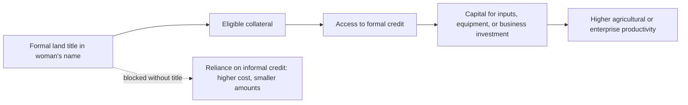

## Women's Land and Property Rights

### Conceptual Foundations

#### Definitions and Scope

Land and property rights encompass a bundle of rights rather than a single entitlement: the right to own, use, control, transfer, inherit, and exclude others from land and associated property (housing, natural resources, livestock). Women's land rights specifically concern the gap between women's *de jure* (legal) and *de facto* (practiced/enforced) access to this bundle.

Key distinctions used in the literature:

- **Ownership rights**: Formal or customary title, registered or recognized
- **Use rights**: Rights to cultivate, graze, or extract resources without necessarily holding title
- **Control rights**: Authority to make decisions about the land (what to plant, whether to sell/lease, whether to use as collateral)
- **Inheritance rights**: Rights to receive land upon the death of a spouse, parent, or relative
- **Independent vs. joint titling**: Whether a woman holds rights individually or only jointly with a male household member (typically a husband)

#### Why Gender and Development Frameworks Treat This as Central

Land is simultaneously a productive asset, a source of collateral, a store of wealth, a determinant of social status, and (in agrarian economies) the primary basis of livelihood. Development economics treats land rights as a structural variable because it sits at the intersection of several theoretical channels:

- **Bargaining power**: Following collective household models (Chiappori, 1988; Sen, 1990's "cooperative conflict" framework), an individual's fallback position (what they could secure outside the household) determines their bargaining weight inside it. Land ownership raises a woman's fallback position, which theory predicts shifts intra-household resource allocation.
- **Credit access**: In most rural credit markets, land serves as the dominant form of acceptable collateral. Without land titles, women are structurally excluded from formal credit, regardless of creditworthiness.
- **Investment incentives**: Secure tenure is theorized to raise incentives for land-improving investment (the "investment channel" in tenure security literature, following Besley, 1995), since the investor is more likely to capture future returns.
- **Agricultural productivity**: The World Bank/FAO literature on the "gender gap in agricultural productivity" identifies insecure land tenure as one of several inputs (alongside credit, extension services, and labor) that are unequally distributed by gender and that jointly explain yield gaps between male- and female-managed plots.

---

### Historical and Legal Context

#### Colonial and Customary Law Legacies

In much of Sub-Saharan Africa, South Asia, and parts of Latin America, contemporary land tenure systems are a hybrid of:

1. **Customary/communal tenure**, historically administered by (usually male) traditional authorities, where women typically accessed land through male relatives (fathers, husbands, sons) rather than holding independent rights
2. **Colonial statutory law**, which in many cases codified and formalized customary systems in ways that hardened male-only inheritance norms that had previously been more fluid in practice
3. **Post-independence statutory reform**, which in some countries introduced formally gender-neutral property law that nonetheless coexists with, and is frequently superseded by, customary practice in rural areas

This produces **legal pluralism**: constitutional or statutory guarantees of gender equality in property (e.g., many Sub-Saharan African constitutions post-1990s) often exist alongside customary or religious law systems that continue to govern actual inheritance and land allocation, particularly in rural areas where formal legal enforcement is weak.

#### Common Legal Mechanisms of Exclusion

- **Discriminatory inheritance/succession law**: Statutory or customary rules that grant sons priority over daughters, or widows only a life interest (not full ownership) in a deceased husband's land
- **Marital property regimes**: Rules governing whether property is jointly or separately owned during marriage, and how it is divided upon divorce or widowhood
- **Land titling defaults**: Administrative practice of registering land titles in the household head's name only (usually assumed to be male), even where law is formally gender-neutral
- **Widow "property grabbing"**: Documented in parts of Sub-Saharan Africa (esp. following the HIV/AIDS epidemic), where in-laws seize a deceased husband's land from his widow, exploiting weak enforcement of her legal inheritance rights

[Inference] The gap between constitutional gender-equality provisions and lived land tenure outcomes is generally attributed in the literature to weak enforcement capacity, low legal literacy among rural women, and the social cost of contesting customary authorities, though the relative weight of each factor is context-specific and contested.

---

### Measurement and Data Challenges

Measuring "women's land rights" is methodologically difficult, and mismeasurement has been a recurring theme in the literature (Doss et al., 2015; Kieran et al., 2015).

#### Key Measurement Problems

1. **Household-level vs. individual-level data**: Most agricultural surveys historically collected data at the household level, attributing land to a single "household head," obscuring intra-household distribution. Individual-disaggregated data (asking who specifically owns/controls each plot) is a more recent and less common standard.
2. **Ownership vs. management**: Being the person who *manages* or *works* a plot is distinct from *owning* it. A woman may cultivate land she does not own or control the disposition of.
3. **Documented vs. perceived rights**: Whether a person's name appears on a formal title/document differs from whether they believe they have the right to sell or bequeath the land — survey instruments must specify which is being measured.
4. **Joint vs. sole ownership**: Aggregating "joint or sole female ownership" with "sole female ownership" can overstate independent female control, since joint titling with a spouse does not guarantee independent decision-making authority.

#### Standard Indicators

- **SDG Indicator 5.a.1**: (a) proportion of total agricultural population with ownership or secure rights over agricultural land, by sex; and (b) share of women among owners or rights-bearers of agricultural land
- **Demographic and Health Surveys (DHS)** modules on asset ownership (house and land, separately, and whether owned alone or jointly)
- **LSMS-ISA (Living Standards Measurement Study – Integrated Surveys on Agriculture)**: individual-level plot ownership and management modules, widely used in the productivity-gap literature

[Unverified] Cross-country comparability of SDG 5.a.1 remains limited as of the most recent UN Women/FAO reporting cycles, since national data collection instruments and legal definitions of "ownership" vary; readers should consult the current UN SDG database for the latest country coverage rather than relying on any specific figures here.

---

### Theoretical Channels: How Land Rights Affect Development Outcomes

#### 1. Intra-Household Bargaining

$$U^i = U^i(x_i, x_j; q) \quad \text{subject to individual budget constraint determined by threat point } T^i$$

In collective household bargaining models, an individual $i$'s consumption allocation $x_i$ depends on their threat point $T^i$ — the utility they could achieve outside the marriage/household. Land ownership directly raises $T^i$ for women by:

- Providing an independent income stream
- Serving as collateral for independent credit access
- Providing a fallback asset in case of separation or widowhood

**Key Point**: Empirical tests of this channel generally examine whether female land/asset ownership is associated with outcomes theorized to reflect greater bargaining power — such as the composition of household expenditure (e.g., higher shares spent on children's education, nutrition, or health) or measures of women's say in household decisions.

#### 2. Credit Market Access

Land titles function as the dominant collateral instrument in most developing-country credit markets. The transmission mechanism:

Where women lack independent title, this channel is closed regardless of their entrepreneurial capacity or creditworthiness — a form of **credit market exclusion driven by collateral constraints** rather than by lender discrimination per se, though the two can compound.

#### 3. Tenure Security and Investment Incentives

Following the tenure-security investment hypothesis (Besley, 1995; Place & Hazell, 1993), the expected return to a land-improving investment (e.g., soil conservation, tree planting, irrigation) depends on the probability that the investor retains the benefit:

$$E[\pi] = p \cdot R - C$$

where $p$ is the probability of retaining land rights over the investment horizon, $R$ is the return if rights are retained, and $C$ is the investment cost. Where women's tenure is insecure (e.g., dependent on a marriage remaining intact, or on a husband's goodwill), $p$ is lower, predicting underinvestment in women-managed or jointly-managed plots relative to secure male-owned plots — an outcome linked in the productivity-gap literature to lower fertilizer use, less soil conservation, and lower long-term land productivity investments on female-managed plots.

#### 4. Agricultural Productivity Gap

The well-documented "gender gap in agricultural productivity" (yields on female-managed plots are commonly found to be lower than on male-managed plots in the same country/context) is attributed by the FAO/World Bank literature to a bundle of correlated input gaps, of which insecure land tenure is one:

| Contributing Input Gap | Relation to Land Rights |
| --- | --- |
| Plot size and quality | Women more often farm smaller, less fertile plots |
| Access to credit/inputs | Constrained by lack of collateralizable title |
| Labor availability | Time poverty from unpaid care work reduces labor allocated to owned plots |
| Access to extension services | Extension services historically targeted "household heads," usually assumed male |
| Tenure security | Reduces investment as described above |

[Inference] The literature generally treats the productivity gap as multi-causal rather than attributable to land tenure alone; studies that decompose the gap (e.g., Oaxaca-Blinder-style decompositions applied to plot-level data) typically find that input access differences explain a substantial share of the gap, but unexplained residuals persist across most country studies, and the precise contribution of land tenure specifically is difficult to isolate from correlated constraints.

---

### Empirical Evidence

#### Land Titling and Reform Programs

A body of quasi-experimental and experimental research has evaluated land titling and joint-titling reforms:

- **Ethiopia's low-cost land certification program (2000s)**: A widely cited example of a large-scale titling reform explicitly designed to include women's names (and photographs) on certificates, including joint certification of spouses. Research on this program (e.g., Deininger, Ali, and colleagues at the World Bank) found associations between certification and increased land-related investment and rental market participation. [Unverified — check most recent literature for updated or contested findings, as this remains an active area of re-analysis.]
- **India's Hindu Succession Act (Amendment) 2005**: Extended equal inheritance rights to daughters in ancestral (coparcenary) property, from which they were previously excluded under Mitakshara law in several states that had not already reformed. Studies using state-level variation in earlier reform timing (some Indian states amended the law between 1976–1994, before the 2005 national amendment) have examined effects on female educational attainment, age at marriage, and other outcomes, on the logic that expected future inheritance affects household investment decisions in daughters.
- **Rwanda's 2013 Land Tenure Regularization program**: Required both spouses' names on land certificates for married couples; research has examined effects on women's investment behavior and land-related decision-making.

**Key Point**: [Inference] Across this literature, joint titling reforms are generally found to improve women's *documented* rights and often their perceived tenure security, but effects on downstream outcomes (investment, productivity, bargaining power) are heterogeneous across contexts and studies, and causal identification is complicated by the fact that titling programs are rarely randomly assigned at the individual level — most rigorous studies rely on policy discontinuities, geographic rollout variation, or difference-in-differences designs rather than randomized controlled trials.

#### Inheritance Law Reform

Cross-country and within-country studies of inheritance law reforms (India, several Sub-Saharan African countries) commonly examine:

- Effects on women's asset accumulation at time of marriage or widowhood
- Effects on domestic violence prevalence (hypothesized channel: land ownership raises a woman's exit option, which bargaining models predict should reduce her exposure to violence — though the empirical relationship is contested and some studies find null or context-dependent effects)
- Effects on daughters' human capital investment (education, health, delayed marriage), under the hypothesis that anticipated inheritance changes parental investment incentives

---

### Policy Instruments

#### Legal and Institutional Reforms

- **Joint titling mandates**: Requiring both spouses' names on land certificates issued through government programs (as in Ethiopia, Rwanda examples above)
- **Inheritance law harmonization**: Aligning statutory law with constitutional gender-equality guarantees, and clarifying the legal hierarchy between statutory and customary law
- **Marital property regime reform**: Establishing default community-of-property or equitable-division regimes rather than regimes that leave property solely in the husband's name
- **Simplified and low-cost registration**: Reducing the transaction costs (fees, travel, documentation, literacy barriers) that disproportionately deter women from registering land in their own name

#### Complementary Interventions

Land rights reforms are generally understood in the literature as necessary but insufficient on their own; complementary measures cited include:

- **Legal literacy and paralegal programs**: Informing rural women of their statutory rights, given that customary practice often diverges from statute
- **Community engagement with traditional authorities**: Since customary land administrators often retain de facto allocation authority even where statutory law has changed
- **Linking titling to extension and credit access**: To ensure formal rights translate into the productive-input access theorized to drive productivity gains
- **Women's land rights documentation drives during titling campaigns**: Proactively including women's names rather than relying on women to request inclusion, given evidence that default administrative practice (registering only the "household head") reproduces exclusion even under gender-neutral law

---

### Diagram: Channels from Land Rights to Development Outcomes (svg_diagram)

<svg xmlns="http://www.w3.org/2000/svg" viewBox="0 0 900 520" font-family="Arial, sans-serif">
<text x="450" y="30" font-size="18" font-weight="bold" text-anchor="middle">Women's Land Rights: Channels to Development Outcomes (svg_diagram)</text>
<rect x="350" y="55" width="200" height="50" rx="8" fill="#fdf2e9" stroke="#e67e22" stroke-width="2" />
<text x="450" y="85" font-size="14" text-anchor="middle" font-weight="bold">Secure Land Rights</text>

<line x1="450" y1="105" x2="150" y2="160" stroke="#7f8c8d" stroke-width="1.5" />
<line x1="450" y1="105" x2="450" y2="160" stroke="#7f8c8d" stroke-width="1.5" />
<line x1="450" y1="105" x2="750" y2="160" stroke="#7f8c8d" stroke-width="1.5" />
<rect x="50" y="160" width="200" height="55" rx="8" fill="#eaf2f8" stroke="#2980b9" stroke-width="2" />
<text x="150" y="182" font-size="13" text-anchor="middle" font-weight="bold">Bargaining Power</text>
<text x="150" y="200" font-size="11" text-anchor="middle">Raised fallback position</text>
<rect x="350" y="160" width="200" height="55" rx="8" fill="#eafaf1" stroke="#27ae60" stroke-width="2" />
<text x="450" y="182" font-size="13" text-anchor="middle" font-weight="bold">Credit Access</text>
<text x="450" y="200" font-size="11" text-anchor="middle">Collateral for formal loans</text>
<rect x="650" y="160" width="200" height="55" rx="8" fill="#f4ecf7" stroke="#8e44ad" stroke-width="2" />
<text x="750" y="182" font-size="13" text-anchor="middle" font-weight="bold">Tenure Security</text>
<text x="750" y="200" font-size="11" text-anchor="middle">Investment incentive</text>

<line x1="150" y1="215" x2="150" y2="270" stroke="#7f8c8d" stroke-width="1.5" marker-end="url(#arrow)" />
<line x1="450" y1="215" x2="450" y2="270" stroke="#7f8c8d" stroke-width="1.5" marker-end="url(#arrow)" />
<line x1="750" y1="215" x2="750" y2="270" stroke="#7f8c8d" stroke-width="1.5" marker-end="url(#arrow)" />
<rect x="50" y="270" width="200" height="65" rx="8" fill="#eaf2f8" stroke="#2980b9" stroke-width="1.5" />
<text x="150" y="295" font-size="12" text-anchor="middle">Child education &amp;</text>
<text x="150" y="312" font-size="12" text-anchor="middle">nutrition spending</text>
<rect x="350" y="270" width="200" height="65" rx="8" fill="#eafaf1" stroke="#27ae60" stroke-width="1.5" />
<text x="450" y="295" font-size="12" text-anchor="middle">Input purchases,</text>
<text x="450" y="312" font-size="12" text-anchor="middle">enterprise capital</text>
<rect x="650" y="270" width="200" height="65" rx="8" fill="#f4ecf7" stroke="#8e44ad" stroke-width="1.5" />
<text x="750" y="295" font-size="12" text-anchor="middle">Soil conservation,</text>
<text x="750" y="312" font-size="12" text-anchor="middle">long-term investment</text>

<line x1="150" y1="335" x2="450" y2="400" stroke="#7f8c8d" stroke-width="1.5" />
<line x1="450" y1="335" x2="450" y2="400" stroke="#7f8c8d" stroke-width="1.5" />
<line x1="750" y1="335" x2="450" y2="400" stroke="#7f8c8d" stroke-width="1.5" />
<rect x="300" y="400" width="300" height="60" rx="8" fill="#fdebd0" stroke="#d35400" stroke-width="2" />
<text x="450" y="425" font-size="14" font-weight="bold" text-anchor="middle">Agricultural Productivity &amp;</text>
<text x="450" y="445" font-size="14" font-weight="bold" text-anchor="middle">Household Welfare Outcomes</text>

<text x="450" y="495" font-size="11" fill="`#555555`" text-anchor="middle">Note: Each channel is theorized and empirically studied separately;</text>

<text x="450" y="510" font-size="11" fill="`#555555`" text-anchor="middle">effect sizes and significance vary substantially by context and study design.</text>

</svg>

---

### Regional Illustrations

#### Sub-Saharan Africa

Predominantly customary tenure systems with recent statutory reform efforts (e.g., Rwanda, Ethiopia, Tanzania land laws). Widow disinheritance and "property grabbing" by in-laws is documented as a persistent enforcement gap even where inheritance law formally protects widows.

#### South Asia

Strong patrilineal and patrilocal inheritance norms; India's Hindu Succession Act amendments are the most studied statutory reform. Land records in many South Asian contexts historically registered only male heads of household, creating a data and administrative legacy that persists even after legal reform.

#### Latin America

Joint-titling requirements in some land reform and titling programs (e.g., aspects of Nicaragua's and other countries' agrarian reform histories) have been studied as natural experiments in female co-titling; marital property regimes (community property vs. separate property defaults) vary significantly by country and are a distinct policy lever from inheritance law.

[Inference] Regional generalizations here describe documented patterns in the literature but mask substantial within-region and within-country heterogeneity by ethnicity, religion, and local customary practice; country-specific legal review is necessary for any applied policy work.

---

### Common Analytical Pitfalls

- Treating "household land ownership" as equivalent to women's access, obscuring intra-household distribution
- Assuming legal reform automatically produces behavioral change, without accounting for enforcement capacity and customary practice
- Attributing the entire agricultural productivity gap to land tenure alone, when it is typically a multi-input, multi-causal gap
- Conflating joint titling with independent female control over disposition decisions
- Using cross-sectional correlations between female land ownership and welfare outcomes to infer causality, without addressing the likely reverse causality or omitted-variable bias (e.g., wealthier, more empowered women may be both more likely to own land and more likely to exhibit the outcome of interest)

---

**Related Topics**

- Intra-household bargaining models (unitary vs. collective household models)
- Gender gap in agricultural productivity (input decomposition methods)
- Microfinance and women's collateral substitutes (group lending, movable asset collateral)
- Widowhood, inheritance law, and social protection
- Legal pluralism and customary vs. statutory law in development contexts
- SDG Indicator 5.a.1 and land rights data infrastructure
- Time poverty and women's unpaid care work as a constraint on land productivity
- Marital property regimes (community property vs. separate property) in comparative law
- Female labor force participation and asset ownership