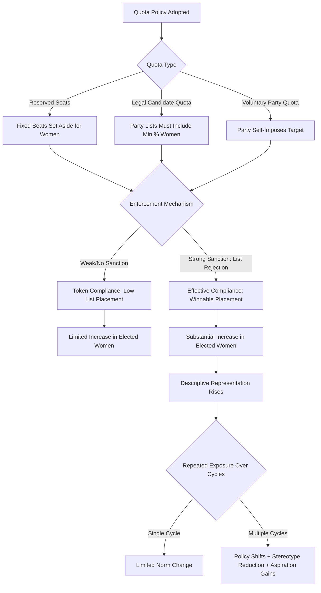

## Political Representation and Gender Quotas

### Overview

Political representation and gender quotas refer to the set of institutional mechanisms designed to increase women's presence in political decision-making bodies — legislatures, executive cabinets, party lists, and local governance structures. Within Development Economics, this topic sits at the intersection of political economy, institutional design, and gender and development, examining both the mechanics of quota systems and their downstream effects on policy outcomes, public goods provision, and broader gender equity.

The core empirical and theoretical questions are: (1) do quotas causally increase substantive representation of women's interests, not just descriptive (numerical) representation; (2) what are the economic and social effects of having more women in power; and (3) do quotas produce backlash, tokenism, or durable shifts in social norms.

### Key Concepts

**Descriptive vs. Substantive Representation**

- *Descriptive representation*: the degree to which representatives share characteristics (e.g., gender) with the represented population.
- *Substantive representation*: the degree to which representatives act in the interests of the represented group, regardless of shared identity.
- A central debate: does descriptive representation (more women in office) causally produce substantive representation (policies favoring women's interests)? Much of the empirical literature in development economics tests this link directly.

**Types of Gender Quotas**

1. **Reserved seats**: A fixed number or percentage of legislative seats is constitutionally or legally set aside for women (e.g., India's Panchayati Raj reservations, Rwanda's parliamentary reserved seats, Uganda's district woman MP seats).
2. **Legal candidate quotas**: Laws requiring political parties to nominate a minimum percentage of female candidates on their lists (e.g., many Latin American "ley de cuotas" systems).
3. **Voluntary party quotas**: Political parties self-impose candidate quotas without legal mandate (common in Scandinavian social democratic parties).
4. **Zipper/alternation systems**: Candidate lists must alternate by gender (used in some proportional representation systems to prevent quota candidates being placed at unelectable list positions).

**Rationale (Theoretical Justifications)**

- **Justice argument**: Underrepresentation reflects historical and structural discrimination; quotas correct this.
- **Interest-group argument**: Women have distinct policy preferences (e.g., over public goods like water, health, education) that go underweighted without descriptive presence.
- **Efficiency/utilization argument**: Excluding half the population from the talent pool for leadership is allocatively inefficient.
- **Role-model/aspiration argument**: Visible female leaders shift aspirations and reduce stereotype-driven expectations for the next generation (a key mechanism tested in the Indian panchayat literature).

### The Indian Panchayat Natural Experiment

India's 73rd Constitutional Amendment (1993) mandated that one-third of village council (*panchayat*) leadership positions (*pradhan*) be reserved for women, with reservation assigned via random rotation across villages. This randomized assignment created a well-known quasi-experimental setting extensively used in development economics.

**Key findings (Chattopadhyay and Duflo, 2004, *Econometrica*)**:

- Villages with women-reserved pradhan seats invested more in infrastructure directly relevant to women's stated priorities (e.g., drinking water) relative to male-led councils.
- Women leaders were more likely to invest in public goods matching women's expressed preferences in surveys, while male leaders' investments tracked male preferences — evidence for substantive representation via descriptive representation.

**Follow-up findings (Beaman, Chattopadhyay, Duflo, Pande, and Topalova, 2009, *QJE*, and related work)**:

- Exposure to female leaders reduced negative gender stereotypes among villagers.
- Repeated exposure (two consecutive reservation cycles) narrowed the gap between parents' aspirations for daughters and sons, and closed gender gaps in adolescent educational outcomes.
- Effects were often not visible after a single exposure cycle but strengthened with repeated exposure, suggesting norm change is a slow-moving, cumulative process rather than an instantaneous shock.

**Interpretation caveats [Inference]**: The panchayat literature is frequently cited as the cleanest causal evidence for quota effects because reservation was randomly rotated, minimizing selection bias. Generalizing magnitudes to national-level legislatures is less certain, since local governance has different fiscal authority, visibility, and voter information conditions than national parliaments.

### Rwanda: The Global Frontier Case

Rwanda has the highest share of women in a national legislature globally, with women holding a majority of seats in the Chamber of Deputies following constitutional reforms after the 1994 genocide that included a 30% reserved-seat quota as a floor. Post-genocide demographic shifts (a female-skewed population) and a deliberate state-led gender-inclusion strategy are both cited as contributing factors.

Research on Rwanda highlights:

- Legislative gender balance is associated with policy changes in areas such as land rights, inheritance law, and gender-based violence legislation.
- [Inference] Whether the Rwandan case generalizes to other post-conflict or non-post-conflict settings is contested, given Rwanda's unique political context (a dominant-party system with limited multiparty competition), which may affect how quota-driven representation translates into contestable policymaking power.

### Latin America and Candidate List Quotas

Latin America pioneered legal candidate quotas starting with Argentina's 1991 Ley de Cupos (30% quota), followed by adoption across most of the region. Key design lessons from this experience:

- **Placement mandates matter**: Quotas without list-placement rules (e.g., requiring women in winnable positions, not just anywhere on the list) are frequently circumvented — parties comply nominally by placing women in low-ranked, unelectable positions.
- **Enforcement mechanisms matter**: Quotas with legal sanctions for non-compliance (list rejection by electoral authorities) produced substantially higher female representation than those with only monitoring or reporting requirements.
- **Zipper systems** (strict alternation) have generally produced the highest female seat shares among list-based systems, since they eliminate the placement-manipulation loophole entirely.

### Quotas and Policy Outcomes: Broader Evidence

- **Public goods provision**: Beyond India, cross-country and within-country studies associate higher female political representation with increased spending on health, education, and social welfare programs, though the strength and causal robustness of these findings varies by context and identification strategy [Inference: effect sizes are context-dependent and not uniformly replicated across all quota settings].
- **Corruption**: Some studies (e.g., cross-country panel analyses) find correlations between higher female political representation and lower perceived corruption, though the causal direction and mechanism (selection effects vs. behavioral effects) remain debated in the literature.
- **Legislative effectiveness and bill sponsorship**: Studies of quota-elected women in various parliaments find they are often as, or more, active in sponsoring legislation on health, education, and family policy relative to non-quota colleagues, countering early "tokenism" concerns in some contexts.

### Critiques and Limitations of Quotas

**The Tokenism Critique**

Early critics argued reserved-seat women would be "proxies" for male relatives (husbands, fathers) who exercise the real power — a phenomenon documented in some early panchayat studies and referred to informally as "Sarpanch Pati" (husband-of-the-chairperson) in parts of India. [Unverified as universal] — the prevalence of this pattern varies significantly by region, is not fully quantified at a general level, and appears to diminish with quota persistence and women's political experience over successive terms.

**Backlash and Elite Capture**

- Quotas can generate backlash: in some panchayat data, villages under mandatory female leadership initially exhibited increased reported dissatisfaction and no measurable difference in perceived corruption, before subsequent terms if women had prior exposure improved outcomes.
- Elite capture: quota seats can be filled by women from politically connected families, potentially limiting representation gains for less advantaged women.

**Ceiling Effects and the "Quota Trap"**

- Some evidence suggests quotas can plateau female representation at the mandated floor (e.g., parties nominate exactly the minimum required and no more), rather than serving as a stepping stone to organic increases in representation over time. [Inference] This is more a theoretical/observed risk in specific national contexts than a universal empirical law.

**Substantive vs. Symbolic Trade-off**

- A quota can raise descriptive representation while insulating incumbent power structures if reserved seats are non-competitive or ceremonial, or if reserved-seat holders lack committee assignments, budgetary authority, or party leadership access proportional to their numbers.

### Design Parameters That Shape Quota Effectiveness

| Design Parameter | Weak Design | Strong Design |
| --- | --- | --- |
| Placement rule | None (women anywhere on list) | Zipper/alternation or top-position mandate |
| Enforcement | Voluntary/self-reported | Legal sanction (list rejection) |
| Seat type | Reserved but non-competitive appointment | Reserved seats subject to electoral competition |
| Duration | One-off/short-term | Sustained across multiple electoral cycles |
| Scope | National legislature only | Multi-level (national, subnational, local) |

### Illustration: Quota Mechanism Pathway

### Measuring Representation: Common Indicators

- **Percentage of seats held by women in national parliament**: The standard cross-country indicator (tracked by the Inter-Parliamentary Union), used in SDG Indicator 5.5.1.
- **Percentage of women in ministerial/cabinet positions**: Captures executive-branch representation, often lagging legislative representation even where quotas exist.
- **Percentage of women in local government**: Increasingly tracked (SDG 5.5.1b), important because local governance often has the most direct interface with household-level public goods.
- **Quota gap**: The difference between the legally mandated quota percentage and the actual percentage of women elected — a diagnostic for the placement-mandate and enforcement issues described above.

### Worked Example: Interpreting a Quota Policy

Consider a hypothetical proportional representation system with a legal quota requiring 40% female candidates on party lists, but no placement mandate. A party could technically comply by listing candidates in the order: Male, Male, Male, Female, Male, Male, Female, Male, Male, Female (i.e., placing all three required women in positions unlikely to be reached given the party's expected seat allocation). If the party wins only 3 seats, zero women may be elected despite full technical compliance with the 40% quota.

This illustrates why development economists studying quota *effects* must always examine **elected outcomes**, not just the *legal quota percentage*, since the two can diverge substantially depending on placement and enforcement design.

### Related Debates in the Literature

- **Selection vs. treatment effects**: Are observed differences between male and female leaders due to gender itself (a treatment effect of being a woman) or due to who self-selects/gets selected into office under quota systems (a selection effect)? Randomized reservation designs (like India's panchayat rotation) help isolate treatment effects better than observational cross-country data.
- **Intersectionality**: Quotas targeting gender alone may not address compounding disadvantages faced by women from ethnic minorities, lower castes, or lower-income groups; some countries layer quotas (e.g., reserved seats for women from Scheduled Castes/Tribes in India) to address this.
- **Quotas as a second-best solution**: Some economists frame quotas as a corrective mechanism for statistical discrimination or informational failures in candidate evaluation, arguing that if voters had perfect information about candidate quality, gender-based screening would not disadvantage women in the first place — quotas are then a second-best response to an information/discrimination market failure rather than a first-best policy.

**Related Topics**

- Gender gaps in labor force participation and their interaction with political time constraints
- Female labor supply responses to local infrastructure investment (e.g., water access reducing time poverty)
- Intersectionality in quota design (caste, ethnicity, and gender-layered reservations)
- Political economy of clientelism and its interaction with gender-based vote-buying
- Household bargaining models and female empowerment indices
- Education gender gaps and role-model effects (aspiration formation literature)
- Gender-based violence legislation as a policy outcome of representation
- Comparative electoral system design (proportional representation vs. majoritarian systems) and quota compatibility
- Women's economic empowerment programs (e.g., self-help groups, microfinance) as complements to political quotas