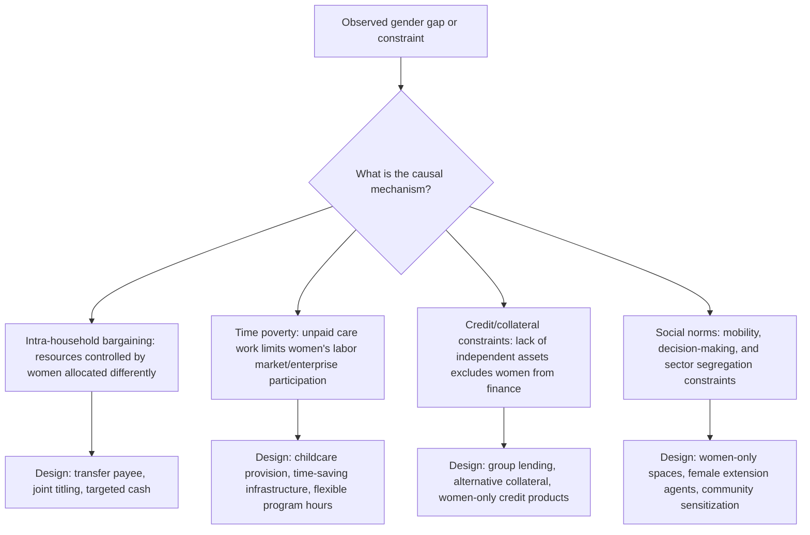

## Gender-Targeted Development Programs

### Conceptual Foundations

#### Definitions and Typology

Gender-targeted development programs are interventions that explicitly condition eligibility, delivery mechanism, or design on gender, in contrast to gender-neutral programs that may have differential gendered effects without explicit targeting. The literature typically distinguishes:

- **Gender-exclusive targeting**: Programs restricted entirely to one sex (e.g., girls'-only scholarship programs, women-only microfinance groups)
- **Gender-differentiated design**: Programs open to all but with design features calibrated to address gender-specific constraints (e.g., cash transfers paid to the mother rather than the father, women-only hours at a training facility)
- **Gender mainstreaming**: A broader institutional approach (distinct from targeted programming) that integrates gender analysis into all development interventions regardless of whether any single program is gender-exclusive

**Key Point**: Gender targeting is a policy *instrument*, not a single theory; different programs targeting women are justified by different, sometimes competing, theoretical rationales (efficiency vs. empowerment vs. correcting historical discrimination), and evaluating "whether gender targeting works" requires specifying which rationale and which outcome is being tested.

#### The Efficiency vs. Empowerment Debate

A recurring conceptual tension in this literature (extensively discussed by Naila Kabeer and others in feminist economics) is between two distinct justifications for targeting women:

1. **Instrumentalist/efficiency argument**: Targeting women is justified because it is a more effective *means* to other development ends (child welfare, household nutrition, economic growth) — women are targeted because doing so is hypothesized to produce better aggregate outcomes, not primarily for women's own sake
2. **Intrinsic/empowerment argument**: Targeting women is justified because gender equality and women's agency are development goals *in themselves*, independent of instrumental effects on other outcomes

[Inference] This distinction is not merely academic — it has practical design implications. A program justified purely instrumentally (e.g., "give cash to mothers because it improves child nutrition") may be judged a failure if child nutrition outcomes are null, even if the same program measurably increased women's autonomy or bargaining power, which was not the stated goal. Critics (notably Kabeer, 1994; Chant, 2008) have argued that development practice has often defaulted to instrumentalist justifications, which can inadvertently increase women's unpaid labor burden by loading additional program-related responsibilities onto them without addressing structural constraints.

---

### Major Program Categories

#### 1. Conditional and Unconditional Cash Transfers (CCTs/UCTs) Targeting Women

The most extensively studied category of gender-targeted programming, spanning Latin America's large-scale CCT programs (Mexico's Progresa/Oportunidades/Prospera, Brazil's Bolsa Família), and adapted variants globally.

**Design feature**: Transfers are conventionally paid to the mother/female household head rather than the father, based on the theoretical and empirical premise from intra-household bargaining models that resources controlled by women are more likely allocated toward child welfare, nutrition, and education spending than resources controlled by men.

**Evidence pattern**: [Inference] A substantial body of evaluation research on Latin American CCTs (using the programs' typically staggered/randomized rollout for identification) has generally found associations between transfers paid to mothers and increased spending shares on food, children's clothing, and schooling, consistent with the bargaining-power hypothesis, though the magnitude and consistency of this "who receives the transfer matters" effect varies across specific study designs and outcome measures, and isolating the effect of payee gender from the effect of the transfer itself requires careful experimental or quasi-experimental design (comparing otherwise-identical transfers paid to fathers vs. mothers).

#### 2. Women-Targeted Microfinance and Group Lending

Grameen Bank (Bangladesh) and its many replications popularized group-lending microfinance models targeting women, motivated by several overlapping rationales:

- Instrumentalist: Women were observed/hypothesized to have higher loan repayment rates than men, reducing lender default risk
- Empowerment: Access to independent credit and income was theorized to increase women's bargaining power and social standing
- Practical: Women were more consistently present in the village/household setting where group meetings occurred, given gendered mobility norms in the study contexts

**Key methodological point**: The empirical literature on microfinance impact has evolved substantially since early enthusiastic claims. Multiple randomized evaluations conducted in the 2000s–2010s (in India, Morocco, Bosnia, Mexico, Ethiopia, Mongolia — synthesized in a well-known set of coordinated studies published together, sometimes referred to as the "microfinance RCT wave") generally found modest or null average effects on household income and consumption, though some studies found effects on business investment among existing entrepreneurs, or on women's decision-making input in some contexts. [Unverified — the specific studies, countries, and effect sizes referenced in any secondary summary should be checked against the original coordinated studies, since popular summaries of this literature have sometimes overstated either the null results or the positive findings depending on the author's prior position in the broader microfinance debate.]

#### 3. Girls' Education Programs

Common design variants include:

- **Conditional cash transfers tied to girls' school attendance** (distinct from general CCTs, specifically targeting the gender gap in enrollment)
- **Merit/needs-based scholarships restricted to girls**
- **School infrastructure targeting** (e.g., separate sanitation facilities for girls, hypothesized to reduce dropout at menarche/puberty)
- **Safe transport or proximity interventions** (addressing parental safety concerns that disproportionately affect girls' school attendance in some contexts)

**Theoretical rationale**: Beyond human capital returns common to all education investment, girls' education targeting is justified in the literature via documented cross-country correlations between female education and fertility decline, child health outcomes, and (in some studies) intergenerational human capital transmission — though as with all such cross-sectional correlations, the literature is attentive to the risk of confounding with unobserved household or community characteristics, and causal identification typically relies on natural experiments (e.g., school construction programs, compulsory schooling law changes) rather than cross-sectional comparison alone.

#### 4. Women's Business Training and Enterprise Support

Programs providing business skills training, mentorship, or access to finance specifically targeting women entrepreneurs, motivated by evidence of gender gaps in enterprise profitability and growth commonly attributed to a combination of:

- Lower access to capital (collateral constraints, discussed in relation to land rights in prior material)
- Sector segregation (women-owned enterprises concentrated in lower-return, lower-barrier-to-entry sectors)
- Time constraints from unpaid care responsibilities limiting business hours/reinvestment capacity
- Social norms constraining mobility, negotiation, or interaction with male suppliers/customers/officials

[Inference] Evaluation evidence on standard business-training programs targeting women (a category studied extensively by researchers including McKenzie and Woodruff, among others) generally finds modest average effects on business practices and more limited or inconsistent effects on profit/revenue, leading to increased attention in more recent program design toward complementary interventions (grants combined with training, psychosocial/soft-skills components, or sector-switching encouragement into traditionally male-dominated, higher-return sectors) rather than training alone.

#### 5. Health-Targeted Programs

- **Maternal and reproductive health programs**: Antenatal care incentives, skilled birth attendance subsidies, family planning access programs
- **Nutrition programs targeting women and girls**: Addressing documented patterns of intra-household food allocation that in some contexts disadvantage women and girls relative to men and boys (a pattern with well-documented regional variation, notably studied extensively in South Asia)

---

### Theoretical Channels Underlying Design Choices

**Key Point**: Effective program design in this literature is generally understood to require correctly diagnosing which constraint (or combination of constraints) is binding in a given context — a program addressing credit constraints (e.g., microloans) will not resolve a binding time-poverty constraint, and vice versa, which is a commonly cited explanation for why interventions successful in one context fail to replicate in another with a different binding constraint.

---

### Methodological Considerations in Evaluation

#### Common Identification Strategies

- **Randomized controlled trials (RCTs)**: The dominant methodology in the contemporary gender-targeted program evaluation literature (spanning cash transfers, microfinance, business training), given the feasibility of randomizing individual or cluster-level access to many such programs
- **Regression discontinuity designs**: Exploiting eligibility cutoffs (e.g., means-tested cash transfer thresholds) to identify local causal effects near the cutoff
- **Difference-in-differences with staggered rollout**: Common for large national programs (e.g., Progresa's phased village-level rollout) where full randomization was combined with phased implementation

#### Common Threats to Interpretation

1. **Spillover effects**: Gender-targeted programs at the household or community level can generate spillovers to non-targeted households or to male household members, complicating simple treatment-control comparisons if spillovers are not explicitly measured
2. **Take-up and compliance**: Distinguishing intention-to-treat (ITT) effects from treatment-on-treated (TOT) effects matters particularly for voluntary programs (e.g., microfinance, business training) with incomplete take-up
3. **Short vs. long time horizons**: Many evaluated effects (e.g., on business profit, school attendance) are measured over relatively short post-intervention windows; long-run follow-up studies are less common and sometimes find effects that attenuate, persist, or emerge only with delay
4. **General equilibrium effects**: Individual-level or village-level RCT findings may not scale linearly to national program implementation, since market-level effects (e.g., on local wages, prices, or credit market equilibrium) are not captured by small-scale randomized designs — a concern raised prominently in critiques of extrapolating from microfinance and cash transfer RCTs to national policy

[Inference] The evolution of this literature over roughly the past two decades has generally moved from an early period of enthusiasm about targeted programming based on theory and small pilot studies, toward a more cautious, evidence-accumulation approach emphasizing replication across contexts and explicit attention to which specific binding constraint a given program addresses — this is a broad characterization of a large literature and individual sub-literatures (CCTs vs. microfinance vs. business training) have each followed somewhat distinct evidentiary trajectories.

---

### Design Trade-offs and Critiques

#### The "Feminization of Responsibility" Critique

Chant (2008) and related feminist economics scholarship have critiqued instrumentalist gender-targeted programming (particularly CCTs conditioning transfers on mothers' compliance with school attendance/health visit requirements) on the grounds that:

- Compliance monitoring and associated time costs (accompanying children to health visits, meeting program requirements) fall disproportionately on women
- Programs designed around women's presumed altruism toward children can reinforce, rather than challenge, gendered divisions of household responsibility
- Intrinsic empowerment outcomes are frequently not measured or prioritized, even in programs that claim empowerment as a goal

#### Targeting Errors

As with all targeted social programs, gender targeting is subject to standard **inclusion and exclusion error** trade-offs:

- **Exclusion error**: Eligible women who do not receive intended benefits (e.g., due to lack of ID documentation required for enrollment, a documented barrier in several LMIC cash transfer programs)
- **Inclusion error**: Resources reaching intended payee (the woman) in name but effectively controlled by another household member in practice — an implementation-level version of the "proxy" concern also discussed in the political representation literature

#### Norms-Based Backlash Risk

[Inference] A body of literature (including some experimental studies) has examined whether gender-targeted programs can provoke intimate partner violence or intra-household conflict as a backlash response, particularly where a program is perceived to threaten a male partner's status or control — findings in this specific area are mixed and highly context-dependent, and this remains an active area of research rather than a settled finding; program design increasingly incorporates violence-risk screening or complementary norms-change components partly in response to this concern.

---

### Diagram: Targeting Logic and Evaluation Pipeline (svg_diagram)

<svg xmlns="http://www.w3.org/2000/svg" viewBox="0 0 900 500" font-family="Arial, sans-serif">
<text x="450" y="28" font-size="17" font-weight="bold" text-anchor="middle">Gender-Targeted Program Design and Evaluation Pipeline (svg_diagram)</text>
<rect x="350" y="50" width="200" height="50" rx="8" fill="#fdf2e9" stroke="#e67e22" stroke-width="2" />
<text x="450" y="80" font-size="13" font-weight="bold" text-anchor="middle">Diagnose Binding Constraint</text>
<line x1="450" y1="100" x2="150" y2="150" stroke="#7f8c8d" stroke-width="1.5" />
<line x1="450" y1="100" x2="450" y2="150" stroke="#7f8c8d" stroke-width="1.5" />
<line x1="450" y1="100" x2="750" y2="150" stroke="#7f8c8d" stroke-width="1.5" />
<rect x="50" y="150" width="200" height="55" rx="8" fill="#eaf2f8" stroke="#2980b9" stroke-width="2" />
<text x="150" y="172" font-size="12" font-weight="bold" text-anchor="middle">Credit constraint</text>
<text x="150" y="190" font-size="10" text-anchor="middle">→ Microfinance, grants</text>
<rect x="350" y="150" width="200" height="55" rx="8" fill="#eafaf1" stroke="#27ae60" stroke-width="2" />
<text x="450" y="172" font-size="12" font-weight="bold" text-anchor="middle">Bargaining power</text>
<text x="450" y="190" font-size="10" text-anchor="middle">→ Transfer payee = mother</text>
<rect x="650" y="150" width="200" height="55" rx="8" fill="#f4ecf7" stroke="#8e44ad" stroke-width="2" />
<text x="750" y="172" font-size="12" font-weight="bold" text-anchor="middle">Time poverty</text>
<text x="750" y="190" font-size="10" text-anchor="middle">→ Childcare, time-saving infra.</text>
<line x1="150" y1="205" x2="450" y2="250" stroke="#7f8c8d" stroke-width="1.5" />
<line x1="450" y1="205" x2="450" y2="250" stroke="#7f8c8d" stroke-width="1.5" />
<line x1="750" y1="205" x2="450" y2="250" stroke="#7f8c8d" stroke-width="1.5" />
<rect x="300" y="250" width="300" height="50" rx="8" fill="#fdebd0" stroke="#d35400" stroke-width="2" />
<text x="450" y="280" font-size="13" font-weight="bold" text-anchor="middle">Program Implementation</text>
<line x1="450" y1="300" x2="450" y2="335" stroke="#7f8c8d" stroke-width="1.5" marker-end="url(#arrow2)" />
<rect x="250" y="335" width="400" height="55" rx="8" fill="#fce4ec" stroke="#c2185b" stroke-width="2" />
<text x="450" y="358" font-size="12" font-weight="bold" text-anchor="middle">Evaluation: RCT / RDD / DiD</text>
<text x="450" y="376" font-size="10" text-anchor="middle">ITT vs. TOT, spillovers, general equilibrium checks</text>
<line x1="450" y1="390" x2="450" y2="420" stroke="#7f8c8d" stroke-width="1.5" marker-end="url(#arrow2)" />
<rect x="200" y="420" width="500" height="55" rx="8" fill="#e8f5e9" stroke="#2e7d32" stroke-width="2" />
<text x="450" y="443" font-size="12" font-weight="bold" text-anchor="middle">Distinguish Instrumental vs. Empowerment Outcomes</text>
<text x="450" y="460" font-size="10" text-anchor="middle">Both should be measured, even if only one was the stated goal</text>
</svg>

---

### Cross-Cutting Measurement Considerations

- **Women's Empowerment in Agriculture Index (WEAI)**: A standardized instrument (developed by IFPRI, USAID, and OPHI) used to measure empowerment across multiple domains (production decisions, resource access, income control, leadership, time use), commonly used to evaluate gender-targeted agricultural programs beyond simple income/output metrics
- **Intra-household allocation surveys**: Individual-level (rather than household-level) expenditure and decision-making modules necessary to detect within-household effects of targeting, as household-aggregate data can mask or misattribute effects
- **Qualitative and mixed-methods components**: Increasingly paired with RCTs to capture empowerment dimensions (voice, autonomy, self-efficacy) not easily reduced to a single quantitative indicator

---

### Common Analytical Pitfalls

- Evaluating a program solely against instrumentalist outcomes (child welfare, income) when empowerment was also a stated program goal, or vice versa
- Assuming that transfer receipt automatically equals transfer control, without verifying who makes disposition decisions within the household
- Generalizing findings from one well-studied program (e.g., Progresa) to structurally different contexts without accounting for differing binding constraints
- Treating null average treatment effects as evidence a program "does not work," without examining heterogeneous effects across subgroups (e.g., by existing business size, baseline empowerment level, or household bargaining structure)
- Overlooking potential backlash or unintended household conflict effects when assessing net welfare impact of targeting

---

**Related Topics**

- Women's land and property rights (as a complementary asset-based empowerment channel)
- Intra-household bargaining models and collective household theory
- Political representation and gender quotas (parallel targeting logic in the political domain)
- Conditional cash transfer program design and evaluation methodology
- Microfinance impact evaluation and the "RCT wave" literature
- Women's Empowerment in Agriculture Index (WEAI) and multidimensional measurement
- Time-use surveys and the care economy
- Social norms change interventions and gender-based violence prevention