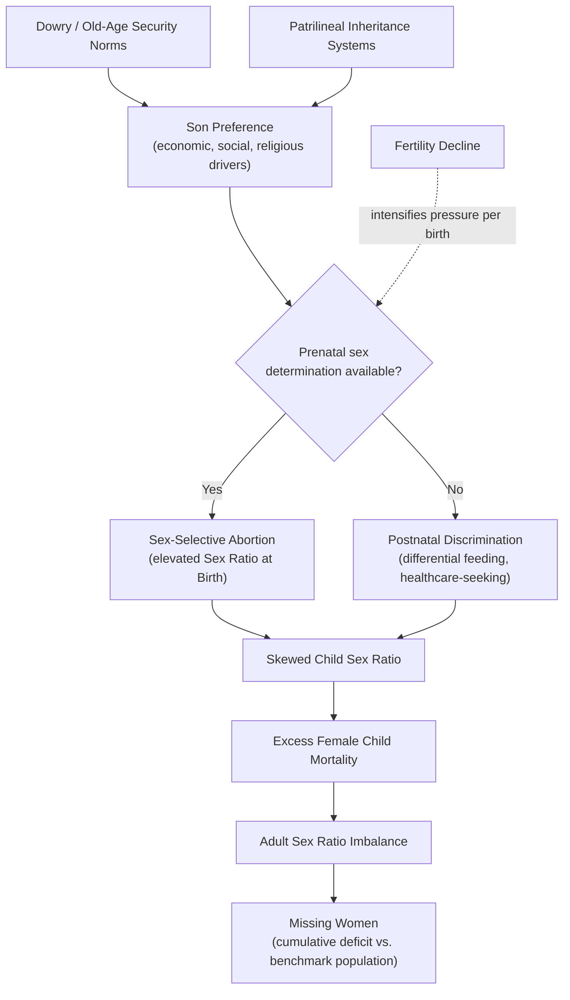

## Missing Women and Sex Ratio Imbalances

### Definition and Conceptual Origins

The concept of "missing women" was introduced by economist Amartya Sen in 1990 to describe the phenomenon of abnormally skewed population sex ratios in parts of the developing world, attributed to systematic discrimination against women and girls in access to healthcare, nutrition, and survival, rather than to natural biological variation. Sen's original calculation compared actual female-to-male population ratios in South Asia, West Asia, and China against the ratios observed in regions with lower gender discrimination (such as Sub-Saharan Africa, Europe, and North America), and estimated the gap in absolute numbers of women who would be alive if girls and women received the same care as boys and men.

The term is intentionally provocative: it does not refer to women who disappeared after being counted, but to a statistical deficit relative to a counterfactual benchmark. This deficit results from three overlapping mechanisms:

- **Prenatal discrimination**: sex-selective abortion following prenatal sex determination
- **Postnatal discrimination**: excess female infant and child mortality due to neglect in feeding, healthcare-seeking behavior, and medical attention
- **Adult-stage disadvantage**: excess female mortality at reproductive and older ages linked to maternal health neglect and unequal resource allocation within households

### The Natural Sex Ratio Benchmark

Human biology produces a fairly consistent baseline sex ratio at birth (SRB) absent intervention, typically expressed as males per 100 females or as a ratio such as 105:100.

$$SRB_{natural} \approx 105 \text{ males} : 100 \text{ females}$$

This male-skewed birth ratio is a well-documented biological regularity, but it is normally offset over the life course because male mortality rates exceed female mortality rates at nearly every age when both sexes receive equal care — due to a combination of genetic, immunological, and behavioral factors. Under conditions of equal treatment, populations tend toward near parity or a slight female majority in the overall population, especially at older ages.

**Key Points**

- A natural SRB of ~105:100 is well established in demographic literature and is not itself evidence of discrimination.
- What signals discrimination is a birth or child sex ratio significantly *above* the natural baseline, or a female-to-male mortality pattern inverted from the biologically expected pattern (i.e., girls dying at higher rates than boys in childhood, when the opposite is biologically expected).
- The "missing women" calculation is fundamentally a comparison against a counterfactual reference population, not an absolute biological standard — this makes measurement sensitive to the choice of benchmark population. [Inference: the specific magnitude of "missing women" estimates varies noticeably depending on which reference standard is used, since scholars have proposed several different benchmarks.]

### Sen's Original Estimation Method

Sen's approach compared the ratio of women to men in a given country against the ratio observed in a benchmark region considered to have minimal gender bias in mortality (commonly Sub-Saharan Africa in his original work). The number of "missing women" for a country was estimated as:

$$MW = P_f \times \left( \frac{F_{benchmark}}{M_{benchmark}} - \frac{F_{actual}}{M_{actual}} \right) \times M_{actual}$$

A simplified conceptual version, more commonly cited:

$$MW = \left( \frac{F_{expected}}{M_{actual}} \times M_{actual} \right) - F_{actual}$$

Where:

- $F_{expected}$ = female population implied by applying the benchmark region's female-to-male ratio
- $F_{actual}$ = observed female population
- $M_{actual}$ = observed male population

Sen's 1990 estimate placed the global total at over 100 million missing women, concentrated in China, India, Pakistan, Bangladesh, and West Asia.

**Example**

If a benchmark region has a female-to-male ratio of 1.02 (implying more women than men), and a country with 500 million men has an actual female-to-male ratio of 0.94, the expected female population would be $500,000,000 \times 1.02 = 510,000,000$, while the actual female population might be $500,000,000 \times 0.94 = 470,000,000$, yielding an estimated 40 million missing women in that country alone.

### Methodological Refinements and Critiques

Subsequent researchers refined Sen's methodology, arguing that a single cross-sectional comparison conflates multiple distinct causes and time periods.

**Coale's Age-Structured Approach (1991)**

Ansley Coale proposed comparing age-specific sex ratios against a model life table, allowing "missing women" to be decomposed by age group (birth, childhood, adulthood) rather than treated as one aggregate. This distinguished sex-selective abortion (visible at birth) from postnatal neglect (visible in child mortality data) from adult-stage disadvantage (visible in maternal mortality and adult sex ratios).

**Klasen's Critique and Adjustment (1994, with Wink 2002)**

Stephan Klasen argued Sen's benchmark (Sub-Saharan Africa) was itself imperfect, since Sub-Saharan Africa has its own elevated female mortality from causes like HIV/AIDS and maternal mortality unrelated to Asia-style discrimination. Klasen and Wink proposed adjustments and highlighted that by the early 2000s, the *rate* of missing women (as a share of female population) was declining in South Asia even as absolute *numbers* rose due to population growth — an important distinction between relative improvement and absolute worsening.

**Anderson and Ray (2010)**

Siwan Anderson and Debraj Ray disaggregated missing women estimates by cause of death and age group using cause-specific mortality data, finding that a substantial share of missing women in India, in particular, occurs at adult ages from diseases and causes not typically classified as "gender discrimination" in the popular sense (e.g., cardiovascular disease, injuries), suggesting the phenomenon is broader and more diffuse across the life cycle than earlier work implied, and not concentrated solely in infancy. [Inference: this finding shifted subsequent policy discussion toward examining healthcare access disparities across the entire female life course, not only sex-selective abortion and infant neglect.]

**Bongaarts and Guilmoto (2015)**

This work incorporated the effect of declining fertility on sex ratio distortion, showing that as families have fewer children, the incentive to sex-select intensifies for any given child (since there are fewer opportunities to have a son), which helps explain why sex ratio imbalances *worsened* in some rapidly developing, fertility-declining regions (e.g., parts of India and China) even as overall living standards rose.

### Core Drivers of Sex Ratio Imbalance

**Son Preference**

Son preference is the underlying cultural-economic driver in most affected regions, rooted in several overlapping incentive structures:

- **Old-age security**: in contexts with weak pension systems and patrilocal residence norms, sons are expected to support parents in old age while daughters join their husband's household after marriage, reducing perceived returns to investing in daughters
- **Dowry systems**: in regions with dowry practices (notably South Asia), daughters represent a net financial outflow at marriage, while sons may bring dowry inflows, creating a direct economic disincentive to raise daughters
- **Patrilineal inheritance and lineage continuity**: property, land rights, and family name continuation often pass through male heirs, reinforcing preference for sons
- **Religious and ritual roles**: in some traditions (e.g., Hindu funeral rites), sons hold specific ritual obligations unavailable to daughters

**Technology-Enabled Sex Selection**

The diffusion of ultrasound technology and other prenatal sex-determination methods from the 1980s onward is widely identified as the proximate technological enabler that converted latent son preference into observable sex ratio distortion at birth. Prior to widespread ultrasound access, son preference manifested primarily through postnatal neglect (differential feeding, healthcare-seeking, and care for sick daughters versus sons); after ultrasound diffusion, it shifted substantially toward prenatal sex selection, which does not require sustained neglect over years and carries lower social visibility.

**Fertility Decline Interaction**

As discussed under Bongaarts and Guilmoto above, declining total fertility rates (a hallmark of demographic transition and development) can paradoxically intensify sex selection pressure per birth, since families with a one- or two-child target have fewer chances to "achieve" a son through natural birth order alone.

### Regional Patterns

**China**

China's sex ratio at birth rose sharply from the early 1980s, reaching some of the highest recorded levels globally (peaking above 120 males per 100 females in some estimates during the 2000s), a pattern closely associated with the One-Child Policy (1980–2015) interacting with strong son preference in rural areas, combined with widespread ultrasound access. The relaxation and eventual end of the One-Child Policy has been followed by only gradual normalization of the birth sex ratio. [Inference: the persistence of skewed ratios after policy relaxation suggests son preference itself, not just the one-child constraint, remains a significant independent driver.]

**India**

India exhibits substantial sub-national variation, with sex ratios considerably more skewed in northern and northwestern states (Punjab, Haryana, parts of Delhi) compared to southern and northeastern states, correlating with regional differences in kinship systems, dowry prevalence, and female labor force participation. India's Pre-Conception and Pre-Natal Diagnostic Techniques (PCPNDT) Act (1994, amended 2003) criminalizes prenatal sex determination and disclosure, representing a direct legal intervention against the technological enabler.

**South Korea**

South Korea is frequently cited as a partial success case: sex ratio at birth rose substantially through the 1980s–1990s (reaching roughly 115–116 males per 100 females at its peak in the mid-1990s) but subsequently declined back toward the natural baseline by the 2010s, attributed to a combination of rapid economic development, rising female educational attainment and labor force participation, legal enforcement against sex-selective practices, and shifting social norms around son preference. This case is often used as evidence that sex ratio imbalance is not a fixed cultural constant but responsive to socioeconomic change and policy. [Inference: while multiple factors are associated with South Korea's normalization, the literature has not fully isolated the independent causal weight of each factor.]

**Other Affected Regions**

Sex ratio imbalances of varying severity have also been documented in Pakistan, Bangladesh, Vietnam, Armenia, Azerbaijan, and Georgia, with Caucasus countries emerging as a documented case since the 1990s despite the absence of a one-child-style policy, reinforcing that son preference and ultrasound access alone can drive skew without coercive population policy.

### Measurement Indicators

| Indicator | Definition | Discrimination Signal |
| --- | --- | --- |
| Sex Ratio at Birth (SRB) | Male live births per 100 (or per 1,000) female live births | Values above ~106 males per 100 females suggest prenatal sex selection |
| Child Sex Ratio (CSR) | Number of girls per 1,000 boys, typically ages 0–6 | Declining CSR over time signals combined prenatal selection and postnatal neglect |
| Under-5 Mortality Ratio (female/male) | Female under-5 mortality rate divided by male under-5 mortality rate | A ratio above 1 is anomalous, since male under-5 mortality is biologically expected to exceed female mortality absent discrimination |
| Overall Population Sex Ratio | Females per 1,000 males in total population | A low ratio (fewer women than men) across all ages suggests cumulative lifetime disadvantage |

**Key Points**

- SRB anomalies indicate prenatal selection specifically.
- CSR anomalies combine both prenatal and postnatal effects and cannot be decomposed without additional mortality data.
- An inverted female/male under-5 mortality ratio (i.e., greater than 1) is one of the clearest quantitative markers of postnatal neglect, since it contradicts the well-established biological pattern of higher male vulnerability in early childhood. [Behavior may vary across settings depending on data quality, birth registration completeness, and underlying disease environment.]

### Diagrammatic Overview

### Economic and Development Consequences

**Marriage Market Distortions**

Regions with severe sex ratio imbalance experience a growing surplus of unmarried men (sometimes termed a "marriage squeeze"), which some researchers link to increased bride trafficking and cross-border/cross-region bride purchasing, rising bride price in son-preference-adjacent regions (contrasted with dowry-driven regions), and social instability associated with large cohorts of unmarried men. [Speculation: some popular and academic commentary further links marriage-market surplus males to elevated crime rates or social unrest, but the causal evidence connecting sex ratio imbalance directly to crime rates is contested and methodologically difficult to isolate from confounding regional factors.]

**Labor Market and Human Capital**

A shrinking female cohort relative to male cohort represents a direct loss of human capital and labor supply, and by extension, forgone economic output. Discriminatory patterns in early-life healthcare and nutrition investment in girls also produce downstream effects on female human capital accumulation, health status, and productivity in adulthood.

**Intergenerational Transmission**

Households and communities with strong son preference frequently reproduce discriminatory resource allocation patterns across generations, meaning sex ratio imbalance is not typically self-correcting through economic growth alone; targeted legal, informational, and social norm interventions are generally required alongside broader development gains. [Inference: this claim follows from the persistence of skewed ratios in several middle-income, rapidly growing economies despite substantial GDP per capita growth over the same period, though the precise conditions under which growth alone is insufficient remain an active area of study.]

### Policy Responses

**Legal Bans on Prenatal Sex Determination**

India's PCPNDT Act and China's analogous restrictions on ultrasound-based sex disclosure represent direct supply-side interventions targeting the technological enabler. Enforcement challenges are widely documented, including underground/informal ultrasound access and cross-border service-seeking. [Unverified: precise current enforcement rates and compliance levels require up-to-date country-specific sources, as these figures change over time and vary by sub-region.]

**Conditional Cash Transfer and Incentive Programs**

Programs such as India's "Beti Bachao, Beti Padhao" (Save the Daughter, Educate the Daughter) initiative and various state-level conditional cash transfer schemes (e.g., Haryana's "Ladli" scheme, and similar programs in other Indian states) provide financial incentives tied to the birth and continued education of girls, intended to offset the perceived economic cost of raising daughters.

**Social Norm and Information Campaigns**

Public awareness campaigns aim to shift underlying son-preference norms directly, often combined with legal enforcement, since legal bans alone can be circumvented if underlying preferences remain unchanged.

**Old-Age Security and Pension Reform**

Because old-age security motives are a documented driver of son preference, some policy proposals argue that strengthening public pension systems and social security independent of family structure can reduce the economic rationale for son preference. [Inference: this is a theoretically grounded policy direction supported by the underlying economic logic of son preference, though direct empirical evidence isolating pension reform's independent causal effect on sex ratios specifically (separate from broader economic development) is more limited.]

### Related Concepts and Terminology

- **Excess Female Mortality**: mortality above the level expected under equal treatment, applicable across all age groups, not solely infancy
- **Female Infanticide**: direct killing of female infants after birth, historically documented in some regions, now largely (though not entirely) superseded by prenatal sex selection where ultrasound access is available
- **Gender-Biased Sex Selection (GBSS)**: the UN-preferred technical term encompassing both prenatal sex selection and prenatal discriminatory practices
- **Demographic Masculinization**: a broader term for population-level male-skewing sex ratios from any cause, of which missing women is the discrimination-attributed subset

**Next Steps**

- Amartya Sen's capability approach and its application to gender inequality
- Female labor force participation and the U-shaped feminization hypothesis
- Dowry systems and marriage market economics
- Intrahousehold bargaining models (Nash bargaining, collective household models)
- Maternal mortality and reproductive healthcare access in developing economies
- China's One-Child Policy: demographic and economic consequences
- Son preference and fertility decline interactions in demographic transition theory
- Gender and property/inheritance rights in developing economies
- Human trafficking and marriage migration linked to sex ratio imbalance
- Measuring gender inequality: the Gender Development Index (GDI) and Gender Inequality Index (GII)