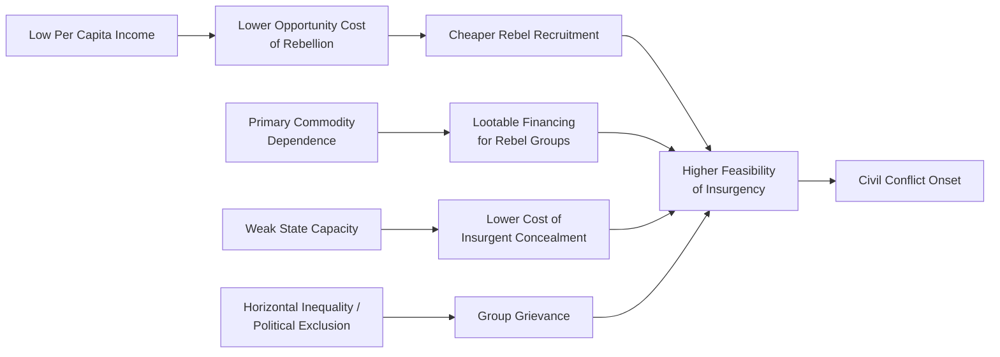

## Economic Causes and Consequences of Civil Conflict

### Definitional Scope

Civil conflict, in the development economics literature, generally refers to internal armed conflict within a state's borders, typically operationalized using conflict-death thresholds (e.g., the commonly cited 25 battle-related deaths per year threshold from the UCDP/PRIO Armed Conflict Dataset, or the higher 1,000-deaths-per-year threshold traditionally used to distinguish "civil war" from lower-intensity civil conflict in earlier datasets such as Correlates of War). The economic study of civil conflict spans two broad analytical directions:

- **Causes**: what economic conditions and structures make civil conflict onset more likely
- **Consequences**: how conflict, once underway, affects economic growth, capital, institutions, and human development, both during conflict and in its aftermath

**Key Points**

- Economic analysis of conflict treats civil war as endogenous to economic conditions, not merely as an exogenous shock — meaning causes and consequences are often studied as part of a feedback loop (conflict traps) rather than a one-directional relationship.
- Precise conflict-death thresholds vary by dataset (UCDP/PRIO, COW, ACLED), so cross-study comparisons require attention to which definition and threshold a given study uses. [Unverified: exact current threshold values and dataset coverage should be checked against the specific dataset version being cited, as these are periodically revised.]

### Theoretical Frameworks for Conflict Onset

**Greed vs. Grievance (Collier and Hoeffler)**

Paul Collier and Anke Hoeffler's influential body of work (notably their 2004 paper "Greed and Grievance in Civil War") proposed that civil war onset is better statistically predicted by "greed" factors — the economic feasibility and opportunity for rebellion — than by "grievance" factors such as ethnic or religious grievance, political repression, or inequality. Key feasibility factors identified include:

- **Primary commodity dependence**: economies heavily reliant on lootable natural resource exports (e.g., oil, diamonds, timber) show a statistically elevated conflict risk, since such resources are easy for rebel groups to loot, tax, or extort to finance insurgency
- **Low per capita income and low economic growth**: poverty reduces the opportunity cost of joining a rebellion (foregone civilian earnings are lower), making rebel recruitment cheaper and more feasible
- **Large diaspora populations**: diasporas can finance rebel groups from abroad without bearing the direct costs of conflict
- **Weak state capacity and difficult terrain**: mountainous or forested terrain lowers the cost of insurgent concealment and survival

**Grievance-Based Models**

Alternative and complementary frameworks emphasize horizontal inequality (systematic inequality between identity groups — ethnic, religious, or regional — as opposed to inequality between individuals), political exclusion of particular groups from power, and historical injustices as drivers of conflict onset. Frances Stewart's work on horizontal inequalities is a central reference point here, arguing that group-based inequality in economic, political, and social dimensions is a more robust predictor of conflict than the individual-level (vertical) inequality measures used in much of the Collier-Hoeffler tradition.

**Key Points**

- The "greed vs. grievance" framing is often presented as a dichotomy in introductory treatments, but subsequent literature (including later work by Collier and Hoeffler themselves) has moved toward integrated models recognizing that opportunity/feasibility and grievance factors are not mutually exclusive and often interact.
- [Inference: the empirical dominance of "feasibility" variables in early greed-grievance regressions may partly reflect data availability and measurability — economic and resource variables are easier to quantify cross-nationally than grievance variables like perceived injustice — rather than proof that grievance is causally unimportant.]

**State Capacity and Institutional Weakness**

A separate but related strand (associated with scholars such as James Fearon and David Laitin) emphasizes weak state administrative and military capacity, rather than ethnic diversity per se, as the key structural condition enabling insurgency, arguing that poverty is strongly correlated with weak states and that this correlation, rather than ethnic grievance, explains much of the cross-national variation in civil war onset.

**Resource Curse and Conflict**

The "resource curse" literature intersects directly with conflict economics: point-source, lootable resources (oil, alluvial diamonds, narcotics-adjacent crops) are associated with higher conflict risk and duration, while diffuse resources (agricultural land, non-lootable minerals) show weaker or different associations. Michael Ross's empirical work is a frequently cited reference in tracing these distinctions.

### Economic Mechanisms Linking Poverty and Conflict Onset

### Immediate Economic Consequences of Conflict

**Output and Growth Losses**

Civil conflict is robustly associated with substantial GDP growth losses, both during the conflict period and often for years afterward. Growth losses arise through multiple compounding channels:

- **Destruction of physical capital**: infrastructure, factories, agricultural land, and housing stock are damaged or destroyed
- **Capital flight and reduced investment**: both domestic and foreign investors withdraw or defer capital in response to heightened risk, reducing the capital stock available for future production
- **Labor market disruption**: conflict-induced mortality, injury, displacement, and conscription remove workers from productive activity
- **Trade disruption**: conflict frequently disrupts internal and external trade routes, market access, and supply chains
- **Fiscal diversion**: government spending shifts from productive investment (health, education, infrastructure) toward military expenditure

**Human Capital Destruction**

Beyond direct conflict mortality, civil war is associated with long-run human capital losses through disrupted schooling (school closures, destroyed school infrastructure, child recruitment into armed groups), disrupted healthcare access (destroyed health infrastructure, disrupted vaccination and maternal health programs), and malnutrition, particularly among children, with documented long-run effects on cohort health and human capital outcomes into adulthood. [Behavior may vary substantially by conflict intensity, duration, and geographic concentration — national-level aggregate figures often mask severe sub-national heterogeneity.]

**Displacement**

Civil conflict is a leading driver of both internal displacement (Internally Displaced Persons, IDPs) and cross-border refugee flows, with economic consequences for both origin and destination areas: origin regions lose labor and human capital, while destination regions (whether other regions within the same country or neighboring countries) face resource and labor market pressures, though the net economic effect on host communities is empirically debated and context-dependent. [Inference: research on refugee impacts on host labor markets has produced mixed findings across different contexts, suggesting the net effect depends heavily on host country labor market flexibility, sectoral composition, and the skill profile of displaced populations, rather than pointing to a single universal outcome.]

**Fiscal and Institutional Effects**

Conflict typically degrades state fiscal capacity through reduced tax collection capability (disrupted administrative infrastructure, reduced economic activity, and territorial contestation limiting the state's reach), increased military expenditure crowding out development spending, and, in prolonged conflicts, the erosion of formal governance institutions and rule of law, sometimes replaced by informal or rebel-administered parallel governance structures in contested territories.

### The Conflict Trap

Collier's concept of the "conflict trap" describes a self-reinforcing cycle in which conflict causes economic decline, and economic decline in turn raises the future risk of conflict recurrence, creating a persistent low-income, high-conflict-risk equilibrium.

$$P(\text{conflict onset}_{t+1}) = f(\text{Y}_t, \text{growth}_t, \text{institutions}_t, \ldots), \quad \frac{\partial P}{\partial Y_t} < 0$$

Where lower income $Y_t$ and slower growth at time $t$ increase the probability of conflict onset in the subsequent period, and conflict itself reduces $Y_{t+1}$, closing the loop.

**Key Points**

- Collier's associated empirical claim (often cited in policy literature) that roughly half of countries emerging from civil war experience conflict recurrence within a decade is a widely referenced estimate in the post-conflict literature. [Unverified: the precise recurrence rate figure varies somewhat across studies and time periods studied, and readers should consult the specific dataset and time window used in any given citation before treating it as a fixed constant.]
- The conflict trap framework has direct implications for post-conflict aid and reconstruction policy, since it implies that economic recovery assistance is not merely humanitarian but also conflict-risk-reducing.

### Post-Conflict Economic Recovery Patterns

**Growth Rebound (Conditional Convergence in Post-Conflict Settings)**

Empirical work (including Collier and Hoeffler's post-conflict growth studies) finds that many post-conflict economies experience an above-average growth rebound in the years immediately following conflict termination, consistent with conditional convergence dynamics (capital-scarce economies recovering toward their pre-conflict or steady-state trajectory), though this rebound is neither universal nor automatic and depends heavily on institutional quality, continued peace, and the policy environment.

**Aid Effectiveness in Post-Conflict Settings**

Collier and Hoeffler's research also examined the timing and effectiveness of foreign aid in post-conflict recovery, generally finding that aid absorption capacity is limited immediately after conflict ends (due to damaged institutions and administrative capacity) but that aid effectiveness for growth tends to improve in the medium term (roughly years 4 through 7 post-conflict, in some of their specifications) as absorptive capacity recovers. [Inference: this timing pattern implies a policy tension between the humanitarian urgency to disburse aid immediately after conflict and the empirical finding that absorption and growth returns to aid may be higher somewhat later in the recovery process.]

**Demobilization, Disarmament, and Reintegration (DDR)**

DDR programs represent a specific post-conflict economic intervention aimed at transitioning ex-combatants into civilian economic life, typically involving disarmament (collection and destruction of weapons), demobilization (formal and controlled discharge of combatants from armed groups), and reintegration (economic and social support — vocational training, cash grants, land access — to help ex-combatants re-enter civilian economic activity). DDR program design is widely recognized in the literature as critical to preventing conflict recurrence, since unemployed and unreintegrated ex-combatants represent a readily available pool for renewed recruitment into armed violence or organized crime.

### Sub-National and Micro-Level Evidence

More recent conflict economics research (enabled by improved geocoded conflict event data, e.g., ACLED and the UCDP Georeferenced Event Dataset) has shifted toward sub-national and household-level analysis, examining:

- **Spatial spillovers**: how conflict in one locality affects economic activity, trade, and displacement in adjacent, non-conflict-affected areas
- **Micro-level shocks**: household-level welfare effects of conflict exposure, including asset loss, consumption smoothing failures, and long-run effects on affected children's health and educational attainment (often studied using difference-in-differences or event-study designs exploiting variation in conflict timing and geographic exposure)
- **Firm-level responses**: how firms adapt location, investment, and hiring decisions in response to localized conflict risk

**Key Points**

- This micro-level turn in the literature has allowed researchers to identify causal mechanisms more precisely than earlier cross-country regression approaches, which faced substantial identification challenges (reverse causality between conflict and growth, omitted variable bias from unobserved institutional quality).
- [Inference: the shift toward geocoded, sub-national data has likely improved causal identification relative to earlier cross-country growth regressions, though sub-national studies in turn face their own identification challenges, such as endogenous selection of conflict locations and measurement error in geocoded event data.]

### Natural Resources, Conflict Financing, and Duration

Beyond onset, natural resources also affect conflict *duration* and *termination* dynamics: resource-rich conflicts (e.g., diamonds in Sierra Leone and Angola, timber in Cambodia, coltan and other minerals in the Democratic Republic of Congo) have been associated in the literature with longer conflict duration, since lootable resource revenue allows rebel groups to sustain military operations independent of popular support or external state sponsorship. This has motivated policy interventions such as the Kimberley Process Certification Scheme, aimed at restricting "conflict diamond" trade financing to rebel groups, though the scheme's effectiveness and scope limitations are actively debated in the literature. [Unverified: current assessments of Kimberley Process effectiveness and any recent reforms should be checked against up-to-date sources, since certification scheme design and compliance evolve over time.]

### Gender and Household Economic Effects

Civil conflict frequently produces gendered economic effects, including shifts in household headship (increased female-headed households due to male conflict mortality or conscription), changes in female labor force participation (sometimes rising during conflict due to necessity, with mixed evidence on whether these gains persist post-conflict), and disrupted intergenerational human capital transmission through interrupted girls' schooling in particular, which several studies link to early marriage and reduced long-run female educational attainment in conflict-affected cohorts. [Inference: while multiple case studies document these patterns, the degree and persistence of female labor force participation gains after conflict ends appears highly context-dependent across different post-conflict settings studied in the literature, rather than following one universal trajectory.]

### Illustrative Framework: The Conflict-Development Feedback Loop

<svg xmlns="http://www.w3.org/2000/svg" viewBox="0 0 900 500">
<text x="450" y="30" text-anchor="middle" font-size="18" font-weight="bold" fill="#1a1a1a">Conflict-Development Feedback Loop (svg_diagram)</text>
<ellipse cx="150" cy="120" rx="120" ry="55" fill="#fde2e2" stroke="#c0392b" stroke-width="2" />
<text x="150" y="115" text-anchor="middle" font-size="14" fill="#1a1a1a">Low Income /</text>
<text x="150" y="133" text-anchor="middle" font-size="14" fill="#1a1a1a">Weak Institutions</text>
<ellipse cx="450" cy="120" rx="120" ry="55" fill="#fdebd0" stroke="#d68910" stroke-width="2" />
<text x="450" y="115" text-anchor="middle" font-size="14" fill="#1a1a1a">Civil Conflict</text>
<text x="450" y="133" text-anchor="middle" font-size="14" fill="#1a1a1a">Onset</text>
<ellipse cx="750" cy="120" rx="120" ry="55" fill="#f9e79f" stroke="#b7950b" stroke-width="2" />
<text x="750" y="115" text-anchor="middle" font-size="14" fill="#1a1a1a">Capital, Human Capital,</text>
<text x="750" y="133" text-anchor="middle" font-size="14" fill="#1a1a1a">Institutional Destruction</text>
<ellipse cx="450" cy="300" rx="140" ry="55" fill="#d5f5e3" stroke="#1e8449" stroke-width="2" />
<text x="450" y="295" text-anchor="middle" font-size="14" fill="#1a1a1a">GDP Decline /</text>
<text x="450" y="313" text-anchor="middle" font-size="14" fill="#1a1a1a">Reduced Growth</text>
<ellipse cx="450" cy="440" rx="150" ry="45" fill="#d6eaf8" stroke="#1f618b" stroke-width="2" />
<text x="450" y="445" text-anchor="middle" font-size="14" fill="#1a1a1a">Elevated Future Conflict Risk (Conflict Trap)</text>
<line x1="270" y1="120" x2="330" y2="120" stroke="#555" stroke-width="2" marker-end="url(#arrow1)" />
<line x1="570" y1="120" x2="630" y2="120" stroke="#555" stroke-width="2" marker-end="url(#arrow1)" />
<line x1="700" y1="175" x2="530" y2="260" stroke="#555" stroke-width="2" marker-end="url(#arrow1)" />
<line x1="450" y1="355" x2="450" y2="395" stroke="#555" stroke-width="2" marker-end="url(#arrow1)" />
<path d="M 340 440 C 100 440, 30 250, 90 155" stroke="#555" stroke-width="2" fill="none" marker-end="url(#arrow1)" />
</svg>

### Related Concepts and Terminology

- **UCDP/PRIO Armed Conflict Dataset**: the standard cross-country conflict event dataset used in much of this literature
- **Horizontal vs. Vertical Inequality**: group-based versus individual-based inequality measures, central to grievance-based conflict theories
- **Resource Curse**: the broader development economics literature on natural resource dependence and adverse economic/institutional outcomes, of which conflict is one specific channel
- **Fragile and Conflict-Affected States (FCS)**: World Bank classification and associated operational framework for aid engagement in conflict-affected contexts
- **State Fragility**: a broader concept encompassing weak governance, service delivery failure, and legitimacy deficits, of which conflict vulnerability is one dimension

**Next Steps**

- Post-conflict reconstruction and state-building strategies
- Fragile and Conflict-Affected States (FCAS) classification frameworks and World Bank/IMF engagement models
- Refugee and forced displacement economics
- Natural resource curse and Dutch disease
- Horizontal inequality and identity-based political economy
- Peacebuilding, peacekeeping economics, and UN mission cost-effectiveness
- DDR (Disarmament, Demobilization, Reintegration) program design and evaluation
- Foreign aid effectiveness in fragile states
- Sub-national conflict data and geocoded econometric methods (ACLED, UCDP-GED)
- Institutions and state capacity theory in development economics