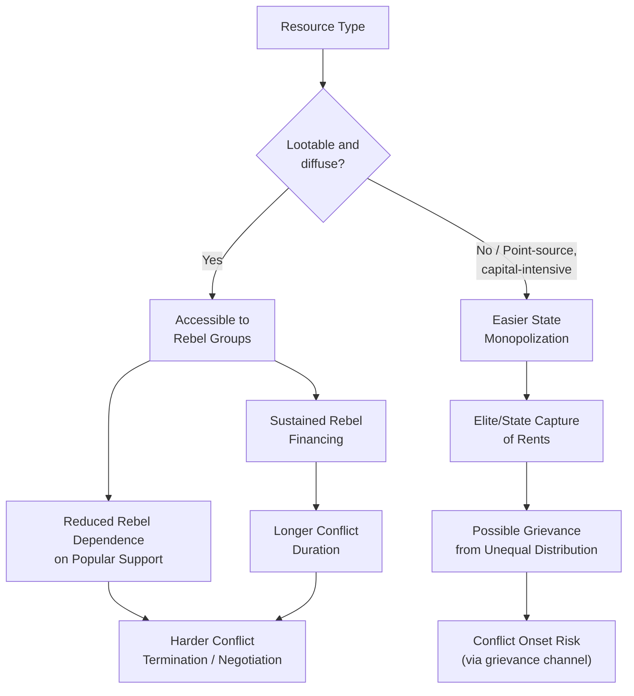

## Resource Conflicts and Civil War

### Definitional Scope

Resource conflict, in this context, refers to civil war and armed conflict in which natural resource wealth plays a causal or sustaining role — either as a motive for conflict onset, a source of financing that sustains conflict once underway, or a factor shaping conflict duration, intensity, and termination dynamics. This is a distinct but overlapping strand within the broader civil conflict literature, focused specifically on the resource dimension rather than conflict causation generally.

Natural resources relevant to this literature are typically classified along two dimensions that matter for conflict dynamics:

- **Lootability**: how easily a resource can be extracted, transported, and sold by armed non-state actors without large fixed capital or complex extraction infrastructure (e.g., alluvial diamonds, coltan, timber, narcotics crops) versus resources requiring capital-intensive extraction infrastructure controlled more easily by the state (e.g., deep-shaft mining, offshore oil)
- **Location relative to state power center**: "point-source" resources concentrated in a specific location (oil fields, kimberlite diamond pipes) versus "diffuse" resources spread across a wide territory (agricultural land, alluvial gemstones, artisanal minerals)

**Key Points**

- These two dimensions matter because they shape *who* can capture resource rents — a centralized, capital-intensive point-source resource is easier for an incumbent government to monopolize, while a diffuse, lootable resource is easier for rebel groups, local militias, or secessionist movements to access and finance operations from.
- [Inference: this classification framework, most closely associated with Michael Ross's work, is widely used in the literature but does not perfectly predict outcomes in every case, since resource governance, existing institutions, and historical context also mediate how resource type translates into conflict risk.]

### Theoretical Channels Linking Resources to Conflict

**Resource Rents as Conflict Motive ("Greed")**

In the Collier-Hoeffler tradition, valuable natural resources create a prize worth fighting over, incentivizing both incumbent elites and challenger groups to seek control of resource-rich territory or resource revenue streams. Primary commodity export dependence was found to be one of the more robust statistical predictors of civil war onset in Collier and Hoeffler's cross-country regressions, with the relationship often described as non-monotonic — the estimated relationship between primary commodity export share of GDP and conflict risk rises then falls, implying conflict risk peaks at a moderate-to-high degree of resource dependence rather than continuing to rise at the very highest levels of dependence. [Unverified: the specific functional form and inflection point of this non-monotonic relationship vary across model specifications and dataset vintages in the literature, so any specific numeric threshold cited should be checked against the particular study being referenced.]

**Resource Rents as Conflict Financing**

Independent of whether resources motivate conflict onset, resource wealth provides a financing mechanism that sustains conflict once it has started, by giving rebel groups an independent revenue source not contingent on continued popular support, foreign state sponsorship, or diaspora funding. This financing channel is a key reason resource wealth is more strongly and consistently associated with conflict *duration* than with conflict *onset* in much of the empirical literature — resources may matter more for how long a war lasts and how it is fought than for whether it starts in the first place. [Inference: this onset-versus-duration distinction reflects a recurring pattern across multiple studies rather than a single source, though the relative strength of the "duration" relationship compared to the "onset" relationship differs somewhat depending on the specific resource type and dataset examined.]

**Grievance from Resource Extraction**

A separate grievance-oriented channel emphasizes that resource extraction itself can generate local grievances that motivate conflict, particularly where extraction causes environmental damage to local livelihoods (e.g., oil spills affecting fishing and farming communities), local populations perceive unfair distribution of resource revenue (revenue captured by central government or foreign firms while extraction-adjacent communities bear environmental and social costs), and resource extraction displaces local populations or disrupts land rights without adequate compensation. The Niger Delta conflict in Nigeria is frequently cited as an example combining both financing (oil theft, "bunkering") and grievance (environmental damage, revenue-sharing disputes) channels simultaneously.

**Secessionist Dynamics**

Point-source resources located in a specific sub-national region create a distinct incentive structure for regional secessionist movements, since a region with concentrated resource wealth may calculate that independence would allow it to retain a larger share of resource rents than remaining within the existing national fiscal arrangement. This dynamic has been discussed in relation to conflicts such as Biafra's attempted secession from Nigeria (oil) and Aceh's separatist conflict in Indonesia (natural gas), among others.

### Empirical Case Patterns

**Alluvial Diamonds: Sierra Leone and Angola**

Sierra Leone's civil war (1991–2002) and the Angolan civil war (1975–2002, with major phases) are among the most extensively studied cases of lootable resource financing of rebel insurgency. In both cases, rebel factions (the Revolutionary United Front in Sierra Leone; UNITA in Angola) derived substantial revenue from alluvial diamond extraction and smuggling, financing weapons purchases and troop payments largely independent of external state patronage after the end of Cold War-era superpower sponsorship. These cases directly motivated the "conflict diamond" or "blood diamond" policy discourse and the subsequent creation of the Kimberley Process Certification Scheme (2003), an international certification regime intended to exclude diamonds originating from conflict zones from legitimate international trade.

**Timber: Cambodia**

The Khmer Rouge's remaining forces in Cambodia during the 1990s financed continued insurgency substantially through illegal timber extraction and cross-border timber sales, illustrating that lootable-resource conflict financing is not limited to gemstones but extends to other extractable commodities with accessible international markets.

**Coltan and Minerals: Democratic Republic of Congo**

The conflict dynamics in the eastern Democratic Republic of Congo, particularly from the late 1990s through the 2000s and beyond, have been extensively linked in the literature to competition over control of coltan (used in electronics manufacturing), gold, tin ore (cassiterite), and other minerals, with multiple armed groups (including foreign-backed militias) deriving financing from mineral extraction and taxation of mining areas. This case is frequently cited as an example of how resource financing can help sustain multiple, overlapping, and prolonged conflict actors rather than a single clearly defined rebel-versus-government dynamic. [Unverified: the DRC conflict involves a highly complex, multi-actor landscape that has evolved considerably across multiple distinct phases since the 1990s; specific current details on active armed groups and control dynamics should be verified against recent sources given how frequently the situation on the ground changes.]

**Oil: Multiple Cases**

Oil-related conflict dynamics have been studied across contexts including Nigeria's Niger Delta (grievance and financing combined, as noted above), Sudan/South Sudan (oil revenue-sharing disputes as a contributing factor in both the pre-2011 north-south conflict and subsequent tensions), and Iraq (control of oil infrastructure and revenue as both a conflict driver and post-conflict governance challenge). Oil's high value density and centralized extraction infrastructure generally make it more capturable by incumbent states than by dispersed rebel groups compared to alluvial resources, though this does not preclude oil-linked conflict where control over oil-producing regions or revenue distribution itself is contested.

### Distinguishing Onset, Duration, and Termination Effects

**Key Points**

- A recurring finding in this literature is that lootable resources are associated more with prolonging and complicating conflict *termination* than with conflict *onset* — because rebel groups with independent resource financing have less incentive to negotiate a settlement, since ending the conflict would mean losing access to that revenue stream.
- [Inference: this termination-difficulty finding has direct policy implications, suggesting that peace negotiations in resource-financed conflicts may need to explicitly address post-conflict resource revenue-sharing arrangements as part of the settlement, not merely security and political power-sharing terms, since unresolved resource control disputes are a plausible channel for conflict recurrence.]

### Governance and Institutional Mediating Factors

The relationship between resource wealth and conflict is not deterministic; institutional quality substantially mediates outcomes. Resource-rich countries with strong pre-existing institutions and transparent revenue management (frequently cited comparators include Botswana's diamond sector and Norway's oil sector) have avoided the resource-conflict pattern observed in weaker-institution contexts, suggesting that the "resource curse" and resource conflict phenomena are conditional on institutional quality rather than an automatic consequence of resource wealth itself. [Inference: this comparison is widely used in the literature to argue for the causal importance of institutions, though Botswana and Norway also differ from many resource-conflict cases along other dimensions — such as colonial history, ethnic composition, and timing of resource discovery relative to state formation — making it difficult to attribute the outcome solely to institutional quality in a fully isolated way.]

**Key Points**

- Policy and institutional interventions proposed to weaken the resource-conflict link include revenue transparency initiatives (e.g., the Extractive Industries Transparency Initiative, EITI), supply-chain certification schemes (e.g., the Kimberley Process for diamonds, and subsequent "conflict minerals" due diligence frameworks for tin, tantalum, tungsten, and gold associated with the DRC region), and sovereign wealth fund or revenue-sharing mechanisms designed to ensure broader and more transparent distribution of resource rents.
- The effectiveness of these interventions is actively debated in the literature, with critiques noting enforcement gaps, smuggling around certification regimes, and cases where formal compliance does not eliminate underlying grievance or elite capture dynamics. [Unverified: current, up-to-date assessments of specific certification scheme effectiveness and compliance rates should be checked against recent sources, since these evolve over time and are subject to ongoing evaluation and reform.]

### Post-Conflict Resource Governance Challenges

Resource-financed conflicts pose distinct post-conflict reconstruction challenges relative to non-resource conflicts, including the need to formalize and regulate resource sectors previously operating through informal, illicit, or rebel-controlled extraction and trade networks; the risk of resource revenue capture by former combatant elites who transition into formal political or economic power in the post-conflict settlement, potentially reproducing pre-conflict grievance dynamics under new leadership; and the design of revenue-sharing arrangements between central government and resource-producing sub-national regions, which is frequently a central and contentious element of peace agreements in resource-conflict cases (e.g., oil revenue-sharing provisions in the 2005 Sudan Comprehensive Peace Agreement).

### Related Concepts and Terminology

- **Resource Curse**: the broader macroeconomic and institutional literature on adverse development outcomes associated with natural resource abundance, of which conflict is one specific manifestation
- **Dutch Disease**: the macroeconomic mechanism (currency appreciation from resource export revenue crowding out other tradable sectors) often discussed alongside, but analytically distinct from, resource-conflict dynamics
- **Conflict Minerals**: the specific policy and supply-chain terminology applied to tin, tantalum, tungsten, and gold sourced from the DRC and adjoining region, subject to due diligence requirements under frameworks such as the OECD Due Diligence Guidance and associated national regulations
- **Rentier State**: a state deriving a substantial share of revenue from resource rents rather than domestic taxation, a condition frequently discussed as related to both resource curse and resource conflict dynamics through its effects on state-society accountability relationships

**Next Steps**

- Resource curse theory and Dutch disease mechanisms
- Extractive Industries Transparency Initiative (EITI) and revenue transparency frameworks
- Rentier state theory and taxation-accountability linkages
- Conflict minerals due diligence and supply chain regulation (OECD guidance, Dodd-Frank Section 1502)
- Post-conflict revenue-sharing agreement design
- Secessionist movements and fiscal federalism in resource-rich regions
- Environmental grievance and extractive industry community relations
- Sovereign wealth funds as resource revenue management tools
- Sanctions and conflict-resource trade restriction regimes
- Comparative institutional analysis: Botswana and Norway as resource governance benchmarks