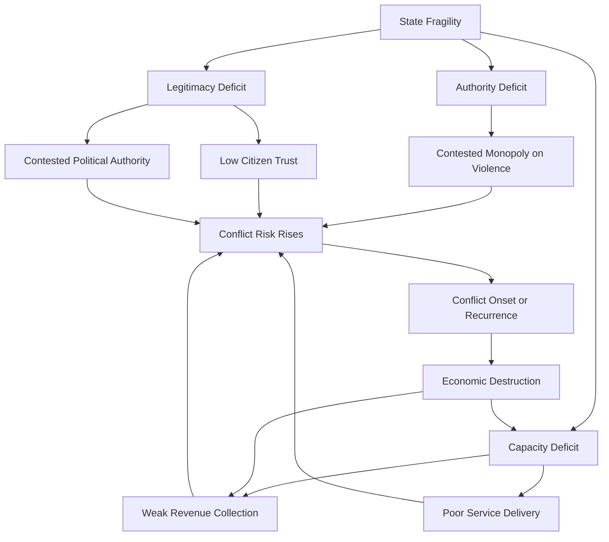

## Fragile and Failed States Framework

### Overview

The fragile and failed states framework is a conceptual and analytical apparatus used in development economics and international relations to classify, measure, and explain state incapacity — the inability or unwillingness of a government to perform core functions expected of a sovereign state. These core functions typically include security provision (monopoly on legitimate violence), basic public service delivery, rule of law, and legitimate political authority over a defined territory and population.

The framework matters for development economics because state fragility is strongly correlated with — and is argued by many scholars to be causally linked to — poverty traps, civil conflict recurrence, weak institutional capacity for growth, and aid effectiveness challenges. Fragility is now treated as a distinct category in development policy (World Bank, OECD, and bilateral donors maintain separate fragility-focused lending windows and diagnostic tools).

### Defining the Continuum: Weak, Fragile, Failed, Collapsed

Terminology in this field is not perfectly standardized across institutions, but a widely used conceptual continuum runs as follows:

- **Weak state**: Government has limited capacity in some sectors but retains general legitimacy and functional core institutions.
- **Fragile state**: Government exhibits significant deficits in one or more of: authority (monopoly on violence), legitimacy (social contract with citizens), and capacity (service delivery, revenue collection). Fragility is often treated as multidimensional and matter of degree rather than a binary state.
- **Failed state**: Central government has lost effective control over significant portions of its territory, cannot perform basic functions, and often faces active internal armed challenges to its authority.
- **Collapsed state**: Complete or near-complete disappearance of governmental authority; a structural vacuum where non-state or informal actors substitute for state functions entirely (historical examples cited in the literature include Somalia in the early 1990s).

**[Inference]** These categories are best understood as points along a continuum rather than as discrete, universally agreed-upon thresholds — different indices and institutions draw the boundaries differently, and a state can be fragile in some dimensions (fiscal capacity) while functional in others (basic security in the capital).

### Core Dimensions of State Fragility

Most analytical frameworks decompose fragility into three to four interacting dimensions:

1. **Authority/Security**: The state's monopoly on the legitimate use of force is contested by armed non-state actors (insurgents, militias, criminal organizations, warlords).
2. **Capacity**: The state's ability to raise revenue, deliver public services (health, education, infrastructure), and administer territory effectively.
3. **Legitimacy**: The degree to which the population and international community recognize the government's right to rule — encompassing electoral legitimacy, performance legitimacy, and traditional/customary legitimacy.
4. **Social contract / resilience** (used in more recent frameworks, e.g., OECD): The state's capacity to manage shocks (economic, environmental, political) without descending into crisis, and to respond to societal expectations.

A state can be fragile in one dimension without being fragile in others — for example, a state with strong military control (authority) but very weak service delivery (capacity), or high service delivery but low legitimacy due to authoritarian rule.

### Major Fragility Indices and Frameworks

**Fragile States Index (FSI)** — published annually by the Fund for Peace

- Aggregates 12 indicators across four baskets: Cohesion (security apparatus, factionalized elites, group grievance), Economic (economic decline, uneven development, human flight/brain drain), Political (state legitimacy, public services, human rights), and Social/Cross-Cutting (demographic pressures, refugees/IDPs, external intervention).
- Produces a composite score and country ranking, widely cited but also critiqued for methodological opacity and conflation of distinct concepts (e.g., "state fragility" vs. "state weakness" vs. "conflict risk") into a single index number.

**World Bank Harmonized List of Fragile Situations**

- Used operationally to determine eligibility for concessional financing terms (e.g., IDA's fragility-related allocations).
- Combines a quantitative threshold based on the Country Policy and Institutional Assessment (CPIA) score with a qualitative criterion for the presence of a UN/regional peacekeeping or peacebuilding mission.
- [Inference] This operational definition is narrower and more policy-instrumental than academic fragility frameworks — it is designed to trigger specific financing modalities rather than to comprehensively theorize state fragility.

**OECD States of Fragility Framework**

- Moved from a single fragility index toward a multidimensional model (as of the 2016 report onward) assessing fragility across five dimensions: economic, environmental, political, security, and societal.
- Explicitly reframes fragility as a matter of *risks exceeding a state/society's capacity to cope*, rather than treating fragile states as a fixed category of "bad" states.

**Failed States/Fragile States academic origins**

- The "failed state" terminology gained prominence in the 1990s post-Cold War period, associated with cases such as Somalia, Liberia, and Sierra Leone, and was popularized in policy circles partly through Foreign Policy magazine's early Failed States Index (the predecessor to the FSI).
- Academic critics (e.g., Charles Call's work on differentiating "gap" concepts — capacity gap, security gap, legitimacy gap) argued the "failed state" label was too totalizing and advocated disaggregating fragility into distinct, independently assessable gaps.

### The Fragility-Conflict-Poverty Nexus

Development economics research has established several empirical regularities connecting fragility to economic outcomes:

- **Conflict traps**: Collier and colleagues' work on civil war (notably Paul Collier's research at Oxford's Centre for the Study of African Economies) proposed that low income, economic dependence on primary commodity exports, and prior conflict history increase the risk of conflict onset and recurrence — creating a self-reinforcing "conflict trap" in which war destroys the economic conditions that could otherwise reduce the risk of future war.
- **The "bottom billion" framework**: Collier's *The Bottom Billion* (2007) argued that a subset of roughly 50-60 low-income countries, disproportionately affected by conflict, resource dependence, being landlocked with poor neighbors, or poor governance in a small country, were falling behind rather than converging with the rest of the developing world — fragility being a central mechanism trapping these states.
- **Growth costs of fragility**: Cross-country growth regressions consistently find fragile and conflict-affected states underperform on GDP growth, human capital accumulation, and investment relative to peer income-level countries, though precise magnitude estimates vary by study and time period [Inference: exact growth cost estimates are sensitive to model specification and the conflict/fragility measure used].
- **Aid effectiveness in fragile settings**: The traditional aid-effectiveness literature (e.g., Burnside-Dollar-style models positing aid works better with good policy) faces particular complications in fragile states, since weak institutional capacity undermines aid absorption, and donors often face a trade-off between channeling aid through weak state institutions (building capacity but risking diversion/corruption) versus bypassing the state via NGOs (delivering services but potentially further undermining state legitimacy and capacity-building).

### Diagram: Fragility Dimension Interactions

The feedback loop from conflict back into capacity deficits (via destroyed infrastructure, disrupted revenue collection, and human capital flight) illustrates the self-reinforcing "conflict trap" dynamic central to the fragility literature.

### The "Good Governance" vs. "State-Building First" Policy Debate

A major policy debate concerns sequencing: should international interventions in fragile states prioritize governance reforms (elections, anti-corruption, decentralization) immediately, or should state-building (basic security, minimal administrative capacity) precede governance reforms?

- **Governance-first critics** argue that imposing liberal governance templates (elections, market liberalization) too early in fragile transitions can destabilize fragile power-sharing arrangements — a view associated with scholars like Roland Paris (*At War's End*) who critiqued rapid post-conflict liberalization ("Institutionalization Before Liberalization" thesis).
- **State-building-first proponents** (echoed in frameworks like the OECD's *Principles for Good International Engagement in Fragile States*) argue basic security and administrative functionality are prerequisites for any governance reform to be meaningful or sustainable.
- [Speculation] This sequencing debate remains unresolved in the literature and is highly context-dependent; there is no consensus formula, and case-specific political economy factors (elite bargains, external security guarantees, resource endowments) appear to matter more than sequencing choice alone in determining outcomes.

### Measurement Critiques and Methodological Concerns

- **Conflation problem**: Composite fragility indices often bundle together conceptually distinct phenomena — active violent conflict, weak fiscal capacity, authoritarian governance, and demographic pressure — into one score, which can obscure which specific deficit is driving a country's classification and misdirect policy responses.
- **Endogeneity and circularity**: Some fragility indicators (e.g., "state legitimacy," "human rights") are difficult to measure independently of the outcomes fragility is meant to explain (conflict, poor governance), raising concerns about circular reasoning in fragility-outcome regressions.
- **Western-centric governance benchmarks**: Critics (e.g., scholars associated with the "hybrid political orders" literature, such as Volker Boege and colleagues) argue fragility frameworks implicitly benchmark against a Weberian, Western state-formation model, potentially mischaracterizing functional but non-Western-style governance arrangements (customary authority, hybrid state/non-state governance) as "failures" when they may represent locally legitimate and effective institutional alternatives.
- **Data quality in fragile settings**: By definition, fragile and conflict-affected states have the weakest statistical capacity, meaning the underlying data feeding fragility indices (GDP, poverty rates, mortality) is often of lower quality or reliability than in stable states — a methodological irony noted throughout the literature.

### Worked Example: Applying the Framework to a Hypothetical Case

Consider a hypothetical state, "Country X," with the following profile: a functioning capital-city bureaucracy that collects taxes and runs schools in urban areas; an active insurgency controlling roughly 30% of rural territory; and a government widely perceived as legitimate among urban populations but viewed as an ethnic-minority-dominated regime by rural populations.

Applying the multidimensional framework:

- **Authority**: Low in insurgent-controlled territory, moderate-to-high in government-controlled areas — fragility is *spatially uneven*, not uniform across the country.
- **Capacity**: Moderate in urban centers, near-absent in contested rural zones.
- **Legitimacy**: Bifurcated along ethnic/geographic lines — high among one group, low among another.

This spatial and social unevenness is why modern fragility frameworks (particularly the OECD's) emphasize disaggregated, subnational analysis over a single national fragility score, since Country X's most policy-relevant fragility likely applies asymmetrically to specific regions or population segments rather than the state as a whole.

### Related Topics

- Civil war onset and duration models (Collier-Hoeffler "greed vs. grievance" framework)
- Post-conflict reconstruction and peacebuilding sequencing
- Foreign aid effectiveness in weak-institution environments
- Resource curse and its interaction with state fragility
- State capacity and fiscal extraction theories (Besley and Persson's work on state capacity investment)
- Security sector reform and disarmament, demobilization, and reintegration (DDR) programs
- Hybrid political orders and customary/informal governance institutions
- Refugee and internally displaced persons (IDP) economics in fragile contexts
- Institutional resilience and shock-responsive social protection systems