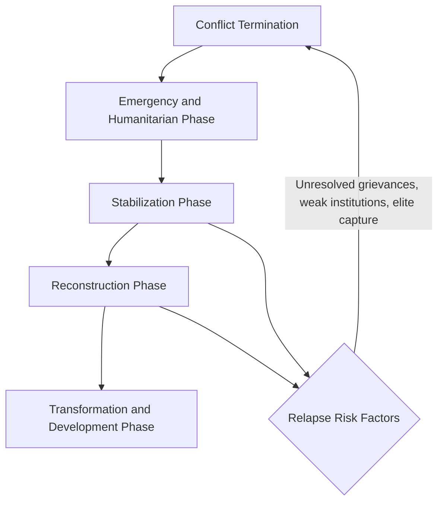

## Post-Conflict Reconstruction Economics

### Definition and Scope

Post-conflict reconstruction economics studies the processes, policies, and institutional arrangements through which economies rebuild physical capital, human capital, institutions, and markets following the cessation of armed conflict. It sits at the intersection of development economics, political economy, and conflict studies, addressing how societies transition from war economies characterized by predation, informal exchange, and institutional collapse toward peacetime economies capable of sustained growth.

The field distinguishes itself from standard development economics in several respects:

- **Compressed timelines**: Reconstruction often requires simultaneous action across security, humanitarian, and economic domains within narrow political windows.
- **Institutional voids**: Formal state capacity for taxation, contract enforcement, and property rights may be absent or severely degraded.
- **Legacy effects**: Wartime economic networks (smuggling, resource capture, patronage) frequently persist into the post-conflict period, shaping incentives for elites.
- **Fragility of peace**: Economic policy choices interact directly with conflict-relapse risk, making sequencing and distributional outcomes politically consequential in ways that differ from ordinary reform contexts.

### The Economic Legacies of Conflict

**Capital destruction and depreciation**

Armed conflict destroys physical capital (infrastructure, housing, factories) and accelerates depreciation of remaining capital through deferred maintenance. Human capital losses occur through mortality, displacement, disrupted schooling, and the psychological toll of violence, which depresses labor productivity even among survivors.

**Institutional erosion**

Conflict typically weakens or destroys the institutions that support market exchange: courts, land registries, banking supervision, and tax administration. [Inference] The degree of institutional persistence versus destruction varies substantially by conflict type — for example, secessionist civil wars that leave central administrative structures intact differ markedly from state-collapse scenarios such as Somalia after 1991.

**Human capital and demographic shocks**

Conflicts disproportionately kill and displace working-age males in many settings, altering household structures, labor force composition, and dependency ratios. Displacement — internal or cross-border — removes labor and entrepreneurial capacity from origin areas while straining absorption capacity in destination areas.

**War economies and vested interests**

Prolonged conflicts generate their own economic logic. Combatants and intermediaries often develop profitable arrangements around resource extraction, smuggling, checkpoints, and aid diversion. These "conflict economy" actors may have weak incentives to support a peace settlement that eliminates their rents, a dynamic central to the political economy of reconstruction.

### Theoretical Frameworks

**The conflict trap**

Paul Collier's conflict trap hypothesis holds that low income, slow growth, and dependence on primary commodity exports raise the risk of civil war onset, while war itself further depresses income and growth, raising the risk of renewed conflict. This creates a self-reinforcing cycle in which post-conflict economies face elevated relapse risk for roughly the first decade after war's end.

**Greed versus grievance**

Collier and Hoefler's greed-versus-grievance framework analyzes whether civil wars are better explained by the economic opportunities they present to rebels (looting, resource capture) or by grievances (inequality, exclusion, political repression). [Inference] This framework remains contested; subsequent literature (e.g., work associated with Stathis Kalyvas and others) emphasizes that motives are heterogeneous across actors and may shift over the course of a conflict, complicating any single unifying explanation.

**State fragility and the social contract**

An alternative lens, associated with the World Bank's *World Development Report 2011: Conflict, Security, and Development*, frames conflict recurrence as a function of weak institutional legitimacy and the absence of a credible social contract, arguing that reconstruction should prioritize rebuilding citizen trust in institutions alongside economic recovery.

**Growth dynamics after war**

Empirical work (e.g., Christopher Blattman and Edward Miguel's survey literature) documents that post-conflict growth rebounds are common but uneven, often driven by capital-stock recovery ("catch-up" growth) rather than genuine structural transformation, and that growth alone does not reliably reduce conflict-relapse risk.

### Core Economic Challenges in Reconstruction

**Macroeconomic stabilization**

Post-conflict states frequently inherit high inflation, exchange rate instability, fiscal deficits, and monetized debt from wartime financing (money printing, external borrowing, aid dependency). Stabilization requires:

- Establishing or restoring central bank credibility and, where feasible, independence
- Currency reform (sometimes full currency replacement, as in Iraq in 2003 or post-genocide Rwanda)
- Fiscal consolidation balanced against the need for visible public spending to demonstrate a "peace dividend"

**Fiscal reconstruction and revenue mobilization**

Rebuilding tax administration is a first-order priority, since aid dependency without domestic revenue capacity undermines long-run state legitimacy and sustainability. Common sequencing favors simple, hard-to-evade taxes first (trade taxes, VAT at the border) before more administratively demanding taxes (personal income tax) once capacity is rebuilt.

**Infrastructure and capital reconstruction**

Physical reconstruction (roads, power, water, telecommunications) is often the most visible form of aid and has both economic and political-signaling functions. [Inference] Evidence on the growth impact of infrastructure-focused reconstruction spending is mixed; returns depend heavily on complementary factors such as security, governance quality of implementing agencies, and absorption capacity of the local economy.

**Labor markets and demobilization**

Disarmament, Demobilization, and Reintegration (DDR) programs must absorb often large cohorts of ex-combatants into civilian labor markets. Economic reintegration failures — insufficient jobs, skills mismatches, weak land access — are widely cited as a proximate risk factor for renewed violence or criminality.

**Land and property rights**

Conflict frequently generates overlapping and contested claims to land through displacement, occupation, and destroyed records. Resolving these claims is both an economic necessity (for agricultural recovery and investment) and a politically sensitive process, since land disputes can themselves reignite violence.

**Financial sector reconstruction**

Banking systems typically require full or partial rebuilding: recapitalization, restoration of payment systems, and reestablishment of credit information and collateral registries. Access to finance for SMEs is commonly cited as a binding constraint on private-sector-led recovery.

### The Role of External Actors

**Aid architecture**

Post-conflict reconstruction typically involves multiple, sometimes uncoordinated external actors: bilateral donors, the World Bank, IMF, UN agencies, and NGOs. Coordination mechanisms have included:

- **Multi-Donor Trust Funds (MDTFs)**: pooled financing vehicles used in settings such as Afghanistan, Iraq, and South Sudan to reduce fragmentation and channel funds through a single administrative structure
- **Post-conflict needs assessments (PCNAs)**: joint UN–World Bank frameworks for estimating reconstruction costs and prioritizing sectors
- **Donor conferences and pledging events**: used to mobilize commitments, though pledge-to-disbursement gaps are a well-documented problem

**The absorptive capacity problem**

A recurring finding in the literature is that aid inflows can exceed the administrative and institutional capacity of post-conflict states to spend funds effectively, generating implementation bottlenecks, corruption risk, and potential Dutch-disease-type effects on the real exchange rate when aid volumes are very large relative to GDP.

**Conditionality and sequencing debates**

There is a long-standing debate over whether external actors should impose governance and macroeconomic conditionality on reconstruction aid or prioritize rapid, unconditional disbursement to stabilize the peace. [Speculation] Some scholars, including those associated with the "liberal peace" critique (e.g., Roland Paris), argue that early emphasis on rapid democratization and marketization ("Institutionalization Before Liberalization") can be destabilizing, and that sequencing matters more than the specific policy content.

### Sequencing Frameworks

A widely referenced heuristic divides reconstruction into overlapping phases, though real-world timelines are rarely this clean:

1. **Emergency/humanitarian phase** — life-saving assistance, basic security, restoring minimal service delivery
2. **Stabilization phase** — macroeconomic stabilization, initial demobilization, restoring core government functions
3. **Reconstruction phase** — rebuilding infrastructure, institutions, and markets; land and property resolution
4. **Transformation/development phase** — structural transformation, diversification, and integration into normal development trajectories

### Political Economy of Reconstruction

**Elite bargains and power-sharing**

Peace settlements often embed power-sharing arrangements that allocate economic rents (ministries, state contracts, resource revenues) among former combatant factions as part of the political settlement. [Inference] While such arrangements can secure short-term peace by satisfying key stakeholders, they may entrench patronage-based governance and complicate later efforts to build merit-based, rules-based institutions.

**Resource curse dynamics in post-conflict settings**

Where reconstruction coincides with natural resource wealth (oil, minerals, timber), the standard resource curse literature applies with added intensity: resource revenues can finance renewed conflict, be captured by narrow elites, or crowd out the development of broader tax-based state–citizen accountability. Frameworks like the Extractive Industries Transparency Initiative (EITI) have been proposed as partial remedies, with mixed empirical results on governance outcomes.

**Corruption and rent-seeking**

Reconstruction spending — characterized by large, rapid financial flows into weak-oversight environments — creates significant corruption risk. Case literature on Afghanistan and Iraq documents substantial leakage through inflated contracts, ghost employees, and diverted procurement.

### Empirical Evidence and Measurement Challenges

Measuring post-conflict economic outcomes is methodologically difficult:

- **Data gaps**: National statistical systems are often destroyed or unreliable during and immediately after conflict, forcing reliance on proxy indicators (satellite night-light data, household surveys, remittance flows).
- **Counterfactual problems**: Isolating the effect of reconstruction policy from natural post-war rebound ("catch-up growth") is econometrically challenging.
- **Selection into conflict**: Countries that experience civil war differ systematically from those that do not, complicating cross-country comparisons of reconstruction outcomes.

[Unverified] Point estimates of aid effectiveness or specific program impacts vary substantially across studies and settings; general claims about "what works" in reconstruction should be treated as context-dependent rather than universal.

### Case Illustrations

**Rwanda (post-1994)**

Widely cited as a relatively successful reconstruction case, combining rapid macroeconomic stabilization, a strong emphasis on state capacity building, and sustained donor engagement, alongside significant human capital losses that took a generation to address. [Inference] The Rwandan case is also frequently discussed in relation to trade-offs between economic performance and political liberalization, since the pace of political opening has been a subject of ongoing scholarly and policy debate.

**Mozambique (post-1992)**

Cited as an early example of successful demobilization and reintegration combined with market liberalization, though later affected by debt crises (the "hidden debts" scandal of 2016) illustrating how governance weaknesses can resurface well after initial reconstruction success.

**Bosnia and Herzegovina (post-1995)**

Illustrates the challenges of reconstruction under a complex power-sharing constitutional structure (the Dayton Agreement), where fragmented governance across entities has been associated with persistent difficulties in fiscal coordination and structural reform.

**Afghanistan (2001–2021)**

Frequently analyzed as a case of large-scale aid inflows combined with weak absorptive capacity, significant corruption, and ultimately state collapse, offering cautionary lessons on aid sequencing, capacity-building assumptions, and the risks of externally dependent fiscal structures.

**Liberia and Sierra Leone (post-civil war)**

Both cases feature prominently in DDR and natural-resource-governance literature, given the role of "conflict diamonds" and timber in financing violence and the subsequent efforts to establish resource certification and revenue transparency mechanisms.

### Key Debates in the Literature

- **Growth-first versus institutions-first**: whether reconstruction should prioritize rapid economic growth (to generate a visible peace dividend) or slower, deliberate institution-building (to secure durable governance foundations)
- **Liberal peacebuilding critique**: whether Western-style rapid democratization and market liberalization are appropriate or destabilizing in fragile post-conflict contexts
- **Local ownership versus donor control**: the tension between donor accountability requirements and building genuine domestic institutional capacity and legitimacy
- **Aid modality choice**: budget support versus project aid versus off-budget delivery through NGOs, each with different implications for state capacity building versus service delivery speed

### Illustrative Diagram: Actors and Flows in Reconstruction Financing

<svg xmlns="http://www.w3.org/2000/svg" viewBox="0 0 800 460" font-family="sans-serif">
<text x="400" y="30" text-anchor="middle" font-size="18" font-weight="bold" fill="#1a1a1a">Post-Conflict Reconstruction Financing Flows (svg_diagram)</text>
<rect x="40" y="70" width="180" height="60" rx="8" fill="#dbeafe" stroke="#2563eb" stroke-width="1.5" />
<text x="130" y="95" text-anchor="middle" font-size="13" fill="#1e3a8a">Bilateral Donors</text>
<text x="130" y="112" text-anchor="middle" font-size="11" fill="#1e3a8a">(grants, loans)</text>
<rect x="40" y="160" width="180" height="60" rx="8" fill="#dbeafe" stroke="#2563eb" stroke-width="1.5" />
<text x="130" y="185" text-anchor="middle" font-size="13" fill="#1e3a8a">World Bank / IMF</text>
<text x="130" y="202" text-anchor="middle" font-size="11" fill="#1e3a8a">(concessional finance)</text>
<rect x="40" y="250" width="180" height="60" rx="8" fill="#dbeafe" stroke="#2563eb" stroke-width="1.5" />
<text x="130" y="275" text-anchor="middle" font-size="13" fill="#1e3a8a">UN Agencies / NGOs</text>
<text x="130" y="292" text-anchor="middle" font-size="11" fill="#1e3a8a">(humanitarian + programs)</text>
<rect x="320" y="160" width="200" height="70" rx="8" fill="#fef3c7" stroke="#d97706" stroke-width="1.5" />
<text x="420" y="188" text-anchor="middle" font-size="13" fill="#78350f">Multi-Donor Trust Fund</text>
<text x="420" y="206" text-anchor="middle" font-size="11" fill="#78350f">/ Pooled Financing Vehicle</text>
<rect x="600" y="70" width="170" height="60" rx="8" fill="#dcfce7" stroke="#16a34a" stroke-width="1.5" />
<text x="685" y="95" text-anchor="middle" font-size="13" fill="#14532d">Government Budget</text>
<text x="685" y="112" text-anchor="middle" font-size="11" fill="#14532d">(on-budget support)</text>
<rect x="600" y="160" width="170" height="60" rx="8" fill="#dcfce7" stroke="#16a34a" stroke-width="1.5" />
<text x="685" y="185" text-anchor="middle" font-size="13" fill="#14532d">Line Ministries</text>
<text x="685" y="202" text-anchor="middle" font-size="11" fill="#14532d">(infrastructure, health, education)</text>
<rect x="600" y="250" width="170" height="60" rx="8" fill="#dcfce7" stroke="#16a34a" stroke-width="1.5" />
<text x="685" y="275" text-anchor="middle" font-size="13" fill="#14532d">NGO-Implemented Projects</text>
<text x="685" y="292" text-anchor="middle" font-size="11" fill="#14532d">(off-budget delivery)</text>
<rect x="280" y="350" width="280" height="70" rx="8" fill="#fee2e2" stroke="#dc2626" stroke-width="1.5" />
<text x="420" y="378" text-anchor="middle" font-size="13" fill="#7f1d1d">Absorptive Capacity Constraint</text>
<text x="420" y="396" text-anchor="middle" font-size="11" fill="#7f1d1d">(procurement, oversight, corruption risk)</text>
<line x1="220" y1="100" x2="320" y2="180" stroke="#6b7280" stroke-width="1.5" marker-end="url(#arrow)" />
<line x1="220" y1="190" x2="320" y2="190" stroke="#6b7280" stroke-width="1.5" marker-end="url(#arrow)" />
<line x1="220" y1="280" x2="320" y2="210" stroke="#6b7280" stroke-width="1.5" marker-end="url(#arrow)" />
<line x1="520" y1="180" x2="600" y2="105" stroke="#6b7280" stroke-width="1.5" marker-end="url(#arrow)" />
<line x1="520" y1="190" x2="600" y2="190" stroke="#6b7280" stroke-width="1.5" marker-end="url(#arrow)" />
<line x1="520" y1="205" x2="600" y2="270" stroke="#6b7280" stroke-width="1.5" marker-end="url(#arrow)" />
<line x1="420" y1="230" x2="420" y2="350" stroke="#dc2626" stroke-width="1.5" stroke-dasharray="4,3" marker-end="url(#arrow-red)" />
</svg>

### Key Metrics and Indicators Used in the Field

| Domain | Common Indicators |
| --- | --- |
| Macroeconomic | Inflation rate, exchange rate stability, fiscal balance as % of GDP, external debt/GDP |
| Institutional | Tax revenue/GDP, World Governance Indicators, state capacity proxies |
| Human capital | School enrollment recovery, health facility functionality, ex-combatant employment rates |
| Aid effectiveness | Disbursement-to-commitment ratios, aid/GNI, on-budget aid share |
| Conflict risk | Conflict recurrence within 5–10 years (widely used threshold in the literature), horizontal inequality measures |

**Related Topics**

- Disarmament, Demobilization, and Reintegration (DDR) programs
- Resource curse and natural resource governance in fragile states
- State-building versus peacebuilding theoretical debates
- Fragile states indices and measurement of state fragility
- Humanitarian-development-peace nexus ("triple nexus") programming
- Land tenure and property rights restitution after displacement
- Refugee and IDP return economics
- Aid effectiveness and the Paris Declaration principles in fragile contexts
- Horizontal inequality and conflict onset (Frances Stewart's framework)
- Transitional justice and its economic dimensions (reparations, truth commissions)