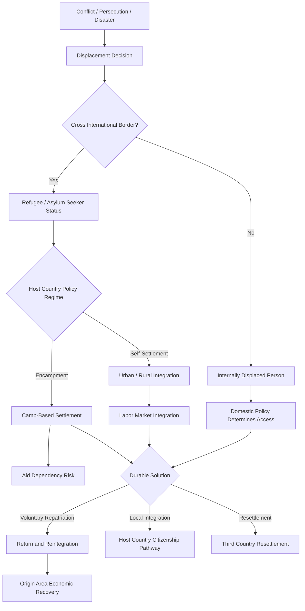

## Refugee and Forced Displacement Economics

### Definition and Scope

Refugee and forced displacement economics examines the causes, mechanisms, and consequences of population movements driven by conflict, persecution, and disaster, focusing on economic outcomes for displaced populations, host communities, and origin areas. The field draws on labor economics, public finance, development economics, and migration studies, and is distinguished from voluntary migration economics by the involuntary nature of movement, which shapes selection patterns, legal status constraints, and the policy instruments available to address it.

Key population categories with distinct legal and economic treatment:

- **Refugees**: persons who have crossed an international border owing to a well-founded fear of persecution, as defined by the 1951 Refugee Convention, typically under UNHCR protection mandates
- **Asylum seekers**: individuals who have applied for refugee status but whose claims have not yet been adjudicated
- **Internally displaced persons (IDPs)**: those displaced within their own country's borders, who remain under their home state's jurisdiction and do not benefit from the same international legal protections as refugees
- **Returnees**: former refugees or IDPs who have returned to their area of origin

[Inference] The legal distinction between these categories has substantial economic consequences, since refugees typically face restrictions on the right to work, freedom of movement, and access to formal financial services that vary widely by host country, while IDPs' economic entitlements depend entirely on domestic policy in their own state.

### Theoretical Frameworks

**Distinguishing forced from voluntary migration**

Standard migration theory (e.g., the Roy model of self-selection, gravity models of migration flows) assumes migrants respond to wage differentials and moving costs. Forced displacement violates core assumptions of these models because the "choice" to move is driven by survival rather than income maximization, producing different selection patterns: displaced populations are less positively selected on skills and wealth than voluntary economic migrants, since flight decisions are dominated by proximity to violence and immediate safety rather than labor market opportunity.

**Push factors and the economics of flight**

Conflict, persecution, and disaster function as push factors whose intensity, duration, and geographic scope shape displacement magnitude and destination choice. Distance to safety, transportation costs, and information about conditions in potential destinations (including diaspora networks) influence where displaced populations settle, even though the initial decision to flee is largely involuntary.

**Human capital and asset destruction**

Displacement typically involves loss of physical assets (land, housing, livestock, business capital) and disruption of human capital accumulation (interrupted schooling, deskilling from prolonged unemployment, loss of professional credentials recognition). [Inference] The degree of asset loss varies substantially by displacement type — sudden-onset flight from acute violence typically results in near-total asset abandonment, while displacement from slower-onset conflict may allow partial asset liquidation or transfer.

### Economic Impacts on Host Communities

**Labor market effects**

The empirical literature on refugee inflows and host labor markets is extensive and shows mixed results depending on context, host labor market flexibility, and the substitutability of refugee and native labor. Influential natural-experiment studies — such as David Card's analysis of the Mariel boatlift and subsequent research on Syrian refugee inflows to Turkey — find limited adverse wage effects on native workers overall, though some studies identify localized negative effects on informal-sector or low-skilled native workers who compete most directly with refugee labor.

[Unverified] The magnitude and even the sign of labor market effects vary considerably across studies using different identification strategies, host country contexts, and time horizons; this remains an active and methodologically contested area of research rather than a settled empirical consensus.

**Fiscal impacts**

Host governments incur costs from service provision (education, health, social protection) and, where refugees are granted work rights, may also gain tax revenue and consumption-driven economic activity. Studies of fiscal impact are highly sensitive to assumptions about labor market integration, service usage rates, and time horizon; short-run cost estimates typically differ substantially from longer-run estimates that account for fiscal contributions from economically integrated refugees and their children.

**Local price and market effects**

Large refugee inflows can affect local housing rents, food prices, and rental markets in refugee-hosting areas, particularly where camps or informal settlements concentrate populations in specific localities. Evidence from contexts such as Jordan and Lebanon during the Syrian displacement crisis documents localized rent increases in areas of high refugee concentration, alongside expanded demand for locally produced goods and services.

**Trade and business creation**

Displaced populations sometimes bring entrepreneurial capital, skills, and cross-border trade networks that generate new economic activity in host areas. [Inference] The extent to which this occurs depends heavily on host country policies toward refugee business registration, work permits, and access to credit, which vary enormously — from highly restrictive encampment policies to more liberal self-settlement and labor market access regimes.

### Economic Impacts on Displaced Populations

**Labor market integration barriers**

Refugees commonly face multiple compounding barriers to labor market integration:

- Legal restrictions on the right to work or sector-specific employment bans
- Non-recognition of foreign educational and professional credentials
- Language barriers and lack of host-country-specific human capital
- Limited access to formal credit and financial services, restricting entrepreneurship
- Discrimination and network exclusion from informal hiring channels

**Deskilling and occupational downgrading**

A robust finding across many contexts is that refugees frequently experience occupational downgrading — working in jobs well below their pre-displacement skill and education level — due to credential non-recognition, language barriers, and legal restrictions, with [Inference] some but not universal evidence of partial recovery in occupational status over multi-year periods as language skills and local credentials are acquired.

**Encampment versus self-settlement**

Policy regimes vary between encampment models (concentrated camps with restricted movement, common in East Africa) and self-settlement or urban integration models (more common in Latin America's response to Venezuelan displacement). Encampment policies are associated with greater aid dependency and restricted economic agency, while self-settlement allows greater labor market participation but can strain local services and housing markets absent adequate host community support.

**Protracted displacement**

A substantial share of the world's displaced population experiences "protracted displacement" — situations lasting five years or more without durable solutions. Protracted displacement fundamentally changes the economic calculus: short-term humanitarian assistance models become inadequate, and development-oriented approaches (self-reliance strategies, market-based livelihoods programming) become more appropriate, though transitioning between these paradigms poses institutional and financing challenges.

### Impacts on Origin Communities and Countries

**Remittances**

Displaced populations who achieve some economic stability abroad often remit funds to family members remaining in or returning to origin areas, providing a private, decentralized channel of financial support that can be more resilient than formal aid flows, though remittance capacity depends heavily on the displaced population's own economic integration in destination areas.

**Brain drain and human capital loss**

Forced displacement of skilled workers (professionals, educators, health workers) can severely deplete origin-country human capital, with effects that may persist even after conflict resolution if displaced professionals have established new lives and careers abroad and do not return.

**Return and reintegration economics**

Return migration — whether voluntary, facilitated, or forced (refoulement) — carries its own economic challenges: returnees often face destroyed or occupied property, limited employment opportunities in areas still recovering from conflict, and psychosocial adjustment costs. [Inference] Sustainable return is generally understood in the literature to require not just physical safety but also functioning labor markets, restored property rights, and access to basic services in areas of return; return absent these conditions is associated with higher risk of secondary displacement.

### Policy Instruments and Institutional Architecture

**International legal and institutional framework**

- **1951 Refugee Convention and 1967 Protocol**: the foundational legal instruments defining refugee status and state obligations, including the principle of non-refoulement (prohibition on returning refugees to danger)
- **UNHCR**: the primary UN agency mandated to protect refugees and, in many contexts, IDPs and stateless persons
- **Global Compact on Refugees (2018)**: a non-binding framework emphasizing burden- and responsibility-sharing among states, and promoting refugee self-reliance and inclusion in national development plans rather than parallel humanitarian systems

**Right-to-work and economic inclusion policies**

Host country policies on refugee labor market access range from full exclusion to full parity with citizens. [Inference] There is a general (though not universal) view in the policy literature that granting the right to work, even with some sectoral restrictions, improves both refugee self-reliance and reduces net fiscal burden over time compared to work-prohibition regimes, though implementation depends on host labor market conditions and political economy considerations around native worker competition.

**Cash-based assistance versus in-kind aid**

A major shift in humanitarian and development practice has been toward cash and voucher assistance rather than in-kind distribution (food, non-food items), on the rationale that cash transfers preserve recipient choice, support local markets, and can be more cost-efficient. [Inference] The relative effectiveness of cash versus in-kind assistance is context-dependent — cash transfers function best where local markets are functioning and goods are available, while in-kind assistance may be preferable in areas with severe market disruption or supply shortages.

**Development-humanitarian financing instruments**

Recognizing the limits of purely humanitarian financing for protracted crises, newer instruments have emerged:

- **World Bank IDA sub-window for refugees and host communities**: concessional financing specifically targeting countries hosting large refugee populations, intended to support both refugees and host communities jointly
- **Regional development compacts**: arrangements (such as the EU-Turkey and Jordan Compact models) that combine financial support with trade concessions or labor market access commitments in exchange for continued refugee hosting

### Measurement and Data Challenges

Measuring displacement-related economic outcomes faces distinct difficulties:

- **Population counting**: Displaced populations, particularly those self-settled outside formal camps, are often undercounted or uncounted in national statistics and censuses.
- **Legal status ambiguity**: Individuals may move between asylum-seeker, refugee, and undocumented status categories, complicating longitudinal tracking.
- **IDP data gaps**: Because IDPs remain under domestic jurisdiction, data quality depends heavily on host government capacity and willingness to track and report displacement, producing significant gaps in fragile or conflict-affected states.
- **Informal sector economic activity**: Since displaced populations disproportionately work informally, their economic contributions and outcomes are poorly captured by standard labor force surveys and national accounts.

### Case Illustrations

**Syrian displacement crisis (2011–present)**

One of the most extensively studied displacement episodes, generating a large body of research on host-country labor market effects in Turkey, Jordan, and Lebanon, and prompting significant innovation in cash-based assistance programming and development-humanitarian financing instruments such as the Jordan Compact, which linked EU trade concessions to Jordanian commitments on Syrian refugee work permits.

**Venezuelan displacement (2015–present)**

Notable for occurring largely through self-settlement and regularization pathways in Latin American host countries (Colombia's Temporary Protection Status program being a prominent example) rather than encampment, offering a contrasting policy model to East African and Middle Eastern refugee responses and generating comparative research on labor market integration under regularization versus restrictive status regimes.

**East African protracted camps (Dadaab, Kakuma)**

Long-standing camp-based settlements in Kenya illustrate the economic dynamics of protracted encampment, including informal cross-border trade networks, aid-dependent local economies, and ongoing policy debates over transitioning toward greater self-reliance and market integration for camp residents.

**Rohingya displacement (Myanmar–Bangladesh)**

Illustrates the economic dynamics of large-scale, rapid-onset displacement into a resource-constrained host area (Cox's Bazar), with significant restrictions on refugee economic activity and heavy reliance on humanitarian assistance, alongside documented impacts on local host community land, labor, and environmental resources.

### Key Debates in the Literature

- **Encampment versus self-settlement**: trade-offs between control/service-delivery efficiency in camps versus economic agency and integration benefits of self-settlement
- **Burden-sharing versus responsibility-sharing**: whether international displacement financing adequately compensates host countries (disproportionately low- and middle-income states) for hosting costs
- **Humanitarian-development nexus**: how and when to transition protracted displacement responses from short-term humanitarian models to longer-term development-oriented, self-reliance-focused approaches
- **Right-to-work politics**: balancing refugee economic inclusion against host-country political sensitivities around native labor market competition
- **Durable solutions framework**: the relative emphasis and feasibility of the three traditional "durable solutions" — voluntary repatriation, local integration, and third-country resettlement — given that resettlement capacity accommodates only a small fraction of the global displaced population

### Illustrative Diagram: Forced Displacement Economic Pathways

### Key Indicators Used in the Field

| Domain | Common Indicators |
| --- | --- |
| Population | UNHCR/IOM displacement figures, camp vs. self-settled population shares |
| Labor market | Refugee labor force participation rate, occupational downgrading indices, work permit issuance rates |
| Fiscal | Per-capita hosting cost estimates, refugee tax contribution estimates (where legal work access exists) |
| Host impact | Local wage and rental price indices in high-concentration hosting areas |
| Welfare | Multi-purpose cash assistance coverage, poverty and food security rates among displaced populations |
| Durable solutions | Voluntary repatriation rates, resettlement quotas filled, naturalization/local integration rates |

**Related Topics**

- Post-conflict reconstruction economics
- Diaspora economics and remittance flows
- Host community resilience and social cohesion programming
- Cash-based humanitarian assistance design and evaluation
- Statelessness and its economic consequences
- Climate-induced displacement and disaster displacement economics
- Labor market integration policy design for migrants and refugees
- Global Compact on Refugees and burden-sharing mechanisms
- Urban refugee economies and informal sector dynamics
- Return migration and reintegration program design