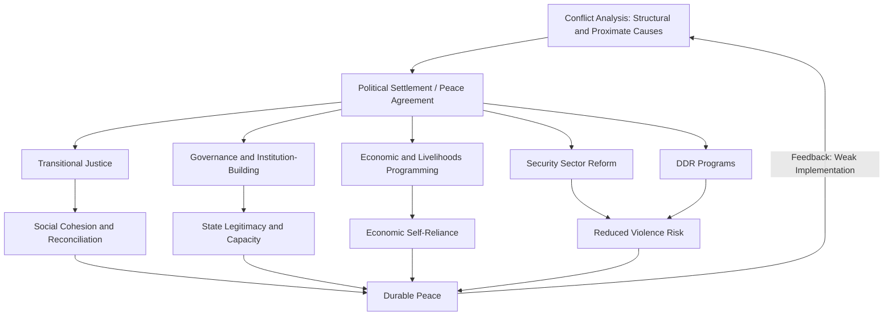

## Peacebuilding and Development Interventions

### Definition and Scope

Peacebuilding and development interventions encompass the set of policies, programs, and institutional strategies designed to prevent the outbreak or recurrence of violent conflict while supporting economic and social development in fragile and conflict-affected settings. The field integrates conflict studies, development economics, and political science, addressing how external and domestic actors can influence the structural, institutional, and relational drivers of conflict alongside conventional development objectives.

Peacebuilding is conventionally distinguished from related but analytically separate activities:

- **Peacemaking**: diplomatic efforts to end active conflict and reach a settlement
- **Peacekeeping**: military or civilian deployment to maintain ceasefires and provide security guarantees
- **Peacebuilding**: longer-term efforts to address the structural and institutional conditions that generate conflict risk, encompassing governance reform, economic development, reconciliation, and institution-building
- **Statebuilding**: a related but distinct concept focused specifically on strengthening state institutions and capacity, which may or may not directly target conflict drivers

[Inference] In practice, these categories overlap substantially and their boundaries are contested in the literature; many interventions labeled "peacebuilding" combine elements of statebuilding, governance reform, and conventional development programming simultaneously.

### Theoretical Frameworks

**Structural versus proximate causes of conflict**

A foundational distinction in the peacebuilding literature separates structural causes of conflict (long-term factors such as horizontal inequality, weak institutions, resource competition, and exclusionary governance) from proximate causes (triggering events such as contested elections, price shocks, or specific acts of violence). Effective peacebuilding, in this framework, requires addressing structural drivers rather than only managing immediate triggers.

**Horizontal inequality**

Frances Stewart's horizontal inequality framework argues that inequalities between identity-based groups (ethnic, religious, regional) — rather than inequality between individuals — are a particularly potent driver of conflict, because group-based exclusion from political power, economic opportunity, or public services generates grievances that can be mobilized for collective violence. This framework has influenced peacebuilding program design toward group-sensitive targeting of development benefits and inclusive institutional design.

**The liberal peace and its critics**

The dominant post-Cold War peacebuilding paradigm — often termed the "liberal peace" — holds that democratization, market liberalization, and rule-of-law institution-building will jointly produce sustainable peace, drawing on democratic peace theory and market-oriented development thinking. Roland Paris's influential critique, articulated in the "Institutionalization Before Liberalization" framework, argues that rapid, simultaneous democratization and marketization in fragile post-conflict settings can be destabilizing, and that sequencing — building basic institutional capacity before full political and economic liberalization — produces more durable outcomes.

**Local ownership and hybrid peace**

A significant strand of critical peacebuilding scholarship, associated with scholars such as Roger Mac Ginty and Oliver Richmond, argues that externally designed peacebuilding interventions often fail to engage adequately with local actors, customary institutions, and context-specific dynamics, producing a "hybrid peace" in which internationally promoted liberal institutions coexist uneasily with local power structures and informal governance arrangements. This critique has informed a broader shift in donor rhetoric toward "local ownership," though [Inference] the degree to which this rhetoric translates into genuine shifts in decision-making authority in practice remains contested and varies considerably across programs and donors.

**Do No Harm framework**

Mary B. Anderson's Do No Harm framework emphasizes that development and humanitarian aid delivered in conflict-affected contexts is never neutral — aid resources can inadvertently exacerbate conflict dynamics by reinforcing existing power imbalances, fueling competition over resources, or legitimizing armed actors, making conflict-sensitivity analysis a necessary component of intervention design.

### Categories of Peacebuilding and Development Interventions

**Security sector reform (SSR)**

Programs aimed at reforming police, military, and justice institutions to be more professional, accountable, and civilian-controlled, addressing both the operational capacity and governance/oversight dimensions of security institutions. Effective SSR is generally understood to require parallel progress in civilian oversight mechanisms, not merely technical capacity-building of security forces.

**Disarmament, Demobilization, and Reintegration (DDR)**

DDR programs disarm combatants, formally demobilize armed groups, and support ex-combatants' transition into civilian economic and social life. The reintegration phase — economic reintegration (jobs, skills training, business support) and social reintegration (community acceptance, addressing stigma) — is widely regarded in the literature as the most difficult and often under-resourced component, with weak reintegration outcomes cited as a contributing factor in conflict relapse.

**Transitional justice mechanisms**

Truth commissions, reparations programs, prosecutions (domestic or international, e.g., through the ICC or hybrid tribunals), and vetting/lustration processes aim to address past human rights violations and support reconciliation. [Inference] While transitional justice is primarily framed in political and legal terms, it has economic dimensions — reparations programs represent direct fiscal transfers, and truth-telling processes can affect economic actors implicated in conflict-era resource capture or violence.

**Governance and institution-building programs**

Interventions targeting public financial management reform, anti-corruption institutions, decentralization, and civil service reform, aimed at rebuilding functional and legitimate state institutions capable of delivering services and managing revenue.

**Economic and livelihoods programming**

Cash-for-work, vocational training, microfinance and business grants, and value-chain development programs targeting conflict-affected populations, often designed explicitly to reduce economic incentives for renewed violence by providing alternative livelihoods to combatants, at-risk youth, or economically marginalized groups.

**Social cohesion and reconciliation programming**

Community-driven development (CDD) programs, intergroup dialogue initiatives, and joint infrastructure projects designed to rebuild trust and cooperative norms across conflict-divided groups, often operating on the theory that shared economic activity and joint decision-making can reduce intergroup hostility.

**Elections and political settlement support**

Technical and financial support for electoral processes, political party development, and power-sharing arrangement design, reflecting the centrality of political settlements to sustainable peace, while also carrying risks where poorly sequenced elections can themselves trigger renewed violence.

### Community-Driven Development as a Peacebuilding Instrument

Community-driven development (CDD) — in which communities receive block grants and control over project selection and implementation — has been widely used in conflict-affected settings (e.g., the National Solidarity Programme in Afghanistan, KDP in Indonesia) on the theory that participatory decision-making processes build local governance capacity and social cohesion alongside delivering infrastructure and services.

[Unverified] Rigorous impact evaluations of CDD's effects on social cohesion and trust have produced mixed results across contexts; some randomized evaluations find limited or short-lived effects on social cohesion measures despite successful infrastructure delivery, indicating that the relationship between participatory development processes and durable peacebuilding outcomes is less straightforward than earlier theory suggested.

### Peacekeeping-Development Interface

**Peacekeeping economic footprint**

UN and regional peacekeeping missions inject substantial resources into host economies through salaries, procurement, and infrastructure spending, generating localized economic effects (sometimes termed the "peacekeeping economy") that can include inflationary pressure on local goods and housing markets alongside employment and business opportunities for local populations.

**Stabilization operations and "hearts and minds" spending**

Military-led stabilization programs, particularly prominent in Afghanistan and Iraq (e.g., the U.S. Commander's Emergency Response Program), have used development-style spending explicitly as a counterinsurgency tool, based on the theory that improved local economic conditions reduce support for insurgent groups. [Inference] Rigorous evaluations of this "hearts and minds" theory of change have generally found weak or inconsistent evidence that aid spending reduces violence in the short term, and in some studies find that poorly targeted aid can increase local violence, informing more cautious approaches to combining military and development objectives.

### Measuring Success: Fragility and Peacebuilding Indices

Several composite indices attempt to measure state fragility and peacebuilding progress, though [Inference] each embeds particular theoretical assumptions about what fragility consists of and faces significant challenges in comparability and construct validity across diverse contexts:

- **Fragile States Index (Fund for Peace)**: composite index based on social, economic, and political/military indicators
- **OECD States of Fragility framework**: multidimensional fragility assessment covering economic, environmental, political, security, and societal dimensions
- **World Bank Harmonized List of Fragile and Conflict-affected Situations**: operational classification used to guide World Bank engagement and financing terms
- **Global Peace Index (Institute for Economics and Peace)**: measures negative peace (absence of violence) across societal safety, ongoing conflict, and militarization indicators

### Financing Architecture for Peacebuilding

**UN Peacebuilding Fund**

A pooled, flexible financing mechanism supporting peacebuilding activities, often used to fill gaps not covered by traditional development or humanitarian financing, particularly in the early post-conflict period when other financing mechanisms are still being established.

**World Bank and fragility-sensitive financing**

The World Bank has developed dedicated financing instruments and analytical frameworks for fragile and conflict-affected situations (FCS), including enhanced concessional terms, risk-tolerant project design, and requirements for conflict and fragility analysis in project preparation.

**New Deal for Engagement in Fragile States**

An international framework (endorsed in 2011) built around country-led "Peacebuilding and Statebuilding Goals" (PSGs) — legitimate politics, security, justice, economic foundations, and revenues and services — intended to reorient donor engagement around nationally owned priorities rather than externally imposed frameworks. [Inference] Implementation of the New Deal principles has been uneven across signatory countries, and assessments of its influence on actual donor behavior versus rhetorical commitment vary in the literature.

### Political Economy and Critiques

**Aid and conflict dynamics**

A substantial critical literature examines how development aid itself can interact with conflict dynamics — being captured by armed actors, fueling competition for control over aid resources, or inadvertently legitimizing exclusionary governance structures — reinforcing the centrality of conflict-sensitive programming design (per the Do No Harm framework above).

**Peacebuilding industry critique**

Some scholars characterize an emergent "peacebuilding industry" of international organizations, consultancies, and NGOs with institutional incentives that may not always align with recipient country needs, including pressure to demonstrate measurable short-term results in contexts where meaningful peacebuilding outcomes unfold over decades, and risk of donor-driven programming that reflects headquarters priorities more than local context.

**Sequencing and the security-development nexus**

Ongoing debate concerns whether security stabilization must precede development programming, or whether development interventions themselves can contribute to security by addressing root causes — a debate with direct implications for resource allocation and institutional mandates (e.g., division of labor between peacekeeping missions and development agencies).

### Illustrative Diagram: Peacebuilding Intervention Logic

### Case Illustrations

**Mozambique (post-1992)**

Frequently cited as a relatively successful case combining DDR, political settlement (RENAMO's transition to a political party), and market liberalization, though later governance and debt challenges illustrate that initial peacebuilding success does not guarantee durable institutional quality.

**Liberia and Sierra Leone**

Prominent cases for DDR and transitional justice research, including the Sierra Leone Truth and Reconciliation Commission and the Special Court for Sierra Leone, alongside natural resource governance reforms (e.g., the Kimberley Process for conflict diamonds) linking peacebuilding to resource-sector regulation.

**Colombia (post-2016 peace agreement)**

Illustrates a comprehensive peace agreement combining DDR of FARC combatants, rural development commitments, transitional justice mechanisms (the Special Jurisdiction for Peace), and political participation guarantees, while facing ongoing implementation challenges including continued violence from non-signatory armed groups and slow rural reform delivery.

**Timor-Leste**

Often analyzed as a statebuilding and peacebuilding case involving extensive UN peacekeeping and transitional administration, offering lessons on the challenges of building state institutions largely from external design in a small, resource-constrained setting.

### Key Debates in the Literature

- **Liberal peace versus context-sensitive/hybrid approaches**: whether standardized democratization-and-marketization templates are appropriate across diverse conflict contexts
- **Sequencing of security, political, and economic reforms**: what should come first, and whether simultaneous versus sequential reform produces better outcomes
- **Local ownership in practice**: whether donor rhetoric on local ownership reflects genuine shifts in program design and decision-making authority
- **Measuring peacebuilding success**: the difficulty of attributing conflict non-recurrence to specific interventions given the counterfactual problem and long time horizons involved
- **Aid conditionality versus flexible, risk-tolerant financing**: how to balance accountability requirements against the need for adaptive programming in volatile contexts

**Related Topics**

- Post-conflict reconstruction economics
- Refugee and forced displacement economics
- Security sector reform and civilian oversight design
- Horizontal inequality and conflict onset (Frances Stewart's framework)
- Community-driven development impact evaluation
- Transitional justice and reparations economics
- Fragile states classification and financing frameworks
- Do No Harm and conflict-sensitive program design
- Peacekeeping economics and stabilization operations
- Political settlements and power-sharing institutional design