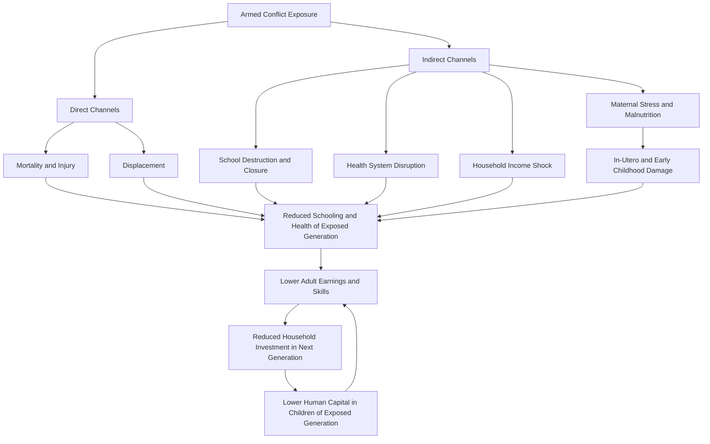

## Conflict's Effects on Human Capital

### Overview

Armed conflict degrades human capital through multiple, often compounding channels: direct physical harm and mortality, disruption of education and health service delivery, forced displacement, and long-run psychological and developmental damage, particularly for children exposed during critical developmental windows. In development economics, this topic is studied both as a direct cost of conflict (destroyed schooling years, stunted health) and as a mechanism through which conflict perpetuates poverty across generations — since human capital losses in one generation reduce that generation's future earnings, and often their own children's human capital investments, creating an intergenerational transmission channel distinct from physical capital destruction.

### Channels of Human Capital Loss

**1. Direct mortality and injury**

Conflict causes death and disability among the working-age and school-age population, directly removing human capital stock. Civilian casualties — often the majority in modern intrastate conflicts — disproportionately affect long-run human capital trajectories since they include children and primary caregivers.

**2. Education disruption**

- School destruction, closure, or repurposing (as shelters, barracks, or military targets) removes the physical infrastructure needed for schooling.
- Teacher flight or casualties reduce the supply of qualified educators, sometimes for years after active fighting ends.
- Households facing conflict-driven income shocks or safety concerns withdraw children from school, either permanently or for extended periods, producing cohort-level "missing years" of schooling.
- Child soldiering and forced recruitment remove children from education entirely during their conflict-affected years, often with limited educational reintegration afterward.

**3. Health system disruption**

- Destruction of health infrastructure (hospitals, clinics) reduces access to routine care, vaccination, and maternal/child health services independent of direct violence.
- Disruption of nutrition supply chains and markets during conflict increases malnutrition and stunting risk, particularly for children under five, whose physical and cognitive development is highly sensitive to nutritional shocks during this window.
- Disease outbreaks often follow conflict due to degraded sanitation infrastructure, crowded displacement settings, and interrupted vaccination campaigns.

**4. In-utero and early childhood exposure**

A substantial body of economic research, drawing on the "fetal origins hypothesis" literature originating with David Barker's epidemiological work, documents that maternal stress, malnutrition, and reduced healthcare access during pregnancy — all elevated during conflict — produce measurable, persistent effects on children's later-life height, cognitive test scores, and even adult earnings. This makes in-utero conflict exposure a distinct and often under-recognized human capital channel, separate from the more visible effects of exposure during school-age years.

**5. Displacement**

Forced displacement, as refugees or internally displaced persons, disrupts schooling continuity, often for years, and can produce permanent educational trajectory changes even after resettlement, due to lost documentation, language barriers, non-recognition of prior schooling, and psychosocial trauma affecting learning capacity.

**6. Psychological and psychosocial harm**

Exposure to violence, especially in childhood, is associated with elevated rates of post-traumatic stress and related psychological distress in the exposed population, which can impair educational attainment, labor market participation, and parenting quality in the next generation, independent of physical health or schooling-access channels.

### Key Empirical Studies

**Akresh and de Walque (2008) — Rwandan Genocide**

Using pre- and post-genocide survey data, this study found children of primary-school age during the 1994 Rwandan genocide completed significantly less schooling than children who were not school-age during the conflict, with effects concentrated among those in the most conflict-affected regions.

**Shemyakina (2011) — Tajikistan Civil War**

Found that girls exposed to conflict-related regional violence during their school-age years experienced significant declines in school enrollment and completed schooling relative to unexposed girls, while effects on boys were smaller — evidencing a gender-differentiated human capital cost of conflict, likely reflecting household resource-allocation decisions during crises that prioritize boys' schooling when resources are scarce. [Inference: the underlying household decision mechanism is inferred from the differential outcome pattern rather than directly observed in the study's data]

**Bundervoet, Verwimp, and Akresh (2009) — Burundi Civil War**

Documented that children exposed to conflict in utero and in early childhood exhibited significantly reduced height-for-age, a standard anthropometric marker of chronic malnutrition and stunting, with effect magnitude varying by the intensity and timing of local conflict exposure.

**Blattman and Annan (2010) — Uganda (LRA conflict, child soldiering)**

Studied former child soldiers abducted by the Lord's Resistance Army, finding abduction was associated with reduced educational attainment and skills training relative to non-abducted peers, though — notably — abductees did not show significantly worse aggression or violence-related labor market outcomes than non-abductees, complicating simplistic narratives about former combatants' reintegration risks.

**León (2012) — Peru (Shining Path conflict)**

Found that exposure to political violence during early childhood was associated with reduced educational attainment in adulthood, with a specific critical-window sensitivity: exposure during preschool ages had larger negative effects than exposure at older school ages, consistent with critical-period theories of human capital formation.

### The Intergenerational Transmission Mechanism

A defining feature of the conflict–human capital literature in development economics is documenting how human capital losses propagate across generations, converting a temporary conflict shock into a durable poverty trap mechanism.

This feedback loop, where the exposed generation's reduced earnings limit their capacity to invest in their own children's education and health, is central to arguments that conflict's human capital costs persist well beyond the conflict period itself, sometimes across multiple generations.

### Critical Period / Timing Effects

A recurring finding across multiple conflict settings is that the *timing* of exposure relative to a child's developmental stage matters more than the mere fact of exposure.

| Exposure Window | Primary Human Capital Channel Affected | Documented Effect Type |
| --- | --- | --- |
| In utero | Physical growth, cognitive foundation | Stunting, lower birth weight, reduced later cognitive test scores |
| Early childhood (0-5) | Physical growth, foundational cognitive development | Height-for-age deficits, developmental delays |
| Primary school age | Foundational literacy/numeracy acquisition | Reduced completed schooling years, enrollment gaps |
| Secondary school age | Skills specialization, labor-market-relevant human capital | Delayed/interrupted secondary completion, skills gaps |
| Adolescence (recruitment-vulnerable ages) | Educational continuity, socialization into civilian labor markets | Child soldiering, disrupted transition to adult economic roles |

[Inference] This table synthesizes patterns across multiple distinct country studies rather than a single unified dataset; the relative magnitude of effects at each developmental stage is not perfectly comparable across studies due to differing conflict intensities, durations, and measurement approaches.

### Gender-Differentiated Effects

Multiple studies, including the Tajikistan case above, find conflict's educational costs fall disproportionately on girls, generally attributed to household resource-allocation responses to income shocks (prioritizing sons' schooling under budget constraints) and heightened security or mobility risks for girls during conflict. However, [Inference] the direction and magnitude of gender-differentiated effects are not universal findings across all conflict settings — some studies find comparable or even reversed patterns depending on the specific conflict's characteristics and pre-existing gender norms in the affected society, so this should not be treated as a fixed law of conflict economics.

### Policy and Recovery Implications

- **Accelerated/remedial education programs**: Programs designed to help conflict-affected cohorts "catch up" on lost schooling years (condensed curricula, accelerated learning programs) are widely used in post-conflict settings, though rigorous impact evaluations of their long-run effectiveness are more limited than the literature documenting the initial human capital losses.
- **Early childhood interventions**: Given the evidence on in-utero and early-childhood sensitivity, nutrition and health interventions targeted at pregnant women and young children in conflict and post-conflict settings are frequently prioritized in humanitarian and development responses, directly informed by the critical-period findings above.
- **Cash transfers and social protection**: Conditional and unconditional cash transfer programs in conflict and post-conflict settings are used partly to counteract the household-level income-shock channel that drives school withdrawal, aiming to keep children enrolled despite parental income loss.
- **Psychosocial support integration**: Given psychological harm's documented effect on learning capacity, an emerging emphasis in post-conflict education programming, though implementation quality and evidence base vary widely, is integrating psychosocial support alongside academic remediation rather than treating them as separate tracks.

### Measurement Challenges

- **Establishing causal exposure**: Most studies rely on geographic and temporal variation in conflict intensity, typically combining birthplace and birth-year cohort with local conflict-event data, as a source of quasi-experimental identification, since conflict exposure cannot be randomized. This approach assumes exposure variation is not driven by unobserved factors correlated with human capital outcomes, an assumption that is generally defensible but not always fully verifiable in every context [Inference].
- **Data collection amid conflict**: Conflict zones typically have the weakest survey and administrative data infrastructure, meaning much of this literature relies on retrospective recall data or post-conflict surveys reconstructing exposure histories, introducing potential recall bias and survivorship bias, since only those who survived and remained available for surveying are observed.
- **Attribution across confounded shocks**: Conflicts frequently coincide with other shocks, such as droughts, economic crises, and disease outbreaks, complicating efforts to isolate conflict's independent human capital effect from these co-occurring factors.

**Related Topics**

- Fragile and failed states framework
- Post-conflict reconstruction and reintegration programs
- Child soldiering and disarmament, demobilization, and reintegration (DDR)
- Fetal origins hypothesis and early-life health economics
- Refugee and internally displaced persons (IDP) economics
- Intergenerational transmission of poverty
- Cash transfer programs in humanitarian settings
- Education in emergencies and accelerated learning programs
- Gender-based violence in conflict and post-conflict settings
- Nutrition, stunting, and long-run human capital formation