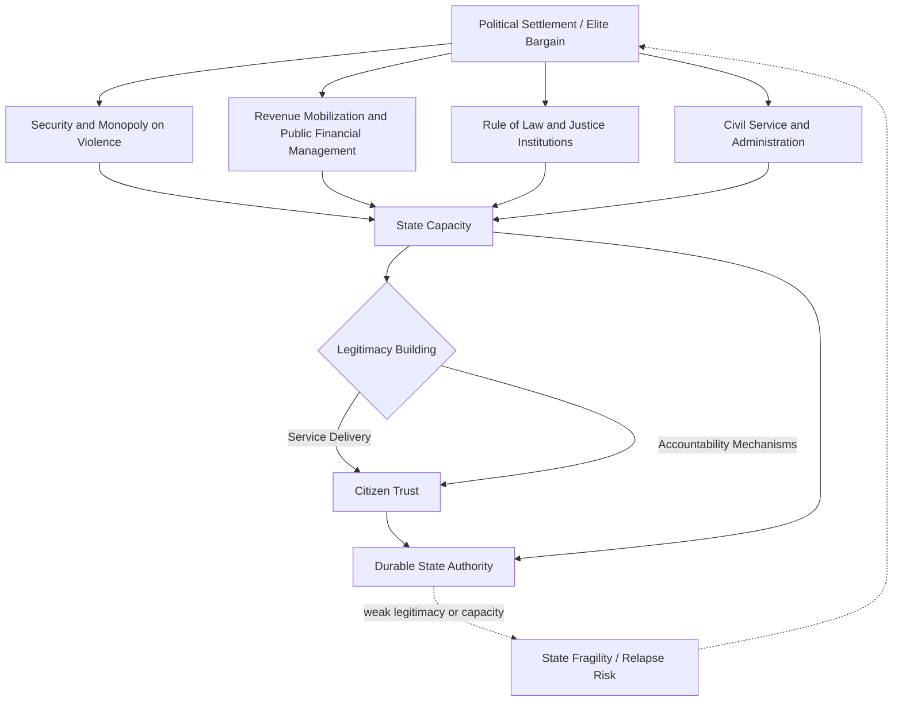

## State Building in Fragile Contexts

### Definition and Scope

State building in fragile contexts refers to the deliberate strengthening of state institutions' capacity, legitimacy, and accountability in settings characterized by weak governance, limited territorial control, conflict legacies, or institutional collapse. The field sits within development economics and political science, addressing how functional states can be constructed or reconstructed where the basic Weberian conditions of statehood — a monopoly on legitimate violence, effective bureaucratic administration, and revenue extraction capacity — are absent, contested, or severely degraded.

State building is analytically distinct from, though closely related to, several adjacent concepts:

- **Peacebuilding**: focused specifically on preventing or ending violent conflict, which may or may not require comprehensive state institution-building
- **Nation building**: the construction of shared national identity, which is a sociological/political process distinct from building administrative institutions
- **Institutional development**: a broader development economics concept applying to all countries, not only fragile or conflict-affected ones
- **Governance reform**: often narrower, targeting specific administrative or policy processes rather than the foundational architecture of state capacity

[Inference] These concepts overlap substantially in practice, and much of the applied literature and donor programming does not cleanly separate them, using "state building" as an umbrella term encompassing elements of all four.

### Theoretical Frameworks

**The Weberian state and its components**

Max Weber's classical definition of the state — an entity claiming a monopoly on the legitimate use of force within a defined territory — underlies much state-building theory, which typically identifies three interrelated core state functions requiring development: security provision, revenue extraction and public financial management, and administrative service delivery.

**Fiscal contract theory and the "resource curse of aid"**

A prominent theoretical strand argues that state legitimacy and accountability historically develop through a fiscal social contract, in which states that must extract tax revenue from citizens face incentives to provide services and accountability in exchange, drawing on historical political economy work (e.g., studies of European state formation through war-making and taxation, associated with Charles Tilly's "war made the state, and the state made war" thesis). This framework has generated concern that large, unconditional aid or natural resource revenues can substitute for domestic tax revenue, weakening the accountability relationship between state and citizen — sometimes termed a "resource curse of aid" or "rentier state" dynamic extended to aid dependency.

**State fragility as a spectrum, not a binary**

Contemporary frameworks (e.g., OECD's States of Fragility reports) conceptualize fragility as a multidimensional spectrum across economic, environmental, political, security, and societal dimensions, rather than a binary "fragile/not fragile" classification, recognizing that states can be fragile in some dimensions while functional in others.

**Legitimacy versus capacity**

A key analytical distinction separates state *capacity* (technical and administrative ability to implement policy and deliver services) from state *legitimacy* (citizens' perception that the state's authority is rightful and its actions are appropriate). [Inference] The literature generally holds that capacity-building without attention to legitimacy can produce technically functional but politically unstable institutions, while legitimacy without capacity produces states that lack the practical means to govern effectively — implying that durable state building requires attention to both dimensions simultaneously, though how to sequence or balance them in practice remains contested.

### Core Dimensions of State Building

**Security and monopoly on violence**

Establishing effective and accountable security forces (military, police) capable of providing territorial security and public order, closely linked to security sector reform programming, and foundational to other state functions since revenue collection, service delivery, and rule of law all depend on a baseline level of security.

**Public financial management and revenue mobilization**

Building the administrative infrastructure for budgeting, procurement, expenditure tracking, and tax/customs revenue collection. Common sequencing in fragile contexts favors administratively simple revenue sources (customs duties, resource royalties, simple consumption taxes) before more complex forms of taxation (personal income tax, property tax) that require greater administrative capacity and taxpayer compliance infrastructure.

**Rule of law and justice institutions**

Developing functioning courts, legal codes, and dispute-resolution mechanisms, including addressing the frequent coexistence of formal state legal systems with customary or informal justice mechanisms that may have greater local legitimacy in fragile contexts, particularly in rural or peripheral areas with limited state presence.

**Civil service and public administration**

Building a professional, merit-based bureaucracy capable of policy implementation, often complicated in fragile contexts by legacies of patronage-based appointment, politicized civil service structures inherited from conflict-era power-sharing arrangements, and severe human capital constraints following conflict-driven brain drain.

**Local governance and decentralization**

Extending state administrative presence and service delivery capacity to subnational levels, a particularly significant challenge in contexts where central state authority historically had limited reach into peripheral or contested territories — a condition frequently correlated with conflict risk per grievance-based theories of civil war onset.

### The Political Economy of State Building

**Elite bargains and the "limited access order"**

Douglass North, John Wallis, and Barry Weingast's framework of "limited access orders" describes how many fragile and developing states are governed through elite coalitions that manage violence and allocate rents among powerful factions, in contrast to "open access orders" with impersonal, rules-based institutions. [Inference] This framework implies that state building in fragile contexts often proceeds through a transitional phase in which elite bargains — rather than fully impersonal institutions — provide interim stability, and that pushing too rapidly toward open-access institutional forms before the underlying elite bargain has stabilized can be destabilizing.

**Neopatrimonialism and hybrid governance**

Many fragile states exhibit neopatrimonial governance, in which formal bureaucratic structures coexist with informal patron-client networks that actually determine resource allocation and political loyalty. State-building interventions premised purely on formal institutional design (organizational charts, legal frameworks) risk being ineffective if they do not account for these underlying informal power structures.

**External versus domestic drivers of state formation**

A significant debate concerns whether state building can be effectively driven by external actors (donors, international organizations) or whether historically most successful state formation has been an endogenous, often conflict-driven domestic process (as in the Tilly thesis on European state formation), raising questions about the fundamental feasibility of externally sponsored state building as a policy paradigm.

### Sequencing Debates

**Institutionalization before liberalization**

Roland Paris's influential critique argues that rapid simultaneous democratization and economic liberalization in fragile post-conflict states can outpace institutional capacity to manage the resulting political and economic competition, recommending that basic institutional capacity be established before full political and market liberalization proceeds — directly informing state-building sequencing debates alongside peacebuilding.

**Security first versus parallel-track approaches**

Debate persists over whether security establishment must precede meaningful governance and economic institution-building, or whether these processes can and should proceed in parallel, with implications for how international missions divide mandates between military/security components and civilian governance-support components.

**Top-down versus bottom-up state building**

Some approaches prioritize building central state capacity first (ministries, national systems) on the theory that subnational governance ultimately depends on central resources and coordination, while others prioritize bottom-up, local governance and community-level institution building on the theory that legitimacy and accountability are more achievable at smaller scales and can subsequently aggregate upward. [Unverified] Comparative evidence on which sequencing produces more durable state capacity is limited and highly context-dependent.

### External Actors and Frameworks

**OECD DAC fragility and state-building principles**

The OECD's "Principles for Good International Engagement in Fragile States and Situations" articulate guidance for donors, emphasizing context-specific analysis, avoiding harm, focusing on state building as a central objective, and aligning with local priorities where feasible.

**New Deal for Engagement in Fragile States**

As discussed in peacebuilding contexts, the New Deal's Peacebuilding and Statebuilding Goals (legitimate politics, security, justice, economic foundations, revenues and services) provide a widely referenced (though unevenly implemented) framework specifically oriented around state-building objectives in fragile and conflict-affected states.

**World Bank engagement in fragile and conflict-affected situations (FCS)**

The World Bank maintains a dedicated operational and analytical framework for FCS engagement, including risk-tolerant project design, enhanced concessional financing terms, and requirements for fragility, conflict, and violence (FCV) risk assessment integrated into country strategies and project preparation.

**Technical assistance and capacity-building modalities**

Common instruments include embedded technical advisors within ministries, twinning arrangements with functional state institutions from other countries, and systems-strengthening programs for specific functions (tax administration, procurement, civil registration). [Inference] Evidence on the effectiveness of externally provided technical assistance in producing durable capacity improvement (as opposed to temporary performance gains that persist only while advisors remain present) is mixed, and is a recurring subject of critical evaluation in the aid effectiveness literature.

### Measurement Challenges

State-building progress is difficult to measure comprehensively:

- **Capacity indicators**: proxy measures such as tax revenue as a share of GDP, civil service size and qualifications, and public financial management assessment scores (e.g., the Public Expenditure and Financial Accountability, or PEFA, framework)
- **Legitimacy indicators**: harder to quantify, often relying on perception surveys (trust in government, service delivery satisfaction) that can be difficult to conduct reliably in insecure or access-constrained environments
- **Composite fragility indices**: as discussed in the peacebuilding context, indices like the Fragile States Index and World Bank's Harmonized List of FCS provide comparative snapshots but embed contested assumptions about fragility's core components and face significant construct-validity debates

[Unverified] There is no broad methodological consensus on a single best composite measure of "state-building progress," and different indices frequently produce divergent rankings for the same country, reflecting genuine conceptual disagreement about what state capacity and legitimacy consist of and how to weight their components.

### Case Illustrations

**Somaliland versus South-Central Somalia**

A widely cited comparative case: Somaliland's relatively more successful (though internationally unrecognized) state-building trajectory, built substantially on endogenous clan-based political settlement processes with limited external intervention, contrasts with the more externally driven and less stable state-building efforts in South-Central Somalia, offering evidence for debates about domestic versus externally driven state formation.

**Rwanda**

Frequently analyzed as a case of relatively rapid and effective state capacity building (particularly in revenue administration and public service delivery) following the 1994 genocide, generating ongoing scholarly debate about the relationship between centralized, disciplined governance and durable, broadly legitimate state institutions.

**Afghanistan (2001–2021)**

Extensively analyzed as a state-building effort characterized by heavy external financial and technical support that produced formally impressive institutional structures (a new constitution, elections, ministries) alongside weak underlying legitimacy, pervasive corruption, and dependency on external security guarantees, culminating in state collapse upon international military withdrawal — widely cited as a cautionary case on the limits of externally driven, capacity-focused state building absent a stable underlying political settlement.

**South Sudan**

Illustrates the challenges of state building in a context where independence (2011) was achieved through conflict but was not followed by a stable internal political settlement, with subsequent civil war (from 2013) demonstrating how formal statehood and international recognition do not guarantee the underlying institutional and political conditions for effective state building.

### Illustrative Diagram: State-Building Dimensions and Interdependencies

### Key Debates in the Literature

- **Externally driven versus endogenous state formation**: whether meaningful state building can be effectively catalyzed by international actors, or whether historically robust states have primarily emerged through internal, often conflict-driven processes
- **Capacity versus legitimacy sequencing**: whether technical capacity-building or legitimacy/accountability-building should take precedence, and whether they can be pursued simultaneously
- **Formal institutions versus hybrid/informal governance**: how state-building programs should engage with (rather than attempt to replace) existing informal and customary governance structures
- **Aid dependency and the fiscal social contract**: whether large aid inflows undermine the domestic revenue-accountability relationship central to some theories of state legitimacy
- **Measuring progress**: the absence of consensus measurement frameworks for state capacity and legitimacy, complicating both academic evaluation and donor program design

**Related Topics**

- Post-conflict reconstruction economics
- Peacebuilding and development interventions
- Fiscal contract theory and taxation-accountability linkages
- Limited access orders (North, Wallis, and Weingast framework)
- Public financial management reform and PEFA assessments
- Security sector reform and civilian oversight
- Decentralization and subnational governance in fragile states
- Fragile states classification and financing frameworks
- Rentier state theory and resource-dependent governance
- Customary and hybrid justice systems