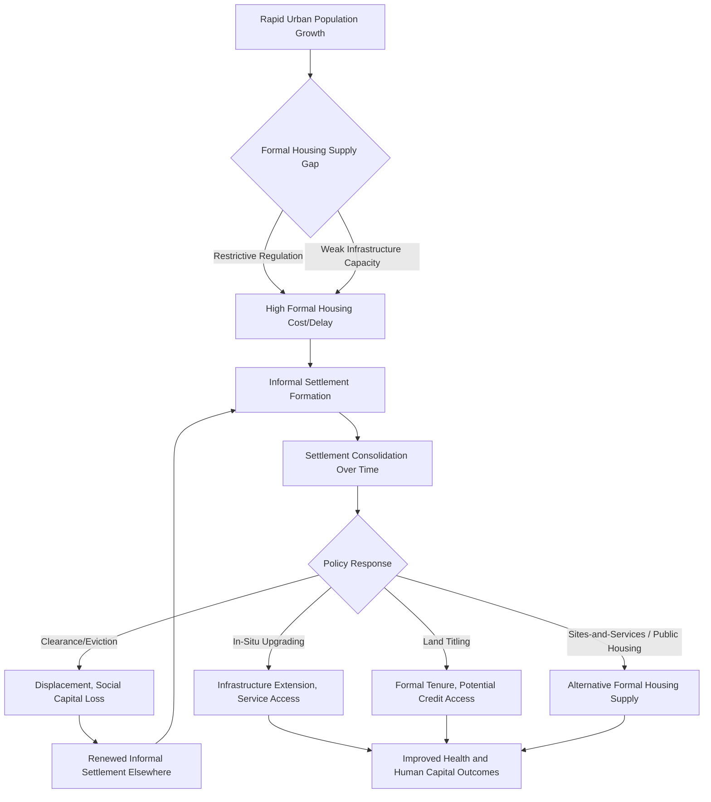

## Slum Formation and Informal Settlements

### Definition and Scope

Slum formation and informal settlements economics examines the processes by which unplanned, tenure-insecure, and often under-serviced urban settlements emerge and persist, and the economic logic, welfare consequences, and policy responses associated with them. The field sits within urban economics and development economics, engaging with housing markets, migration, property rights theory, and public service provision under conditions of rapid or unmanaged urbanization.

**UN-Habitat operational definition**

UN-Habitat defines a slum household as one lacking one or more of the following conditions: access to improved water, access to improved sanitation, sufficient living area (not overcrowded), durability of housing structure, and security of tenure. [Inference] This multi-dimensional definition is widely used in international statistics and comparative research, though it means "slum" is a composite deprivation measure rather than a single well-defined settlement type, and settlements meeting the definition vary enormously in their physical, legal, and economic characteristics across contexts.

**Distinguishing related terms**

- **Slums**: used broadly (often in official statistics) to denote settlements or households meeting the UN-Habitat deprivation criteria above, regardless of legal status
- **Informal settlements**: emphasizes the legal/planning dimension — settlements developed outside formal land-use planning, building codes, or legal land tenure processes, which may or may not also meet slum deprivation criteria
- **Squatter settlements**: informal settlements specifically characterized by occupation of land without legal ownership or rental agreement, a subset of informal settlements
- **Informal housing**: a broader term encompassing any housing produced or occupied outside formal legal and regulatory channels, including informal rental arrangements on formally owned land

### Theoretical Frameworks

**Housing market failure and supply-side explanations**

A core economic explanation for slum formation is a mismatch between the supply of formal, legally compliant housing and demand from rapidly growing urban populations, particularly low-income migrants and workers. Where formal housing supply is constrained by restrictive land-use regulation, slow bureaucratic land titling processes, or inadequate infrastructure investment, informal settlement becomes the primary mechanism by which urban housing demand is met, especially for lower-income households priced out of the formal market.

**Harris-Todaro migration and urban labor market absorption**

The Harris-Todaro model of rural-urban migration, which posits that migrants move to cities based on expected (rather than certain) urban wages given the probability of formal-sector employment, has been extended in urban economics literature to help explain informal settlement formation: migrants who do not immediately secure formal employment or formal housing often settle informally while seeking urban economic opportunity, with informal settlements functioning partly as a housing-market analog to informal labor markets absorbing excess urban labor supply.

**De Soto's property rights framework**

Hernando de Soto's influential work argues that the absence of formal property titles in informal settlements represents "dead capital" — assets that cannot be leveraged as collateral for credit, formally transferred, or used to signal creditworthiness, thereby constraining residents' ability to invest in housing improvements or access formal financial markets. This framework has substantially influenced policy toward land titling programs as a slum-upgrading strategy, discussed further below.

**Path dependency and settlement consolidation**

Informal settlements often follow a documented consolidation trajectory: initial occupation with rudimentary shelter, gradual incremental investment in housing quality as tenure security perceptions increase (even absent formal legal title), and eventual partial infrastructure extension by local governments responding to political pressure from established populations — a process sometimes termed "slum consolidation" that complicates simple binary distinctions between "slum" and "formal neighborhood."

### Drivers of Slum Formation

**Rapid urbanization outpacing formal housing supply**

Rapid rural-to-urban migration and natural urban population growth, when occurring faster than formal housing production and infrastructure extension, create a structural gap that informal settlement fills, particularly acute in rapidly urbanizing regions of Sub-Saharan Africa and South Asia.

**Restrictive land-use regulation and formal housing costs**

Overly restrictive zoning, minimum plot size requirements, building codes calibrated to higher-income standards, and slow or costly formal land titling processes can make formal housing production prohibitively expensive or slow relative to demand, pushing lower-income households toward informal alternatives. [Inference] This supply-side regulatory explanation is prominent in the urban economics literature, though the relative importance of regulatory barriers versus sheer income constraints (i.e., households simply lacking sufficient income for any formal housing regardless of regulation) varies by context and is difficult to disentangle empirically.

**Land tenure systems and customary land rights**

In many developing-country contexts, especially in peri-urban areas, land is held under customary or communal tenure systems that are not well integrated with formal statutory land administration, creating ambiguity about legal development rights that can result in settlements that are informal from a statutory legal perspective while being legitimate under customary tenure arrangements.

**Weak urban planning and infrastructure investment capacity**

Local governments in rapidly urbanizing developing-country cities frequently lack the fiscal and administrative capacity to extend planned infrastructure and serviced land fast enough to accommodate population growth, a capacity constraint closely linked to broader municipal finance and fiscal decentralization challenges.

**Conflict and disaster-driven displacement**

As discussed in displacement economics, informal settlements are frequently formed or expanded by populations fleeing conflict or disaster who settle informally in urban areas absent access to formal housing markets, linking slum formation to the broader forced displacement literature.

### Economic Functions and Characteristics of Informal Settlements

**Proximity to labor markets**

A defining economic feature of many informal settlements, particularly centrally located ones, is proximity to urban labor markets and economic opportunities that would be inaccessible or prohibitively costly to reach from more distant formal housing, making informal settlement in some cases a rational locational choice trading housing quality for labor market access.

**Informal land and rental markets**

Despite lacking formal legal recognition, informal settlements typically develop active informal land and housing rental markets, with de facto (if not de jure) property rights enforced through community-recognized norms, informal documentation, and social sanctioning mechanisms rather than state legal enforcement.

**Heterogeneity in tenure security**

[Inference] Perceived tenure security in informal settlements varies substantially and is not simply a function of formal legal status; long-established settlements with strong community organization and political recognition may exhibit de facto tenure security and associated housing investment behavior similar to formally titled areas, even without formal legal title, while newer or more politically vulnerable settlements may face genuine eviction risk despite superficially similar physical characteristics.

**Service provision gaps and coping mechanisms**

Informal settlements typically lack full access to formal water, sanitation, electricity, and waste management infrastructure, with residents often relying on informal or self-organized alternatives (water vendors, shared facilities, informal electricity connections) that are frequently more expensive per unit of service than formal utility connections available to wealthier, formally served neighborhoods — a phenomenon sometimes termed the "poverty premium" in service access.

### Health, Human Capital, and Welfare Consequences

**Health outcomes**

Informal settlements' inadequate water and sanitation infrastructure, overcrowding, and often hazardous physical locations (floodplains, steep slopes, land near industrial hazards) are associated with elevated rates of infectious disease, child mortality, and vulnerability to disaster-related harm, with well-documented links to broader health and human capital literatures.

**Human capital and educational access**

Children in informal settlements often face constrained access to formal schooling due to distance, cost, or lack of legal residential documentation sometimes required for school enrollment, connecting slum formation to human capital accumulation and intergenerational mobility literatures.

**Tenure insecurity and investment disincentives**

Consistent with de Soto's framework, empirical studies generally find that greater perceived tenure security is associated with increased household investment in housing quality improvements, though [Unverified] the magnitude of this effect and the specific channels (credit access versus pure investment-incentive effects) vary across studies and contexts.

### Policy Responses

**Slum clearance and forced eviction**

Historically common policy response involving demolition of informal settlements, often to reclaim land for formal development or infrastructure projects; widely criticized in contemporary development literature for displacing residents without adequate resettlement, destroying accumulated informal social and economic capital, and frequently failing to address the underlying housing supply gap that generated the settlement.

**In-situ upgrading**

An alternative approach involving improvement of existing informal settlements in place — extending water, sanitation, electricity, and road infrastructure, and in some cases providing formal land tenure — rather than displacement, based on the rationale that in-situ upgrading preserves residents' social networks, economic proximity advantages, and existing housing investment while addressing the most acute service and tenure deficits. [Inference] In-situ upgrading has become the dominant paradigm favored by major development institutions (World Bank, UN-Habitat) since roughly the 1970s–1980s shift away from clearance-oriented policies, though implementation quality and long-run sustainability of upgrading programs vary substantially across cases.

**Land titling and tenure formalization programs**

Programs to provide formal legal land titles to informal settlement residents, most prominently associated with de Soto-inspired reforms (e.g., large-scale titling programs in Peru in the 1990s and 2000s), intended to unlock credit access and investment incentives. [Unverified] Empirical evaluations of titling programs' effects on credit access, investment, and broader economic outcomes have produced mixed results across different studies and contexts — some find significant positive effects on housing investment with more limited or contested effects on formal credit access, suggesting the "dead capital" mechanism may operate less straightforwardly in practice than the theoretical framework suggests.

**Sites-and-services schemes**

An earlier World Bank-supported approach (prominent especially in the 1970s–1980s) providing serviced land plots (with basic infrastructure already installed) to low-income households for progressive, incremental self-construction of housing, intended to formalize the housing production process from the outset rather than upgrading after informal settlement has occurred. [Inference] Sites-and-services programs saw declining donor support from the 1990s onward, with mixed assessments of cost-effectiveness and targeting accuracy relative to alternative approaches such as in-situ upgrading and enabling-market strategies.

**Enabling markets and regulatory reform**

A policy strand focused on addressing the regulatory and market-based drivers of slum formation directly — reforming restrictive zoning and building codes, streamlining formal land titling and subdivision processes, and expanding affordable formal housing finance — intended to reduce the structural housing supply gap rather than only addressing existing informal settlements after the fact.

**Public housing provision**

Direct government construction and provision of subsidized formal housing, used with varying intensity across countries; [Inference] evidence on cost-effectiveness of large-scale public housing construction relative to upgrading or enabling-market approaches is mixed, and public housing programs face their own well-documented challenges around targeting, subsidy costs, and unit quality/location trade-offs.

### Measurement Challenges

**Data collection difficulties**

Informal settlements are frequently undercounted or excluded from official census and survey sampling frames due to their unplanned and sometimes legally unrecognized status, irregular street layouts complicating standard survey enumeration methods, and in some cases active concealment from authorities due to eviction risk.

**Satellite and remote sensing methods**

Given ground survey limitations, researchers increasingly use satellite imagery and machine learning classification methods to identify and measure informal settlement extent and growth over time, providing more consistent measurement than administrative records in many rapidly urbanizing contexts, though [Inference] such methods primarily capture physical/morphological characteristics of settlements (building density, layout irregularity) rather than the legal tenure or full multidimensional deprivation criteria in the UN-Habitat definition, so they serve as a complement to, rather than full substitute for, household-level survey data.

**Defining settlement boundaries and heterogeneity**

Aggregate slum population statistics can obscure substantial heterogeneity in settlement age, consolidation level, service access, and tenure security within what official statistics may classify under a single "slum" category, complicating policy targeting and cross-study comparability.

### Illustrative Diagram: Slum Formation and Policy Response Pathways

### Case Illustrations

**Dharavi, Mumbai, India**

One of the most studied informal settlements globally, notable for its substantial internal informal manufacturing and recycling economy alongside severe infrastructure and tenure deficits, and the subject of long-running, politically contentious redevelopment and upgrading proposals illustrating the complexity of balancing economic function, resident welfare, and formal redevelopment interests.

**Peru land titling program**

De Soto-inspired large-scale urban land titling initiative in Lima and other Peruvian cities from the 1990s, extensively studied in the economics literature (including work by Erica Field and others) as a natural experiment for evaluating the effects of formal tenure on household investment, labor supply, and credit market outcomes.

**Orangi Pilot Project, Karachi, Pakistan**

Widely cited as a successful community-driven, low-cost sanitation upgrading model in an informal settlement context, in which residents themselves financed and constructed internal sanitation infrastructure with technical support, connecting to broader community-driven development literature on cost-sharing and participatory infrastructure provision.

**Rio de Janeiro favela upgrading (Favela-Bairro and successors)**

Long-running Brazilian municipal upgrading programs illustrating both the potential and limitations of in-situ upgrading approaches, including debates over program sustainability, gentrification pressure following successful upgrading, and the challenge of addressing security and governance dimensions alongside physical infrastructure.

### Key Debates in the Literature

- **Clearance versus upgrading**: broad but not universal consensus favoring in-situ upgrading over clearance, though debates persist regarding cases where land use conflicts (hazard exposure, high-value redevelopment sites) may still favor relocation with adequate resettlement support
- **Titling effectiveness**: contested empirical evidence on whether formal land titling delivers the credit-access and investment benefits predicted by de Soto-style property rights theory
- **Regulation versus poverty as the binding constraint**: ongoing debate over whether restrictive formal housing regulation or fundamental household income constraints are the primary driver of informal settlement, with differing policy implications
- **Informality as adaptive strategy versus market failure**: whether informal settlement should be understood primarily as a rational adaptive response to labor market and housing market conditions, or as a market/governance failure requiring correction
- **Measurement and definitional consistency**: the challenge of comparing slum statistics across countries and over time given definitional heterogeneity and data collection limitations

**Related Topics**

- Urban primacy and city-size distributions
- Harris-Todaro model and rural-urban migration
- Property rights theory and land tenure formalization
- Municipal finance and urban infrastructure investment
- Housing market regulation and affordable housing policy
- Refugee and forced displacement economics
- Urban health and water/sanitation access economics
- Community-driven development and participatory infrastructure
- Remote sensing and satellite data in development economics
- Gentrification and displacement risk in upgraded settlements