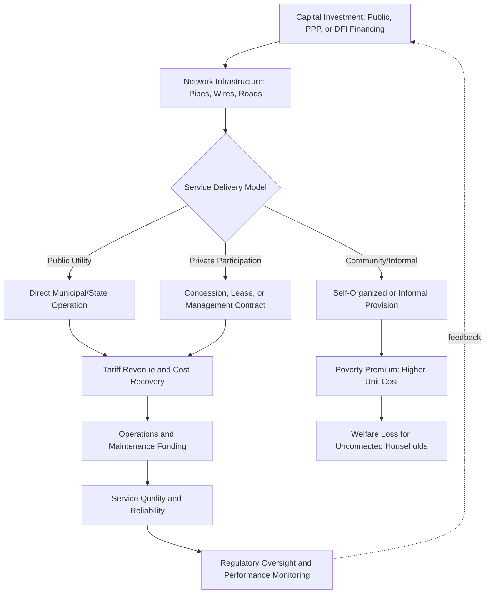

## Urban Infrastructure and Service Delivery

### Definition and Scope

Urban infrastructure and service delivery economics examines the provision, financing, and governance of the physical systems and public services that enable urban areas to function — water, sanitation, electricity, transport, solid waste management, and related networked infrastructure. The field draws on public economics, industrial organization, and urban economics, addressing questions of natural monopoly regulation, financing mechanisms, service delivery models, and the distributional consequences of infrastructure access across income groups and settlement types.

Urban infrastructure is conventionally analyzed across several service categories:

- **Water supply and sanitation**: piped water networks, sewerage, and wastewater treatment
- **Electricity distribution**: urban power grids and last-mile connection
- **Transport**: roads, public transit systems, and non-motorized transport infrastructure
- **Solid waste management**: collection, transport, and disposal or treatment of municipal waste
- **Drainage and flood management**: stormwater systems, particularly critical in rapidly urbanizing and climate-exposed cities

[Inference] These categories are analytically distinct but functionally interdependent — for example, inadequate drainage infrastructure can undermine road durability and public health outcomes independent of sanitation system quality — meaning infrastructure planning literature increasingly emphasizes integrated rather than purely sectoral approaches, though sectoral silos remain common in practice due to distinct institutional and financing arrangements for each service.

### Theoretical Frameworks

**Natural monopoly and network economics**

Most urban infrastructure services exhibit natural monopoly characteristics — high fixed costs of network construction (pipes, wires, roads) combined with low marginal costs of service provision once the network exists, creating economies of scale that make single-provider service delivery more efficient than competitive provision within a given geographic area. This underlies the standard economic rationale for regulated monopoly or public provision models in water, electricity distribution, and similar network services.

**Public goods and externality characteristics**

Some urban infrastructure services have public-good or externality dimensions beyond pure private consumption benefits: sanitation investment generates positive externalities for neighboring households and the broader public health system (reducing disease transmission), while inadequate drainage or waste management can impose negative externalities on downstream areas — providing an efficiency rationale for public financing or subsidization beyond what private willingness-to-pay alone would support.

**Two-part tariff and cost recovery theory**

Standard public utility pricing theory addresses the tension between marginal-cost pricing (economically efficient but potentially insufficient to recover fixed network costs given increasing-returns-to-scale technology) and average-cost pricing (ensures financial sustainability but may deviate from allocative efficiency), commonly resolved through two-part tariff structures combining a fixed connection charge with a per-unit consumption charge, alongside consideration of distributional objectives through increasing-block tariff structures that subsidize a basic consumption tier.

**Infrastructure and agglomeration economies**

Urban economics connects infrastructure provision directly to agglomeration theory: transport infrastructure in particular affects the effective size and connectivity of urban labor and product markets, with implications for productivity, and inadequate infrastructure can constrain a city's ability to realize agglomeration benefits even where underlying population density is high.

### Service Delivery Models

**Public provision**

Direct provision by government agencies or state-owned utilities, historically the dominant model for water, sanitation, and electricity distribution in most countries, with mixed track records on operational efficiency, cost recovery, and service quality that vary substantially by country and sector-specific governance arrangements.

**Private sector participation models**

A spectrum of arrangements transferring varying degrees of operational responsibility, investment obligation, and commercial risk to private operators:

- **Management contracts**: private operator manages day-to-day operations for a fee, with limited capital investment responsibility and risk transfer
- **Lease/affermage contracts**: private operator takes on operational responsibility and revenue collection risk while the public sector retains asset ownership and major capital investment responsibility
- **Concessions**: private operator takes on both operational responsibility and capital investment obligations for a defined contract period, typically bearing greater commercial and investment risk
- **Full privatization/divestiture**: transfer of asset ownership itself to private entities, historically rare in water and sanitation compared to electricity and telecommunications sectors

**The water privatization debate**

Water sector privatization, prominent in international development policy discourse particularly during the 1990s–2000s, generated substantial controversy and a mixed empirical track record: some concessions (e.g., in parts of Latin America) faced significant public opposition, contract renegotiation, or reversal (most notably Bolivia's Cochabamba water concession, cancelled after public protest in 2000), while other cases showed improved service coverage and operational efficiency under private management. [Unverified] The empirical literature on water privatization outcomes is genuinely contested, with results appearing highly sensitive to specific contract design, regulatory capacity, and political context rather than supporting a uniform conclusion favoring or opposing private participation as a general model.

**Community-based and self-provision models**

In contexts where formal utility service does not reach informal or peripheral settlements, community-organized infrastructure provision (as illustrated by the Orangi Pilot Project sanitation model) and informal private provision (water vendors, informal electricity connections) often fill service gaps, frequently at higher per-unit cost to consumers than formal utility service, connecting to the "poverty premium" concept discussed in informal settlement economics.

### Financing Mechanisms

**Tariff revenue and cost recovery**

User charges/tariffs are a primary financing source for infrastructure operation and maintenance, though full cost-recovery tariff levels are frequently politically difficult to implement, particularly for water and electricity, given affordability concerns for low-income households and the political salience of utility pricing.

**Public capital investment and transfers**

Central government capital transfers and municipal own-revenue (property taxes, other local taxes) fund significant shares of infrastructure capital expenditure in many contexts, particularly in earlier-stage municipal systems with limited tariff-based cost recovery capacity.

**Municipal borrowing and infrastructure bonds**

More fiscally developed municipal systems access capital markets directly through municipal bonds or infrastructure-specific debt instruments, though [Inference] this financing channel typically requires a degree of municipal creditworthiness, revenue predictability, and regulatory framework (often including credit rating mechanisms) not present in many lower-income and institutionally weaker municipal contexts, limiting its applicability as a financing source in many developing-country cities.

**Development finance institution lending**

Multilateral and bilateral development finance institutions (World Bank, regional development banks, bilateral development finance agencies) provide substantial infrastructure financing in developing countries, often combined with technical assistance and, in some cases, policy conditionality related to utility governance or tariff reform.

**Public-private partnerships (PPPs) and blended finance**

Structured arrangements combining public and private capital, often with development finance institution risk-sharing instruments (guarantees, concessional co-financing) intended to mobilize private capital for infrastructure projects that would not otherwise meet pure commercial risk-return thresholds, particularly relevant for larger transport and energy infrastructure projects.

### Distributional Dimensions and Access Inequality

**Urban-rural and intra-urban disparities**

Infrastructure access is frequently highly unequal both between urban and rural areas (urban bias in infrastructure investment, as discussed in urban primacy literature) and within cities themselves, with informal settlements and peripheral areas systematically underserved relative to formal, centrally located, and higher-income neighborhoods.

**The poverty premium in service access**

As discussed in informal settlement economics, households lacking formal utility connections frequently pay substantially more per unit for water, electricity, and other services obtained through informal or intermediary channels than formally connected households pay for equivalent formal service, a well-documented pattern with significant implications for both welfare and the economic case for extending formal infrastructure to underserved areas.

**Gender dimensions of infrastructure access**

[Inference] Inadequate water and sanitation infrastructure has documented gender-differentiated effects, since water collection responsibilities in many contexts fall disproportionately on women and girls, and inadequate sanitation access has been linked in some studies to school attendance effects specifically for adolescent girls, though the magnitude and consistency of these effects vary across the empirical literature.

### Governance and Regulatory Frameworks

**Utility regulation models**

Independent regulatory agencies, tariff-setting commissions, and performance-based regulatory frameworks (e.g., price-cap or rate-of-return regulation, adapted from broader public utility economics) are used with varying degrees of institutional independence and effectiveness to oversee infrastructure service providers, whether publicly or privately operated.

**Decentralization and municipal service responsibility**

Many countries have decentralized infrastructure and service delivery responsibility to municipal or subnational governments, following broader fiscal federalism trends, though [Inference] decentralization's effects on service delivery quality are contingent on adequate fiscal transfer mechanisms and municipal administrative capacity, and unfunded or under-resourced decentralization mandates are a recurring documented problem in developing-country contexts.

**Corruption and governance risk in infrastructure procurement**

Infrastructure projects, characterized by large capital sums, technical complexity limiting oversight capacity, and often extended procurement and construction timelines, are widely recognized in the governance literature as particularly exposed to corruption risk, with implications for both project cost and quality outcomes.

### Measurement and Data

**Access and coverage indicators**

Standard indicators include the share of urban population with access to piped water, improved sanitation, grid electricity connection, and all-weather road access, commonly tracked through household surveys (e.g., Demographic and Health Surveys, Multiple Indicator Cluster Surveys) and administrative utility connection records, informing global monitoring frameworks such as the Sustainable Development Goals (notably SDG 6 for water/sanitation and SDG 11 for sustainable cities).

**Service quality beyond binary access**

A growing methodological emphasis addresses the limitations of binary access indicators (connected/not connected) in capturing actual service quality — continuity of water supply, water quality/safety, electricity outage frequency and duration — recognizing that formal connection alone does not guarantee reliable service, a particularly salient issue in many developing-country utility systems characterized by intermittent supply despite nominal formal coverage.

**Nonrevenue water and utility operational efficiency**

A widely used utility performance indicator, "non-revenue water" (water produced but not billed due to physical leakage or commercial losses such as illegal connections and metering inaccuracies), serves as a key diagnostic measure of utility operational and financial efficiency, with high non-revenue water levels common in many developing-country utilities and directly affecting both financial sustainability and resource efficiency.

### Illustrative Diagram: Infrastructure Service Delivery Chain and Financing

### Case Illustrations

**Cochabamba, Bolivia water concession (1999–2000)**

Widely cited cautionary case in the water privatization literature: a water concession led to substantial tariff increases and public protest culminating in contract cancellation, frequently referenced in debates over the political feasibility and design requirements of private participation in essential service provision.

**Phnom Penh Water Supply Authority, Cambodia**

Frequently cited as a relatively successful public utility turnaround case, in which a publicly owned utility achieved substantial improvements in non-revenue water reduction, service coverage, and financial sustainability without private sector participation, often referenced as a counterpoint in debates over whether private participation is necessary for utility performance improvement.

**Delhi and other Indian metros: intermittent water supply**

Frequently studied cases of the "access versus quality" distinction in infrastructure measurement, where substantial nominal piped water coverage coexists with highly intermittent actual supply, illustrating the limitations of binary connection-based access indicators.

**Rwanda energy access programs**

Cited in some development literature as an example of relatively rapid electrification progress achieved through a combination of grid extension and off-grid/mini-grid solutions, illustrating hybrid infrastructure strategies combining centralized and decentralized approaches to service extension.

### Key Debates in the Literature

- **Public versus private provision**: the continued lack of empirical consensus on whether private participation systematically improves infrastructure service outcomes, with results highly sensitive to contract design and regulatory context
- **Cost recovery versus affordability**: tension between tariff levels needed for financial sustainability and affordability constraints for low-income households, and the appropriate design of subsidy mechanisms (e.g., increasing-block tariffs versus targeted direct subsidies)
- **Centralized network extension versus decentralized/off-grid solutions**: particularly salient in electricity and water sectors, where extending centralized networks to peripheral or informal areas competes with decentralized technological alternatives (mini-grids, decentralized sanitation) as service extension strategies
- **Measuring true service quality**: ongoing methodological shift from binary access measures toward continuity, reliability, and quality-adjusted service indicators
- **Financing gap and blended finance effectiveness**: debates over whether blended finance and PPP structures genuinely mobilize additional private capital for infrastructure or primarily substitute for financing that would have otherwise come through public or concessional channels

**Related Topics**

- Slum formation and informal settlements
- Urban primacy and city-size distributions
- Public utility regulation and tariff design
- Fiscal federalism and municipal finance
- Public-private partnerships and blended finance instruments
- Water, sanitation, and hygiene (WASH) economics
- Urban transport economics and congestion management
- Climate resilience and urban flood/drainage infrastructure
- Corruption in public procurement and infrastructure projects
- Sustainable Development Goals monitoring frameworks (SDG 6, SDG 11)