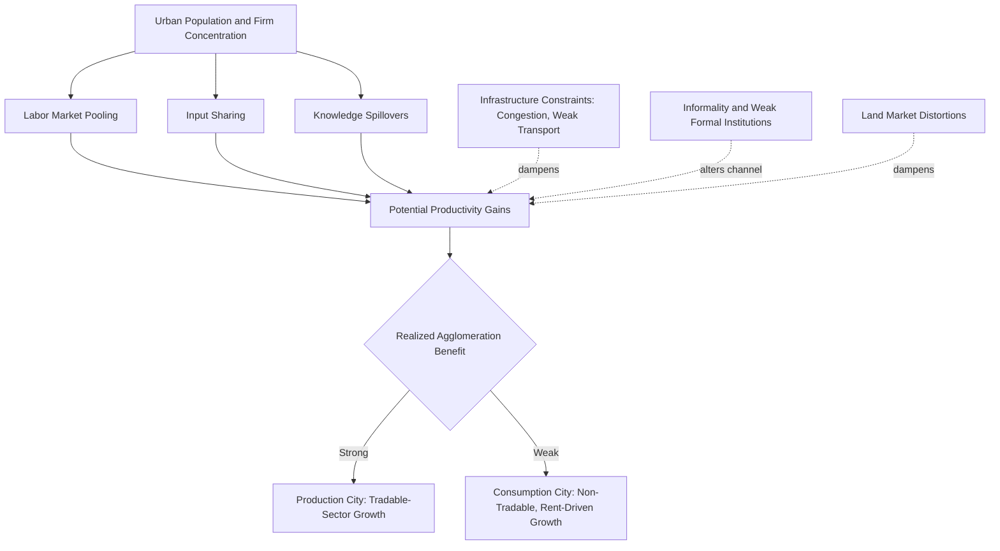

## Agglomeration Economies in Developing Cities

### Definition and Scope

Agglomeration economies refer to the productivity, innovation, and welfare benefits that arise when firms and workers locate in geographic proximity to one another. Applied to developing-country cities, this literature examines whether and how the same mechanisms documented extensively in advanced-economy urban economics operate under conditions of weak infrastructure, large informal sectors, land market distortions, and often high urban primacy — and what this implies for urbanization-as-development-strategy debates.

The core theoretical taxonomy, drawing on Alfred Marshall's original formulation and its modern elaboration by economists including Edward Glaeser and Paul Krugman, identifies three classic sources of agglomeration economies, often termed **Marshallian externalities**:

- **Labor market pooling**: concentration of workers with relevant skills reduces search and matching frictions for firms and workers alike, and provides insurance against firm-specific or sector-specific shocks
- **Input sharing**: proximity to specialized suppliers, intermediate input producers, and shared infrastructure reduces transaction and transport costs for firms
- **Knowledge spillovers**: proximity facilitates the informal transmission of tacit knowledge, technology, and innovation between firms and workers, particularly for activities requiring frequent face-to-face interaction

### Theoretical Frameworks

**New Economic Geography**

Paul Krugman's New Economic Geography (NEG) models formalize how the interaction between increasing returns to scale at the firm level, transport costs, and market size can generate self-reinforcing spatial concentration ("core-periphery" outcomes), providing a general equilibrium framework for understanding why economic activity clusters rather than dispersing evenly across space, with direct application to understanding urban concentration patterns in developing economies.

**Localization versus urbanization economies**

The literature distinguishes between **localization economies** (benefits from the concentration of firms within the *same* industry, associated with Marshall-Arrow-Romer, or MAR, externalities) and **urbanization economies** (benefits from the diversity and overall scale of economic activity across *different* industries within a city, associated with Jane Jacobs's emphasis on urban diversity as a driver of innovation). [Inference] Empirical work in developing-country contexts has found evidence for both mechanisms depending on sector and city characteristics, though disentangling the two econometrically remains challenging given that industry concentration and city scale are often correlated in the same locations.

**Nature versus nurture in urban productivity**

A persistent identification challenge in agglomeration economics — equally relevant in developing-country contexts — is distinguishing genuine agglomeration effects (proximity causally raising productivity) from selection effects (more productive firms and workers choosing to locate in larger cities for reasons unrelated to agglomeration benefits themselves). Addressing this "nature versus nurture" problem typically requires panel data tracking the same firms or workers as they move between cities of different sizes, a data requirement that is often more difficult to satisfy in developing-country statistical systems than in advanced economies.

### Distinctive Features of Agglomeration in Developing-Country Contexts

**Informality as a defining structural feature**

A large share of urban economic activity in developing countries occurs in the informal sector, which changes how agglomeration mechanisms operate: informal firms may rely more heavily on informal knowledge spillovers and personal networks (given limited access to formal information channels, contract enforcement, or credit) while facing distinct constraints on scaling that limit their ability to fully capture agglomeration benefits available to formal-sector firms.

**Infrastructure and congestion constraints**

Agglomeration benefits depend on the effective functioning of urban infrastructure — transport networks that allow labor market pooling to operate across a metropolitan area, and communication/utility infrastructure supporting input sharing. In many developing-country cities, inadequate transport infrastructure and severe traffic congestion can significantly reduce the effective size of urban labor and product markets even where nominal population density is very high, potentially limiting realized agglomeration benefits relative to what population size alone would suggest.

**Land market distortions and urban form**

Restrictive land-use regulation, unclear property rights, and land market distortions discussed in urban primacy and informal settlement literature can produce urban spatial forms — excessive sprawl, fragmented development, or conversely excessive density in central areas due to height restrictions — that do not efficiently support agglomeration-maximizing urban structure, an issue receiving increasing attention in urban economics applied to developing cities (e.g., work by Alain Bertaud and others on urban spatial structure).

**Weak formal institutions and reliance on relational contracting**

Where formal contract enforcement and credit information systems are weak, agglomeration-driven "input sharing" and business networking benefits may operate substantially through relational contracting and reputation mechanisms embedded in dense social networks — a mechanism that itself depends on geographic proximity and repeated interaction, potentially making agglomeration economies operate through somewhat different channels than in advanced economies with stronger formal institutions.

### Empirical Evidence on Urban Wage and Productivity Premiums

**Urban wage premiums in developing countries**

Empirical studies across various developing-country contexts generally find an urban wage premium — workers in larger cities earn more than comparable workers in smaller cities or rural areas — consistent with agglomeration theory predictions, though [Unverified] the magnitude of the premium and the extent to which it reflects genuine productivity effects versus worker selection (more skilled or ambitious individuals selecting into urban migration) varies across studies and is a persistent identification challenge in this literature, as noted above.

**City-size and firm productivity**

Firm-level studies in various developing-country settings have found evidence that firms in larger, denser urban areas tend to exhibit higher productivity, consistent with agglomeration theory, though [Inference] the specific magnitude of estimated elasticities (the percentage productivity gain associated with a given increase in city size or density) varies considerably across studies, sectors, and countries, and cross-study comparability is complicated by differing measures of both productivity and urban scale.

**Manufacturing versus services agglomeration patterns**

[Inference] Some research suggests that agglomeration patterns and their intensity may differ between manufacturing (which can be more sensitive to transport costs for physical inputs and outputs, and has in some contexts shown a tendency toward decentralization to secondary cities or industrial zones as cities grow) and services, particularly high-skill and knowledge-intensive services (which tend to remain more concentrated in dominant cities due to stronger reliance on face-to-face interaction and specialized labor pooling), though this distinction is an area of ongoing research rather than a fully settled finding.

### Agglomeration and Structural Transformation

**Urbanization as a driver of structural transformation**

Agglomeration economics connects directly to the broader structural transformation literature: urban agglomeration is often argued to facilitate the reallocation of labor from low-productivity agriculture to higher-productivity manufacturing and services, a central mechanism in classic dual-economy development models (e.g., Lewis-type frameworks) as extended to explicitly spatial contexts.

**The "urbanization without growth" puzzle**

A significant strand of literature (associated with researchers including Remi Jedwab and Dietrich Vollrath) has documented that urbanization in many developing countries, particularly in Sub-Saharan Africa, has not been accompanied by the manufacturing-led structural transformation historically associated with urbanization in earlier-industrializing regions, generating a debate over whether such "urbanization without growth" or "urbanization without industrialization" reflects consumption-city dynamics (driven by resource rents or agricultural income financing urban consumption rather than production-driven urbanization) rather than the classic agglomeration-driven industrial urbanization pattern.

**Consumption cities versus production cities**

Related to the above, some scholars distinguish between "production cities" (where urban growth is driven by tradable-sector agglomeration economies, historically the dominant pattern in early industrializers) and "consumption cities" (where urban population growth is driven by natural resource rents, agricultural income, or aid inflows financing urban consumption and non-tradable services, without a strong underlying tradable-sector productivity base) — a distinction with significant implications for whether observed developing-country urbanization is likely to deliver the productivity benefits associated with classic agglomeration theory.

### Sector-Specific Agglomeration Patterns

**Manufacturing clusters and industrial zones**

Many developing countries have pursued explicit industrial cluster and special economic zone (SEZ) policies intended to artificially engineer agglomeration benefits (shared infrastructure, input-sharing among co-located firms, labor pooling) for targeted manufacturing sectors, drawing on the theoretical logic of localization economies. [Unverified] The empirical track record of SEZ-based agglomeration policies is mixed across countries, with success appearing to depend heavily on complementary factors including trade policy, infrastructure quality, and broader investment climate rather than co-location alone.

**Informal sector clustering**

Distinct informal-sector agglomeration patterns are well documented in many developing-city contexts — informal markets, artisanal production clusters, and trading zones that exhibit their own forms of input sharing and knowledge spillover among informal enterprises, sometimes analyzed using similar theoretical frameworks to formal-sector agglomeration despite operating largely outside formal regulatory and financial systems.

**Digital and service-sector agglomeration**

Emerging research examines whether digital connectivity is altering traditional agglomeration patterns for certain knowledge-intensive service activities (business process outsourcing, IT services) that can in principle be delivered at a geographic distance from end markets, potentially allowing some agglomeration benefits (specialized labor pooling in a services hub) to be captured in secondary cities rather than only the primary metropolis — though [Speculation] the extent to which this genuinely disrupts long-standing spatial concentration patterns in most developing economies, versus simply adding a new sector to already-concentrated primary cities, remains an open and actively debated question.

### Policy Implications

**Connective infrastructure investment**

Given evidence that inadequate transport infrastructure can constrain the effective size of urban labor markets even in high-density cities, transport investment (roads, mass transit) is frequently argued to be a necessary complement to realizing agglomeration benefits from urban population growth, rather than agglomeration benefits accruing automatically from density alone.

**Land use and urban planning reform**

Given evidence on land market distortions constraining efficient urban form, reform of restrictive zoning, building height limits, and land titling processes is often proposed as a policy lever to allow urban spatial structure to better support agglomeration-maximizing density patterns, connecting this literature to broader urban land economics and informal settlement policy debates.

**Balancing primary-city agglomeration against secondary-city development**

Agglomeration economics creates an inherent tension with urban primacy and regional balance concerns discussed elsewhere in this chapter: policies that strengthen the primary city's agglomeration advantages may be efficient from a pure productivity-maximization perspective but can exacerbate the regional inequality and congestion costs associated with excessive primacy, requiring policymakers to weigh aggregate productivity gains against distributional and resilience considerations.

### Measurement and Data Challenges

**Establishment-level data limitations**

Rigorous agglomeration economics research typically requires establishment-level panel data allowing researchers to track firm productivity, entry, and exit across locations over time — data that is frequently limited or unavailable in developing-country statistical systems, particularly given the informal sector's size, constraining the scope and rigor of agglomeration research relative to advanced-economy contexts with more comprehensive business registries and firm census data.

**Defining functional urban areas**

As in urban primacy measurement, agglomeration research is sensitive to how city boundaries are defined; using administrative city limits rather than functional urban areas based on actual commuting and economic integration patterns can significantly misstate the effective scale of agglomeration in a given metropolitan area.

**Satellite-based density and nightlight data**

Given data limitations, researchers increasingly use satellite-derived measures (nighttime lights as a proxy for economic activity, high-resolution population density and built-up area data) to study agglomeration patterns in developing-country cities where conventional economic census data is limited, though [Inference] these serve as useful complements rather than full substitutes for direct economic and firm-level data given their indirect relationship to the underlying productivity and welfare outcomes of primary theoretical interest.

### Illustrative Diagram: Agglomeration Mechanisms and Developing-City Constraints

### Case Illustrations

**Lagos, Nigeria**

Frequently studied as a case of very large urban agglomeration facing severe infrastructure and congestion constraints, generating research interest in the extent to which nominal city scale translates into realized agglomeration productivity benefits given transport and infrastructure limitations.

**Bangalore/Bengaluru, India**

Widely cited as a case of successful services-sector agglomeration (particularly IT and business process outsourcing), often analyzed for the role of specific historical, educational infrastructure (technical universities), and initial public-sector research institution presence in catalyzing a services-based agglomeration cluster distinct from traditional manufacturing-led urbanization patterns.

**Sub-Saharan African urbanization patterns**

A major focus of the "urbanization without industrialization" literature (Jedwab, Vollrath, and others), with cross-country evidence suggesting many African cities have grown substantially in population without corresponding growth in tradable-sector manufacturing employment, informing the consumption-city versus production-city distinction discussed above.

**Special Economic Zones in China and Southeast Asia**

Frequently cited as comparatively successful cases of policy-engineered agglomeration through zone-based manufacturing clusters combined with complementary infrastructure and trade policy, often contrasted with less successful SEZ experiences elsewhere to illustrate the importance of complementary factors beyond co-location alone.

### Key Debates in the Literature

- **Genuine agglomeration effects versus selection**: the persistent "nature versus nurture" identification challenge in distinguishing causal agglomeration benefits from selection of more productive firms/workers into large cities
- **Consumption cities versus production cities**: whether developing-country urbanization, particularly in Africa, reflects genuine tradable-sector agglomeration dynamics or resource-rent/consumption-driven urban growth without corresponding productivity gains
- **Infrastructure as precondition versus consequence**: whether infrastructure investment should precede urban agglomeration to enable it, or whether agglomeration-driven demand should be allowed to guide infrastructure investment sequencing
- **Formal-informal sector agglomeration interaction**: how agglomeration mechanisms operate differently (or similarly) across the formal-informal divide that characterizes most developing-country urban economies
- **Primacy versus balanced growth policy tension**: the tension between maximizing aggregate agglomeration-driven productivity (favoring primary-city concentration) and pursuing more balanced regional development (favoring secondary-city investment), discussed in direct connection to the urban primacy literature

**Related Topics**

- Urban primacy and city-size distributions
- Slum formation and informal settlements
- Urban infrastructure and service delivery
- Structural transformation and the Lewis dual-economy model
- Special economic zones and industrial cluster policy
- New Economic Geography and spatial equilibrium models
- Informal sector economics and firm heterogeneity
- Urban land use regulation and spatial structure
- Rural-urban migration and the Harris-Todaro model
- Nighttime lights and satellite data in development economics measurement