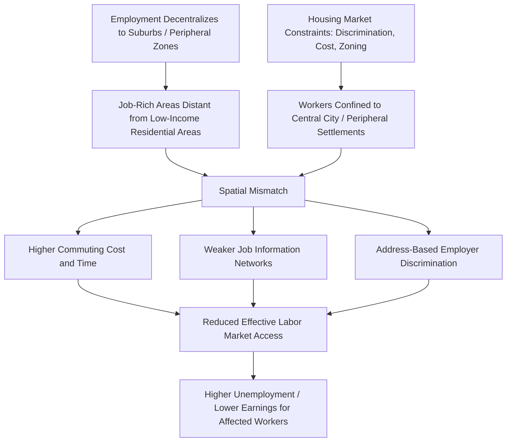

## Spatial Mismatch and Urban Labor Markets

### Overview

Spatial mismatch refers to a geographic misalignment between where workers, particularly low-income and minority workers, reside and where suitable job opportunities are located within a metropolitan area. First formalized by John Kain (1968) in the context of U.S. urban labor markets, the hypothesis argues that as employment decentralized from urban cores to suburbs while residential segregation confined certain populations to central-city neighborhoods, the resulting distance-and-access gap between workers and jobs contributed independently to elevated unemployment and lower earnings among affected groups, above and beyond skill or discrimination-based explanations.

In development economics, the spatial mismatch framework has been extended beyond its original U.S. racial-segregation context to analyze urban labor market frictions more broadly in developing-country cities, where rapid, often informal urbanization produces analogous, sometimes more severe, geographic disconnects between low-income peripheral settlements and concentrated formal employment zones.

### The Original Kain Hypothesis

Kain's 1968 study of Detroit and Chicago proposed that:

1. Employment, particularly manufacturing, was decentralizing from central cities to suburbs.
2. Racial discrimination in suburban housing markets restricted Black workers' ability to relocate closer to these decentralizing jobs.
3. This produced a "spatial mismatch" in which Black workers faced longer commutes, weaker information networks about suburban job openings, and higher effective job search costs, resulting in higher unemployment and lower labor force participation relative to what would be predicted purely by education and skill differences.

The hypothesis was significant because it proposed a *geographic* mechanism for labor market disadvantage that was distinct from, and could compound, both human-capital-based and discrimination-based explanations for unemployment gaps.

### Core Mechanisms

**1. Commuting cost and time barriers**

Workers residing far from job clusters face higher transportation costs (monetary and time), which can make otherwise viable jobs effectively inaccessible, especially for low-wage positions where commuting costs represent a larger share of potential earnings.

**2. Information frictions**

Job information often travels through informal social networks that are themselves spatially clustered; residents of peripheral or segregated neighborhoods may have systematically less access to information about job openings in distant employment centers.

**3. Housing market constraints**

Discriminatory housing practices, zoning restrictions, or affordability constraints prevent workers from relocating closer to job opportunities, effectively locking in the mismatch even when workers are aware of and interested in distant jobs.

**4. Employer discrimination correlated with geography ("statistical discrimination by address")**

Some research suggests employers may use residential address as a proxy signal correlated with perceived worker quality or reliability, independently disadvantaging applicants from certain neighborhoods regardless of true individual productivity — a channel sometimes called "geographic" or "address" discrimination.

**5. Public transit inadequacy**

In many metropolitan areas, public transit networks are radially designed around historic urban cores and poorly serve reverse commutes (from central city to suburban job centers) or cross-suburban commutes, compounding the physical accessibility problem beyond what private commuting cost alone would predict.

### Empirical Evidence Base

**U.S.-focused studies**

- Ihlanfeldt and Sjoquist's extensive review work found substantial support across many empirical studies for a negative relationship between job proximity/accessibility and youth employment outcomes, though the precise magnitude and causal mechanism remained debated.
- The Moving to Opportunity (MTO) experimental housing voucher program, while primarily designed to test neighborhood effects on outcomes like health and long-run child outcomes, also provided evidence relevant to spatial mismatch by relocating low-income families to different (often lower-poverty, sometimes more suburban) neighborhoods and tracking subsequent labor market outcomes, with mixed and heterogeneous employment effects reported across different follow-up studies and age cohorts affected.
- David Autor and colleagues, in related labor economics work on trade and automation shocks, have documented how local labor market geography interacts with commuting zones to shape the incidence of job loss and adjustment, a related but distinct literature on spatial labor market frictions.

**Developing-country and informal-sector applications**

- Studies of cities such as Nairobi, Delhi, and various Latin American metropolitan areas document analogous patterns: informal settlements often form in peripheral locations with poor transit connectivity to central business districts or industrial employment zones, creating commuting cost burdens that can consume a very large share of low-wage workers' daily earnings.
- Research on transit infrastructure interventions in developing cities (e.g., studies of Bus Rapid Transit systems in Bogotá's TransMilenio and similar systems) has examined whether improved transit connectivity to peripheral neighborhoods measurably improves employment access and labor market outcomes for residents, with generally positive but context-dependent findings on employment and earnings effects. [Inference: effect sizes and even directions vary meaningfully by city and by the specific population studied, so results should not be generalized as a uniform "transit investment solves mismatch" conclusion]
- Studies of urban slum resettlement programs (e.g., some Indian and Latin American slum relocation policies that move informal settlement residents to peripheral government housing) have found that relocating residents away from central economic activity, often justified on housing-quality or land-use grounds, can generate negative labor market outcomes by increasing effective distance to employment, illustrating a policy-induced spatial mismatch effect distinct from the market-driven decentralization Kain originally described.

### Diagram: Spatial Mismatch Mechanism

### Distinguishing Spatial Mismatch from Alternative Explanations

A methodologically central challenge in this literature is separating spatial mismatch from competing or overlapping explanations for the same observed unemployment gaps:

| Alternative Explanation | Distinguishing Feature | Overlap/Interaction with Spatial Mismatch |
| --- | --- | --- |
| Human capital gap | Workers lack skills/education for available jobs regardless of location | Can compound spatial mismatch; disentangling requires controlling for skill level while varying job proximity |
| Employer discrimination (non-geographic) | Occurs regardless of applicant's residential location | Distinguished via audit/correspondence studies varying applicant address while holding qualifications constant |
| Reservation wage / labor supply effects | Workers voluntarily choose not to work at prevailing wages | Distinguished via job search intensity and acceptance-rate data relative to distance |
| Network/referral hiring practices | Jobs filled through informal networks regardless of geography | Overlaps substantially with spatial mismatch's "information friction" channel; hard to fully separate empirically |

[Inference] This decomposition reflects the standard analytical framing used in the literature to isolate mechanisms, but in practice most empirical studies find these factors operate simultaneously and interactively rather than as cleanly separable, independent causes.

### Worked Example: Commuting Cost as an Implicit Tax on Wages

Consider a low-wage worker earning $15/day in a peripheral informal settlement, with a formal-sector job opportunity available in a central business district requiring a round-trip commute costing $3 in transit fares and consuming 3 hours of travel time daily.

- **Direct monetary cost**: $3/$15 = 20% of daily earnings consumed by transit costs alone, before accounting for the opportunity cost of the 3 hours spent commuting (which could otherwise be used for additional informal-sector work, childcare, or rest).
- If the worker has an informal-sector alternative near their home paying $10/day with zero commuting cost, the effective net return to taking the formal job is $15 - 3 = \$12$ minus the value the worker places on 3 hours of lost time, which may make the formal job's *effective* wage advantage marginal or even negative relative to the local informal option.

This illustrates why proximity-blind wage comparisons can significantly overstate the real economic incentive for peripheral-settlement workers to accept distant formal employment, a core intuition underlying the spatial mismatch hypothesis's predicted labor market effects.

### Policy Responses

**1. Transit-oriented interventions**

Expanding public transit connectivity between peripheral residential areas and employment centers (Bus Rapid Transit systems, rail extensions, subsidized transit passes) directly targets the commuting-cost channel.

**2. Housing mobility / voucher programs**

Programs like the U.S. Moving to Opportunity initiative attempt to address the housing-constraint channel by enabling low-income households to relocate to neighborhoods with better job access, though implementation and take-up challenges (landlord discrimination against voucher holders, information gaps about better-connected neighborhoods) have limited effectiveness in some contexts.

**3. Job decentralization / place-based employment incentives**

Some policy approaches attempt to bring jobs to workers rather than workers to jobs, via tax incentives or infrastructure investment encouraging firms to locate in or near underserved peripheral areas — though evidence on the cost-effectiveness of place-based job-creation subsidies relative to transit or mobility interventions is mixed across studies. [Inference: this remains an actively debated area of urban and regional economic policy without clear consensus on optimal intervention choice]

**4. Information interventions**

Job-matching platforms, employment centers, and outreach programs aimed at improving peripheral-area residents' access to information about distant job openings target the information-friction channel specifically, independent of physical transit improvements.

**5. Decentralized service/employment hub planning**

Some urban planning approaches advocate for polycentric city design, deliberately distributing employment centers across a metropolitan area rather than concentrating them in a single central business district, to reduce the average distance between any given residential area and the nearest substantial job cluster.

### Critiques and Limitations of the Framework

- **Endogenous residential sorting**: Critics note that if workers with weaker labor market attachment or lower job-search intensity self-select into cheaper, peripheral housing (rather than housing discrimination or cost alone determining location), then observed correlations between peripheral residence and unemployment may partly reflect reverse causation or selection rather than a pure spatial-access effect.
- **Measurement of "job access"**: Different studies use different metrics for job accessibility (raw job counts within a radius, gravity-weighted accessibility measures accounting for competition from other job seekers, commute-time-weighted measures), and results are sometimes sensitive to which measure is used, complicating cross-study comparison.
- **Applicability across urban contexts**: [Inference] The framework was developed in the context of mid-20th-century U.S. racial residential segregation and industrial decentralization; while the underlying logic (distance and information frictions reducing effective job access) generalizes reasonably well conceptually to other urban contexts, the specific magnitude and policy-relevant channels may differ substantially in cities with different transit infrastructure, informal labor market structures, and housing market institutions, such as many rapidly urbanizing cities in the Global South.

**Related Topics**

- Urban agglomeration economies and firm location decisions
- Informal settlements and slum upgrading policy
- Public transit infrastructure and Bus Rapid Transit system design
- Housing discrimination and residential segregation economics
- Rural-urban migration and urbanization patterns
- Moving to Opportunity and neighborhood effects literature
- Urban labor market informality
- Commuting behavior and time-use economics
- Polycentric urban planning and employment decentralization