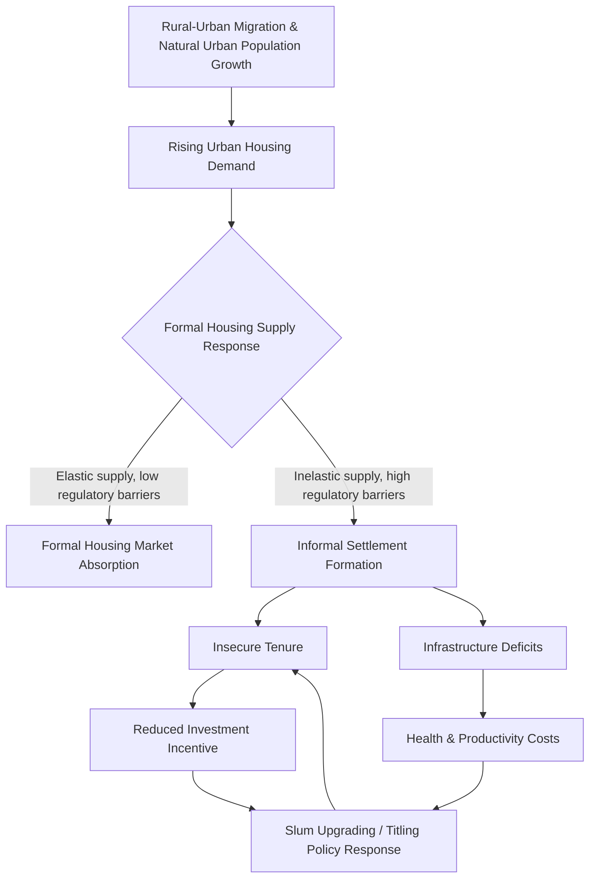

## Housing Policy in Developing Countries

### Overview

Housing policy in development economics addresses how governments and markets allocate shelter — a basic need with large externalities for health, productivity, and human capital — under conditions of rapid urbanization, weak land administration, fiscal constraints, and large informal sectors. Unlike housing policy in mature economies, developing-country housing policy must contend with informal settlements as the dominant mode of urban growth, incomplete property rights, and housing finance systems poorly suited to informal-income households.

### The Core Policy Tension: Enable vs. Provide

**Key Points**

- The field is organized around a long-running debate between two paradigms:
  1. **"Provider" paradigm** (dominant 1950s–1970s): government directly builds and allocates public housing units.
  2. **"Enabling markets" paradigm** (dominant from the 1980s onward, associated with World Bank policy under economists like Stephen Mayo and the influence of Hernando de Soto): government's role shifts to enabling private and community-based housing production through land titling, infrastructure provision, housing finance regulation, and removal of restrictive building codes, rather than direct construction.
- The 1980s shift is often traced to the perceived failure of large-scale public housing projects in many developing countries to reach the poorest households (units frequently captured by middle-income beneficiaries, high per-unit subsidy costs limiting total units delivered) combined with World Bank lending conditionality favoring market-enabling approaches.
- [Inference] Neither paradigm has fully displaced the other in practice; most contemporary national housing strategies combine elements of both (e.g., direct public housing for the poorest alongside titling and finance-market reforms for the broader population).

### Informal Settlements and Slum Upgrading

#### Why Informality Emerges

Informal settlement formation is modeled as a rational response to a **housing affordability gap**: when the cost of formal-sector housing (meeting minimum plot size, infrastructure, and building code standards) exceeds what low-income urban migrants can afford, and formal land markets are slow or exclusionary, households self-build on unauthorized or informally-subdivided land.

$$P_{formal} > Y_{household} \times \alpha_{affordability}$$

Where $P_{formal}$ is the cost of the cheapest formal housing unit meeting regulatory minimums, $Y_{household}$ is household income, and $\alpha_{affordability}$ is a conventional affordability threshold (commonly 25–30% of income in housing-finance practice) — when this inequality holds for a large share of the urban population, informal housing supply fills the gap.

**Key Points**

- De Soto's thesis (*The Mystery of Capital*, 2000) argues informal housing represents substantial **"dead capital"** — assets held without secure, transferable legal title, and therefore unusable as loan collateral — and that formalization (titling) could unlock this capital for investment and credit access. This thesis has been influential in policy circles but has also drawn empirical scrutiny.
- **Slum upgrading** (in-situ infrastructure and tenure improvement rather than clearance and relocation) has become the dominant multilateral-agency approach since roughly the 1990s, reflecting evidence that relocation-based slum clearance frequently disrupts residents' livelihoods (proximity to informal-sector employment) and social networks, and that unit costs of upgrading are typically far lower than full redevelopment.
- Key upgrading components: trunk infrastructure (water, sanitation, drainage, roads), tenure regularization or titling, community participation in planning, and sometimes complementary services (health posts, schools).

#### Land Titling: Evidence Base

**Key Points**

- The causal effects of land titling on investment, credit access, and labor supply have been studied using natural experiments (e.g., Peru's large-scale urban titling program of the late 1990s/2000s, studied by Field (2005, 2007) and others).
- Documented effects in these studies commonly include increased housing investment (renovation, expansion) following titling — consistent with tenure security reducing the risk of eviction-related loss of investment.
- Effects on **formal credit access** have been more mixed across studies than the strong "dead capital unlocking" prediction — some studies find limited pass-through from titling to bank lending, attributed to lenders' continued reliance on income documentation and formal employment status (which informal-sector households often lack) rather than collateral alone, indicating that titling addresses only one of several binding constraints on credit access.
- Field (2007) documents a **labor supply effect**: titling in Peru was associated with reduced time spent by household members guarding property (informal tenure requiring someone to remain home to assert occupancy claims), freeing labor time for market work — a distinct mechanism from the credit-access channel.

### Housing Finance in Developing Contexts

#### The Missing Middle / Mortgage Gap

**Key Points**

- Formal mortgage markets in most developing countries serve only a narrow upper-income band, because most households have informal or irregular incomes that fail conventional mortgage underwriting (proof of stable salaried income, formal credit history, collateral documentation).
- This produces a **"missing middle"**: households too well-off for social/public housing eligibility but unable to access formal mortgage finance, who are left to self-build incrementally or remain in informal settlements.

#### Incremental / Progressive Housing Finance

- **Microfinance for housing** (home-improvement loans, smaller and shorter-term than conventional mortgages, often without formal collateral requirements) has emerged as an instrument targeted at this missing-middle and lower-income segment, recognizing that most low-income households in developing countries build incrementally over years rather than purchasing a completed unit outright.
- **Sites-and-services schemes**: government or donor provision of serviced plots (basic infrastructure — water, sanitation access, road layout) with the housing structure left to incremental self-construction by the household — a core "enabling" instrument from the 1970s–1990s World Bank housing lending era, designed to reduce per-unit subsidy cost relative to complete-unit public housing.

#### Housing Subsidy Design

| Subsidy Type | Mechanism | Typical Trade-off |
| --- | --- | --- |
| Supply-side (capital) subsidy | Direct public construction or developer subsidy | Risk of misallocation to non-poorest beneficiaries; high per-unit cost |
| Demand-side (voucher/cash) subsidy | Cash or voucher to eligible households for housing purchase/rent | Requires functioning private housing supply to be effective; can be inflationary if supply is inelastic |
| Interest-rate subsidy | Government subsidizes mortgage interest rate | Regressive in practice if primarily accessed by higher-income formal-sector borrowers |
| Site-and-service / land subsidy | Subsidized serviced land, self-build structure | Lower per-unit cost, but slower unit completion and variable build quality |

**Key Points**

- A recurring finding across country evaluations is that **demand-side subsidies function poorly without adequate elastic housing supply** — if construction supply cannot expand in response to subsidized demand, subsidies capitalize into land/house prices rather than expanding effective housing access, a standard incidence-analysis result applying general subsidy-incidence theory (dependent on relative elasticities) to the housing sector specifically.

### Land Use Regulation and Urban Form

**Key Points**

- **Minimum plot size and building code regulations** inherited from colonial-era or aspirational modernist planning frameworks are frequently identified in the literature as a direct cause of housing informality, since they set formal-sector minimum housing costs above what large shares of the urban population can afford.
- **Floor-area ratio (FAR) restrictions** and height limits in many developing-country cities are documented (particularly in South Asian megacities) as constraining vertical densification, pushing urban growth outward into sprawl or upward into informal vertical extension (illegal additional floors), rather than accommodating growth through regulated high-density formal construction.
- **Rent control** policies, where present, are generally treated in this literature the same way as in the broader housing-economics literature: while intended to protect tenants, standard supply-response analysis and empirical studies in multiple developing-country contexts associate rent control with reduced rental housing supply, deferred maintenance, and market bifurcation between long-controlled tenancies and an uncontrolled shadow market — though the magnitude of these effects is context- and design-dependent (e.g., depending on whether controls apply to new construction).

### Urbanization Pressure and Housing Demand

### Housing and Broader Development Outcomes

**Key Points**

- Housing quality and tenure security link to health outcomes (sanitation-linked disease burden, indoor air quality), educational outcomes (stable housing associated with reduced school disruption), and labor market outcomes (commute distance/cost from peripheral informal settlements to urban job centers, tying into the spatial mismatch literature).
- **Housing as collateral/asset accumulation** connects this topic to the broader household-asset literature: for many low-income urban households, the home represents the primary store of wealth, making housing policy directly relevant to poverty-dynamics and asset-based poverty-trap models.

### Notable Policy Case Patterns

**Key Points**

- **Large-scale public housing programs** (e.g., various Latin American and Asian national housing bank/subsidy programs) are frequently evaluated for unit-delivery cost-effectiveness and locational quality (peripheral public housing developments often criticized for poor job/transit access, undermining their poverty-reduction intent despite nominal successful "unit delivery" counts).
- **Community-driven / participatory upgrading approaches** (e.g., through community land trusts, resident associations negotiating directly with municipal authorities) are studied as an alternative to top-down titling, particularly where formal legal titling is politically or administratively infeasible in the near term — offering intermediate tenure security short of full freehold title.
- [Speculation] The increasing availability of satellite imagery and GIS-based informal-settlement mapping is likely to make targeting of upgrading investment more precise over time, though rigorous evidence on how much this technology shift has actually changed programmatic outcomes (as opposed to planning inputs) is still limited.

**Related Topics**

- Land tenure security and titling economics
- Slum upgrading program evaluation methods
- Urban spatial mismatch and commuting costs for the urban poor
- Housing microfinance design
- Rent control economics and supply elasticity
- De Soto's dead capital thesis and its empirical critiques
- Site-and-services scheme design
- Urban land use regulation and informal settlement formation
- Housing as an asset in poverty-trap models