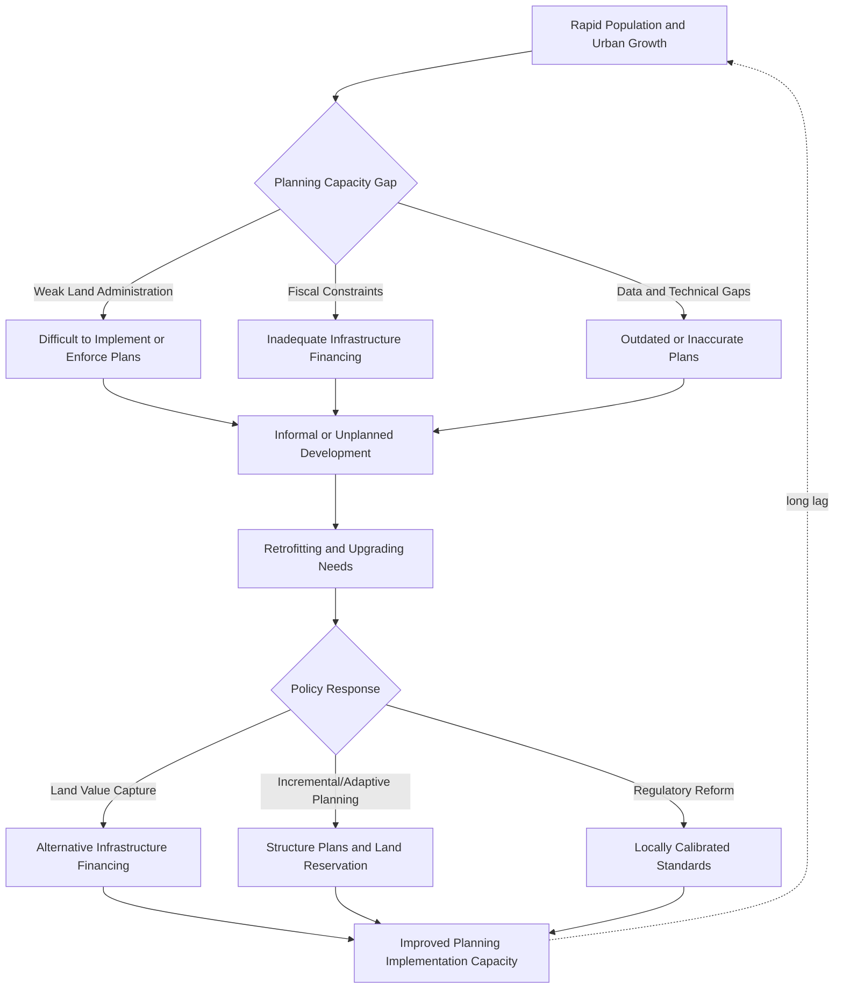

## Urban Planning Challenges in Rapid Urbanization

### Definition and Scope

Urban planning challenges in rapid urbanization encompass the institutional, technical, and fiscal difficulties that municipal and national governments face in guiding urban spatial development when population and economic growth outpace planning capacity, land administration systems, and infrastructure investment. This topic sits at the intersection of urban economics, public administration, and planning theory, examining why conventional master-planning approaches developed in slower-growing, higher-capacity institutional contexts frequently fail to function effectively in rapidly urbanizing developing-country settings, and what alternative planning paradigms have emerged in response.

This topic connects directly to several others in this chapter — informal settlement formation is substantially a consequence of planning and land-supply failures, spatial mismatch reflects planning's inability to coordinate residential and employment location, and urban primacy is shaped by planning and infrastructure investment decisions — but focuses specifically on the institutional and technical planning process itself: how land-use decisions are made, implemented, and enforced (or fail to be).

### The Scale and Pace Problem

**Urbanization rates versus institutional capacity**

Many developing countries, particularly in Sub-Saharan Africa and parts of South Asia, are urbanizing at rates substantially faster than the historical urbanization experience of currently high-income countries, while starting from a lower base of planning institutional capacity, technical staffing, and fiscal resources — creating a structural mismatch between the pace of urban growth and the administrative capacity to plan for it.

**The planning lag**

[Inference] A common pattern in rapidly urbanizing cities is that formal planning processes and infrastructure investment decisions lag behind actual urban growth by years or decades, meaning planning frequently operates in a reactive, retrofitting mode — attempting to regularize, service, or reorganize areas that have already developed informally — rather than a proactive mode of planning ahead of population growth and channeling it into planned areas.

### Theoretical and Paradigmatic Frameworks

**Master planning and its critiques**

Traditional comprehensive "master planning" — detailed, long-horizon land-use plans specifying permitted uses and densities across an entire jurisdiction — has been extensively critiqued in the rapid-urbanization planning literature as poorly suited to conditions of rapid, uncertain growth: master plans are frequently based on population projections that prove inaccurate, take years to prepare and approve (by which point conditions have changed), and presume an enforcement capacity that many municipal governments in rapidly urbanizing contexts lack.

**Alain Bertaud's market-informed planning approach**

Urban planner and economist Alain Bertaud has been influential in advocating for planning approaches that work with, rather than against, underlying urban economic forces (land price gradients, transport cost structures, and household location preferences) rather than pure regulatory master planning divorced from economic fundamentals, emphasizing that effective urban planning requires understanding how land and housing markets actually function in order to design regulations (particularly floor-area-ratio and density regulations) that are compatible with, rather than in direct conflict with, market-driven urban growth pressures.

**Incremental and adaptive planning approaches**

In response to master planning's documented limitations in rapid-growth contexts, planning theory has increasingly emphasized more incremental, flexible planning approaches: structure plans that establish broad frameworks (major infrastructure corridors, key land reservations) while leaving finer-grained land-use decisions to be resolved incrementally as growth actually occurs, rather than attempting to specify detailed land use for areas that may not develop for decades.

**"Planning for urban extensions" and land readjustment**

Some planning approaches focus specifically on getting ahead of urban expansion at the fringe — reserving road and infrastructure rights-of-way and basic plot layouts in peri-urban areas before informal or unplanned development occurs — on the theory that it is far cheaper and more effective to establish a basic grid and infrastructure reservation in advance of development than to retrofit infrastructure into already-built, informally subdivided areas.

### Core Institutional Challenges

**Land administration and property rights weaknesses**

Effective urban planning presupposes reasonably functional land administration systems (clear property boundaries, registered ownership, accessible land records) to implement land-use plans, provide compensation for land needed for public infrastructure, and enforce development regulations. Weak or fragmented land administration — including overlapping formal, customary, and informal tenure systems discussed in informal settlement economics — substantially undermines planning implementation capacity independent of the technical quality of plans themselves.

**Fragmented and overlapping institutional mandates**

Urban planning functions are frequently split across multiple government bodies (national planning ministries, municipal governments, sector-specific infrastructure agencies, and in some contexts traditional or customary authorities) with unclear or overlapping jurisdiction, coordination failures, and misaligned incentives, complicating coherent implementation even where individual agencies have adequate technical capacity.

**Fiscal capacity constraints**

As discussed in urban infrastructure and municipal finance economics, many rapidly urbanizing municipalities lack adequate own-source revenue and access to capital financing to fund the infrastructure investments (roads, utility trunk lines, public facilities) that effective planning implementation requires, meaning technically sound land-use plans frequently cannot be backed by the infrastructure investment needed to make planned areas viable and attractive relative to unplanned alternatives.

**Weak enforcement capacity**

Even where land-use regulations and plans exist on paper, many rapidly urbanizing municipalities lack the administrative and legal enforcement capacity (building inspectors, legal processes for addressing violations, political will to enforce against politically influential violators) to prevent unauthorized development, resulting in a substantial gap between formal planning regulation and actual urban development patterns.

### Regulatory Design Challenges

**Inappropriate regulatory standards**

A frequently cited problem is that formal building codes, minimum plot sizes, and infrastructure standards in many developing countries were historically inherited from colonial-era or high-income-country regulatory models poorly calibrated to local household incomes and construction practices, resulting in formal regulatory compliance costs that price the majority of the urban population out of legal formal housing and development, directly contributing to informal settlement formation as discussed elsewhere in this chapter.

**Floor-area-ratio and density regulation**

Excessively restrictive floor-area-ratio (FAR) and building height regulations in central, high-demand urban areas can constrain the vertical development that would otherwise accommodate population growth at higher densities in well-located areas, instead displacing growth to peripheral areas with poorer infrastructure and job access — directly connecting FAR regulation design to both agglomeration economics and spatial mismatch outcomes discussed elsewhere in this chapter.

**Zoning rigidity versus mixed-use reality**

Formal zoning systems that rigidly separate residential, commercial, and industrial land uses can conflict with the mixed-use, home-based economic activity patterns common in many developing-country urban and peri-urban contexts (informal commerce, home-based production), creating a mismatch between formal zoning categories and actual, often economically productive, urban land use patterns.

### Land Value Capture and Infrastructure Financing

**The land value capture rationale**

Given fiscal capacity constraints, planning literature has increasingly emphasized land value capture mechanisms — capturing some of the land value increases generated by public infrastructure investment or rezoning decisions to help finance that same infrastructure — as a potentially significant infrastructure financing source specifically linked to the planning process, given that infrastructure and zoning decisions themselves generate substantial land value uplift that would otherwise accrue entirely to private landowners.

**Instruments for land value capture**

- **Betterment levies/special assessments**: charges on landowners benefiting from specific infrastructure investments, calibrated to capture a portion of the resulting land value increase
- **Development impact fees**: charges on new development calibrated to the infrastructure costs that development necessitates
- **Land readjustment schemes**: mechanisms (used prominently in some East Asian contexts) in which landowners in an area to be developed contribute a portion of their land for public infrastructure and facilities in exchange for improved, serviced remaining plots, avoiding the need for cash compensation or public land acquisition
- **Sale or lease of publicly owned land following rezoning or infrastructure investment**: capturing value uplift directly where land is under public ownership

[Inference] The effectiveness of land value capture instruments depends substantially on functioning land administration and valuation systems and adequate legal and institutional capacity to implement and enforce them, meaning — somewhat circularly — that the contexts most in need of land value capture financing (due to weak fiscal capacity) are often also the contexts with the greatest institutional constraints on implementing land value capture mechanisms effectively.

### Data and Technical Capacity Challenges

**Outdated or absent spatial and demographic data**

Effective urban planning requires reasonably current data on population distribution, land use, and growth trends, which is frequently limited in rapidly urbanizing developing-country cities given infrequent census cycles, limited administrative data systems, and the difficulty of capturing informal settlement populations in official statistics, as discussed in informal settlement measurement challenges.

**Satellite imagery and remote sensing for planning**

Given data limitations, satellite imagery and remote sensing-based urban growth monitoring have become increasingly important planning inputs, allowing planning authorities to track actual urban expansion patterns (including informal settlement growth) between infrequent census cycles, complementing though not fully substituting for ground-level administrative and survey data.

**Technical human capital constraints**

Many rapidly urbanizing municipalities face acute shortages of trained urban planners, surveyors, and geographic information system (GIS) specialists relative to the scale of planning demand, a human capital constraint that compounds the institutional and fiscal challenges discussed above.

### Political Economy of Urban Planning

**Elite capture and politically connected development**

Land-use and zoning decisions, given the substantial land value implications of rezoning and infrastructure siting decisions, are frequently subject to political influence and elite capture, with connected developers or landowners sometimes able to secure favorable zoning or infrastructure decisions disproportionate to broader public planning objectives — a governance risk closely related to corruption concerns discussed in urban infrastructure economics.

**Displacement and eviction politics**

Planning interventions that involve clearing informally developed or occupied land for formal redevelopment or infrastructure projects raise significant political and equity concerns regarding resident displacement, connecting directly to the clearance-versus-upgrading debate discussed in informal settlement economics, and often generate significant political resistance that can stall or reshape planning implementation.

**Balancing planning ambition against implementation realism**

[Inference] A recurring critique in the planning literature is that many developing-country master plans are prepared with limited regard for realistic implementation capacity and financing, resulting in aspirational plans (sometimes explicitly modeled on planning documents or urban forms from very different, higher-capacity contexts) that are never substantially implemented, potentially representing a poor use of scarce planning resources relative to more modest, implementation-focused planning approaches.

### Illustrative Diagram: Rapid Urbanization Planning Challenge Cycle

### Case Illustrations

**China's land readjustment and urban expansion model**

Frequently cited as an example of proactive land value capture and infrastructure-ahead-of-development planning, in which government-led land assembly, infrastructure investment, and subsequent land leasing have financed rapid urban expansion, though the model relies on specific land ownership and governance institutions (state land ownership) not directly transferable to many other developing-country contexts.

**Ahmedabad, India: town planning schemes**

Widely cited as a relatively successful land readjustment/land pooling model used to guide peri-urban development in advance of urbanization, involving landowner contribution of land for infrastructure and public facilities in exchange for improved serviced plots, referenced in comparative planning literature as an adaptable model for other rapidly urbanizing contexts.

**Kigali, Rwanda master plan implementation**

Frequently discussed in contemporary African urban planning literature as an example of ambitious master planning (including substantial international consultant involvement) facing documented tensions between plan ambitions and implementation realism, informal settlement displacement concerns, and debates over the appropriateness of imported planning templates.

**Lagos, Nigeria: informal development outpacing formal planning**

Frequently studied as a large-scale example of the "planning lag" phenomenon, where rapid, substantially informal urban expansion has significantly outpaced formal planning and infrastructure provision capacity, generating extensive research and policy interest in retrofitting and upgrading approaches.

### Key Debates in the Literature

- **Master planning versus incremental/adaptive planning**: ongoing debate over whether comprehensive long-horizon master plans remain useful in rapid-growth contexts or whether more flexible, incremental planning frameworks are systematically better suited to conditions of rapid and uncertain urban growth
- **Regulatory standards calibration**: the tension between maintaining adequate safety and quality standards versus setting standards low enough to be broadly achievable given local income levels and construction practices
- **Land value capture feasibility**: whether land value capture instruments can be effectively implemented in exactly the weak-institutional-capacity contexts that most need alternative infrastructure financing sources
- **Imported versus locally adapted planning models**: ongoing debate over the appropriateness of planning models, standards, and consultant expertise imported from high-income-country contexts relative to approaches more directly adapted to local institutional, fiscal, and cultural conditions
- **Proactive land reservation versus reactive retrofitting**: the relative cost-effectiveness of investing in getting ahead of urban expansion (through land readjustment or infrastructure reservation) versus accepting informal development and focusing resources on subsequent upgrading

**Related Topics**

- Slum formation and informal settlements
- Urban infrastructure and service delivery
- Housing policy in developing countries
- Urban primacy and city-size distributions
- Agglomeration economies in developing cities
- Spatial mismatch and urban labor markets
- Land value capture and municipal infrastructure finance
- Fiscal federalism and municipal finance
- Property rights theory and land tenure formalization
- Geographic information systems and satellite data in urban planning