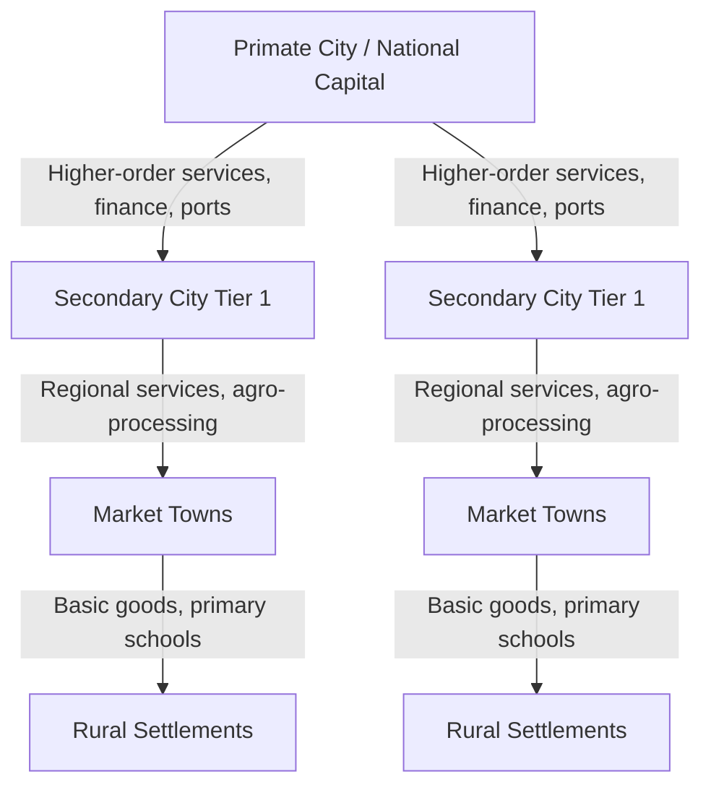
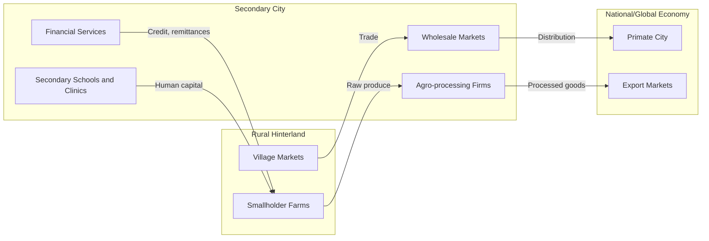

## Secondary Cities and Regional Development

### Definition and Conceptual Scope

Secondary cities are urban centers that rank below a country's primate city or dominant metropolitan area in population, economic output, or administrative significance, yet perform critical functions in national and regional urban systems. They are typically defined relative to the largest city rather than by an absolute population threshold, since what counts as "secondary" in a small country (e.g., a city of 200,000) differs from what counts as secondary in a large one (e.g., a city of 5 million).

Common operational criteria include:

- **Population rank**: Second- to fifth-largest cities in a national urban hierarchy, or cities within a defined population band (often 100,000–1,000,000, though this varies by country)
- **Functional role**: Regional administrative capitals, port cities, agro-processing hubs, or industrial centers that serve as gateways between rural hinterlands and the primate city
- **Growth trajectory**: Cities experiencing rapid population or economic growth that may not yet be reflected in formal rankings

Secondary cities are conceptually distinct from "intermediate cities," a term more common in Latin American and European urban planning literature, though the two overlap substantially in usage.

### Position Within Urban Systems Theory

**Rank-Size Distribution**

The rank-size rule, formalized by Zipf, describes an empirical regularity in many national urban systems:

$$P_r = \frac{P_1}{r^q}$$

where $P_r$ is the population of the city ranked $r$, $P_1$ is the population of the largest city, and $q$ is an empirical constant often close to 1 in economies with well-developed urban hierarchies. Deviations from this pattern are diagnostic: a national urban system with a small number of very large cities and a "missing middle" of secondary cities suggests underinvestment in second-tier urban infrastructure, while a smoother rank-size curve suggests a more balanced hierarchy.

**Primacy Index**

Urban primacy is commonly measured as:

$$\text{Primacy Ratio} = \frac{P_1}{P_2 + P_3 + P_4}$$

A ratio significantly above 1 indicates high primacy (dominance of one city), which is common in many developing economies, particularly former colonial states where the primate city was historically the administrative and export-processing center. High primacy is often associated with regional economic imbalance, though the causal direction (whether primacy causes imbalance or reflects it) is debated in the literature. [Inference: the specific causal mechanisms linking primacy to welfare outcomes remain contested and vary substantially by country context]

**Central Place Theory Extension**

Christaller's central place theory provides a stylized account of how settlements of different sizes distribute services across space, with higher-order goods and services concentrated in fewer, larger centers and lower-order goods dispersed more widely. Secondary cities in this framework occupy an intermediate tier, providing services (secondary education, regional hospitals, wholesale markets, mid-level government offices) that are too specialized for villages but do not require the full agglomeration of the primate city.

### Economic Rationale for Secondary City Development

**Agglomeration Economies at Lower Density**

Secondary cities can capture a subset of agglomeration benefits, namely localization economies (firms in the same industry clustering to share labor pools and suppliers) and urbanization economies (diverse firms benefiting from shared infrastructure), without the full congestion, land price inflation, and diseconomies of scale characteristic of megacities. The theoretical justification for secondary city investment rests on the idea that agglomeration benefits follow a curve with diminishing and eventually negative returns as a city grows very large, meaning secondary cities may offer more efficient returns to infrastructure investment at the margin than continued expansion of the primate city. [Inference: the exact shape and turning point of this agglomeration curve is empirically contested and varies by sector and country]

**Reducing Migration Pressure on Primate Cities**

A common policy rationale is that developing secondary cities creates alternative migration destinations, reducing rural-to-primate-city migration and its associated costs (slum formation, congestion, service overload). This logic underpins many "counter-magnet" or "growth pole" strategies, though empirical evidence on whether such interventions durably redirect migration flows is mixed.

**Territorial Rebalancing and Spatial Equity**

Secondary cities often serve as nodes connecting rural regions to national and global markets. Investment in these cities can be framed as a spatial equity instrument, extending the benefits of urbanization (job diversification, service access) beyond the capital region, and is often linked to reducing interregional inequality.

### Growth Pole Theory and Its Legacy

Secondary city strategies trace intellectual roots to François Perroux's growth pole theory (1955), later spatialized by Boudeville and others into "growth center" policy. The core idea: concentrated investment in a propulsive industry within a designated urban node generates backward and forward linkages that diffuse growth to the surrounding region via:

- **Backward linkages**: demand for local inputs, raw materials, and labor
- **Forward linkages**: processing and distribution of outputs
- **Polarization-then-diffusion (Myrdal/Hirschman)**: initial concentration of growth followed by "spread effects" (positive spillovers to the periphery) that may or may not outweigh "backwash effects" (the periphery losing capital and skilled labor to the growth pole)

**Key Points**

- Growth pole strategies were widely implemented in the 1960s–1980s (e.g., in Brazil, France, and parts of Sub-Saharan Africa) with mixed results
- Many programs failed because they were top-down, capital-intensive (often heavy industry), and poorly linked to local economic structures, resulting in enclave development rather than diffused regional growth
- Contemporary secondary city policy has shifted away from single-industry growth poles toward diversified, endogenous growth approaches emphasizing local economic development, infrastructure connectivity, and institutional capacity building

### Functional Typology of Secondary Cities

Secondary cities are not a homogeneous category; their development trajectories and policy needs differ by function:

1. **Port and gateway cities** — facilitate trade, often with strong logistics and customs infrastructure needs (e.g., Mombasa in Kenya, Chittagong in Bangladesh)
2. **Resource-frontier cities** — grow around extractive industries (mining, oil, forestry); often face boom-bust volatility and weak economic diversification
3. **Agro-industrial or market towns** — serve as processing and trading hubs for agricultural hinterlands; central to rural-urban linkage strategies
4. **Administrative/regional capitals** — grow due to devolved government functions and public sector employment
5. **Manufacturing and industrial satellite cities** — often located near a primate city or along transport corridors, capturing overflow investment (e.g., cities along Vietnam's coastal corridor, India's peripheral industrial towns)
6. **Tourism-oriented secondary cities** — economies structured around hospitality, heritage, or natural amenities

### Rural-Urban Linkages

Secondary cities are theorized as critical intermediaries in the rural-urban continuum, distinct from the rural-urban dichotomy assumed in older dual-economy models (e.g., Lewis 1954). Their functions include:

- **Market access**: providing wholesale and retail markets for agricultural produce, reducing transaction costs for smallholder farmers
- **Non-farm employment**: absorbing surplus agricultural labor into manufacturing, trade, and services without requiring long-distance migration
- **Service delivery nodes**: hosting secondary schools, clinics, and financial services (bank branches, agricultural extension offices) accessible to surrounding rural populations
- **Remittance and information circulation**: enabling circular migration patterns where rural households diversify income through seasonal or commuting-based urban employment

This linkage function is central to the "territorial development" approach advanced by institutions such as the OECD and the World Bank, which frames secondary cities as anchors of functional economic regions rather than isolated urban points.

### Infrastructure and Institutional Constraints

**Infrastructure Deficits**

Secondary cities frequently suffer from underinvestment relative to primate cities because national infrastructure budgets and private investment tend to concentrate where returns are most visible and immediate. Typical constraints include:

- Inadequate trunk infrastructure (power, water, sanitation) limiting industrial investment
- Poor inter-city transport connectivity, raising the cost of integrating secondary cities into national value chains
- Underdeveloped land markets and unclear land tenure, complicating urban expansion and private investment
- Limited access to long-term finance for municipal capital projects, since secondary city governments often lack creditworthiness for municipal bonds or commercial borrowing

**Institutional and Fiscal Capacity**

A recurring theme in development economics is that secondary cities are frequently underserved by fiscal decentralization frameworks: they may have devolved responsibilities (service delivery, local infrastructure maintenance) without commensurate revenue-raising authority or intergovernmental transfers, a mismatch sometimes called the "decentralization gap." Weak technical capacity in urban planning, land-use management, and public financial management further constrains secondary cities' ability to manage growth effectively, often resulting in unplanned peri-urban expansion.

**Governance Fragmentation**

Secondary cities often span multiple administrative jurisdictions (municipalities, districts, or metropolitan areas without formal metropolitan governance structures), complicating coordinated infrastructure planning and service delivery across a functional urban area that exceeds formal city boundaries.

### Policy Instruments for Secondary City Development

**Key Points**

- **Infrastructure-first strategies**: prioritizing transport corridors, power, and water/sanitation to reduce the cost of doing business and attract private investment
- **Special economic zones (SEZs) and industrial parks**: sited in secondary cities to decentralize manufacturing investment away from primate cities (used extensively in China's coastal-to-inland development strategy and in Ethiopia's industrial park program)
- **Fiscal decentralization reform**: strengthening local revenue instruments (property taxes, business licensing, betterment levies) and predictable intergovernmental transfers
- **Municipal creditworthiness programs**: technical assistance and credit enhancement mechanisms (e.g., partial credit guarantees) to enable secondary cities to access capital markets for infrastructure finance
- **Regional connectivity investment**: transport corridors linking secondary cities to ports and primate cities, reducing trade costs and enabling value chain integration
- **Land value capture instruments**: using increases in land value from public infrastructure investment (e.g., transit-oriented development, betterment levies) to fund further urban infrastructure
- **Human capital and local economic development (LED) planning**: building locally-led economic strategies matched to a city's comparative advantage rather than imposing uniform industrial policy

### Analytical Framework: Assessing Secondary City Potential

Development economists and multilateral institutions commonly assess secondary city investment priorities using a framework combining:

1. **Economic base analysis** — identifying export-oriented sectors driving local employment (using location quotients: $LQ = \frac{(e_i / e)}{(E_i / E)}$, where $e_i$ is local employment in sector $i$, $e$ is total local employment, and $E_i$, $E$ are the national equivalents; an $LQ > 1$ indicates local specialization)
2. **Connectivity analysis** — travel time and transport cost to major markets and ports
3. **Institutional capacity assessment** — own-source revenue ratios, budget execution rates, and planning capacity
4. **Demographic and migration trend analysis** — in- and out-migration patterns, age structure, and labor force growth
5. **Market potential/gravity modeling** — estimating a city's economic mass relative to surrounding markets, often using gravity-model formulations:

$$M_i = \sum_{j \neq i} \frac{P_j}{d_{ij}^\beta}$$

where $M_i$ is the market potential of city $i$, $P_j$ is the economic mass (population or GDP) of city $j$, $d_{ij}$ is the distance or transport cost between $i$ and $j$, and $\beta$ is a distance-decay parameter.

### Regional Case Patterns

**East Asia**: China's development strategy since the 2000s has explicitly promoted secondary and tertiary "prefecture-level cities" through the "Go West" and later regional coordination strategies, combining infrastructure investment (high-speed rail, expressways) with industrial relocation incentives to redistribute growth from coastal megacities to inland secondary cities.

**Sub-Saharan Africa**: Secondary cities are growing rapidly, often faster in relative terms than primate cities, but frequently without proportional infrastructure investment, producing what some researchers term "urbanization without structural transformation" — urban population growth not accompanied by a shift of employment into higher-productivity manufacturing or services. [Inference: the extent to which this pattern generalizes across the region versus reflecting specific country contexts remains an active empirical debate]

**South Asia**: India's approach has included dedicated secondary city programs (e.g., AMRUT — Atal Mission for Rejuvenation and Urban Transformation) targeting municipal infrastructure in mid-sized cities, motivated partly by concerns over megacity congestion (Delhi, Mumbai) and partly by a desire to capture demographic dividends in a more geographically distributed pattern.

**Latin America**: The region has a long history of intermediate-city policy dating to import-substitution-era growth pole programs; more recent strategies emphasize connectivity corridors and decentralized service delivery within federal or highly decentralized governance structures.

*[Unverified: specific up-to-date programmatic details and current funding status of named national initiatives (e.g., AMRUT) should be checked against current government sources, as urban policy programs are frequently revised, renamed, or reallocated]*

### Critiques and Debates

- **Growth pole skepticism**: critics argue that many secondary city interventions replicate the failures of 20th-century growth pole policy by prioritizing physical infrastructure over institutional capacity and market linkages, producing underutilized infrastructure ("white elephants")
- **Selectivity and picking winners**: government selection of which secondary cities to prioritize can be politically driven rather than economically justified, risking misallocation of scarce public investment
- **Migration diversion assumption**: the assumption that secondary city investment reduces primate-city migration pressure is not strongly supported by evidence in all contexts; migration decisions are driven by a wider set of push-pull factors (wage differentials, network effects, life-cycle considerations) that infrastructure alone may not offset
- **Equity vs. efficiency tension**: concentrating investment in a subset of secondary cities (rather than spreading investment across the entire urban hierarchy or focusing solely on the primate city) raises normative questions about which regions and populations benefit from limited public resources

### Illustrative Diagram: Polarization-Diffusion Dynamic (svg_diagram)

<svg xmlns="http://www.w3.org/2000/svg" viewBox="0 0 760 380">
<rect x="0" y="0" width="760" height="380" fill="#ffffff" />
<text x="380" y="24" text-anchor="middle" font-size="16" font-weight="bold" fill="#1a1a1a">Polarization vs. Diffusion Effects Around a Secondary City (svg_diagram)</text>
<circle cx="380" cy="190" r="55" fill="#c9dff0" stroke="#2b6ca3" stroke-width="2" />
<text x="380" y="185" text-anchor="middle" font-size="13" fill="#0d3b57">Secondary</text>
<text x="380" y="200" text-anchor="middle" font-size="13" fill="#0d3b57">City</text>
<circle cx="380" cy="190" r="150" fill="none" stroke="#8ab4d1" stroke-width="1.5" stroke-dasharray="6,4" />
<circle cx="380" cy="190" r="230" fill="none" stroke="#c3d8e6" stroke-width="1.5" stroke-dasharray="4,6" />

<text x="600" y="120" font-size="12" fill="`#2b6ca3`">Spread effects</text>

<text x="600" y="136" font-size="11" fill="#555">(demand, remittances,</text>

<text x="600" y="150" font-size="11" fill="#555">jobs, information)</text>

<line x1="430" y1="150" x2="560" y2="115" stroke="#2b6ca3" stroke-width="2" marker-end="url(#arrowGreen)" />

<text x="120" y="270" font-size="12" fill="#a33">Backwash effects</text>

<text x="120" y="286" font-size="11" fill="#555">(skilled labor, capital</text>

<text x="120" y="300" font-size="11" fill="#555">drawn toward city)</text>

<line x1="200" y1="260" x2="330" y2="215" stroke="#a33" stroke-width="2" marker-end="url(#arrowRed)" />
<text x="380" y="360" text-anchor="middle" font-size="11" fill="#666">Net regional impact depends on whether spread effects outweigh backwash effects over time</text>

</svg>

### Measurement and Data Considerations

Empirical work on secondary cities faces persistent data challenges:

- National statistical systems often collect detailed data only for capital or primate cities, leaving secondary city economic and demographic data sparse or outdated
- Administrative city boundaries frequently do not match the functional urban area (commuting zone), leading to underestimation of a secondary city's true economic footprint
- Informal economic activity, which is often proportionally larger in secondary cities than in primate cities, is difficult to capture in formal statistics, complicating economic base analysis

**Next Steps**

- Urban primacy and the rank-size rule: empirical testing methods
- Growth pole theory and Perroux/Myrdal/Hirschman spread-backwash frameworks
- Fiscal decentralization and municipal finance in developing economies
- Special economic zones as spatial industrial policy instruments
- Rural-urban linkages and the "missing middle" in agricultural value chains
- Agglomeration economies: localization vs. urbanization economies
- Land value capture and municipal infrastructure financing
- Metropolitan governance and functional urban area delineation
- Structural transformation and urbanization without industrialization in Sub-Saharan Africa
- Gravity models of market potential and economic geography (New Economic Geography, Krugman)