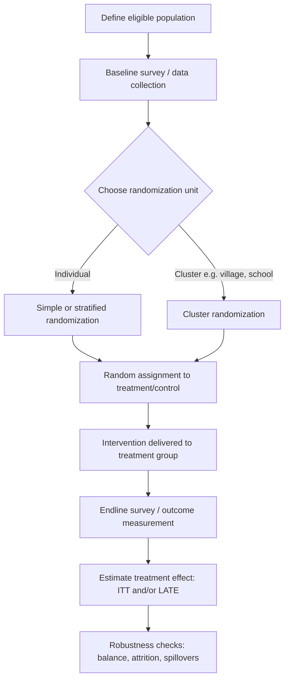
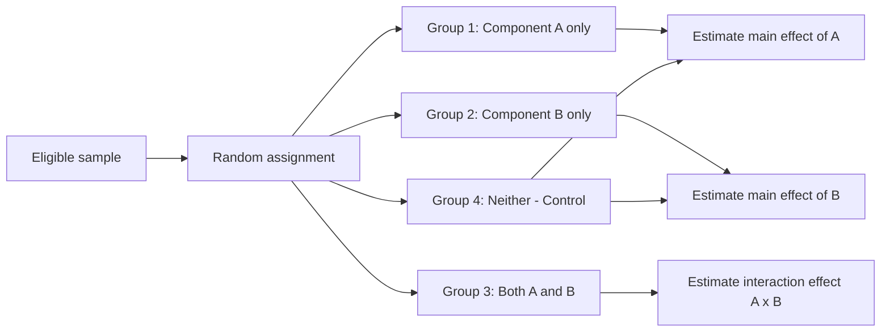

## Randomized Controlled Trials Methodology

### Conceptual Foundation

Randomized controlled trials (RCTs) are experimental research designs in which units (individuals, households, firms, villages, schools) are randomly assigned to a treatment group receiving an intervention and a control group that does not, with the goal of estimating the causal effect of the intervention on an outcome of interest. In development economics, RCTs became widely adopted from the early 2000s onward, associated with researchers including Abhijit Banerjee, Esther Duflo, and Michael Kremer, who were awarded the 2019 Nobel Memorial Prize in Economic Sciences for their experimental approach to alleviating global poverty.

The methodological appeal of randomization rests on its ability to address the **fundamental problem of causal inference**: for any given unit, we cannot simultaneously observe both its treated and untreated outcomes. Randomization solves this at the group level by ensuring that, in expectation, treatment and control groups are statistically identical on all characteristics (observed and unobserved) except for exposure to the treatment itself.

### The Potential Outcomes Framework

RCT analysis is typically grounded in the Rubin Causal Model (potential outcomes framework). For each unit $i$, define:

- $Y_i(1)$: the potential outcome if unit $i$ receives treatment
- $Y_i(0)$: the potential outcome if unit $i$ does not receive treatment

The individual treatment effect is $\tau_i = Y_i(1) - Y_i(0)$, which is never directly observable since only one potential outcome is realized per unit. The observed outcome is:

$$Y_i = D_i Y_i(1) + (1 - D_i) Y_i(0)$$

where $D_i \in \{0,1\}$ indicates treatment assignment. The parameter of interest is usually the **Average Treatment Effect (ATE)**:

$$ATE = E[Y_i(1) - Y_i(0)]$$

Random assignment ensures $D_i$ is statistically independent of both potential outcomes, so:

$$E[Y_i(1) - Y_i(0)] = E[Y_i \mid D_i=1] - E[Y_i \mid D_i=0]$$

This identity is what makes the simple difference in means between treatment and control groups an unbiased estimator of the ATE, without needing to control for confounding variables.

### Core Design Elements

**Key Points**

- **Randomization unit**: individual, household, classroom, school, village, or administrative unit — the choice affects statistical power, spillover risk, and implementation feasibility
- **Randomization method**: simple randomization, stratified randomization (blocking on baseline covariates to improve balance and precision), or clustered randomization (randomizing groups rather than individuals)
- **Treatment arms**: RCTs may include multiple treatment arms to compare different intervention intensities or components (a "multi-arm" design), plus a pure control
- **Baseline survey**: pre-intervention data collection used to check balance between groups and to serve as a control variable in analysis (increasing statistical power via ANCOVA-type specifications)
- **Endline survey**: post-intervention data collection measuring outcomes
- **Sample size and power calculations**: conducted ex ante to ensure the study can detect a meaningful effect size given expected variance, intra-cluster correlation, and attrition

### Randomization Procedures

**Simple (Individual-Level) Randomization**

Each eligible unit has an independent probability of assignment to treatment, typically implemented via a random number generator applied to a sampling frame. This is straightforward but can produce chance imbalances in small samples.

**Stratified (Blocked) Randomization**

Units are grouped into strata based on baseline characteristics (e.g., gender, wealth quintile, geographic region) before randomizing within each stratum. This ensures balance on key covariates and can increase statistical precision, particularly in smaller samples.

**Cluster Randomization**

Entire groups (villages, schools, health clinics) are randomized rather than individuals within them. This is often necessitated by the nature of the intervention (e.g., a policy implemented at the village level cannot be selectively applied to individuals within the village) or to avoid contamination between treatment and control units in close proximity.

Cluster randomization has an important statistical consequence: outcomes within a cluster are typically correlated (intra-cluster correlation, $\rho$), which reduces the effective sample size relative to the same number of individually randomized units. The design effect is approximately:

$$DEFF = 1 + (m-1)\rho$$

where $m$ is the average cluster size and $\rho$ is the intra-cluster correlation coefficient. Standard errors must be adjusted (typically via clustering at the randomization level) to avoid overstating statistical precision.

### Estimation Approaches

**Intention-to-Treat (ITT) Estimation**

The ITT estimate compares outcomes based on original random assignment, regardless of whether units in the treatment group actually received or complied with the intervention. This is estimated via the simple regression:

$$Y_i = \alpha + \beta D_i + \varepsilon_i$$

where $D_i$ is the randomized assignment indicator and $\beta$ is the ITT effect. ITT is generally considered the most policy-relevant estimate because it reflects the effect of *offering* an intervention under real-world compliance conditions, which is typically what a policymaker controls.

**Treatment-on-the-Treated (TOT) and Local Average Treatment Effect (LATE)**

When compliance is imperfect (some assigned to treatment do not take it up; some assigned to control obtain the treatment through other means), researchers often use random assignment as an **instrumental variable** for actual treatment receipt. This produces the LATE, estimated via two-stage least squares (2SLS):

$$\text{First stage: } T_i = \pi_0 + \pi_1 D_i + \eta_i$$

$$\text{Second stage: } Y_i = \gamma_0 + \gamma_1 \hat{T}_i + \upsilon_i$$

where $T_i$ is actual treatment receipt. Under standard IV assumptions (relevance, exclusion restriction, monotonicity), $\gamma_1$ recovers the LATE — the average treatment effect for "compliers" (those who take up treatment only because they were assigned to it). This estimate does not generalize to "always-takers" or "never-takers" and its interpretation is context-specific.

**Key Points**

- ITT is generally unbiased regardless of compliance rates but may understate the effect of the intervention itself if take-up is low
- TOT/LATE recovers a larger-magnitude effect but is only valid for the complier subpopulation, which may not be representative of the overall population of interest
- Reporting both ITT and TOT/LATE estimates is common practice for transparency

### Statistical Power and Sample Size

Minimum detectable effect size (MDE) calculations are conducted prior to fieldwork to determine required sample sizes. A standard formula for a two-sided test with individual randomization is:

$$MDE = (t_{\alpha/2} + t_{\beta}) \times \sigma \sqrt{\frac{1}{P(1-P)N}}$$

where $t_{\alpha/2}$ and $t_\beta$ are critical values corresponding to significance level $\alpha$ and power $1-\beta$, $\sigma$ is the standard deviation of the outcome, $P$ is the proportion assigned to treatment, and $N$ is total sample size. For clustered designs, the formula incorporates the design effect described above, substantially increasing the required sample size when $\rho$ is non-trivial, even for outcomes with modest intra-cluster correlation.

Researchers commonly use baseline covariates (via ANCOVA specifications controlling for the lagged outcome) to reduce residual variance and improve power without increasing sample size:

$$Y_{i,1} = \alpha + \beta D_i + \delta Y_{i,0} + \varepsilon_i$$

where $Y_{i,0}$ is the baseline (pre-treatment) value of the outcome.

### Threats to Validity

**Internal Validity Threats**

- **Attrition**: differential loss of subjects between treatment and control groups over the study period, which can bias estimates if attrition is correlated with the treatment and potential outcomes. Researchers assess this via attrition rate comparisons and bounding approaches (e.g., Lee bounds) that construct worst-case bounds on treatment effects under extreme assumptions about missing data
- **Spillover effects (SUTVA violations)**: the Stable Unit Treatment Value Assumption requires that one unit's potential outcomes are unaffected by another unit's treatment status. Spillovers (e.g., information diffusion, general equilibrium price effects, or resource reallocation between households) violate this assumption and can bias estimates in either direction depending on whether spillovers are positive (control units benefit indirectly) or negative (control units are made worse off, e.g., through competitive displacement)
- **Non-compliance**: as discussed above, addressed through ITT/LATE estimation strategies
- **Hawthorne and John Henry effects**: behavioral changes induced by awareness of being observed (Hawthorne, typically affecting treatment group behavior) or by control group members exerting extra effort to compensate for not receiving treatment (John Henry effect)
- **Survey/measurement effects**: the act of measurement itself (e.g., repeated surveying) may affect behavior or outcomes independent of the treatment

**External Validity Threats**

- **Site selection bias**: RCTs are often conducted in specific geographic or institutional contexts chosen partly for implementation feasibility (partner NGO presence, government cooperation), which may not represent the broader population to which findings are meant to generalize
- **General equilibrium effects**: many RCTs estimate partial equilibrium effects (impact on treated units holding the rest of the economy fixed); scaling an intervention economy-wide may trigger price or wage adjustments that were absent in the small-scale trial (e.g., a cash transfer program's effect on local prices when scaled from a pilot to a national program)
- **Implementer effects**: interventions delivered by highly motivated NGO staff or researchers during a pilot may not replicate when implemented at scale by government bureaucracies with different incentives and capacity, sometimes termed the difference between "efficacy" and "effectiveness" trials
- **Time horizon limitations**: most RCTs measure short- to medium-term outcomes; long-run effects (a decade or more) require follow-up studies that are logistically and financially demanding, and may be confounded by unrelated events over time

[Inference: the magnitude and direction of external validity concerns, particularly general equilibrium effects, are inherently difficult to quantify from a single trial and are often the subject of ongoing methodological debate rather than settled consensus]

### Multiple Comparisons and Pre-Analysis Plans

Because RCTs in development economics frequently measure many outcome variables (health, education, income, consumption, empowerment indices, etc.), there is a risk of false positives from data mining or specification searching. Common mitigation strategies include:

- **Pre-analysis plans (PAPs)**: publicly registered documents (e.g., via the AEA RCT Registry) specifying primary outcomes, hypotheses, and analysis methods before endline data is collected or analyzed, reducing scope for post-hoc rationalization
- **Multiple hypothesis testing corrections**: adjusting p-values for the number of comparisons tested (e.g., Bonferroni correction, or the sharpened False Discovery Rate approach of Benjamini-Hochberg/Anderson)
- **Summary index construction**: aggregating multiple related outcomes into a single standardized index (e.g., using inverse-covariance weighting following Anderson's method) to reduce the number of formal hypothesis tests and increase statistical power

### Ethical Considerations

RCTs involving human subjects in development contexts raise distinct ethical questions:

- **Equipoise and withholding treatment**: justifying random assignment typically requires genuine uncertainty about whether the intervention is beneficial, effective, or superior to existing alternatives; withholding a known-effective intervention from a control group for research purposes raises ethical concerns
- **Informed consent**: obtaining meaningful consent from participants, particularly in contexts with low literacy or unfamiliarity with research processes, requires careful protocol design
- **Institutional Review Board (IRB) approval**: required from researchers' home institutions and often from host-country ethics bodies
- **Phase-in and encouragement designs**: ethical alternatives to permanent denial of treatment, where the control group receives the intervention after the study period ("phase-in" or "pipeline" design), or where randomization is applied to encouragement/promotion of an already-available service rather than the service itself (encouragement design)
- **Power asymmetries**: researchers (often from high-income country institutions) designing experiments on low-income populations raises questions about whose research priorities are served and the distribution of benefits from the resulting knowledge

### Common Design Variants

**Encouragement Designs**

Rather than randomizing access to an intervention, researchers randomize an encouragement or incentive to take up an already-available program (e.g., a text message reminder, a small subsidy, or a household visit), avoiding the ethical issue of denying access to a public good. Analysis uses assigned encouragement as an instrument for actual take-up.

**Phase-In (Randomized Rollout) Designs**

All eligible units eventually receive the intervention, but the timing of rollout is randomized (e.g., across waves), allowing later-treated groups to serve as a control for earlier-treated groups during the interim period. This is often more politically and ethically palatable for government partners since no one is permanently excluded.

**Factorial Designs**

Multiple treatment components (e.g., a cash transfer and a training program) are randomized independently, allowing researchers to estimate both individual component effects and interaction effects between components in a single sample, improving cost-efficiency relative to running separate trials.

**Saturation/Randomized Saturation Designs**

Used to estimate spillover effects directly: the proportion of units treated within a cluster is itself randomized across clusters (e.g., some villages have 20% of households treated, others have 80%), allowing researchers to separate direct treatment effects from indirect (spillover) effects on untreated units within the same cluster.

### Illustration: Randomization and Balance Check Logic (svg_diagram)

<svg xmlns="http://www.w3.org/2000/svg" viewBox="0 0 760 340">
<rect x="0" y="0" width="760" height="340" fill="#ffffff" />
<text x="380" y="24" text-anchor="middle" font-size="16" font-weight="bold" fill="#1a1a1a">RCT Randomization and Balance Logic (svg_diagram)</text>
<rect x="300" y="45" width="160" height="45" rx="6" fill="#eef3f8" stroke="#4477aa" stroke-width="1.5" />
<text x="380" y="72" text-anchor="middle" font-size="12" fill="#1a1a1a">Eligible Population (N)</text>
<line x1="380" y1="90" x2="380" y2="120" stroke="#555" stroke-width="1.5" />
<polygon points="380,128 373,116 387,116" fill="#555" />
<rect x="300" y="128" width="160" height="40" rx="6" fill="#fff3d6" stroke="#c99b1f" stroke-width="1.5" />
<text x="380" y="153" text-anchor="middle" font-size="12" fill="#5c4200">Random Assignment</text>
<line x1="340" y1="168" x2="200" y2="205" stroke="#2b6ca3" stroke-width="1.5" />
<line x1="420" y1="168" x2="560" y2="205" stroke="#a33" stroke-width="1.5" />
<rect x="120" y="205" width="160" height="45" rx="6" fill="#d9ecd9" stroke="#3a8a3a" stroke-width="1.5" />
<text x="200" y="232" text-anchor="middle" font-size="12" fill="#1e4d1e">Treatment Group</text>
<rect x="480" y="205" width="160" height="45" rx="6" fill="#f0d9d9" stroke="#a33" stroke-width="1.5" />
<text x="560" y="232" text-anchor="middle" font-size="12" fill="#5c1e1e">Control Group</text>
<line x1="200" y1="250" x2="200" y2="275" stroke="#3a8a3a" stroke-width="1.5" />
<line x1="560" y1="250" x2="560" y2="275" stroke="#a33" stroke-width="1.5" />

<text x="200" y="292" text-anchor="middle" font-size="11" fill="#333">Baseline covariates</text>

<text x="560" y="292" text-anchor="middle" font-size="11" fill="#333">Baseline covariates</text>

<line x1="240" y1="285" x2="520" y2="285" stroke="#666" stroke-width="1" stroke-dasharray="5,3" />
<text x="380" y="315" text-anchor="middle" font-size="12" fill="#333">Balance check: means should be statistically indistinguishable</text>
<text x="380" y="330" text-anchor="middle" font-size="11" fill="#666">(in expectation, under correct randomization)</text>
</svg>

### Regression Specifications in Practice

The canonical impact evaluation regression, incorporating stratification fixed effects and baseline controls, is typically specified as:

$$Y_{i,1} = \alpha + \beta D_i + \sum_s \gamma_s \text{Strata}_s + \delta X_{i,0} + \varepsilon_i$$

where $\text{Strata}_s$ are fixed effects for randomization strata (required for correct inference when stratified randomization is used) and $X_{i,0}$ is a vector of baseline covariates. Standard errors are typically clustered at the level of randomization to account for within-cluster correlation, even when the primary analysis unit is the individual, if treatment was assigned at a group level.

*[Note: exact standard error clustering conventions and preferred covariate adjustment approaches continue to evolve in applied econometrics practice; researchers should consult current methodological guidance (e.g., from the J-PAL or IPA technical resources) for best practice at the time of study design, as this is an area of active methodological refinement]*

### Relationship to Other Identification Strategies

RCTs are often presented as the "gold standard" for internal validity because randomization directly addresses selection bias without requiring the researcher to model the selection process. This distinguishes RCTs from quasi-experimental methods (difference-in-differences, regression discontinuity, instrumental variables using natural experiments, matching methods) which rely on identifying assumptions about the underlying process that generated non-random treatment assignment. However, RCTs are not universally applicable: some policy-relevant questions (macroeconomic policy, large-scale institutional reforms, questions involving long historical processes) are not amenable to randomization for practical, financial, or ethical reasons, which has generated ongoing methodological debate about the appropriate scope and limits of experimental methods within development economics. [Speculation: whether RCT-based evidence appropriately generalizes to inform macro-level policy design, as opposed to micro-level program design, remains a genuinely contested question among development economists]

**Next Steps**

- Difference-in-differences and parallel trends assumption
- Regression discontinuity design in program evaluation
- Instrumental variables and natural experiments
- External validity and generalizability across contexts (site-selection bias literature)
- Pre-analysis plans and the AEA RCT Registry
- Structural estimation approaches as a complement/alternative to RCTs
- General equilibrium effects of scaled interventions
- Meta-analysis and evidence aggregation across multiple RCTs (e.g., specification curve analysis)
- Cost-effectiveness analysis in impact evaluation
- Ethics of experimentation in low-income country research settings