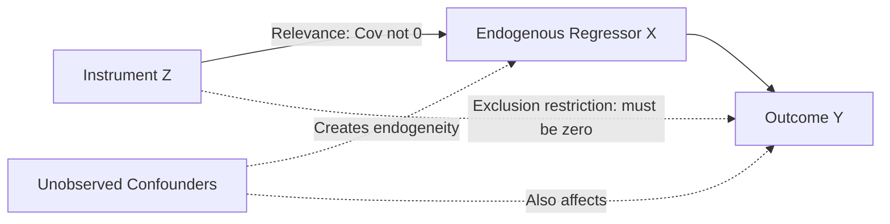
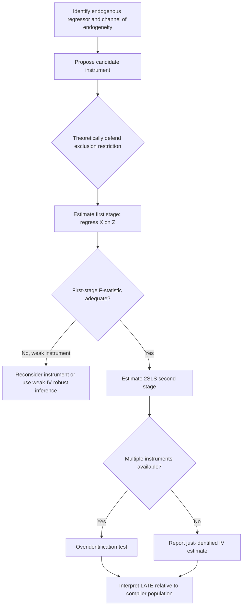

## Instrumental Variables Approach

### Conceptual Foundation

The instrumental variables (IV) approach is an identification strategy used to estimate causal effects when the explanatory variable of interest is endogenous — that is, correlated with the error term in a regression, due to omitted variable bias, reverse causality, or measurement error. This is a pervasive concern in development economics, where variables such as schooling, income, institutional quality, or program participation are rarely randomly assigned and are often jointly determined with the outcome of interest.

An instrument is a variable that induces variation in the endogenous explanatory variable but has no direct effect on the outcome except through that variable. Formally, given a structural equation:

$$Y_i = \beta_0 + \beta_1 X_i + \varepsilon_i$$

where $X_i$ is correlated with $\varepsilon_i$ (i.e., $\text{Cov}(X_i, \varepsilon_i) \neq 0$), ordinary least squares (OLS) produces a biased and inconsistent estimate of $\beta_1$. An instrument $Z_i$ is introduced to isolate the exogenous variation in $X_i$ that can be used to identify $\beta_1$.

### Core Identifying Assumptions

A valid instrument $Z_i$ must satisfy two conditions:

**1. Relevance (First-Stage Condition)**

$Z_i$ must be correlated with the endogenous regressor $X_i$:

$$\text{Cov}(Z_i, X_i) \neq 0$$

This is empirically testable via the first-stage regression and its associated F-statistic.

**2. Exogeneity (Exclusion Restriction)**

$Z_i$ must be uncorrelated with the error term, meaning it affects the outcome $Y_i$ only through its effect on $X_i$, not through any other channel:

$$\text{Cov}(Z_i, \varepsilon_i) = 0$$

This condition is **not directly testable** in the just-identified case (one instrument, one endogenous regressor) because $\varepsilon_i$ is unobserved. The exclusion restriction must be defended on theoretical and institutional grounds specific to the context, and is the primary source of scholarly disagreement over the validity of any given IV strategy. [Inference: the plausibility of an exclusion restriction is inherently a matter of argument and domain knowledge rather than something statistical tests can fully resolve]

### Two-Stage Least Squares (2SLS) Estimation

The most common estimation method is two-stage least squares:

**First stage** — regress the endogenous variable on the instrument(s) and exogenous controls:

$$X_i = \pi_0 + \pi_1 Z_i + \pi_2 W_i + \eta_i$$

where $W_i$ represents exogenous control variables included in the structural equation. The fitted values $\hat{X}_i$ represent the portion of variation in $X_i$ that is explained by the instrument (and hence, under the exclusion restriction, uncorrelated with $\varepsilon_i$).

**Second stage** — regress the outcome on the fitted values from the first stage:

$$Y_i = \beta_0 + \beta_1 \hat{X}_i + \beta_2 W_i + u_i$$

The coefficient $\beta_1$ is the 2SLS estimate of the causal effect of $X_i$ on $Y_i$. In practice, this is not run as two separate OLS regressions (which produces incorrect standard errors) but through purpose-built 2SLS estimators (e.g., `ivreg2` in Stata, `ivreg` in R) that compute correct standard errors accounting for the estimation of the first stage.

### The Wald Estimator (Just-Identified Case with Binary Instrument)

In the simplest case of a single binary instrument and single endogenous regressor, the IV estimate reduces to the Wald estimator:

$$\hat{\beta}_{IV} = \frac{E[Y_i \mid Z_i=1] - E[Y_i \mid Z_i=0]}{E[X_i \mid Z_i=1] - E[X_i \mid Z_i=0]}$$

This expresses the IV estimate as a ratio: the "reduced-form" effect of the instrument on the outcome, divided by the first-stage effect of the instrument on the endogenous variable. This ratio interpretation is useful for understanding IV intuitively — it scales up the reduced-form relationship by however much the instrument was able to shift the endogenous variable.

### Local Average Treatment Effect (LATE)

When treatment effects are heterogeneous across individuals (as is standard to assume in applied microeconomics), IV does not recover the average treatment effect (ATE) for the full population. Instead, under the framework developed by Imbens and Angrist, IV recovers the **Local Average Treatment Effect (LATE)** — the average causal effect for the subpopulation of "compliers," defined as those individuals whose treatment status is changed by the instrument.

This requires an additional assumption beyond relevance and exclusion:

**Monotonicity**: the instrument must not induce any individual to move in the opposite direction (no "defiers"). Formally, if $X_i(1)$ and $X_i(0)$ denote potential treatment status under $Z_i=1$ and $Z_i=0$ respectively, monotonicity requires $X_i(1) \geq X_i(0)$ for all $i$ (or the reverse, consistently).

**Population subgroups relative to the instrument:**

| Subgroup | Definition | Behavior |
| --- | --- | --- |
| Compliers | Take treatment if and only if assigned/encouraged | $X_i(1) > X_i(0)$ |
| Always-takers | Take treatment regardless of instrument | $X_i(1) = X_i(0) = 1$ |
| Never-takers | Never take treatment regardless of instrument | $X_i(1) = X_i(0) = 0$ |
| Defiers | Take treatment only when NOT assigned/encouraged (ruled out by monotonicity) | $X_i(1) < X_i(0)$ |

**Key Points**

- LATE is only informative about compliers, a subpopulation that is generally not directly identifiable in the data and may differ systematically from always-takers, never-takers, or the overall population
- External validity of an IV estimate depends on whether compliers are a policy-relevant group; different instruments for the same endogenous variable can yield different LATEs because they identify effects for different complier populations
- This is a central limitation distinguishing IV from RCT-based ATE estimates, and is a common point of critique when comparing IV results across studies using different instruments for ostensibly the same causal question

### Common Instrument Types in Development Economics

**Geographic and Environmental Instruments**

Variation in geography, climate, or natural resource endowments used to instrument for institutional or economic outcomes. A widely cited example is the use of historical settler mortality rates to instrument for the quality of colonial-era institutions (Acemoglu, Johnson, and Robinson, 2001), based on the argument that European settlers established more extractive institutions in regions with high disease burden, and these institutional patterns persisted into the present.

**Historical and Policy-Induced Instruments**

Historical events, colonial policies, or administrative rules that generated variation unrelated to current outcomes except through their historical legacy — e.g., historical land tenure systems, colonial-era railway placement, or administrative boundary changes used to instrument for present-day economic outcomes.

**Rainfall and Weather Shocks**

Weather variation used to instrument for agricultural income or economic shocks in contexts where farming is a dominant livelihood, on the grounds that rainfall is plausibly exogenous to household or village-level economic decision-making (though this instrument requires care regarding whether rainfall affects outcomes only through the hypothesized income channel — e.g., rainfall could also affect health directly through waterborne disease, violating exclusion).

**Policy Discontinuities and Administrative Rules**

Arbitrary administrative thresholds, quotas, or rules that create variation in program access or resource allocation unrelated to underlying characteristics (this overlaps conceptually with regression discontinuity design when the threshold is used directly rather than as an instrument).

**Demographic and Distance-Based Instruments**

Distance to infrastructure (e.g., distance to a market, school, or health facility at the time it was built) used to instrument for access or utilization, under the assumption that historical siting decisions are unrelated to current unobserved determinants of the outcome.

*[Note: many "classic" instruments in development and growth economics, including settler mortality and other historical instruments, have faced substantial methodological critique in subsequent literature regarding data quality, functional form sensitivity, and exclusion restriction plausibility; researchers should consult the current state of this debate before relying on any specific instrument as an unquestioned standard]*

### Overidentification and Testing

When more instruments are available than endogenous regressors (the "overidentified" case), researchers can formally test whether the instruments produce consistent estimates via the **Sargan-Hansen J-test** (or Sargan test in homoskedastic settings). The null hypothesis is that all instruments are valid (uncorrelated with the error term).

**Key Points**

- A rejection of the overidentification test indicates that at least one instrument is invalid, but does not identify which one
- Failure to reject does not prove validity — it is possible for all instruments to be jointly invalid in a way that is undetectable by this test if they share a common correlation with the error term
- Overidentification tests provide supportive but not definitive evidence and should not be treated as a substitute for a strong theoretical exclusion restriction argument

### Weak Instruments Problem

An instrument with only a weak correlation with the endogenous regressor (weak first stage) produces IV estimates that are biased in finite samples (biased toward the OLS estimate) and have inflated standard errors, even asymptotically. The conventional diagnostic is the first-stage F-statistic, with the traditional rule of thumb of $F > 10$ (Staiger and Stock, 1997) used as an informal threshold for adequate instrument strength, although more rigorous approaches (e.g., the Stock-Yogo critical values, or robust weak-instrument inference methods such as Anderson-Rubin confidence sets) provide more formally grounded alternatives. [Inference: the F > 10 threshold is a widely used heuristic rather than a definitive statistical cutoff, and its adequacy depends on the number of instruments and the specific inference procedure used]

With a weak instrument:

$$\text{plim}(\hat{\beta}_{IV} - \beta) = \frac{\text{Cov}(Z_i, \varepsilon_i)}{\text{Cov}(Z_i, X_i)}$$

As $\text{Cov}(Z_i, X_i) \to 0$ (a weak first stage), even a small violation of exogeneity in the numerator is magnified, potentially producing an IV estimate that is more biased than the original OLS estimate it was meant to correct.

### Diagnostic and Robustness Practices

**Key Points**

- **Report the first stage explicitly**, including the coefficient on the instrument and the F-statistic, not just the second-stage results
- **Test for weak instruments** using Stock-Yogo critical values or robust alternatives (Anderson-Rubin, conditional likelihood ratio tests) when the F-statistic is marginal
- **Conduct overidentification tests** when multiple instruments are available
- **Assess exclusion restriction plausibility qualitatively**, considering all plausible alternative channels through which the instrument could affect the outcome
- **Compare OLS and IV estimates**, and interpret the direction and magnitude of the difference in light of the expected direction of endogeneity bias (e.g., if omitted ability bias is expected to inflate the OLS returns-to-schooling estimate, a lower IV estimate is broadly consistent with that prior, though this comparison is not itself a formal validity test)
- **Conduct a Durbin-Wu-Hausman test** to formally assess whether the endogenous regressor is, in fact, statistically distinguishable from exogenous under the maintained instrument, informing whether IV is necessary relative to OLS

### Illustration: IV Identification Logic (svg_diagram)

<svg xmlns="http://www.w3.org/2000/svg" viewBox="0 0 760 320">
<rect x="0" y="0" width="760" height="320" fill="#ffffff" />
<text x="380" y="24" text-anchor="middle" font-size="16" font-weight="bold" fill="#1a1a1a">Instrumental Variables: Isolating Exogenous Variation (svg_diagram)</text>
<rect x="40" y="90" width="140" height="50" rx="6" fill="#eef3f8" stroke="#4477aa" stroke-width="1.5" />
<text x="110" y="119" text-anchor="middle" font-size="13" fill="#1a1a1a">Instrument Z</text>
<rect x="320" y="90" width="140" height="50" rx="6" fill="#fff3d6" stroke="#c99b1f" stroke-width="1.5" />
<text x="390" y="112" text-anchor="middle" font-size="12" fill="#5c4200">Endogenous</text>
<text x="390" y="128" text-anchor="middle" font-size="12" fill="#5c4200">Regressor X</text>
<rect x="600" y="90" width="140" height="50" rx="6" fill="#d9ecd9" stroke="#3a8a3a" stroke-width="1.5" />
<text x="670" y="119" text-anchor="middle" font-size="13" fill="#1e4d1e">Outcome Y</text>
<rect x="320" y="220" width="140" height="50" rx="6" fill="#f0d9d9" stroke="#a33" stroke-width="1.5" />
<text x="390" y="242" text-anchor="middle" font-size="12" fill="#5c1e1e">Unobserved</text>
<text x="390" y="258" text-anchor="middle" font-size="12" fill="#5c1e1e">Confounder U</text>
<line x1="180" y1="115" x2="320" y2="115" stroke="#2b6ca3" stroke-width="2" marker-end="url(#arrow1)" />
<text x="250" y="105" text-anchor="middle" font-size="10" fill="#2b6ca3">Relevance</text>
<line x1="460" y1="115" x2="600" y2="115" stroke="#3a8a3a" stroke-width="2" marker-end="url(#arrow1)" />
<text x="530" y="105" text-anchor="middle" font-size="10" fill="#3a8a3a">Causal effect (of interest)</text>
<line x1="390" y1="220" x2="390" y2="140" stroke="#a33" stroke-width="2" marker-end="url(#arrow1)" />
<text x="410" y="185" font-size="10" fill="#a33">Confounds</text>
<line x1="460" y1="245" x2="670" y2="140" stroke="#a33" stroke-width="2" marker-end="url(#arrow1)" />
<text x="580" y="210" font-size="10" fill="#a33">Also confounds</text>
<line x1="110" y1="140" x2="230" y2="240" stroke="#888" stroke-width="1.5" stroke-dasharray="5,4" />
<text x="150" y="200" font-size="10" fill="#666">Must be zero</text>
<text x="150" y="213" font-size="10" fill="#666">(exclusion restriction)</text>
</svg>

### Worked Example: Returns to Schooling

A canonical application (Angrist and Krueger, 1991) uses quarter of birth as an instrument for years of schooling, exploiting the interaction between compulsory schooling laws (which require attendance until a fixed birthdate-based age) and school entry age cutoffs, which causes individuals born in different quarters to be compelled to complete different amounts of schooling before becoming eligible to leave school.

**Structural equation:**

$$\log(\text{wage}_i) = \beta_0 + \beta_1 \text{Schooling}_i + \beta_2 X_i + \varepsilon_i$$

**First stage:**

$$\text{Schooling}_i = \pi_0 + \pi_1 \text{QuarterOfBirth}_i + \pi_2 X_i + \eta_i$$

The identifying argument is that quarter of birth is unrelated to unobserved ability or family background (satisfying exclusion) but mechanically affects total years of schooling completed under compulsory schooling laws (satisfying relevance). This example is also frequently cited in the weak-instruments literature, since the first-stage relationship between quarter of birth and schooling, while statistically detectable in very large samples, is quantitatively small — illustrating both the potential and the practical fragility of instrument-based identification.

### Relationship to Other Identification Strategies

IV is one of several quasi-experimental tools used when randomization is infeasible, alongside difference-in-differences, regression discontinuity design (RDD), and matching methods. It is often used in combination with RDD (fuzzy RDD is, in fact, a special case of IV, where the discontinuity itself serves as the instrument for treatment receipt) and is sometimes contrasted with structural approaches that impose an explicit behavioral model rather than relying on a single source of exogenous variation.

**Key Points**

- IV is most credible when the source of exogenous variation is well-understood, institutionally grounded, and defensible against specific alternative channels
- The rise of "instrument-hunting" in the empirical literature — searching for statistically strong but theoretically weak instruments — has been critiqued as producing results with limited external validity or credibility (sometimes referred to pejoratively as searching for "clever" rather than "credible" instruments)
- Contemporary applied microeconometrics increasingly emphasizes transparent discussion of exclusion restriction threats over reliance on formal overidentification tests alone

**Next Steps**

- Regression discontinuity design and the fuzzy RDD–IV connection
- Difference-in-differences and parallel trends assumption
- Weak instrument-robust inference (Anderson-Rubin, conditional likelihood ratio tests)
- Heterogeneous treatment effects and the LATE framework (Imbens-Angrist)
- Historical and institutional instruments in growth and development economics
- Panel data methods and fixed-effects approaches to endogeneity
- Structural estimation as an alternative to reduced-form IV
- Randomized controlled trials as a comparison identification strategy
- Control function approaches to endogeneity
- Shift-share (Bartik) instruments and their recent critiques