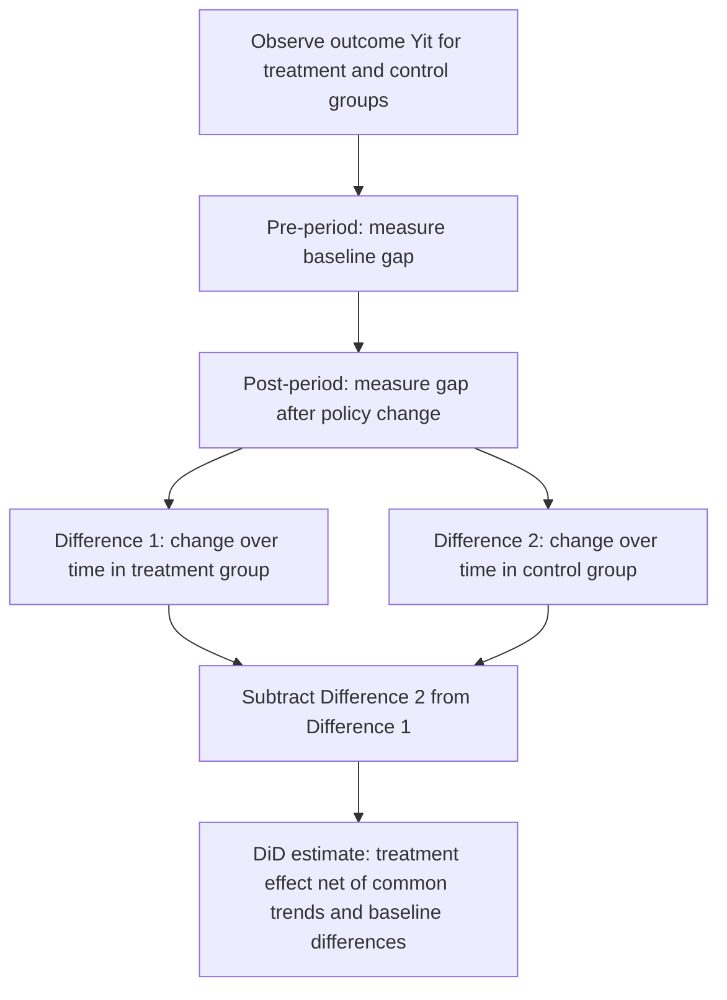
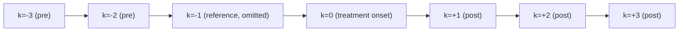
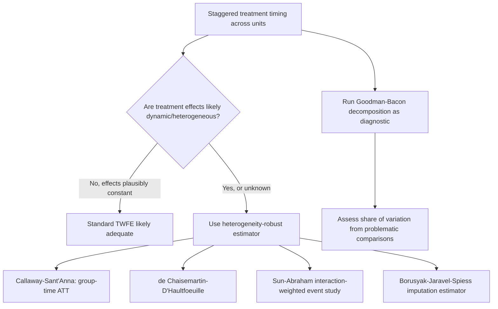

## Difference-in-Differences Estimation

### Conceptual Foundation

Difference-in-differences (DiD) is a quasi-experimental identification strategy that estimates causal effects by comparing the change in outcomes over time between a group exposed to a treatment or policy change and a group that is not exposed. It is widely used in development economics when random assignment is infeasible but a policy change, program rollout, or shock affects some units and not others at a specific point in time.

The core intuition is that comparing treatment and control groups at a single point in time (a simple cross-sectional comparison) may be biased by pre-existing differences between groups, while comparing a single group's outcomes before and after treatment (a simple before-after comparison) may be biased by other factors that change over time and are unrelated to treatment. DiD combines both comparisons to net out both time-invariant group differences and common time trends.

### The Canonical 2x2 Design

**Setup**

Consider two groups (treatment $T$ and control $C$) observed at two time periods (before, $t=0$, and after, $t=1$). The DiD estimator is:

$$\hat{\delta}_{DiD} = \left(\bar{Y}_{T,1} - \bar{Y}_{T,0}\right) - \left(\bar{Y}_{C,1} - \bar{Y}_{C,0}\right)$$

where $\bar{Y}_{g,t}$ denotes the mean outcome for group $g$ at time $t$. This is equivalently estimated via OLS using the regression:

$$Y_{it} = \alpha + \beta \cdot \text{Treat}_i + \gamma \cdot \text{Post}_t + \delta \cdot (\text{Treat}_i \times \text{Post}_t) + \varepsilon_{it}$$

where $\text{Treat}_i$ is an indicator for belonging to the treatment group, $\text{Post}_t$ is an indicator for the post-treatment period, and the interaction term coefficient $\delta$ is the DiD estimate of the treatment effect. In this specification:

- $\alpha$ captures the baseline level for the control group in the pre-period
- $\beta$ captures the time-invariant difference between treatment and control groups
- $\gamma$ captures the common time trend affecting both groups
- $\delta$ isolates the treatment effect, net of both baseline group differences and common trends

### The Parallel Trends Assumption

The central identifying assumption underlying DiD is **parallel trends**: in the absence of treatment, the treatment and control groups would have followed the same trajectory over time. Formally, using potential outcomes notation where $Y_{it}(0)$ denotes the untreated potential outcome:

$$E[Y_{i1}(0) - Y_{i0}(0) \mid \text{Treat}_i=1] = E[Y_{i1}(0) - Y_{i0}(0) \mid \text{Treat}_i=0]$$

This assumption is fundamentally **untestable** in the two-period case, because it makes a counterfactual claim about what would have happened to the treatment group absent treatment — something never observed. Researchers instead build indirect evidence for its plausibility, most commonly through:

- **Pre-trends analysis**: examining whether treatment and control groups exhibited similar trends in the outcome variable during multiple pre-treatment periods, under the logic that similar historical trends make continued parallel evolution more plausible (though this is suggestive, not conclusive — a discontinuous change in relative trends coincident exactly with treatment remains possible)
- **Placebo tests**: testing for a "treatment effect" using an outcome that should not be affected by treatment, or applying the DiD estimator to periods before the actual treatment occurred (an artificial "fake" treatment date), expecting to find no effect
- **Institutional/theoretical justification**: providing a substantive account of why the two groups should be expected to evolve similarly absent the treatment, given their economic and demographic characteristics

**Key Points**

- Parallel trends does not require that treatment and control groups have the same *level* of the outcome (this is what the baseline difference term $\beta$ absorbs) — only that they would move in parallel absent treatment
- Parallel trends can hold on one outcome variable but not another; it must be justified separately for each outcome studied
- Visual inspection of pre-trends (event-study plots) is standard practice, though a lack of statistically significant pre-trends does not prove the assumption holds (an underpowered test with wide confidence intervals is not strong evidence)

### Event-Study (Dynamic) Specifications

Rather than a single pre/post comparison, researchers commonly estimate a dynamic or "event-study" specification that allows the treatment effect to vary by time relative to treatment onset:

$$Y_{it} = \alpha_i + \lambda_t + \sum_{k \neq -1} \beta_k \cdot \mathbb{1}(t - T_i^* = k) + \varepsilon_{it}$$

where $\alpha_i$ are unit fixed effects, $\lambda_t$ are time fixed effects, $T_i^*$ is the period unit $i$ is treated, and $k$ indexes time relative to treatment (leads and lags). The period immediately before treatment ($k=-1$) is typically omitted as the reference category. This specification allows researchers to:

- Visually and statistically assess pre-trends (coefficients on pre-treatment leads, $k<0$, should be close to zero and statistically insignificant if parallel trends holds)
- Examine the dynamic path of treatment effects over time (whether effects grow, shrink, or remain stable following treatment)

### Two-Way Fixed Effects (TWFE) Generalization

With more than two periods and/or more than two groups, DiD is commonly generalized to a two-way fixed effects regression:

$$Y_{it} = \alpha_i + \lambda_t + \delta \cdot D_{it} + \varepsilon_{it}$$

where $\alpha_i$ are unit fixed effects (absorbing time-invariant unit characteristics), $\lambda_t$ are time fixed effects (absorbing common shocks affecting all units in a given period), and $D_{it}$ is an indicator for whether unit $i$ is treated at time $t$. This specification is widely used in settings with staggered treatment timing, where different units receive treatment at different calendar dates.

### Critical Issue: TWFE Bias Under Staggered Treatment Timing

A substantial body of methodological literature (Goodman-Bacon, 2021; de Chaisemartin and D'Haultfœuille, 2020; Callaway and Sant'Anna, 2021; Sun and Abraham, 2021; Borusyak, Jaravel, and Spiess) has demonstrated that the standard TWFE estimator can produce **biased estimates of the average treatment effect when treatment timing is staggered across units and treatment effects are heterogeneous** (e.g., effects that vary across cohorts or grow over time since treatment).

The core problem, formalized by Goodman-Bacon's decomposition, is that the TWFE coefficient is a weighted average of all possible **2x2 DiD comparisons** between pairs of groups treated at different times, including comparisons where an **already-treated group serves as the "control"** for a later-treated group. If treatment effects change over time (dynamic effects), these "forbidden comparisons" can generate **negative weights**, and in extreme cases the TWFE estimate can even have the opposite sign of the true average treatment effect across all units.

**Key Points**

- This bias arises specifically because already-treated units are implicitly used as comparison units for newly-treated units in the standard TWFE decomposition, contaminating the control group with treatment-driven variation
- The bias is more severe when treatment timing is more staggered and when treatment effects exhibit meaningful dynamics (increasing or decreasing over time since treatment)
- This has become one of the most actively developed areas of applied econometrics since approximately 2018–2021, prompting a suite of new "heterogeneity-robust" estimators

*[Note: this area of methodology has evolved rapidly and continues to develop; researchers should consult current literature and software documentation for the most up-to-date recommended estimators, as best practice guidance has shifted substantially in a relatively short period and further refinements are likely]*

### Heterogeneity-Robust DiD Estimators

Several alternative estimators have been developed to address the TWFE staggered-timing bias:

- **Callaway and Sant'Anna (2021)**: estimates group-time average treatment effects $ATT(g,t)$ for each treatment cohort $g$ and time period $t$, then aggregates them using weights that avoid the "forbidden comparison" problem; implemented in the `did` package (R) and corresponding Stata/Python ports
- **de Chaisemartin and D'Haultfœuille (2020)**: proposes an estimator robust to heterogeneous and dynamic treatment effects, implemented via the `did_multiplegt` command
- **Sun and Abraham (2021)**: proposes an interaction-weighted estimator for event-study specifications that avoids contamination from already-treated units acting as controls
- **Borusyak, Jaravel, and Spiess**: proposes an "imputation" estimator that estimates unit and time fixed effects using only untreated observations, then imputes counterfactual untreated outcomes for treated observations
- **Goodman-Bacon (2021)**: primarily a diagnostic decomposition tool showing how much of the TWFE estimate derives from "clean" comparisons (never-treated vs. treated) versus problematic comparisons (already-treated vs. newly-treated)

**Key Points**

- These estimators generally require researchers to explicitly identify a valid comparison group (commonly "never-treated" units or "not-yet-treated" units at a given point in time), rather than pooling all variation as in standard TWFE
- Applied researchers are now commonly expected to report both a standard TWFE estimate and at least one heterogeneity-robust estimate, along with a Goodman-Bacon decomposition, particularly in staggered-adoption settings such as state-level policy rollouts
- Choice among these estimators can affect point estimates and confidence intervals meaningfully in practice, and the appropriate choice depends on the specific structure of treatment timing and expected treatment effect dynamics in the application [Inference: there is not yet full consensus among practitioners on a single default estimator across all contexts, and this remains an area of active methodological discussion]

### Standard Error Considerations

**Clustering**

Standard errors in DiD applications should generally be clustered at the level of treatment assignment (e.g., state, village, or district), not at the individual observation level, since the treatment variable typically does not vary within these clusters and outcomes within a cluster are likely serially correlated. Failure to cluster appropriately can produce severely understated standard errors, a well-documented issue in panel-data DiD applications (Bertrand, Duflo, and Mullainathan, 2004).

**Serial Correlation in Panel Data**

With many time periods, outcome variables often exhibit strong serial correlation, which can further bias standard errors if not addressed through clustering or alternative approaches (e.g., aggregating data to a single pre/post observation per unit, or using wild cluster bootstrap methods when the number of clusters is small).

**Few Treated Clusters**

When only a small number of clusters are treated (e.g., a policy implemented in a handful of states), conventional cluster-robust standard errors can be unreliable; researchers often turn to randomization inference, wild cluster bootstrap procedures, or synthetic control methods as more robust alternatives in this setting.

### Illustration: Parallel Trends Logic (svg_diagram)

<svg xmlns="http://www.w3.org/2000/svg" viewBox="0 0 760 380">
<rect x="0" y="0" width="760" height="380" fill="#ffffff" />
<text x="380" y="24" text-anchor="middle" font-size="16" font-weight="bold" fill="#1a1a1a">Difference-in-Differences: Parallel Trends Logic (svg_diagram)</text>
<line x1="80" y1="330" x2="700" y2="330" stroke="#333" stroke-width="1.5" />
<line x1="80" y1="330" x2="80" y2="60" stroke="#333" stroke-width="1.5" />
<text x="390" y="360" text-anchor="middle" font-size="12" fill="#333">Time</text>
<text x="30" y="195" text-anchor="middle" font-size="12" fill="#333" transform="rotate(-90 30 195)">Outcome Y</text>
<line x1="380" y1="60" x2="380" y2="330" stroke="#888" stroke-width="1" stroke-dasharray="5,4" />
<text x="380" y="50" text-anchor="middle" font-size="11" fill="#666">Treatment begins</text>
<polyline points="120,270 250,240 380,215 500,200 620,190" fill="none" stroke="#a33" stroke-width="2.5" />
<text x="640" y="185" font-size="11" fill="#a33">Control group (actual)</text>
<polyline points="120,180 250,150 380,125" fill="none" stroke="#2b6ca3" stroke-width="2.5" />
<polyline points="380,125 500,110 620,100" fill="none" stroke="#2b6ca3" stroke-width="2.5" />
<text x="640" y="95" font-size="11" fill="#2b6ca3">Treatment group (actual)</text>
<polyline points="380,125 500,110 620,100" fill="none" stroke="#2b6ca3" stroke-width="2.5" stroke-dasharray="1,0" />
<polyline points="380,125 500,155 620,170" fill="none" stroke="#2b6ca3" stroke-width="1.5" stroke-dasharray="6,4" />
<text x="640" y="175" font-size="10" fill="#5588bb">Counterfactual (parallel to control)</text>
<line x1="620" y1="100" x2="620" y2="170" stroke="#3a8a3a" stroke-width="2" />
<text x="655" y="140" font-size="11" fill="#1e4d1e">DiD effect</text>
<circle cx="120" cy="270" r="3.5" fill="#a33" />
<circle cx="120" cy="180" r="3.5" fill="#2b6ca3" />
</svg>

### Extensions and Related Designs

**Triple Differences (DDD)**

Adds a third dimension of variation (e.g., a demographic group expected to be differentially affected by treatment within the treated region) to further net out confounding trends that might differ across regions but not across the specific subgroup of interest within those regions:

$$\delta_{DDD} = \left[(\bar{Y}_{T,A,1} - \bar{Y}_{T,A,0}) - (\bar{Y}_{C,A,1} - \bar{Y}_{C,A,0})\right] - \left[(\bar{Y}_{T,B,1} - \bar{Y}_{T,B,0}) - (\bar{Y}_{C,B,1} - \bar{Y}_{C,B,0})\right]$$

where $A$ and $B$ denote a group expected to be affected by treatment and one that is not, respectively, within each region.

**Synthetic Control Method**

When there is a single treated unit (e.g., one country or state) and many potential control units, the synthetic control method (Abadie, Diamond, and Hainmueller) constructs a weighted combination of control units that closely matches the treated unit's pre-treatment outcome trajectory, serving as a data-driven counterfactual. This is often viewed as a complementary approach to DiD in comparative case study settings with very few treated units.

**Conditional Parallel Trends and Matching-DiD Combinations**

When parallel trends is more plausible conditional on observable covariates than unconditionally, researchers may combine DiD with matching or reweighting approaches (e.g., inverse probability weighting) to construct a comparison group with similar pre-treatment characteristics and trends before applying the DiD estimator.

### Application Context in Development Economics

DiD is commonly used in development economics to evaluate:

- Effects of policy reforms implemented in some regions/countries but not others (e.g., minimum wage changes, trade liberalization episodes, land reform programs)
- Effects of large-scale infrastructure investments phased in across different areas at different times (e.g., electrification, road construction)
- Effects of natural disasters or economic shocks that affect some regions more than others, combined with pre-existing panel data
- Effects of administrative or programmatic changes rolled out in stages across districts or provinces

**Key Points**

- DiD requires panel or repeated cross-section data with observations of the same (or comparable) units before and after the change
- Compared to RCTs, DiD relies on an assumption (parallel trends) rather than a design feature (randomization) for identification, making it inherently more vulnerable to unobserved confounding specific to the natural experiment being exploited
- DiD is often the preferred approach when a policy change of interest has already occurred (retrospective evaluation) and randomization was never implemented, making it a common tool for evaluating real-world policy variation rather than researcher-designed interventions

### Relationship to Other Identification Strategies

DiD sits alongside RCTs, instrumental variables, and regression discontinuity design as one of the primary quasi-experimental tools in applied microeconomics. It is frequently combined with these other strategies: for example, a triple-difference design might be combined with an instrument for a mediating variable, or a regression discontinuity might be embedded within a broader DiD framework if the discontinuity is not constant over time (a "DiD-RD" hybrid). Understanding DiD's core assumption structure — particularly the distinction between assumption-based and design-based identification — is foundational for critically evaluating applied development economics research relying on natural policy variation.

**Next Steps**

- Two-way fixed effects bias under staggered treatment timing (Goodman-Bacon decomposition)
- Callaway and Sant'Anna group-time treatment effect estimation
- Synthetic control methods for single-unit case studies
- Event-study design and pre-trends testing in applied practice
- Regression discontinuity design and its relationship to DiD
- Instrumental variables approach as an alternative identification strategy
- Randomized controlled trials methodology as a design-based benchmark
- Clustered standard errors and inference with few treated clusters
- Triple-differences (DDD) design in policy evaluation
- Panel data econometrics and fixed-effects estimation