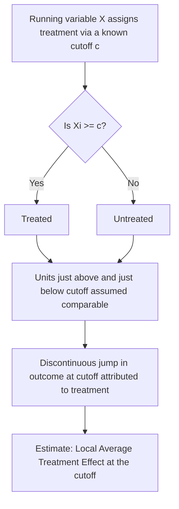
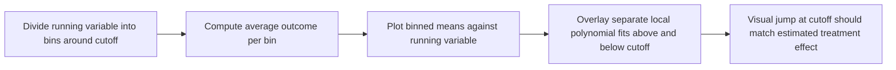

## Regression Discontinuity Design

### Conceptual Foundation

Regression discontinuity design (RDD) is a quasi-experimental identification strategy that exploits a known, deterministic rule assigning treatment based on whether a continuous variable (the "running variable" or "forcing variable") crosses a fixed threshold (the "cutoff"). Units just above and just below the cutoff are assumed to be otherwise similar, so any discontinuous jump in the outcome variable at the cutoff can be attributed to the treatment, rather than to underlying differences between units.

RDD is particularly valuable in development economics because eligibility for many programs is determined by an administrative rule based on a continuous measure — a poverty score for cash transfer eligibility, a test score for scholarship allocation, an age cutoff for school enrollment, or a population threshold for administrative classification — creating a natural source of quasi-random variation in treatment near the cutoff, even though assignment is not randomized overall.

### Core Identifying Logic

Let $X_i$ denote the running variable and $c$ the threshold, with treatment assigned according to:

$$D_i = \mathbb{1}(X_i \geq c)$$

The key identifying assumption is that potential outcomes $Y_i(0)$ and $Y_i(1)$ are **continuous functions of $X_i$ at the cutoff** — that is, absent treatment, there would be no discontinuous jump in the outcome at $c$. Under this assumption, the treatment effect at the cutoff is identified as:

$$\tau_{RD} = \lim_{x \to c^+} E[Y_i \mid X_i = x] - \lim_{x \to c^-} E[Y_i \mid X_i = x]$$

This is the **Local Average Treatment Effect at the cutoff** — it is only directly informative about units with $X_i$ near $c$, not the full population of treated or untreated units. This locality is both RDD's key strength (strong internal validity near the cutoff) and its key limitation (uncertain external validity away from the cutoff).

### Sharp vs. Fuzzy RDD

**Sharp RDD**

Treatment is a deterministic function of the running variable: everyone above the cutoff is treated, everyone below is not, with perfect compliance. This is estimated directly as the discontinuity in the conditional expectation of the outcome given the running variable.

**Fuzzy RDD**

Crossing the cutoff changes the *probability* of treatment but does not perfectly determine it (e.g., eligibility for a program increases take-up but some eligible individuals do not enroll, and some ineligible individuals gain access through other means). In this case, the cutoff is used as an **instrument** for actual treatment receipt, and the estimator becomes a ratio analogous to the Wald IV estimator:

$$\tau_{Fuzzy RD} = \frac{\lim_{x \to c^+} E[Y_i \mid X_i=x] - \lim_{x \to c^-} E[Y_i \mid X_i=x]}{\lim_{x \to c^+} E[D_i \mid X_i=x] - \lim_{x \to c^-} E[D_i \mid X_i=x]}$$

The numerator is the "reduced-form" discontinuity in the outcome, and the denominator is the discontinuity in the probability of treatment (the first-stage). Fuzzy RDD is thus formally equivalent to an IV estimator where the cutoff-crossing indicator serves as the instrument for treatment receipt, and it recovers a LATE for compliers local to the cutoff.

**Key Points**

- Sharp RDD requires perfect compliance with the assignment rule; fuzzy RDD accommodates imperfect compliance
- Fuzzy RDD inherits the same identifying assumptions as IV (relevance and exclusion) in addition to the RDD continuity assumption
- Most real-world administrative rules in development settings exhibit some degree of non-compliance (misclassification, appeals processes, corruption, or measurement error in the running variable), making fuzzy RDD common in practice even when a rule is nominally sharp

### Estimation Methods

**Local Linear (and Local Polynomial) Regression**

The standard approach fits separate regressions on either side of the cutoff within a bandwidth $h$ around $c$, typically using local linear regression:

$$Y_i = \alpha + \beta (X_i - c) + \tau D_i + \gamma D_i (X_i - c) + \varepsilon_i \quad \text{for } |X_i - c| \leq h$$

where $\tau$ is the RDD treatment effect estimate. Allowing different slopes on each side of the cutoff (via the interaction term) accommodates the possibility that the relationship between the running variable and outcome differs in shape between treated and untreated units.

**Key Points**

- Higher-order polynomial specifications (quadratic, cubic) were historically common but are now generally discouraged for global fits, since Gelman and Imbens (2019) demonstrated that high-order polynomials can produce spurious results driven by noisy behavior at the boundaries of the data range
- Current best practice favors local linear or local quadratic regression within a narrow, data-driven bandwidth around the cutoff, rather than fitting a high-order polynomial to the full range of the running variable
- Robustness checks typically include re-estimating with multiple bandwidths and multiple polynomial orders to assess sensitivity

**Bandwidth Selection**

The choice of bandwidth $h$ involves a bias-variance tradeoff: a wider bandwidth includes more data (reducing variance) but risks bias if the true relationship between $X_i$ and $Y_i$ is nonlinear further from the cutoff; a narrower bandwidth reduces this bias but increases variance due to fewer observations. Data-driven optimal bandwidth selection procedures (notably Imbens-Kalyanaraman and Calonico-Cattaneo-Titiunik, often abbreviated CCT) are standard in current applied practice, implemented in packages such as `rdrobust` (Stata, R, and Python).

**Robust Bias-Corrected Inference**

Calonico, Cattaneo, and Titiunik (2014) developed bias-corrected confidence intervals that account for the fact that optimal bandwidth selection (which minimizes mean squared error) introduces a first-order bias that standard confidence intervals do not account for. This robust inference approach is now widely considered standard practice and is implemented directly in the `rdrobust` package.

### Graphical Presentation

RDD results are conventionally presented visually via binned scatterplots: the running variable is divided into bins, the average outcome within each bin is plotted, and separate fitted lines (or curves) are overlaid for observations above and below the cutoff. A visually discontinuous jump at the cutoff, consistent with the numerical estimate, is standard supporting evidence, though bin width and placement should not be chosen in a way that manufactures the appearance of a discontinuity (a well-known source of visual manipulation risk in RDD presentation).

### Illustration: Sharp RDD Discontinuity (svg_diagram)

<svg xmlns="http://www.w3.org/2000/svg" viewBox="0 0 760 380">
<rect x="0" y="0" width="760" height="380" fill="#ffffff" />
<text x="380" y="24" text-anchor="middle" font-size="16" font-weight="bold" fill="#1a1a1a">Regression Discontinuity: Jump at the Cutoff (svg_diagram)</text>
<line x1="80" y1="330" x2="700" y2="330" stroke="#333" stroke-width="1.5" />
<line x1="80" y1="330" x2="80" y2="60" stroke="#333" stroke-width="1.5" />
<text x="390" y="360" text-anchor="middle" font-size="12" fill="#333">Running variable X</text>
<text x="30" y="195" text-anchor="middle" font-size="12" fill="#333" transform="rotate(-90 30 195)">Outcome Y</text>
<line x1="390" y1="60" x2="390" y2="330" stroke="#888" stroke-width="1.5" stroke-dasharray="5,4" />
<text x="390" y="50" text-anchor="middle" font-size="11" fill="#666">Cutoff c</text>
<circle cx="120" cy="280" r="3" fill="#a33" />
<circle cx="160" cy="270" r="3" fill="#a33" />
<circle cx="200" cy="260" r="3" fill="#a33" />
<circle cx="240" cy="255" r="3" fill="#a33" />
<circle cx="280" cy="248" r="3" fill="#a33" />
<circle cx="320" cy="240" r="3" fill="#a33" />
<circle cx="360" cy="232" r="3" fill="#a33" />
<line x1="115" y1="285" x2="380" y2="225" stroke="#a33" stroke-width="2.5" />
<text x="200" y="300" font-size="11" fill="#a33">Below cutoff (untreated)</text>
<circle cx="420" cy="150" r="3" fill="#2b6ca3" />
<circle cx="460" cy="145" r="3" fill="#2b6ca3" />
<circle cx="500" cy="140" r="3" fill="#2b6ca3" />
<circle cx="540" cy="132" r="3" fill="#2b6ca3" />
<circle cx="580" cy="128" r="3" fill="#2b6ca3" />
<circle cx="620" cy="120" r="3" fill="#2b6ca3" />
<circle cx="660" cy="115" r="3" fill="#2b6ca3" />
<line x1="400" y1="158" x2="665" y2="112" stroke="#2b6ca3" stroke-width="2.5" />
<text x="560" y="100" font-size="11" fill="#2b6ca3">Above cutoff (treated)</text>
<line x1="390" y1="222" x2="390" y2="163" stroke="#3a8a3a" stroke-width="2.5" />
<text x="405" y="195" font-size="12" fill="#1e4d1e" font-weight="bold">Treatment effect</text>
</svg>

### Validity Threats and Diagnostic Tests

**Manipulation of the Running Variable**

The central validity threat to RDD is precise manipulation of the running variable by units seeking to gain or avoid treatment status (e.g., government officials manipulating a poverty score to include favored households, or applicants strategically retaking a test to just clear a scholarship threshold). If units can precisely control which side of the cutoff they fall on, the continuity assumption breaks down, since units just above and below the cutoff would no longer be comparable.

**McCrary Density Test**

The standard diagnostic for manipulation is the McCrary (2008) density test, which examines whether there is a discontinuity in the *density* of the running variable at the cutoff. A sharp jump in density just above (or below) the cutoff — many more observations barely qualifying than barely failing to qualify, or vice versa — is suggestive evidence of manipulation. This is commonly implemented via the local polynomial density estimator of Cattaneo, Jansson, and Ma (2018), which improves on the original McCrary test's finite-sample properties.

**Covariate Balance/Continuity Tests**

Researchers typically test whether predetermined covariates (measured before treatment assignment, and therefore mechanically unaffected by treatment) exhibit a discontinuity at the cutoff. Since these covariates cannot be causally affected by treatment, any observed discontinuity would indicate a violation of the underlying continuity assumption, casting doubt on the design's validity.

**Placebo Cutoff Tests**

Applying the RDD estimator at artificial cutoffs (values of the running variable other than the true threshold, within either the treated or untreated range) should produce no discontinuity; a spurious "effect" at a placebo cutoff would raise concerns about specification or data issues.

**Key Points**

- Manipulation concerns are especially salient in development settings with weak institutional oversight, where administrative discretion, corruption, or measurement error in the running variable (e.g., self-reported income for a poverty-targeting program) create real risk of non-random sorting around the cutoff
- A discontinuity in a covariate that should be balanced is a strong signal against the design's internal validity for that application
- Combining multiple diagnostics (density test, covariate balance, placebo cutoffs) provides more convincing evidence than any single test alone

### External Validity Limitations

**Key Points**

- RDD estimates are inherently **local** to the cutoff; they do not directly identify the treatment effect for units far from the threshold, whose response to treatment could plausibly differ (e.g., a scholarship's effect on a marginal student near the qualifying score may differ substantially from its effect on a much higher- or lower-scoring student)
- Extrapolating RDD results to justify changing the location of the cutoff, or to infer effects for the full eligible population, requires additional assumptions beyond what the design itself supports
- This locality limitation is analogous to the LATE interpretation in fuzzy IV designs, and is a routine point of critique when RDD-based evidence is used to inform broader policy questions [Inference: the degree to which local RDD estimates generalize to non-marginal units is inherently an extrapolation and cannot be resolved by the RDD design itself]

### Design Variants

**Multi-Cutoff and Multi-Score RDD**

Some programs use multiple cutoffs (e.g., different eligibility thresholds across regions or years) or multiple running variables jointly determining eligibility (e.g., a geographic RDD combining latitude and longitude along an administrative border). These designs allow pooling of information across cutoffs but require additional assumptions about the comparability of treatment effects across different cutoff values.

**Geographic RDD**

Uses spatial discontinuities — such as an administrative or historical border — as the "cutoff," comparing outcomes for units on either side of a boundary that determines exposure to a policy, colonial administration, or jurisdictional rule. This requires particular care regarding two-dimensional running variables (distance to the border) and the possibility that other factors also change discontinuously at the same boundary (a violation of the "no other discontinuities" assumption).

**Regression Kink Design (RKD)**

A related design exploits a kink (a discontinuous *change in slope*, rather than a jump in level) in a policy rule — for example, a benefit formula whose marginal rate changes at a threshold — to identify the effect of the policy variable using the discontinuity in the *derivative* of the outcome with respect to the running variable at the kink point.

**Dynamic/Panel RDD**

Combines RDD with panel data structure, allowing researchers to examine treatment effects over multiple periods following the initial threshold crossing, useful when treatment effects are expected to evolve over time (e.g., long-run effects of a scholarship threshold on later-life outcomes).

### Application Context in Development Economics

RDD is commonly used to evaluate:

- Targeted anti-poverty program eligibility rules based on poverty or vulnerability index scores
- Educational interventions using test-score-based scholarship or grade-promotion cutoffs
- Age-based eligibility rules for social protection programs (pensions, child grants)
- Administrative population or size thresholds determining a locality's access to specific government resources or classifications
- Electoral cutoffs (e.g., close elections) used to study the effects of political outcomes, such as the effect of winning office on subsequent policy or economic outcomes

### Relationship to Other Identification Strategies

RDD shares its local, ratio-based estimation logic with fuzzy instrumental variables (fuzzy RDD is formally a special case of IV where cutoff-crossing serves as the instrument for treatment). It differs from difference-in-differences in relying on a cross-sectional discontinuity around a threshold rather than a before-after comparison across groups, though the two can be combined (a "DiD-RD" design) when a discontinuity's effect is measured over time or is itself subject to a policy change. Compared to RCTs, RDD offers weaker external validity (local to the cutoff) but is often available in contexts where randomization was never feasible, since many administrative programs already implement rule-based rather than randomized allocation.

**Key Points**

- RDD is generally regarded as one of the most credible quasi-experimental designs when its continuity assumption holds, due to its close conceptual link to local randomization near the threshold
- The main practical burden on researchers is defending against manipulation concerns and being transparent about the local nature of the resulting estimate
- Modern RDD practice (post-Gelman-Imbens 2019) strongly favors local linear/quadratic estimation with robust bias-corrected inference over global high-order polynomial fits

**Next Steps**

- Instrumental variables approach and the fuzzy RDD–IV equivalence
- Difference-in-differences estimation and DiD-RD hybrid designs
- McCrary density test and manipulation diagnostics
- Bandwidth selection methods (Imbens-Kalyanaraman, Calonico-Cattaneo-Titiunik)
- Regression kink design as a related identification strategy
- Geographic RDD using administrative or historical borders
- Randomized controlled trials methodology as a design-based benchmark
- Local Average Treatment Effect (LATE) interpretation across quasi-experimental designs
- Close-election RDD designs in political economy research
- External validity and extrapolation limits in quasi-experimental research