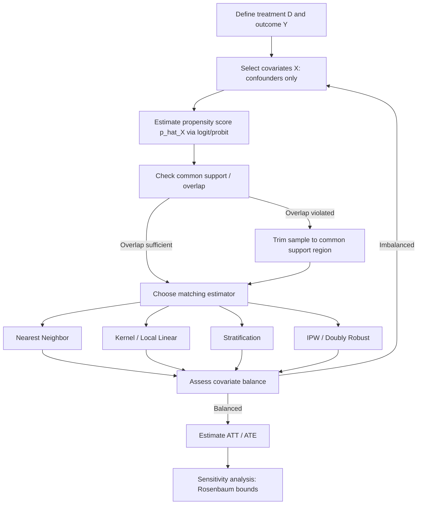

## Matching Methods and Propensity Scores

### Overview

Matching methods are a class of quasi-experimental techniques used to estimate causal effects from observational data when random assignment to treatment is infeasible or unethical — a common constraint in development economics, where programs (microfinance access, conditional cash transfers, land titling, agricultural extension) are rarely assigned randomly across the population of interest. The core idea is to construct a comparison group of untreated units that resembles the treated units as closely as possible on observed characteristics, thereby approximating the counterfactual: what would have happened to treated units had they not received treatment.

Propensity score methods, introduced by Rosenbaum and Rubin (1983), address a key practical problem in matching: when the set of covariates $X$ is high-dimensional, exact matching on all covariates becomes infeasible due to the curse of dimensionality. The propensity score collapses this multidimensional matching problem into a single scalar.

### The Selection Problem and Identification

In observational studies, treatment assignment $D_i \in \{0,1\}$ is typically correlated with potential outcomes $Y_i(0), Y_i(1)$ because participants self-select into programs, or programs are placed non-randomly (e.g., a health intervention placed in higher-need districts). The naive comparison of treated and untreated means is biased:

$$E[Y_i \mid D_i = 1] - E[Y_i \mid D_i = 0] = \underbrace{E[Y_i(1) - Y_i(0) \mid D_i = 1]}_{\text{ATT}} + \underbrace{\{E[Y_i(0) \mid D_i = 1] - E[Y_i(0) \mid D_i = 0]\}}_{\text{selection bias}}$$

Matching methods aim to eliminate the selection bias term by conditioning on observables.

**Conditional Independence Assumption (CIA) / Unconfoundedness**

The central identifying assumption is that, conditional on a vector of observed covariates $X$, treatment assignment is independent of potential outcomes:

$$\{Y_i(0), Y_i(1)\} \perp D_i \mid X_i$$

This assumption is untestable directly — it requires that all variables jointly affecting both treatment assignment and outcomes are observed and included in $X$. This is a strong assumption in development contexts, where unobserved factors like motivation, entrepreneurial ability, or informal political connections often drive both program participation and outcomes.

**Common Support / Overlap Condition**

$$0 < P(D_i = 1 \mid X_i = x) < 1 \quad \text{for all } x \text{ in the support of } X$$

Every unit must have a positive probability of being both treated and untreated given its characteristics. If certain covariate combinations perfectly predict treatment status, no valid comparison unit exists for those units, and they must be dropped from the analysis (with consequences for external validity).

### The Propensity Score

**Definition**

The propensity score is the conditional probability of receiving treatment given observed covariates:

$$p(X_i) = P(D_i = 1 \mid X_i)$$

**Rosenbaum-Rubin Theorem**

If unconfoundedness holds given $X$, it also holds given the scalar propensity score $p(X)$:

$$\{Y_i(0), Y_i(1)\} \perp D_i \mid X_i \implies \{Y_i(0), Y_i(1)\} \perp D_i \mid p(X_i)$$

This is the theoretical justification for matching or reweighting on $p(X)$ alone rather than on the full covariate vector — it is a dimension-reduction result, not a way to relax the underlying CIA.

**Estimation**

The propensity score is unknown and must be estimated, typically via a binary choice model:

$$\hat{p}(X_i) = \hat{P}(D_i = 1 \mid X_i) = F(X_i'\beta)$$

where $F(\cdot)$ is typically the logistic or normal (probit) CDF. In development applications, logit is more common due to computational convenience and comparable performance to probit in most settings.

**Practical guidance on specification:**

- Include covariates that plausibly affect both treatment assignment and the outcome (confounders); avoid including variables affected by treatment (bad controls) or pure instruments unrelated to outcomes, as these can worsen bias or efficiency.
- Include higher-order terms and interactions to better balance covariates — the goal of the specification is to achieve covariate balance, not to maximize predictive fit or pseudo-$R^2$.
- Iterate: estimate, check balance (below), and respecify if imbalance persists.

### Matching Estimators

**1. Nearest-Neighbor Matching**

Each treated unit $i$ is matched to the untreated unit(s) $j$ with the closest propensity score:

$$j(i) = \arg\min_j \| \hat{p}(X_i) - \hat{p}(X_j) \|$$

Variants:

- **1:1 matching**: each treated unit matched to one control (lower bias, higher variance).
- **k:1 matching**: matched to $k$ nearest neighbors (lower variance, potentially higher bias).
- **With/without replacement**: matching with replacement allows a control unit to be reused as a match for multiple treated units, improving match quality (lower bias) at the cost of increased variance, since effective sample size shrinks.
- **Caliper matching**: imposes a maximum allowable distance (caliper) between matched propensity scores, discarding treated units without a sufficiently close match; this trades bias reduction for a smaller effective sample and potential loss of external validity.

**2. Kernel and Local Linear Matching**

Instead of using only the nearest neighbor(s), every control unit is used, weighted by a kernel function of the distance in propensity scores:

$$\hat{Y}_i(0) = \sum_{j \in \{D=0\}} W_{ij} Y_j, \qquad W_{ij} = \frac{K\left(\frac{\hat{p}(X_j) - \hat{p}(X_i)}{h}\right)}{\sum_{k \in \{D=0\}} K\left(\frac{\hat{p}(X_k) - \hat{p}(X_i)}{h}\right)}$$

where $K(\cdot)$ is a kernel (e.g., Epanechnikov, Gaussian) and $h$ is the bandwidth. This uses more information than nearest-neighbor matching (asymptotically lower variance) at the cost of potentially including poorer-quality matches (higher bias) — a standard bias-variance trade-off governed by bandwidth choice.

**3. Stratification / Interval Matching**

Units are grouped into strata (blocks) of similar propensity scores (e.g., quintiles), and the treatment effect is computed within each stratum, then aggregated (often weighted by the share of treated units in each stratum). This is computationally simple and was historically common but is less precise than kernel or nearest-neighbor methods when strata are coarse.

**4. Inverse Probability Weighting (IPW)**

Rather than matching units directly, IPW reweights the full sample using the propensity score to construct a pseudo-population in which treatment is independent of $X$:

$$\hat{\tau}_{ATE} = \frac{1}{N}\sum_{i=1}^N \left[ \frac{D_i Y_i}{\hat{p}(X_i)} - \frac{(1-D_i) Y_i}{1 - \hat{p}(X_i)} \right]$$

IPW is sensitive to extreme propensity scores near 0 or 1, which produce very large weights and inflate variance. This motivates **trimming** (dropping observations outside a propensity score range, e.g., [0.1, 0.9]) or **normalization** (dividing by the sum of weights rather than $N$).

**5. Doubly Robust Estimation (Augmented IPW)**

Combines an outcome regression model with IPW such that the estimator remains consistent if *either* the propensity score model *or* the outcome model is correctly specified (not necessarily both):

$$\hat{\tau}_{DR} = \frac{1}{N}\sum_i \left[ \hat{m}_1(X_i) - \hat{m}_0(X_i) + \frac{D_i(Y_i - \hat{m}_1(X_i))}{\hat{p}(X_i)} - \frac{(1-D_i)(Y_i - \hat{m}_0(X_i))}{1-\hat{p}(X_i)} \right]$$

where $\hat{m}_1(X), \hat{m}_0(X)$ are estimated conditional mean outcome functions under treatment and control. This is increasingly the preferred approach in applied development work due to its robustness property.

### Diagram: Matching Workflow

### Covariate Balance Diagnostics

Matching quality must be verified after estimation — balance is the empirical check that the procedure has approximated a randomized design on observables.

**Standardized Mean Difference (SMD)**

$$SMD = \frac{\bar{X}_{treated} - \bar{X}_{matched\ control}}{\sqrt{\frac{s^2_{treated} + s^2_{control}}{2}}}$$

A common rule of thumb treats $|SMD| < 0.1$ as indicating adequate balance for a given covariate, though this threshold is a convention rather than a formal statistical criterion. [Inference: some applied literatures use 0.25 as an acceptable threshold; the appropriate cutoff is not universally standardized and should be justified in context.]

**Variance ratio test**: comparing the variance of $X$ in treated vs. matched control groups; ratios far from 1 suggest distributional imbalance beyond means.

**Love plots**: a standard visualization plotting standardized differences for each covariate before and after matching, used to visually confirm balance improvement.

### Illustration: Balance Improvement (svg_diagram)

<svg xmlns="http://www.w3.org/2000/svg" viewBox="0 0 640 300">
<text x="200" y="20" font-size="14" font-weight="bold" text-anchor="middle">Covariate Balance Before vs After Matching (svg_diagram)</text>
<line x1="320" y1="40" x2="320" y2="270" stroke="#999" stroke-width="1" />
<line x1="60" y1="270" x2="580" y2="270" stroke="#333" stroke-width="1" />
<text x="320" y="285" font-size="11" text-anchor="middle">Standardized Mean Difference</text>
<line x1="380" y1="35" x2="380" y2="270" stroke="#f0a" stroke-width="1" stroke-dasharray="4,3" />
<text x="380" y="30" font-size="9" text-anchor="middle" fill="#f0a">+0.1</text>
<line x1="260" y1="35" x2="260" y2="270" stroke="#f0a" stroke-width="1" stroke-dasharray="4,3" />
<text x="260" y="30" font-size="9" text-anchor="middle" fill="#f0a">-0.1</text>

<text x="65" y="60" font-size="11">Household income</text>

<circle cx="480" cy="60" r="5" fill="#d33" />

<circle cx="330" cy="60" r="5" fill="#333" />

<text x="65" y="100" font-size="11">Years of education</text>

<circle cx="420" cy="100" r="5" fill="#d33" />

<circle cx="300" cy="100" r="5" fill="#333" />

<text x="65" y="140" font-size="11">Household size</text>

<circle cx="200" cy="140" r="5" fill="#d33" />

<circle cx="310" cy="140" r="5" fill="#333" />

<text x="65" y="180" font-size="11">Distance to market</text>

<circle cx="500" cy="180" r="5" fill="#d33" />

<circle cx="350" cy="180" r="5" fill="#333" />

<text x="65" y="220" font-size="11">Age of household head</text>

<circle cx="150" cy="220" r="5" fill="#d33" />

<circle cx="290" cy="220" r="5" fill="#333" />

<circle cx="440" cy="250" r="5" fill="#d33" />
<text x="450" y="254" font-size="10">Before matching</text>
<circle cx="440" cy="265" r="5" fill="#333" />
<text x="450" y="269" font-size="10">After matching</text>
</svg>

### Sensitivity to Hidden Bias: Rosenbaum Bounds

Because unconfoundedness is untestable, applied researchers commonly report a sensitivity analysis quantifying how strong an unobserved confounder would need to be to overturn the estimated treatment effect. Rosenbaum's approach parameterizes the degree to which the odds of treatment assignment could differ between two units with identical observed covariates $X$ by a factor $\Gamma \geq 1$:

$$\frac{1}{\Gamma} \leq \frac{p_i(1-p_j)}{p_j(1-p_i)} \leq \Gamma$$

At $\Gamma = 1$, no hidden bias is assumed (equivalent to a randomized experiment given $X$). The analysis reports the critical $\Gamma$ at which the estimated effect would no longer be statistically significant; a result robust to only small $\Gamma$ is considered fragile to omitted variable bias, while robustness up to a large $\Gamma$ is regarded as reassuring — though this remains a bounding exercise, not proof of unconfoundedness.

### Worked Example: Microfinance Program Evaluation

**Setup**: A researcher wants to estimate the effect of microfinance loan access ($D$) on household business income ($Y$) using cross-sectional survey data covering both borrowers and non-borrowers in a rural district, where loan take-up was not randomized.

**Step 1 — Specify the propensity score model:**

$$\hat{P}(D_i=1 \mid X_i) = \Lambda(\beta_0 + \beta_1 \text{HH size}_i + \beta_2 \text{education}_i + \beta_3 \text{land owned}_i + \beta_4 \text{distance to bank}_i + \beta_5 \text{baseline income}_i)$$

where $\Lambda(\cdot)$ is the logistic CDF.

**Step 2 — Check common support:** Plot the estimated propensity score densities for borrowers and non-borrowers. Suppose non-borrowers with very low estimated probability of borrowing (e.g., $\hat p < 0.05$, often very wealthy households with no need for credit) show no overlap with borrowers — these units are dropped.

**Step 3 — Match:** Apply 1:1 nearest-neighbor matching with a caliper of 0.02 (in propensity score units), sampling with replacement to improve match quality.

**Step 4 — Check balance:** Compute SMDs on household size, education, land, distance to bank, and baseline income pre- and post-matching. Suppose all SMDs fall below 0.1 post-matching, indicating adequate balance was achieved (per the earlier convention).

**Step 5 — Estimate ATT:**

$$\hat{\tau}_{ATT} = \frac{1}{N_1}\sum_{i \in \{D=1\}} \left(Y_i - Y_{j(i)}\right)$$

Suppose this yields an estimated increase in business income attributable to loan access, conditional on the matched comparison being valid.

**Step 6 — Sensitivity analysis:** Report the critical Rosenbaum bound $\Gamma^*$ at which the result would cease to be significant, to communicate robustness to unobserved selection (e.g., entrepreneurial ability, which is plausibly correlated with both loan-seeking behavior and income growth).

**Note on interpretation:** Because unconfoundedness cannot be directly verified, this ATT should be interpreted as causal only under the maintained assumption that all relevant selection variables (including unobserved ability/motivation) are adequately proxied by observables like baseline income and land ownership. [Inference: in most microfinance applications, unobserved entrepreneurial ability is a leading threat to this assumption, and matching alone is often considered less credible than an RCT or instrumental variables strategy for this reason.]

### Comparison with Alternative Identification Strategies

| Method | Key Identifying Assumption | Typical Data Requirement | Common Development Use Case |
| --- | --- | --- | --- |
| Propensity score matching | Unconfoundedness given observables | Cross-sectional, rich covariates | Program evaluation with no baseline/comparison group design |
| Difference-in-differences | Parallel trends | Panel data (pre/post) | Policy rollout with staggered timing |
| Instrumental variables | Exclusion restriction, relevance | Valid instrument | Endogenous program take-up |
| Regression discontinuity | Continuity of potential outcomes at cutoff | Assignment rule with threshold | Means-tested eligibility programs |
| Randomized controlled trial | Random assignment | Prospective design | Pilot programs, phased rollout |

### Common Pitfalls in Applied Practice

- **Conditioning on post-treatment variables**: including covariates measured after treatment assignment can induce bias, since these may themselves be outcomes of treatment.
- **Overfitting the propensity score model**: including too many covariates or interactions relative to sample size can reduce common support, discarding usable observations.
- **Ignoring standard error adjustments**: matching-based standard errors generally need to account for the matching process itself (e.g., using the Abadie-Imbens variance estimator) rather than treating matched-pair differences as an i.i.d. sample.
- **Confusing balance with identification**: achieving good covariate balance on observables does not verify unconfoundedness — it is a necessary but not sufficient condition, since balance says nothing about unobserved confounders.
- **Cherry-picking specifications**: iterating on the propensity score model until balance is achieved without pre-registering the covariate set can introduce specification-search bias; best practice is to fix the balancing objective and covariate set ex ante where feasible.

### Software Implementation Notes

Standard implementations include the `MatchIt` and `Matching` packages in R, `psmatch2` and `teffects` in Stata, and `causalinference`/`DoWhy` in Python. [Unverified: exact default settings, caliper conventions, and variance estimators differ across these implementations and across versions; consult current package documentation before relying on default behavior for a specific analysis, as behavior may vary by version.]

### Related Topics

- Instrumental variables and two-stage least squares (2SLS) in development contexts
- Difference-in-differences and event study designs
- Regression discontinuity design (sharp and fuzzy)
- Randomized controlled trials and stratified randomization
- Synthetic control methods for aggregate/regional policy evaluation
- Selection bias and the Heckman two-step correction
- External validity and heterogeneous treatment effects in development RCTs
- Machine learning approaches to propensity score estimation (e.g., generalized boosted models, LASSO-selected covariates)