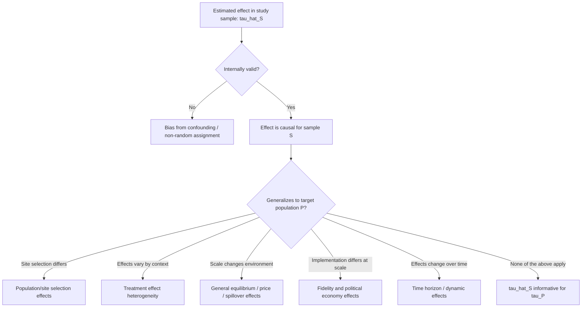

## External Validity and Generalizability Debates

### Overview

External validity concerns whether a causal effect estimated in one study population, setting, and time period can be expected to hold in other populations, settings, or time periods. This is distinct from **internal validity** — whether the estimated effect is an unbiased causal estimate for the study sample itself. A study can have very high internal validity (e.g., a well-executed randomized controlled trial) while having weak external validity if the study context differs systematically from the context of interest for policy.

In development economics, external validity debates gained particular prominence following the proliferation of randomized controlled trials (RCTs) since the early 2000s, associated with researchers including Esther Duflo, Abhijit Banerjee, and Michael Kremer (jointly awarded the 2019 Nobel Memorial Prize in Economic Sciences for their experimental approach to alleviating global poverty). Critics — notably Angus Deaton, Lant Pritchett, and Martin Ravallion — have raised sustained concerns about whether findings from small-scale, geographically localized RCTs can inform national-scale policy.

### Internal vs. External Validity: Formal Distinction

**Internal validity** asks whether the estimated average treatment effect (ATE) or average treatment effect on the treated (ATT) for sample $S$ correctly identifies the causal parameter:

$$\hat{\tau}_S = E[Y_i(1) - Y_i(0) \mid i \in S]$$

**External validity** asks whether $\hat{\tau}_S$ is informative about the corresponding parameter in a target population $P$:

$$\tau_P = E[Y_i(1) - Y_i(0) \mid i \in P]$$

The gap $\tau_P - \hat{\tau}_S$ can arise from several distinct sources, which the literature has increasingly tried to disentangle rather than treat as a single "external validity problem."

### Sources of External Validity Failure

**1. Population/Site Selection Effects**

Sample sites are rarely randomly selected from the population of policy interest. Study locations are frequently chosen for logistical convenience, implementing-partner presence, or researcher relationships, which correlates with unobserved characteristics affecting treatment effects.

**2. Effect Heterogeneity Across Contexts**

Even a correctly identified local treatment effect may not generalize if treatment effects vary systematically with observable or unobservable context — e.g., baseline institutional quality, market thickness, cultural norms, or complementary infrastructure (roads, credit markets, health systems).

**3. General Equilibrium and Scale Effects**

Small-scale pilots operate in "partial equilibrium": prices, wages, and the behavior of non-participants are held approximately fixed. Scaling an intervention economy-wide can trigger effects invisible at pilot scale:

- **Price effects**: e.g., cash transfer programs scaled up may shift local prices in ways a small pilot cannot detect.
- **Spillovers/general equilibrium effects**: a job training program that helps participants find jobs in a small pilot may simply displace non-participants at scale (a zero-sum labor market effect), which a partial-equilibrium RCT cannot capture. [Inference: this is one of the most cited scale-up concerns in the literature, though the magnitude of such effects is empirically contested and setting-dependent.]
- **Political economy effects**: government-implemented programs at scale face capacity, corruption, and incentive constraints that differ from NGO-run pilots with intensive research oversight.

**4. Implementation Fidelity and "Hawthorne"/Researcher Effects**

Pilots are often implemented with unusually high fidelity — well-trained staff, close monitoring, frequent researcher visits — that a government-scaled version may not replicate. Participants may also behave differently knowing they are being studied.

**5. Time Horizon Effects**

Short-run RCT results (often measured 1–3 years post-intervention) may not capture long-run effects, especially for interventions with delayed or compounding returns (e.g., early childhood interventions, education).

### Diagram: Decomposing the Internal-to-External Validity Gap

### The Structural / Site-Selection Framework (Allcott, Pritchett)

Hunt Allcott's 2015 study of the U.S. Opower energy conservation program formalized the site-selection problem: programs are more likely to be piloted by utilities or NGOs with favorable characteristics for showing positive effects, meaning treatment effects at "early adopter" sites systematically overstate effects at sites that adopt later. Allcott introduced a diagnostic comparing the distribution of observable site characteristics between experimental and non-experimental (or later-adopting) sites to detect whether site-selection bias is likely to matter for extrapolation.

Lant Pritchett and Justin Sandefur's work (particularly their debates on "randomizing development") argued more provocatively that cross-country heterogeneity in contextual factors is often large enough that internally valid local estimates can be *less* useful for predicting effects elsewhere than even a biased regression using local, non-experimental data from the country of interest — because the bias from omitted variables can be smaller than the bias from applying an estimate from a dissimilar context. [Inference: this claim was influential but contested; critics note the comparison depends heavily on how much the OLS bias and the cross-context heterogeneity actually differ in any given application, which is itself an empirical question rarely resolved definitively.]

### Formal Approaches to Assessing/Improving External Validity

**1. Multi-site Trials and Meta-Analysis**

Running the same intervention across multiple, purposively varied sites allows researchers to estimate the *distribution* of treatment effects rather than a single point estimate, and to model how effects covary with observable site characteristics $Z$:

$$\tau_j = \alpha + \gamma Z_j + \epsilon_j$$

where $\tau_j$ is the estimated effect in site $j$ and $Z_j$ are site-level moderators (e.g., baseline poverty rate, market access, state capacity). This allows extrapolation to a new site $j'$ with characteristics $Z_{j'}$, conditional on the model being correctly specified. Prominent examples include multi-country replications of deworming, graduation programs (e.g., the six-country "graduation approach" study by Banerjee, Duflo, and coauthors published in *Science*, 2015), and microcredit replications (the "Six Randomized Evaluations of Microcredit" special issue in *AEJ: Applied Economics*, 2015).

**2. Structural Modeling**

Rather than relying purely on reduced-form treatment effects, structural approaches estimate the underlying behavioral parameters (e.g., risk aversion, discount rates, production function parameters) that generate observed outcomes. Because these parameters are assumed more stable across contexts than a reduced-form treatment effect, structural estimates can, in principle, be used to simulate counterfactual policies or different contexts — at the cost of relying on stronger, harder-to-verify functional-form and behavioral assumptions.

**3. Bayesian Hierarchical / Meta-Analytic Extrapolation**

Treats each site-level estimate $\hat\tau_j$ as a noisy draw from a distribution of true effects, using partial pooling to shrink individual site estimates toward a global mean, and produces a predictive distribution for a new (unobserved) site:

$$\tau_j \sim N(\mu, \tau^2), \qquad \hat\tau_j \mid \tau_j \sim N(\tau_j, \sigma_j^2)$$

This approach explicitly quantifies uncertainty about generalizability rather than assuming a single fixed effect applies everywhere.

**4. Purposive/Stratified Site Selection Design**

Rather than selecting one convenient site, researchers deliberately select multiple sites spanning the range of the target population's characteristics (e.g., high- and low-market-access regions), improving the ability to extrapolate to the full range of the policy-relevant population ex ante.

### Illustration: Effect Heterogeneity Across Site Characteristics (svg_diagram)

<svg xmlns="http://www.w3.org/2000/svg" viewBox="0 0 640 320">
<text x="320" y="20" font-size="14" font-weight="bold" text-anchor="middle">Treatment Effect vs. Site Market Access (svg_diagram)</text>
<line x1="70" y1="270" x2="580" y2="270" stroke="#333" stroke-width="1" />
<line x1="70" y1="40" x2="70" y2="270" stroke="#333" stroke-width="1" />
<text x="325" y="300" font-size="11" text-anchor="middle">Site market access (low to high)</text>
<text x="30" y="160" font-size="11" text-anchor="middle" transform="rotate(-90 30 160)">Estimated effect size</text>
<circle cx="120" cy="90" r="6" fill="#2266cc" />
<circle cx="180" cy="110" r="6" fill="#2266cc" />
<circle cx="240" cy="140" r="6" fill="#2266cc" />
<circle cx="300" cy="160" r="6" fill="#2266cc" />
<circle cx="360" cy="175" r="6" fill="#2266cc" />
<circle cx="420" cy="200" r="6" fill="#2266cc" />
<circle cx="480" cy="225" r="6" fill="#2266cc" />
<circle cx="540" cy="245" r="6" fill="#2266cc" />
<line x1="100" y1="85" x2="560" y2="250" stroke="#d33" stroke-width="2" stroke-dasharray="5,3" />
<text x="565" y="255" font-size="10" fill="#d33">fitted trend</text>
<rect x="480" y="55" width="10" height="10" fill="#2266cc" />
<text x="495" y="64" font-size="10">Observed site-level estimate</text>
<text x="90" y="60" font-size="10" fill="#555">Effect declines as market access rises →</text>
</svg>

### Case Illustration: Microcredit Replications

The 2015 *AEJ: Applied Economics* special issue coordinated six RCTs of microcredit expansion across Bosnia, Ethiopia, India, Mexico, Mongolia, and Morocco using harmonized outcome definitions and similar analytical approaches. The exercise was explicitly designed to address external validity concerns by testing generalizability directly rather than relying on a single-country result. The consistent finding across studies was modest or null average effects on household income and consumption, though effects varied by pre-existing business ownership and other subgroup characteristics [Inference: precise pooled effect sizes and subgroup patterns should be checked against the original special issue and subsequent meta-analyses for exact figures, as summary characterizations vary somewhat by source]. This is frequently cited as a model for addressing generalizability through coordinated replication rather than single-study extrapolation.

### Formal vs. Informal Generalization Strategies — Comparison

| Strategy | What It Requires | Strength | Limitation |
| --- | --- | --- | --- |
| Single-site RCT + qualitative judgment | Researcher/reader intuition about similarity | Cheap, common in practice | Ad hoc, not systematic, prone to motivated reasoning |
| Multi-site RCT | Funding for replication across purposively varied sites | Directly estimates effect heterogeneity | Expensive; sites still not randomly drawn from full population |
| Meta-analysis of independent studies | Sufficient published studies on the same intervention | Leverages existing evidence base | Publication bias; heterogeneous designs complicate pooling |
| Structural modeling | Strong behavioral/functional-form assumptions | Enables counterfactual simulation | Assumptions are often as strong as, or stronger than, extrapolation assumptions being avoided |
| Site-selection diagnostics (e.g., Allcott-style) | Observable site characteristics data | Flags likely direction/magnitude of selection bias | Cannot correct for unobserved selection factors |

### Key Debates and Positions

**The "randomistas" position** (associated with Duflo, Banerjee, Kremer): RCTs provide the most credible internally valid estimates available, and external validity concerns apply to *all* empirical methods (including cross-country regressions and structural models), not uniquely to RCTs; the appropriate response is more replication and mechanism-based theorizing about *why* effects occur, which supports more principled extrapolation than atheoretical reduced-form comparisons.

**The skeptical position** (associated with Deaton, Pritchett, Ravallion): The credibility revolution's focus on internal validity has come at the expense of attention to external validity and to underlying economic theory; a large, internally valid literature of small-scale, non-representative pilots may still fail to answer the policy question of "what happens if this is implemented as national policy," and mechanism/theory-based extrapolation requires structural assumptions that RCT advocates often deprioritize relative to design-based identification.

**A reconciling position** common in more recent methodological literature: internal and external validity are not in tension in principle — the choice is not "RCT vs. generalizability" but rather how research is *designed and aggregated* (multi-site, theory-guided, replicated) to jointly serve both goals, and the debate has increasingly shifted toward practical guidance (e.g., "generalizability frameworks," pre-specified site-selection criteria, structural-experimental hybrids) rather than a binary methodological dispute.

### Practical Checklist for Assessing External Validity of a Given Study

1. Was the study site selected randomly, purposively to span relevant heterogeneity, or by convenience/partner availability?
2. Are the mechanisms behind the effect theorized and tested (e.g., via mediation analysis), or is the estimate a reduced-form "black box"?
3. Does the intervention involve prices, labor markets, or other channels susceptible to general equilibrium effects at scale?
4. Was implementation fidelity unusually high due to research oversight, relative to a realistic government/scaled delivery model?
5. Is the outcome measured over a time horizon sufficient to capture the policy-relevant effect (short-run vs. long-run)?
6. Has the finding been replicated in other contexts, and if so, how much does the effect size vary?

### Related Topics

- Randomized controlled trials: design, ethics, and threats to internal validity
- Structural estimation approaches in development economics
- Meta-analysis and evidence aggregation methods (e.g., Bayesian hierarchical models)
- General equilibrium effects of anti-poverty programs
- Site-selection bias and the Allcott framework
- The "randomistas" debate: RCTs vs. structural/theory-based approaches
- Scaling evidence-based interventions: government implementation challenges
- Replication studies and pre-analysis plans in economics