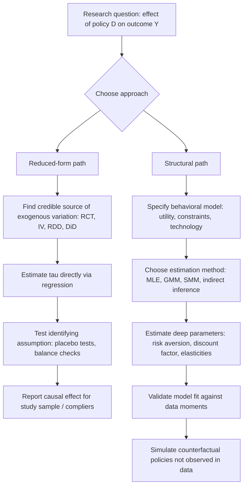

## Structural versus Reduced-Form Approaches

### Overview

The structural-versus-reduced-form debate concerns two distinct philosophies for empirical economic research: whether to estimate a fully specified model of economic behavior derived from optimization and equilibrium conditions (structural), or to estimate the direct statistical relationship between a treatment/policy variable and an outcome without fully specifying the underlying behavioral mechanism (reduced-form). This methodological divide runs through development economics and shapes debates on external validity, counterfactual policy simulation, and the interpretation of empirical estimates.

Both traditions aim to answer causal questions, but they differ fundamentally in what they are willing to assume versus what they insist on identifying directly from variation in the data.

### Reduced-Form Approach

**Definition and Core Logic**

A reduced-form approach estimates the relationship between an outcome $Y$ and a treatment/policy variable $D$ using research designs that exploit exogenous variation — randomization, natural experiments, instrumental variables, discontinuities, or panel variation — without modeling the structural mechanism connecting $D$ to $Y$. The estimating equation is typically a direct regression:

$$Y_i = \alpha + \tau D_i + X_i'\beta + \varepsilon_i$$

where $\tau$ is identified through a credible source of exogenous variation in $D_i$ (randomization, an instrument, a discontinuity, or a difference-in-differences design), not through modeling agents' optimization problems.

**Associated Methods**

- Randomized controlled trials (RCTs)
- Instrumental variables (IV) / two-stage least squares (2SLS)
- Regression discontinuity design (RDD)
- Difference-in-differences (DiD) and event-study designs
- Matching and propensity score methods

**Strengths**

- **Transparency of identifying assumptions**: the credibility of the estimate rests on a small number of checkable assumptions (e.g., instrument exogeneity, parallel trends, continuity at a cutoff), which are often directly testable or falsifiable using placebo tests.
- **Minimal functional-form assumptions**: reduced-form estimates typically do not require specifying utility functions, production functions, or expectations formation processes.
- **High internal validity**: when the identifying assumption holds, the estimated $\tau$ is a credible causal effect for the study population, largely free of the risk of behavioral misspecification.

**Limitations**

- **Local, not global**: IV estimates (e.g., a Local Average Treatment Effect, LATE) apply to compliers induced by the specific instrument, not necessarily the full population — the parameter answers a narrow question by design.
- **Limited counterfactual scope**: a reduced-form estimate of "what happened when policy X was implemented" cannot, by itself, predict the effect of an untested alternative policy X′, since it does not model the mechanism generating the response.
- **"Black box" mechanism**: without modeling the underlying behavior, reduced-form estimates can be silent on *why* an effect occurred, complicating extrapolation to new contexts (connecting directly to external validity debates).

### Structural Approach

**Definition and Core Logic**

A structural approach specifies an economic model — derived from assumptions about preferences, technology, constraints, and equilibrium — and estimates the "deep" behavioral parameters of that model (e.g., risk aversion coefficients, discount factors, production function elasticities, cost parameters) using the observed data. Once estimated, the model can be used to simulate counterfactual policies that were never directly observed in the data.

A canonical structural framework in applied microeconomics is:

$$\max_{\{a_t\}} \quad E_0 \sum_{t=0}^{T} \beta^t u(c_t, a_t; \theta)$$

$$\text{s.t. } c_t = f(a_t, X_t; \theta), \quad \text{state transitions and constraints}$$

where $\theta$ is a vector of structural parameters (e.g., risk aversion, discount factor $\beta$, production elasticities) estimated via methods such as:

- **Maximum likelihood estimation (MLE)**
- **Generalized method of moments (GMM)**, matching model-implied moments to data moments
- **Simulated method of moments (SMM)**, when the model's likelihood is analytically intractable
- **Indirect inference**, using an auxiliary reduced-form model to match simulated and observed statistics

**Strengths**

- **Counterfactual policy simulation**: because the model specifies the mechanism, it can predict outcomes under policies never actually observed (e.g., "what if the transfer amount were doubled" or "what if eligibility rules changed").
- **Extrapolation across contexts**: if the estimated behavioral parameters (e.g., risk aversion) are genuinely more stable across settings than a reduced-form treatment effect, the structural model can, in principle, generalize better — directly addressing external validity concerns.
- **Welfare analysis**: structural models, by specifying utility functions, permit direct welfare comparisons across policies, which reduced-form treatment effects alone cannot provide without additional assumptions.

**Limitations**

- **Strong, often untestable assumptions**: functional forms for utility, expectations formation (e.g., rational expectations), and equilibrium concepts are typically assumed rather than derived from the data, and misspecification can bias all downstream parameter estimates and counterfactuals.
- **Identification can be fragile**: structural parameters are often identified through a combination of functional-form and exclusion restrictions that are harder to communicate and validate than a reduced-form instrument.
- **Computational complexity**: solving and estimating dynamic structural models (especially with rational expectations or strategic interaction) can be computationally intensive and sensitive to numerical optimization choices.

### Diagram: Structural vs. Reduced-Form Workflow Comparison

### The Hybrid Middle Ground: Sufficient Statistics and Structural-Experimental Approaches

A significant methodological development has been the "sufficient statistics" approach (associated with Raj Chetty and others), which attempts to combine the credibility of reduced-form identification with the counterfactual-prediction power of structural models. The idea is to derive a welfare or policy formula from theory that depends only on a small number of reduced-form "sufficient statistics" (e.g., elasticities) that can be estimated using credible quasi-experimental variation, without needing to fully specify or estimate every structural primitive of the underlying model.

$$\Delta W = g(\varepsilon_1, \varepsilon_2, \ldots, \varepsilon_k)$$

where $g(\cdot)$ is derived from theory and $\varepsilon_k$ are estimable elasticities (e.g., labor supply elasticity, demand elasticity) identified via reduced-form methods.

Similarly, "structural-experimental" hybrids increasingly use randomized variation to identify specific structural parameters directly (rather than relying purely on functional-form assumptions for identification), combining experimental credibility with the ability to simulate counterfactuals. Examples in development economics include using randomized price or interest-rate variation to estimate demand elasticities or discount factors that then feed into a broader structural model, e.g., in studies of demand for preventive health products, agricultural technology adoption, and credit market behavior.

### Illustrative Comparison Table

| Dimension | Reduced-Form | Structural |
| --- | --- | --- |
| Core object estimated | Direct treatment effect $\tau$ | Deep behavioral parameters $\theta$ |
| Identifying assumption | Exogeneity of instrument/design | Correct model specification |
| Counterfactual scope | Limited to observed policy variation | Can simulate untested policy scenarios |
| Transparency | High — few, checkable assumptions | Lower — assumptions embedded in functional form |
| Typical estimation method | OLS/2SLS on exogenous variation | MLE, GMM, SMM, indirect inference |
| Welfare analysis | Requires additional assumptions | Built into utility specification |
| Risk of misspecification | Low (design-based) | Higher (model-based) |
| Common development applications | Program evaluation, cash transfers, RCTs | Migration decisions, savings/insurance behavior, agricultural technology adoption, dynamic labor supply |

### Worked Illustration: Evaluating a Conditional Cash Transfer (CCT) Program

**Reduced-form approach**: Using a randomized rollout of a CCT program, estimate the effect on school enrollment directly:

$$Enrollment_i = \alpha + \tau \cdot Treatment_i + X_i'\beta + \varepsilon_i$$

This yields a credible estimate of $\tau$ for the specific transfer amount and conditionality rules tested, but cannot directly answer "what would happen if the transfer amount were halved" or "what if the conditionality were dropped," since those scenarios were not randomized.

**Structural approach**: Specify a household model in which parents choose child schooling versus child labor to maximize a utility function subject to a budget constraint and the transfer schedule:

$$\max_{s} \ u(c, s; \theta) \quad \text{s.t.} \quad c = w(1-s) + T \cdot \mathbb{1}[s \geq \bar{s}]$$

where $s$ is time allocated to schooling, $w$ is the child's potential labor wage, $T$ is the transfer amount, and $\bar s$ is the attendance threshold required to receive it. Estimating $\theta$ (e.g., parental valuation of child leisure/labor relative to schooling) allows simulation of enrollment responses under alternative transfer amounts $T'$ or thresholds $\bar s'$ never actually implemented in the observed program — at the cost of relying on the assumed functional form of $u(\cdot)$ and the correctness of the budget constraint specification.

**Hybrid approach**: Use the randomized transfer amount variation (if multiple transfer levels were randomized, as in some CCT evaluations) to directly and credibly estimate the elasticity of schooling with respect to transfer size, without needing to fully specify $u(\cdot)$ — a sufficient-statistics-style use of experimental variation to pin down the policy-relevant parameter needed for extrapolation to nearby transfer levels.

### Key Debates

**Pro-reduced-form position** (associated with Angrist, Imbens, and the broader "credibility revolution" in applied microeconomics): identification should come primarily from the research design, not from assumptions about behavior; heavy reliance on structural assumptions risks producing precise-looking but potentially invalid counterfactuals if the model is misspecified in ways that are hard to detect.

**Pro-structural position** (associated with structural labor/IO economists such as those working in the tradition of Heckman, Rust, and others): reduced-form estimates, however credible for the specific design studied, are often too narrow to answer the policy questions that matter (e.g., predicting effects of policies never tried, or conducting welfare analysis), and progress requires being explicit about the economic model connecting cause and effect rather than treating the mechanism as unknowable.

**Reconciling view**: the choice is increasingly framed as complementary rather than mutually exclusive — reduced-form, quasi-experimental variation is used to test and discipline structural model components (rather than relying purely on functional-form assumptions for identification), and structural models are used to extend the reach of credible reduced-form estimates to counterfactual policies of interest. Chetty's sufficient-statistics framework and structural-experimental hybrids are frequently cited as the practical synthesis of this debate. [Inference: while this "complementary" framing is common in contemporary methodological discussions, individual researchers still frequently express a strong preference for one tradition, and the debate is not fully settled in practice.]

### Related Topics

- Instrumental variables and Local Average Treatment Effects (LATE)
- Sufficient statistics approach to welfare analysis (Chetty)
- Dynamic discrete choice models and estimation (Rust-style structural models)
- External validity and generalizability debates
- Randomized controlled trials in development economics
- Household economic models: labor supply, schooling, and intra-household bargaining
- Structural-experimental hybrid designs
- Generalized Method of Moments (GMM) and Simulated Method of Moments (SMM)