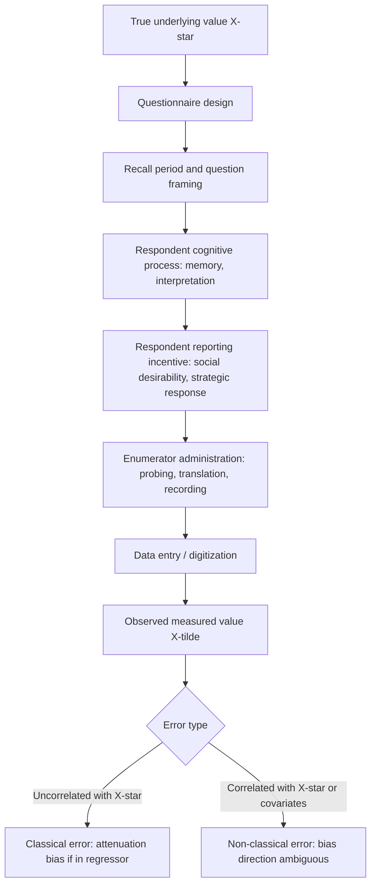

## Survey Design and Measurement Error

### Overview

Survey design and measurement error is foundational to empirical development economics, where most microdata originate from household, firm, or individual surveys rather than administrative records. Measurement error is pervasive in these settings — recall periods are long, respondents have incentives to misreport, enumerators introduce variation, and key constructs (consumption, income, assets, subjective wellbeing) are inherently difficult to measure precisely. Unlike in many other applied fields, measurement error in development economics is frequently large relative to the effect sizes being estimated, making survey design choices a first-order methodological concern rather than a secondary data-quality footnote.

### Types of Measurement Error

**Classical Measurement Error**

The observed variable $\tilde{X}$ equals the true value $X^*$ plus a mean-zero error uncorrelated with the true value:

$$\tilde{X}_i = X_i^* + u_i, \qquad E[u_i] = 0, \quad Cov(X_i^*, u_i) = 0$$

**Consequence for regression**: Classical measurement error in a right-hand-side (independent) variable causes **attenuation bias** — the estimated coefficient is biased toward zero:

$$plim(\hat\beta) = \beta \cdot \frac{\sigma^2_{X^*}}{\sigma^2_{X^*} + \sigma^2_u} = \beta \cdot \lambda$$

where $\lambda < 1$ is the **reliability ratio**. Classical measurement error in the dependent variable $Y$, by contrast, is absorbed into the error term and does not bias $\hat\beta$, though it inflates standard errors and reduces precision.

**Non-Classical (Systematic) Measurement Error**

In practice, measurement error in development survey data is frequently **not** classical — it is correlated with the true value, with respondent characteristics, or with the outcome of interest. Common forms:

- **Mean-reverting error**: error correlated negatively with the true value (e.g., poor households overreport income, wealthy households underreport it), which can bias coefficients in either direction depending on the correlation structure, not merely toward zero.
- **Differential/systematic misreporting**: error correlated with treatment status, a serious concern in program evaluation — e.g., if respondents believe reporting lower income increases future benefit eligibility, treatment groups anticipating evaluation may systematically underreport post-treatment income.
- **Non-classical error in the dependent variable**: if the error is correlated with regressors, it *does* bias coefficient estimates, unlike the classical case.

### Sources of Measurement Error in Development Surveys

**1. Recall Error**

Respondents are commonly asked to recall consumption, income, health events, or time use over periods (e.g., "in the last 7 days," "in the last 12 months") long enough that memory decay and recall heuristics introduce error. Recall error tends to increase with the length of the recall period and can be systematic (e.g., **telescoping**, where events are misremembered as occurring more recently than they did, or **anchoring**, where recent/salient consumption dominates recalled averages).

**2. Social Desirability and Strategic Misreporting**

Respondents may misreport sensitive behaviors (domestic violence, corruption, illicit income, contraceptive use, or even program participation) due to social desirability bias or strategic incentives tied to program eligibility, taxation, or social stigma.

**3. Enumerator Effects**

Systematic differences in how enumerators probe, translate, or record responses can introduce measurement error correlated with the enumerator rather than the respondent — a concern particularly acute in large teams administering long questionnaires across diverse dialects/languages.

**4. Instrument/Questionnaire Design Effects**

- **Recall period length**: shorter, more frequent recall periods (e.g., diaries or weekly visits) generally reduce recall error but increase respondent burden and cost.
- **Question framing and ordering**: the sequence and wording of questions can affect responses (e.g., anchoring effects from preceding questions, or fatigue effects late in long modules).
- **Aggregation level of consumption modules**: highly disaggregated item-by-item consumption modules (as in the World Bank Living Standards Measurement Study, LSMS) versus a single aggregate question produce systematically different consumption estimates — disaggregated modules typically yield higher, more complete consumption estimates.
- **Unit/definitional ambiguity**: local measurement units (e.g., non-standard weight/volume units for agricultural output), household composition definitions, and land area units introduce error that is compounded when converted to standardized units.

**5. Sampling Frame and Coverage Error**

Distinct from response-level measurement error, but a related data-quality concern: outdated or incomplete sampling frames (e.g., census enumeration areas that miss informal settlements or recent migrants) introduce coverage error that biases who is measured at all, not just how accurately.

### Diagram: Sources of Error in the Survey Measurement Process

### Detecting and Diagnosing Measurement Error

**1. Validation Studies**

Compare survey-reported values against a "gold standard" measure for a subsample — e.g., comparing self-reported consumption against detailed diary records, or self-reported plot size against GPS-measured plot area. A well-known finding in this literature is that farmer-reported land area is frequently overreported relative to GPS measurement, particularly for smaller plots, with implications for estimated productivity (yield per hectare), since errors in the denominator of a ratio can generate mechanical, spurious correlations. [Inference: the specific direction and magnitude of over/underreporting varies by study and country context; the general finding of substantial farmer/GPS discrepancy is well replicated, but exact percentages should be checked against the specific study cited.]

**2. Test-Retest / Reinterview Surveys**

Re-administering the same survey (or module) to a subsample shortly after the original interview allows estimation of response reliability and enumerator-level variance components.

**3. Bounding Approaches**

When validation data are unavailable, researchers can sometimes bound the direction/magnitude of bias using theoretical restrictions (e.g., known sign of the correlation between error and regressors) rather than point-identifying the true measurement error process.

**4. Multiple Measurement / Errors-in-Variables Estimators**

- **Instrumental variables using a second, independent noisy measure**: if two independently collected error-prone measures of the same construct exist, one can be used as an instrument for the other, since classical measurement errors across the two measures are uncorrelated with each other by construction, restoring consistent estimation of $\beta$.
- **Reliability ratio correction**: if the reliability ratio $\lambda$ can be estimated (e.g., from a validation subsample), $\hat\beta$ can be rescaled by $1/\lambda$ to correct for attenuation bias, under the classical measurement error assumption.

### Worked Example: Measurement Error in Consumption-Based Poverty Estimates

**Setup**: A researcher wants to estimate the poverty rate using household consumption data collected via a 7-day recall consumption module, then compare it against an alternative module using 30-day recall for less frequently purchased items.

**Step 1 — Compare aggregate consumption estimates across recall periods.** Shorter recall periods for frequently purchased items (food) typically yield higher reported consumption due to reduced recall decay, while longer recall periods for infrequent purchases (durables, clothing) reduce respondent burden but may introduce greater recall error for those specific items.

**Step 2 — Assess implications for poverty measurement.** Because poverty headcount rates are highly sensitive to the exact consumption aggregate relative to the poverty line, systematic measurement error from recall design choices can shift measured poverty rates independent of any true change in welfare — a well-documented methodological concern in the LSMS literature on questionnaire design.

**Step 3 — Consider differential measurement error across survey waves.** If a panel survey changes its consumption module design between waves (e.g., shortening the item list or changing recall periods), estimated consumption *growth* — and therefore poverty *dynamics* — can be confounded by the instrument change rather than reflecting true welfare change. Best practice is to hold questionnaire design constant across waves used for comparison, or to explicitly test and adjust for instrument-driven discontinuities.

**Step 4 — Address measurement error in regression-based welfare analysis.** If consumption (measured with error) is used as a regressor (e.g., in an analysis of the correlates of health outcomes), attenuation bias should be anticipated and, where feasible, addressed via instrumental variables using an independent consumption proxy (e.g., asset-based wealth index) or a validated reliability ratio correction.

### Illustration: Attenuation Bias Under Classical Measurement Error (svg_diagram)

<svg xmlns="http://www.w3.org/2000/svg" viewBox="0 0 620 300">
<text x="310" y="20" font-size="14" font-weight="bold" text-anchor="middle">Attenuation Bias from Classical Measurement Error (svg_diagram)</text>
<line x1="70" y1="260" x2="560" y2="260" stroke="#333" stroke-width="1" />
<line x1="70" y1="40" x2="70" y2="260" stroke="#333" stroke-width="1" />
<text x="315" y="285" font-size="11" text-anchor="middle">X (true value, with noise added when measured)</text>
<text x="30" y="150" font-size="11" text-anchor="middle" transform="rotate(-90 30 150)">Y</text>
<circle cx="120" cy="220" r="4" fill="#555" />
<circle cx="160" cy="195" r="4" fill="#555" />
<circle cx="200" cy="205" r="4" fill="#555" />
<circle cx="240" cy="175" r="4" fill="#555" />
<circle cx="280" cy="160" r="4" fill="#555" />
<circle cx="320" cy="150" r="4" fill="#555" />
<circle cx="360" cy="130" r="4" fill="#555" />
<circle cx="400" cy="120" r="4" fill="#555" />
<circle cx="440" cy="100" r="4" fill="#555" />
<circle cx="480" cy="90" r="4" fill="#555" />
<line x1="100" y1="235" x2="500" y2="80" stroke="#2266cc" stroke-width="2" />
<text x="505" y="78" font-size="10" fill="#2266cc">True slope (beta)</text>
<line x1="100" y1="215" x2="500" y2="150" stroke="#d33" stroke-width="2" stroke-dasharray="6,3" />
<text x="505" y="152" font-size="10" fill="#d33">Estimated slope (attenuated)</text>
</svg>

### Best-Practice Design Recommendations

| Design Choice | Recommendation | Rationale |
| --- | --- | --- |
| Recall period | Match to natural purchase/event frequency; shorter for frequent items | Reduces recall decay while balancing respondent burden |
| Consumption module structure | Disaggregated, itemized lists preferred over single aggregate questions | Reduces omission of small/irregular expenditures |
| Land/plot area measurement | Use GPS/GIS measurement where feasible rather than farmer self-report | Corrects known self-report bias, especially on smaller plots |
| Sensitive topics | Use indirect elicitation methods (list randomization, randomized response technique) | Reduces social desirability bias |
| Panel consistency | Hold questionnaire wording/design fixed across waves used for comparison | Avoids confounding true change with instrument change |
| Enumerator assignment | Randomize enumerator-to-respondent assignment where feasible; track enumerator fixed effects | Allows estimation and adjustment for enumerator effects |
| Validation | Budget for a validation subsample against an objective benchmark (diaries, GPS, biomarkers) | Enables reliability ratio estimation and bias correction |

### Indirect Elicitation Methods for Sensitive Topics

**List Randomization (Item Count Technique)**

Respondents are randomly assigned to a control list of non-sensitive items or a treatment list with the sensitive item added, and asked only how many items apply (not which ones). The prevalence of the sensitive behavior is estimated from the difference in mean counts between the two groups:

$$\hat{p}_{sensitive} = \bar{Y}_{treatment} - \bar{Y}_{control}$$

**Randomized Response Technique (RRT)**

Respondents answer truthfully or a forced/random response based on a private randomizing device (e.g., a coin flip unobserved by the enumerator), and the true prevalence is backed out using the known randomization probability, preserving individual-level privacy while still permitting aggregate estimation.

Both methods trade individual-level data (unavailable, since responses cannot be attributed to specific respondents in a straightforward way) for reduced social-desirability bias in the aggregate estimate — an explicit design trade-off between precision/traceability and honesty of response.

### Related Topics

- Living Standards Measurement Study (LSMS) survey methodology
- Attrition and panel survey design
- Instrumental variables for errors-in-variables correction
- List randomization and randomized response technique
- GPS-based land area and remote sensing measurement in agricultural economics
- Enumerator effects and survey experiment design
- Subjective wellbeing and psychological measurement in development surveys
- Administrative data versus survey data in development research