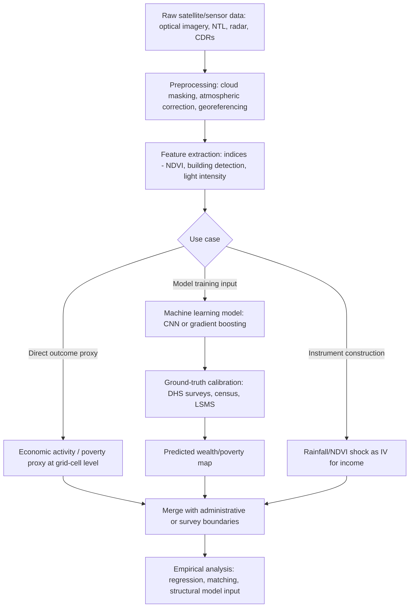

## Big Data and Satellite Data in Development Research

### Overview

Big data and satellite (remote sensing) data have become increasingly important complements to traditional household and firm surveys in development economics, particularly where survey infrastructure is weak, conflict or logistical constraints limit ground access, or researchers need high-frequency, large-scale coverage that periodic surveys cannot provide. These data sources are used both as **direct outcome measures** (e.g., nighttime lights as a proxy for economic activity) and as **inputs into traditional empirical designs** (e.g., using satellite-derived rainfall as an instrument, or mobile phone data to construct treatment/control comparisons at scale).

This is a genuinely fast-moving area of the field methodologically, with substantial recent work applying machine learning to satellite imagery for poverty prediction. Because specific tools, datasets, and model architectures continue to evolve, this material synthesizes current standard practice as of major recent contributions, but researchers should verify current data availability, spatial/temporal resolution, and access terms directly with the citied ata providers before designing a study.

### Major Data Types

**1. Nighttime Lights (NTL) Data**

Satellite-recorded intensity of nighttime luminosity, used since the mid-2000s as a proxy for economic activity, especially where GDP/output data are unavailable, unreliable, or not available at sub-national resolution.

- **Key sources**: DMSP-OLS (Defense Meteorological Satellite Program, available historically from 1992–2013, coarser resolution, top-coded pixel values), and VIIRS (Visible Infrared Imaging Radiometer Suite, available from 2012 onward, finer resolution, no top-coding).
- **Canonical application**: Henderson, Storeygard, and Weil (2012, *American Economic Review*) used nighttime lights growth to cross-validate and supplement official GDP growth statistics, particularly useful in countries with weak national statistical capacity or where GDP figures are suspected to be manipulated or poorly measured.
- **Known limitations**: NTL saturates in already brightly lit urban cores (a ceiling effect reducing sensitivity to further growth in dense cities), is a noisy proxy at low light levels typical of rural areas where much extreme poverty is concentrated, and reflects electrification access as much as pure output — meaning changes in NTL can reflect rural electrification rollout rather than economic growth per se.

**2. Daytime Satellite Imagery**

High-resolution optical imagery (e.g., from Landsat, Sentinel-2, or commercial providers such as Planet or Maxar) used to observe land use, built-up area extent, agricultural land cover, building footprints/rooftop materials, and road infrastructure.

- **Canonical application**: Jean et al. (2016, *Science*) demonstrated that a convolutional neural network (CNN) trained on daytime satellite imagery, using nighttime lights as a noisy intermediate label (a "transfer learning" approach), could predict village-level household consumption/asset wealth with substantial accuracy across several African countries — a widely cited proof of concept for poverty mapping using imagery in place of costly nationwide surveys.
- **Common features extracted**: building density and rooftop type (proxying housing quality), road network density, agricultural field boundaries and crop type classification, vegetation indices (see below), and urban expansion over time.

**3. Vegetation and Agricultural Indices**

- **NDVI (Normalized Difference Vegetation Index)**: computed from red and near-infrared reflectance bands, used as a proxy for vegetation health/greenness and, by extension, agricultural productivity and drought conditions:

$$NDVI = \frac{NIR - Red}{NIR + Red}$$

- **Applications**: crop yield estimation, drought/rainfall shock identification (often combined with gridded rainfall data as an instrument for agricultural income shocks), and land cover classification for deforestation/agricultural expansion studies.

**4. Gridded Climate and Rainfall Data**

Satellite- and reanalysis-derived precipitation and temperature datasets (e.g., CHIRPS — Climate Hazards Group InfraRed Precipitation with Station data — and ERA5 reanalysis) provide spatially continuous rainfall/temperature estimates, widely used as instruments for agricultural income or as direct measures of climate shocks in studies of migration, conflict, and agricultural production.

**5. Mobile Phone and Call Detail Records (CDRs)**

Anonymized mobile network operator data on call/SMS metadata and, where available, mobile money transaction records, used to infer mobility patterns, social network structure, and economic activity at high spatial and temporal frequency.

- **Applications**: estimating internal migration and displacement (including during crises/conflict), proxying wealth from calling/topping-up patterns, and evaluating mobile money and digital financial inclusion interventions using transaction-level data.
- **Key constraint**: access typically requires partnership with mobile network operators under strict privacy/data-sharing agreements, and representativeness is limited to the subset of the population with mobile phone access and usage (a coverage/selection concern analogous to survey sampling frame issues).

**6. Machine-Learning-Based Poverty and Wealth Mapping**

Building on the Jean et al. (2016) approach, subsequent work has combined multiple satellite/big-data sources (NTL, daytime imagery, mobile data, and OpenStreetMap infrastructure data) with machine learning models to produce high-resolution ("micro-estimated") poverty and wealth maps at sub-district or even village level, often calibrated/validated against Demographic and Health Surveys (DHS) asset indices where ground-truth survey data exist. [Unverified: specific current-generation model architectures, exact accuracy benchmarks, and publicly available map products change frequently as new satellite datasets and model generations are released; consult current documentation from providers such as the World Bank's Development Data Group or specific published papers for up-to-date specifications.]

### Diagram: Satellite/Big Data Integration Pipeline

### Methodological Considerations and Limitations

**1. Ground-Truthing and Validation Requirements**

Satellite-derived measures are proxies, not direct measurements of the underlying economic construct of interest (income, consumption, wellbeing). Model-based estimates (e.g., CNN-predicted wealth) require validation against survey-based ground truth (commonly DHS wealth indices or LSMS consumption aggregates), and predictive accuracy can vary substantially by region, urban/rural status, and the specific outcome being predicted — a model performing well in one country or region cannot be assumed to generalize without re-validation (directly connecting to external validity concerns).

**2. Resolution and Aggregation Mismatch**

Satellite data are naturally organized on a spatial grid (pixels), while economic outcomes of interest (household welfare, firm output) are properties of discrete economic units. Aggregating pixel-level data to administrative or survey-cluster boundaries introduces its own measurement error, and the appropriate level of spatial aggregation involves a bias-precision trade-off similar to bandwidth choice in nonparametric estimation.

**3. Temporal Frequency Mismatches**

High-frequency satellite data (daily to monthly) is often merged with lower-frequency survey rounds (annual or multi-year), requiring careful decisions about temporal alignment (e.g., which rainfall window corresponds to a given agricultural season and survey recall period).

**4. Selection and Coverage in Big Data Sources**

Mobile phone and mobile money data are limited to individuals with phone access and network coverage, which correlates with wealth, urbanicity, and gender in many developing-country contexts — meaning naive use of such data as a population-representative measure can reproduce or amplify existing survey coverage biases rather than solve them.

**5. Privacy and Ethical Considerations**

CDR and mobile money data, even anonymized, carry re-identification risks given the uniqueness of individual mobility/communication patterns, and typically require institutional review board (IRB) approval, data use agreements with network operators, and differential privacy or aggregation safeguards before analysis or publication.

**6. Cannot Substitute for Causal Identification**

Big data and satellite measures primarily address *measurement* — providing new or better outcome/covariate data — rather than *identification*. They must still be combined with a credible identification strategy (RCT, IV, RDD, DiD) to support causal claims; a rich, high-resolution satellite dataset merged with non-random treatment variation does not, by itself, resolve confounding.

### Worked Example: Combining Satellite Data with a Difference-in-Differences Design

**Research question**: Does a rural electrification program increase local economic activity?

**Step 1 — Construct treatment and control groups.** Identify villages that received grid electrification in a given year (treatment) versus comparable villages not yet connected (control), using program rollout administrative records.

**Step 2 — Construct the outcome from satellite data.** Extract VIIRS nighttime lights intensity for the geographic footprint of each village over a multi-year panel spanning pre- and post-electrification periods.

**Step 3 — Address the electrification-mechanical-effect concern.** Because nighttime lights partly reflect the mere presence of electric lighting infrastructure rather than only "real" economic activity, results should be interpreted carefully — an increase in NTL after grid connection may partly mechanically reflect new streetlights/household lighting rather than new economic output, and this measurement concern should be explicitly disclosed. [Inference: This is a widely recognized pitfall specific to electrification studies using nighttime lights as the outcome; ideally, findings should be cross-validated against a non-lighting-related economic proxy such as consumption survey data, business registration records, or daytime imagery indicators of built-up commercial activity.]

**Step 4 — Estimate the difference-in-differences specification:**

$$NTL_{vt} = \alpha_v + \gamma_t + \delta \cdot (Electrified_v \times Post_t) + \varepsilon_{vt}$$

where $\alpha_v$ are village fixed effects, $\gamma_t$ are year fixed effects, and $\delta$ is the treatment effect of interest, identified under a parallel-trends assumption (verifiable via pre-trend event-study plots, a standard DiD diagnostic).

**Step 5 — Cross-validate with ground survey data where available.** If a survey subsample exists for a subset of villages, compare the NTL-based effect estimate against a survey-based income/consumption estimate to assess whether the satellite proxy tracks the intended construct in this specific context.

### Comparative Summary of Data Sources

| Data Source | Typical Resolution | Key Use Case | Main Limitation |
| --- | --- | --- | --- |
| DMSP-OLS nighttime lights | ~1km, 1992–2013 | Long-run GDP proxy, cross-country growth | Top-coded in bright areas, coarse resolution |
| VIIRS nighttime lights | ~750m, 2012–present | Sub-national economic activity, program evaluation | Still reflects electrification, not pure output |
| Daytime optical imagery (Landsat/Sentinel/commercial) | 10m–30m (free); <1m (commercial) | Land use, building detection, ML poverty mapping | Cloud cover gaps, needs ground-truth calibration |
| NDVI/vegetation indices | 250m–1km typical | Agricultural productivity, drought shocks | Confounds crop type, water stress, and vegetation type |
| CHIRPS/ERA5 rainfall/climate | ~5km (CHIRPS), ~30km (ERA5) | IV for agricultural shocks, climate impact studies | Ground-truth gauge sparsity in some regions affects accuracy |
| Mobile phone CDRs | Individual/tower-level | Migration, mobility, economic activity proxies | Selection into phone ownership; privacy constraints |
| ML-based wealth/poverty maps | Village/grid-cell level | High-resolution poverty targeting | Requires survey ground-truth; generalization untested outside calibration sample |

### Illustration: Resolution Mismatch Between Data Sources (svg_diagram)

<svg xmlns="http://www.w3.org/2000/svg" viewBox="0 0 620 260">
<text x="310" y="20" font-size="14" font-weight="bold" text-anchor="middle">Spatial Resolution Comparison Across Data Sources (svg_diagram)</text>
<rect x="60" y="60" width="500" height="30" fill="none" stroke="#333" />
<text x="30" y="80" font-size="10" text-anchor="end">DMSP-OLS</text>
<rect x="60" y="60" width="500" height="30" fill="#cce0f5" opacity="0.6" />
<rect x="60" y="100" width="300" height="30" fill="none" stroke="#333" />
<text x="30" y="120" font-size="10" text-anchor="end">VIIRS</text>
<rect x="60" y="100" width="300" height="30" fill="#99c2eb" opacity="0.6" />
<rect x="60" y="140" width="120" height="30" fill="none" stroke="#333" />
<text x="30" y="160" font-size="10" text-anchor="end">Landsat</text>
<rect x="60" y="140" width="120" height="30" fill="#5599d6" opacity="0.6" />
<rect x="60" y="180" width="20" height="30" fill="none" stroke="#333" />
<text x="30" y="200" font-size="10" text-anchor="end">Commercial</text>
<rect x="60" y="180" width="20" height="30" fill="#1a5fa3" opacity="0.6" />
<line x1="60" y1="230" x2="560" y2="230" stroke="#333" />
<text x="310" y="250" font-size="11" text-anchor="middle">Pixel footprint size (coarser → finer, left to right)</text>
</svg>

### Related Topics

- Machine learning methods for economic prediction and poverty targeting
- Instrumental variables using climate/rainfall shocks
- Difference-in-differences and event-study designs
- Demographic and Health Surveys (DHS) and asset-based wealth indices
- Data privacy and ethics in digital trace data research
- Administrative data versus survey data in development research
- Measurement error and validation studies
- Conflict, migration, and displacement measurement using mobile and satellite data