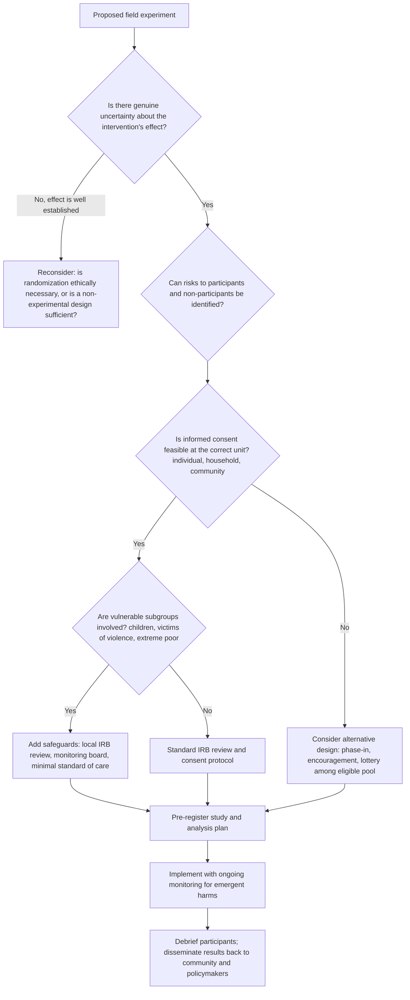

## Ethics of Field Experiments

### Overview

Field experiments in development economics involve deliberately manipulating real-world conditions for populations of study — often poor, vulnerable, or otherwise marginalized people — in order to identify causal effects. This raises ethical questions that go beyond the standard human-subjects protections built for clinical or lab research, because the "treatment" is frequently an economic, social, or institutional intervention (cash transfers, microcredit, school inputs, governance reforms) whose effects on welfare, power, and community relations are large, long-lasting, and unevenly distributed. This section covers the core ethical frameworks, the specific tensions unique to randomized field experiments in development settings, procedural safeguards, and the ongoing debates within the discipline.

### Core Ethical Principles

**Foundational Frameworks**

Most institutional ethical review is built on three principles articulated in the **Belmont Report** (1979), originally designed for biomedical and behavioral research:

- **Respect for persons**: individuals are autonomous agents whose informed, voluntary participation must be secured; those with diminished autonomy (children, the extremely poor, the coerced) warrant additional protection.
- **Beneficence**: researchers must maximize possible benefits and minimize possible harms; this is usually formalized as a risk-benefit analysis.
- **Justice**: the benefits and burdens of research should be distributed fairly — a population should not bear the risks of an experiment while another population enjoys its benefits.

[Inference] These principles were designed primarily for individual medical interventions and map imperfectly onto interventions that operate at the household, village, or market level, which is a recurring source of debate in development economics methodology.

**Extensions Specific to Development Field Experiments**

- **Non-maleficence at the group level**: because many interventions have general-equilibrium or spillover effects (e.g., a cash transfer program raising local prices), harm can be created for non-participants who never consented to anything.
- **Procedural justice / voice**: whether the community or its representatives had any say in whether the experiment happens at all, not just how individuals were treated within it.
- **Epistemic justice**: whether the knowledge produced serves the studied population, or primarily serves donors, publications, and policymakers elsewhere.

### The Randomization Problem

**Why Randomization Raises Distinct Ethical Questions**

Randomized controlled trials (RCTs) are prized for internal validity, but random assignment of a beneficial or harmful treatment to human populations raises the question of who is arbitrarily excluded or included.

- **Clinical equipoise analogy**: in medicine, randomization is often justified by "equipoise" — genuine uncertainty among experts about whether a treatment works. Development economists have imported this justification, arguing that if we don't know if a program works, no one is denied a "known good."
- **Departure from equipoise**: [Inference] this analogy is contested because many development RCTs test programs whose broad direction of effect (e.g., cash transfers increasing consumption) is fairly well established in prior literature, meaning the ethical case rests more on quantifying effect size than testing existence of effect. Critics argue researchers sometimes overstate uncertainty to justify withholding a likely-beneficial treatment from a control group.
- **Withholding vs. denying**: a key ethical distinction is between denying something a person is otherwise entitled to (ethically fraught) versus simply not being the first population to receive a benefit that is resource-constrained and would have been rationed anyway (comparatively more defensible). Researchers often use "encouragement designs," phase-in/rollout randomization, or randomizing among an already-excluded population to sidestep pure denial.

**Common Randomization-Compatible Designs Used to Mitigate Ethical Concerns**

| Design | Mechanism | Ethical rationale |
| --- | --- | --- |
| Randomized phase-in | All units eventually receive treatment; timing is randomized | No one is permanently denied treatment |
| Encouragement design | Everyone is eligible; only encouragement/information to take up is randomized | No direct denial of the good itself |
| Oversubscription/lottery design | Program capacity < demand; randomization allocates scarce slots | Randomization is a fair allocation mechanism given true scarcity, not a research-imposed denial |
| Randomization at higher levels (e.g., villages, clusters) | Treatment assigned to clusters, not individuals | Can reduce within-community perception of unfairness, though it introduces new spillover/contamination and consent-unit issues |

### Informed Consent in Field Settings

**Standard Requirements**

Informed consent generally requires that participants understand: the nature of the study, what will be done to/with them, foreseeable risks and benefits, that participation is voluntary, and that they can withdraw without penalty.

**Practical Complications Specific to Development Contexts**

- **Literacy and numeracy barriers**: written consent forms are often inappropriate; oral consent protocols, translated into local languages and read aloud, are common but harder to verify and audit.
- **Power asymmetries**: when the "researcher" is affiliated with an NGO, government ministry, or aid agency the respondent depends on, consent may not be fully voluntary — refusal may be feared to jeopardize future aid ("implied coercion").
- **Consent at the wrong unit**: household heads may consent on behalf of other household members (spouses, children) whose interests may diverge, particularly relevant in experiments on intra-household bargaining, domestic violence, or fertility.
- **Community versus individual consent**: in cluster-randomized designs, a village leader's agreement to participate is not equivalent to informed consent from every resident; scholars increasingly argue for **two-tiered consent** (community gatekeeper approval plus individual consent for any data collection or direct intervention).
- **Deception and partial disclosure**: many experiments (e.g., audit studies, corruption experiments, discrimination studies) require withholding the true purpose to avoid demand effects or behavioral distortion. This is generally justified under a **necessity + minimal-harm + debriefing** standard, but is one of the most heavily scrutinized categories by Institutional Review Boards (IRBs).

### Institutional Review and Oversight

**IRB / Research Ethics Committee Review**

Nearly all university-affiliated field experiments require approval from an Institutional Review Board (IRB) in the researcher's home country, and frequently also from a local ethics board in the country where the study occurs.

- **Dual review problem**: home-country IRBs (often in the US or Europe) may lack contextual knowledge of local norms, while local ethics boards may have limited capacity, resource constraints, or political pressures shaping what gets approved. [Inference] Divergence between these two bodies is a recognized practical challenge, though its frequency is not something that can be quantified without citing a specific empirical audit.
- **Registration and pre-analysis plans**: many journals and funders now require pre-registration (e.g., in the AEA RCT Registry) partly as a scientific-integrity measure (limiting p-hacking) but also as an ethical transparency measure, since it discloses the intervention and its risks publicly before implementation.
- **Data Safety Monitoring**: for experiments with potential for serious harm (e.g., health interventions, conditional cash transfers tied to behavior), some studies establish independent monitoring boards empowered to halt the experiment early if harm accumulates disproportionately in the treatment or control arm.

### Specific Ethical Tensions in Development RCTs

**Power Relations Between Researchers and Subjects**

- Researchers from wealthy institutions studying poor populations abroad face what is often termed "**parachute research**" or "**ethics dumping**" — extracting data and publishable results while offering little benefit, authorship, or capacity-building to local researchers or communities. [Inference] This concern has grown more prominent in the discipline's public discourse in the 2020s alongside broader debates about decolonizing global health and development research; the extent of the practice itself is contested and not something a single figure can characterize.
- Growing calls for **co-design** with local researchers, local IRBs holding genuine veto power (not just rubber-stamping), and local co-authorship as an ethical (not just practical) requirement.

**Externalities and Spillovers**

- Because many interventions are cost-effective by design (i.e., resource-constrained), someone is always a "control" — the ethical question is whether the control group is worse off than they would have been absent the study entirely (generally acceptable) or worse off *because of* the study's design choices, e.g., general equilibrium price effects, displaced resources, or heightened local inequality/tension between treated and untreated households in the same village.
- **Envy and social cohesion effects**: cash or asset transfers to a randomly chosen subset of households within a village can generate resentment, weakened social capital, or even localized conflict — an externality on non-participants that standard consent processes don't capture, since bystanders were never asked to consent to anything.

**Deception-Based Designs**

- **Correspondence/audit studies** (e.g., sending fictitious resumes with randomized names signaling ethnicity to test hiring discrimination) manipulate real employers or landlords who are unwitting subjects and never consent.
- Ethical justification for this class of study generally rests on: (1) no direct intervention actually occurs (no one is truly hired/fired), (2) the deception is minimal and time-limited, (3) the research question (discrimination) cannot be credibly answered without concealment, and (4) aggregate-level, anonymized reporting prevents any individual employer from being identifiable or harmed.
- Critics counter that this still imposes real costs (e.g., employer time reviewing fake applications) without consent or compensation and note that anonymity in reporting does not fully offset the fact that no consent was ever sought.

**Harm from the Absence of Intervention (Control Group Ethics)**

- Particularly acute in experiments touching health, nutrition, gender-based violence, or child welfare, where withholding a plausibly effective intervention from the control group may cause identifiable harm.
- Standard mitigations: providing a "**minimal standard of care**" to all arms (rather than nothing), ensuring the control condition reflects the pre-existing status quo rather than an artificially degraded one, and building in **crossover/rollout** so control households eventually benefit.

**Ethics of Publication Bias and Negative Results**

- If communities bear the risk of experimentation but null or negative results go unpublished, the studied population absorbs costs without the offsetting societal benefit of knowledge production — an ethical argument frequently used to support pre-registration and mandatory reporting requirements.

### Risk-Benefit Assessment Framework

A generalized decision framework researchers and ethics boards apply:

### Illustrative Cases and Debates

**Microcredit and Debt-Related Harm**

Studies randomizing access to microloans have raised concerns about over-indebtedness among treated households, particularly in populations with limited financial literacy. This illustrates the tension between an intervention presumed broadly beneficial (credit access) and the possibility of concentrated harm in a subset of recipients invisible to average treatment effect estimates.

**Deworming and Health Externalities**

Randomizing deworming treatment at the school or individual level raises externality concerns because untreated children benefit indirectly from reduced transmission when nearby children are treated (positive spillovers), which is itself an argument researchers have used both for and against certain unit-of-randomization choices — clustering at the school level internalizes some spillovers but at the cost of a much larger required sample and higher between-cluster inequality in exposure.

**Cash Transfer Experiments and Intra-Household Consent**

Programs that condition or direct transfers toward women in the household (on the theory that female-controlled income improves child welfare) have raised questions about whether the male household head's "consent" to study participation adequately represents the interests of the actual transfer recipient, and whether the intervention itself could increase intra-household conflict — an outcome some but not all studies explicitly monitor for.

### Governance Mechanisms Beyond IRBs

- **AEA RCT Registry** and similar registries: primarily a scientific-integrity tool but functions as an ethics-adjacent public disclosure mechanism.
- **J-PAL and IPA ethical guidelines**: major development-economics research networks maintain internal ethics guidance and require staff/partner training (e.g., human-subjects certification) beyond formal university IRB requirements.
- **Funder-imposed conditions**: some funders (e.g., certain government aid agencies) require additional ethical vetting or community engagement plans as a condition of funding.
- **Data protection regulations**: increasingly, data-privacy law (in respondent's country and/or researcher's country) imposes independent obligations around data storage, anonymization, and cross-border data transfer, layered on top of traditional human-subjects ethics.

### Ongoing Debates in the Discipline

- **Whether RCTs are over-used relative to their ethical cost**, given that alternative identification strategies (natural experiments, quasi-experimental designs) can sometimes answer similar questions without deliberately manipulating real welfare outcomes.
- **Whether "development as usual" (i.e., non-experimental program rollout) is held to a lower ethical standard than an RCT testing the identical intervention** — critics argue this creates a perverse incentive where evaluating a policy rigorously triggers more scrutiny than implementing the same policy without evaluation.
- **The role of local ownership**: a shift in the 2020s field-experiment literature toward requiring meaningful local partnership, not just administrative local IRB sign-off, as a substantive ethical requirement rather than a procedural formality. [Inference] The strength and universality of this shift varies by institution, funder, and journal, and is not uniformly enforced across the discipline.

**Related Topics**

- Institutional Review Board (IRB) protocols and cross-country ethical review
- Pre-registration and pre-analysis plans (AEA RCT Registry)
- Spillover effects and general equilibrium considerations in experimental design
- Cluster randomization and unit-of-analysis problems
- Informed consent design for low-literacy populations
- Power dynamics and "ethics dumping" in North-South research collaborations
- Randomization designs: phase-in, encouragement, and lottery/oversubscription methods
- Data privacy and cross-border data governance in field research
- External validity and generalizability of RCT findings (related methodological topic)
- Cost-effectiveness analysis and its relationship to ethical resource allocation